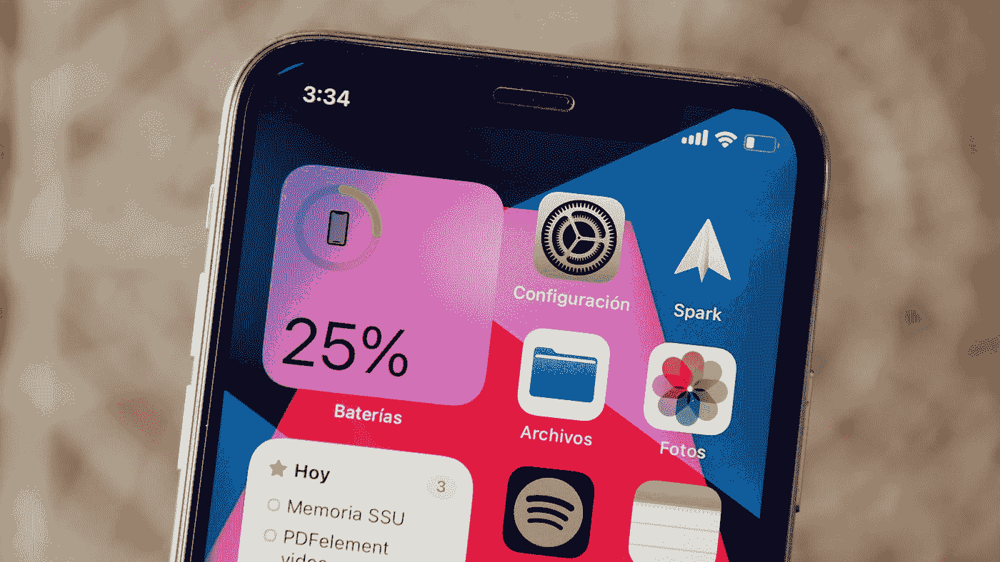

# 如何在 SwiftUI 中创建一组小部件

> 原文：<https://blog.devgenius.io/how-to-create-a-bundle-of-widgets-in-swiftui-942317d14ed6?source=collection_archive---------3----------------------->

## SwiftUI 中的小部件包

阿尔瓦罗·佩雷兹在 [Unsplash](https://unsplash.com?utm_source=medium&utm_medium=referral) 上的照片

前几天，我为我的应用 [FitMe](https://apps.apple.com/es/app/fitme-app-gym-planner/id1512680351#?platform=iphone) 创建了我的第一个小工具。没那么难。但是后来，我想再创建两个小部件，但是我不知道如何去做。在网上看书，发现了一个叫“WidgetBundle”的东西，超级好用。只需做以下包括所有你想要的部件，就是这样。

超级简单对吧？我将创建一个如何创建一个小部件的新教程

与我们合作:

 [## 阿维拉泰克

### 技术创新的发展

www.avilatek.com](https://www.avilatek.com/en/) 

我的 LinkedIn 个人资料:

 [## Marcelo Laprea - iOS 软件工程师- Kindred Group plc | LinkedIn

### 经验丰富的 iOS 应用程序开发人员，有在计算机软件行业工作的经历。熟练于…

www.linkedin.com](https://www.linkedin.com/in/marcelo-laprea/)