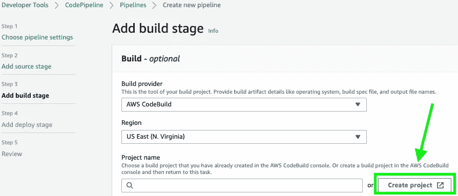
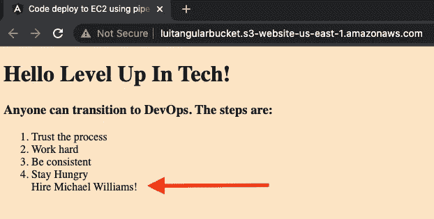

# 如何使用 AWS 代码管道创建 CI/CD 管道

> 原文：<https://blog.devgenius.io/how-to-create-a-ci-cd-pipeline-using-aws-codepipeline-fcfeb7bcb6e7?source=collection_archive---------2----------------------->


什么是 AWS CodePipeline？
**AWS CodePipline** 是一项持续的交付服务，有助于简化您的软件发布流程。

什么是 CI/CD？
**持续集成和持续交付**是一系列旨在简化应用程序开发的自动化步骤。这是通过管道实现的。

好处:
1。测试和发布代码是自动化的
2。应用可以快速发展以满足您客户的需求
3。轻松适应不断变化的市场

**目标**:使用更新 GitHub repo 时触发的 AWS Codepipeline 创建 CI/CD 管道。管道应该包括一个构建来测试代码，然后它应该部署到一个 S3 静态站点。
*我将在 GitHub 中使用一个角度应用*。

> ***先决条件:***
> GitHub 账号
> AWS 账号
> 源代码

# 步骤 1:创建一个 S3 存储桶

首先，我们需要登录 AWS 并创建一个 S3 桶，应用程序将被托管在这里。登录后在上面的搜索栏中搜索 S3，然后点击**“创建桶”**。

1.  创建全局唯一的名称
2.  取消选中“阻止所有公共访问”

# 步骤 2:创建 AWS 代码管道

在上面的搜索栏中搜索 CodePipeline，然后**点击“创建管道”**。您需要创建一个管道名称，并选择一个新的服务角色来访问管道。


# 步骤 3:选择 GitHub 作为您的源代码提供者

您需要选择承载代码的位置。**点击【连接 Github】**登录授权。我将选择我在 GitHub 中分叉的库和分支。之后**点击【下一步】**。


# 步骤 4:添加构建阶段

你需要这个来构建你的应用！



选择 AWS CodeBuild 作为构建提供程序。最后，**点击【创建项目】**。

# **步骤 5:创建 AWS 代码构建项目**

为 CodeBuild 项目选择一个新的项目名称，并使用以下设置:

*   **环境镜像:** *管理镜像*
*   **操作系统:**Ubuntu
*   **运行时:** *标准*
*   **图片:***AWS/code build/standard:4.0*
*   **镜像版本:** *始终使用该运行时版本的最新镜像*
*   **服务角色:** *新服务角色*


**点击【继续管道】**。

# 步骤 6:添加部署阶段 S3

选择 Amazon S3 作为您的部署提供商、您当前所在的地区以及您开始时创建的托管网站的存储桶。确保勾选底部的“部署前提取文件”!


**点击【下一步】**，在下一页点击**【创建管道】**。

# **第七步:测试一下！**

发射后，它不会工作。您将得到下面的错误。


我们需要更新 S3 桶下的权限。使用以下代码插入到存储桶策略中:

```
{
  "Version": "2012-10-17",
  "Statement": [
    {
      "Sid": "PublicReadGetObject",
      "Effect": "Allow",
      "Principal": "*",
      "Action": [
        "s3:GetObject"
      ],
      "Resource": "arn:aws:s3:::YOUR-BUCKET-NAME/*"
    }
  ]
}
```

现在我们应该可以访问我们的静态网站了。转到您的桶的属性选项卡下的静态网站托管。


接下来，转到 GitHub 存储库并更新代码。我加了一句**“雇佣迈克尔·威廉斯！”**

刷新您的浏览器，您应该会看到您在 GitHub 资源库中所做的任何更改！



恭喜你成功了！您使用 AWS CodePipeline 创建了一个 CI/CD 管道，它是由对 GitHub 存储库的更新触发的。