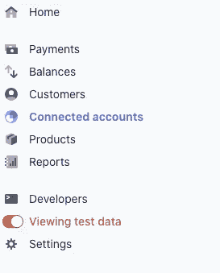
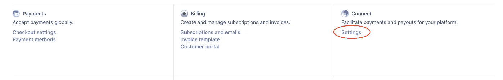
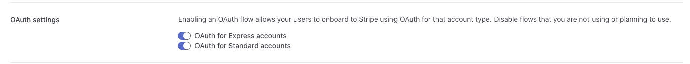
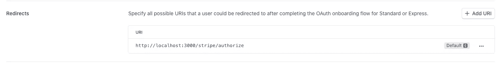
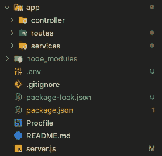
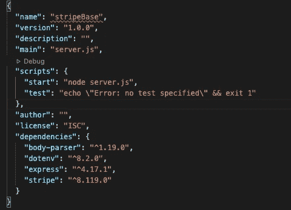

# 如何在带节点的条带中创建关联帐户

> 原文：<https://blog.devgenius.io/how-to-create-a-connected-account-in-stripe-with-node-c179c009458a?source=collection_archive---------2----------------------->

使用 NodeJS 和 Express 在 Stripe 中创建关联帐户


[rupixen.com](https://unsplash.com/@rupixen?utm_source=medium&utm_medium=referral)在 [Unsplash](https://unsplash.com?utm_source=medium&utm_medium=referral) 上拍照

在我的一个项目中，我必须集成一个支付平台，用户向我们付款，我们收取一些费用，然后我们需要转移一些钱给我们的提供商。我的第一个选择是看条纹。

[Stripe](https://stripe.com) 是一个支付基础设施，可以让开发者轻松支付。他们有几种产品，其中之一是关联客户。

随着[连接帐户](https://stripe.com/en-gb-es/connect)你可以向用户收费，收取一些费用，然后将其余的转移到另一个帐户，正是我想要的。

配置此功能的第一步是创建条带帐户。然后创建将成为我们提供商的关联帐户。那我们开始吧。

假设您已经有一个 Stipe 帐户，请转到仪表板。让我们使用测试数据，因此检查“查看测试数据”。



然后，单击左侧面板中的设置选项，然后单击连接部分中的设置按钮。



在本节中，您将配置您的品牌，即您的企业在入职和接受奖金时向用户展示的方式。

在这一页的底部，有一个集成部分。在这里，您将检查 OAuth 设置。



在重定向部分，您将添加一个 URI 并添加以下 URL:http://localhost:3000/stripe/authorize



在使用 Stripe 创建帐户后，用户将被重定向到该 URL，以便在您的平台中验证该用户。**在生产数据中，您需要为您的生产 URL** 进行更改。这只是为了测试。

现在我们已经配置好了，让我们创建我们服务器。我们将使用 Node 和 Express。我不会解释如何创建节点和 Express 服务器，但是我会向您展示我使用的文件夹结构和依赖关系。



要安装条带，您需要执行以下操作:

```
npm install --save stripe
```

现在我们已经安装了 Stripe，让我们配置我们的 server.js

我们的条纹.路线. js

我们的 stripe.controller.js

最后，我们的 stripe.service.js

在这里，我们将添加以下内容:

const stripe = require(' stripe ')(' client-ID ')，其中客户端 ID 是条带控制面板中的一个。

现在让我们创建一个函数来授权新帐户。

对此的反应将是:

这里发生了什么？

首先，Stripe 将生成一个 URL，以便用户可以创建自己的帐户。然后，它将重定向到我们在 dasboard 中添加的 URL:

http://localhost:3000/stripe/authorize

当用户重定向到那个 URL 时，我们的服务器将执行我们刚刚编写的函数。其中我们将接收授权码作为查询参数。

现在我们需要调用 Stripe API: stripe.oauth.token，并发送从 Stripe 接收的代码。这将授权我们的用户。如果功能是成功的，我们可以重定向用户到一个网站，在那里我们可以告诉他，一切正常，如果不是显示他一个错误。

要对此进行测试，请转到集成部分的仪表板，并单击 **test OAuth…**

复制**标准链接**，打开，点击页面开头的**跳过此账户表单**。这将执行您的服务器函数，然后将用户重定向到您在**RES . redirect(" customURL ")**中创建函数时想要的位置。

这就是全部，现在我们已经创建了我们的用户，我们可以开始集成支付。下一步将是创建一个 PaymentIntent，但我将在另一篇文章中介绍这一点。

谢谢，如果您有任何问题或任何改进代码的建议，请不要犹豫，给我写信。

更多关于 Stripe 的信息，你可以查看他们的网页:[https://stripe.com/docs/connect/oauth-express-accounts](https://stripe.com/docs/connect/oauth-express-accounts)

与我们合作:

[](https://www.avilatek.com/en/) [## 阿维拉泰克

### 技术创新的发展

www.avilatek.com](https://www.avilatek.com/en/) 

领英:[https://www.linkedin.com/in/marcelo-laprea/](https://www.linkedin.com/in/marcelo-laprea/)