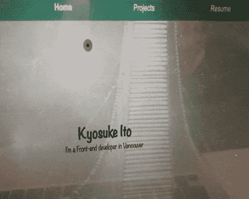
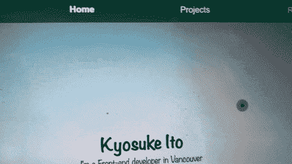

# 如何使用 react 创建自定义光标(不带库)。

> 原文：<https://blog.devgenius.io/how-to-create-a-custom-cursor-by-using-react-with-no-library-f5f890d82968?source=collection_archive---------1----------------------->


图片来自[https://www . freecodecamp . org/news/react-js-for-初学者-props-state-explained/](https://www.freecodecamp.org/news/react-js-for-beginners-props-state-explained/)

**目的**

虽然我可以通过仅使用 css 和 javascript 来创建自定义光标，但我尝试使用 react 来创建。在我的例子中，我一直使用 TypeScript，所以我的扩展名是 tsx，但是您也可以使用 js 扩展名。

**结果**

首先，这是我完成的自定义光标。



这是我的作品集网站

就像上面的 gif 图片，我的自定义光标有一个点和一个跟随点的小圆圈，如果悬停在某个元素上，这个点会消失，这个大圆圈会变大。

这是我的文件夹结构(因为我只写与本文相关的文件夹结构，所以如果你想看完整的文件夹结构，请在参考页中查看我的 GitHub repo。)

```
My Folder structure—Src
    —components
        —common
           Header.tsx
        —feature
           Cursor.tsx
           UseMousePosition.tsx
    —context
       mouse-context.tsx
    —router
       AppRouter.tsx
    —styles
        —base
           _base.scss
        —components
            —feature
               _cursor.scss
     app.tsx
```

步伐

1.  创建“UseMousePosition.tsx”文件，并编写如下代码。基本上，当我们使用自定义光标时，它是用于鼠标位置的。

```
 UseMousePosition.tsximport { useEffect, useState } from "react";const useMousePosition = () => {
  const [mousePosition, setMousePosition] = useState({ x: null, y: null });useEffect(() => {
    const mouseMoveHandler = (event) => {
      const { clientX, clientY } = event;
      setMousePosition({ x: clientX, y: clientY });
    };
    document.addEventListener("mousemove", mouseMoveHandler);return () => {
      document.removeEventListener("mousemove", mouseMoveHandler);
    };
  }, []);return mousePosition;
};export default useMousePosition;
```

2.创建“Cursor.tsx”文件，并编写如下代码。*注释区域将用于添加元素的悬停动作。以我为例，我想加上“点”和“环”(比点大一点的圆)。

```
Cursor.tsximport React from "react";
// import { useContext } from "react"; used later
import useMousePosition from "./useMousePosition";
// import { MouseContext } from "../../context/mouse-context"; used from step6const Cursor = () => {
  // const { cursorType } = useContext(MouseContext); used from step6const { x, y } = useMousePosition();
  return (
    <>
      <div
        className={"ring"}
        // className={`ring ${cursorType}`} used from step6
        style={{ left: `${x}px`, top: `${y}px` }}
      ></div>
      <div
        className={"dot"}
        // className={`dot ${cursorType}`} used from step6
        style={{ left: `${x}px`, top: `${y}px` }}
      ></div>
    </>
  );
};export default Cursor;
```

3.创建“_cursor.scss”文件，并编写如下代码。(注释区域将用于添加元素的悬停动作)。你可以随意定制。

```
_cursor.scss.ring {
  position: fixed;
  top: 0;
  left: 0;
  width: 30px;
  height: 30px;
  background-color: rgba(31, 30, 30, 0.4);
  border-radius: 100%;
  transform: translate(-50%, -50%);
  -webkit-transition-duration: 100ms;
  transition-duration: 100ms;
  -webkit-transition-timing-function: ease-out;
  transition-timing-function: ease-out;
  will-change: width, height, transform, border;
  z-index: 999;
  pointer-events: none;
}.dot {
  position: fixed;
  top: 50%;
  left: 50%;
  width: 8px;
  height: 8px;
  background-color: black;
  border-radius: 100%;
  transform: translate(-50%, -50%);
  z-index: 999;
  pointer-events: none;
}below code is used from step6// .ring.hovered {
//   width: 50px;
//   height: 50px;
//   border-width: 3px;
//   background-color: rgba(31, 30, 30, 0.4);
// }// .dot.hovered {
//   display: none;
// }
```

4.在你想要的渲染位置使用光标(基本上是 app.tsx 或其他地方)。在我的例子中，当我想在 app.tsx 中呈现一个 AppRouter 时，我将光标放在 AppRouter 中。(app.tsx 的注释区域将用于添加元素的悬停动作)。

```
AppRouter.tsximport React from "react";
import { BrowserRouter, Route, Switch } from "react-router-dom";
import Header from "../components/common/Header";
import Footer from "../components/common/Footer";
import HomePage from "../components/pages/HomePage";
import ProjectContainer from "../components/project/ProjectContainer";
import ProjectDetail from "../components/project/ProjectDetail";
import ResumePage from "../components/pages/ResumePage";
import NotFoundPage from "../components/pages/NotFoundPage";
import Cursor from "../components/feature/Cursor";
import data from "../resource/data";const AppRouter = () => {
  return (
    <BrowserRouter>
      <>
        <Cursor /> // I put cursor here because I want to use this Cursor for whole app.
        <Header />
        <Switch>
          <Route path="/" component={HomePage} exact={true} />
          <Route path="/project" exact={true}>
            <ProjectContainer data={data} />
          </Route>
          <Route path="/project/:title">
            <ProjectDetail data={data} />
          </Route>
          <Route path="/resume" component={ResumePage} />
          <Route component={NotFoundPage} />
        </Switch>
        <Footer />
      </>
    </BrowserRouter>
  );
};export default AppRouter;
```

这是 app.tsx

```
app.tsximport React from "react";
import ReactDOM from "react-dom";
import AppRouter from "./routers/AppRouter";
// import MouseContextProvider from "./context/mouse-context";import "normalize.css/normalize.css";
import "./styles/styles.scss";ReactDOM.render(
  // <MouseContextProvider>
  <AppRouter />,
  //* </MouseContextProvider>, */}
  document.getElementById("app")
);
```

5.将 base.scss 添加到“cursor: none”(如果使用 create-react-app，则需要使用 index.css)。因为我们不再使用基本光标了。(边距:0 是可选的)

```
base.scss* {
  margin: 0;
  cursor: none;
}
```

我们已经创建了“自定义光标”，但我们不能使用悬停动作在这一时刻的元素。

我的意思是，像下面的 gif



这是我的投资组合网站(没有 onHover)

所以从现在开始我们要创建悬停动作。

6.创建 MouseContext.tsx 并编写下面的代码。如果要使用 typescript，应该在 createContext 中的 cursorChangeHandler 内添加 cursorType 类型。您需要创建一个上下文，以便在应用程序中任何地方使用 customChangeHandler。

```
MouseContext.tsximport React, { createContext, useState } from "react";export const MouseContext = createContext({
  cursorType: "",
  cursorChangeHandler: (_cursorType // you can add cursorType here if you want to use typescript) => {},
});const MouseContextProvider = (props) => {
  const [cursorType, setCursorType] = useState("");const cursorChangeHandler = (cursorType) => {
    setCursorType(cursorType);
  };return (
    <MouseContext.Provider
      value={{
        cursorType: cursorType,
        cursorChangeHandler: cursorChangeHandler,
      }}
    >
      {props.children}
    </MouseContext.Provider>
  );
};export default MouseContextProvider;
```

7.您需要添加要呈现的“MouseContextProvider”。在我的例子中，app.tsx 但是如果你使用 create-react-app，那就是 index.js。

```
app.tsximport React from "react";
import ReactDOM from "react-dom";
import AppRouter from "./routers/AppRouter";
import MouseContextProvider from "./context/mouse-context";import "normalize.css/normalize.css";
import "./styles/styles.scss";ReactDOM.render(
  <MouseContextProvider>
    <AppRouter />
  </MouseContextProvider>,
  document.getElementById("app")
);
```

8.您需要取消步骤 2 的 Cursor.tsx 文件的注释(并分别删除关于 ring、dot 的重复类名)。我们添加了“useContext”和“MouseContext”，还添加了 cursorType。

```
Cursor.tsximport React from "react";
import { useContext } from "react";
import useMousePosition from "./useMousePosition";
import { MouseContext } from "../../context/mouse-context";const Cursor = () => {
  const { cursorType } = useContext(MouseContext);const { x, y } = useMousePosition();
  return (
    <>
      <div
        className={`ring ${cursorType}`}
        style={{ left: `${x}px`, top: `${y}px` }}
      ></div>
      <div
        className={`dot ${cursorType}`}
        style={{ left: `${x}px`, top: `${y}px` }}
      ></div>
    </>
  );
};export default Cursor;
```

9.您需要取消关于悬停操作的步骤 3 的 _cursor.scss 的注释。

```
_cursor.scss.ring {
  position: fixed;
  top: 0;
  left: 0;
  width: 30px;
  height: 30px;
  background-color: rgba(31, 30, 30, 0.4);
  border-radius: 100%;
  transform: translate(-50%, -50%);
  -webkit-transition-duration: 100ms;
  transition-duration: 100ms;
  -webkit-transition-timing-function: ease-out;
  transition-timing-function: ease-out;
  will-change: width, height, transform, border;
  z-index: 999;
  pointer-events: none;
}.dot {
  position: fixed;
  top: 50%;
  left: 50%;
  width: 8px;
  height: 8px;
  background-color: black;
  border-radius: 100%;
  transform: translate(-50%, -50%);
  z-index: 999;
  pointer-events: none;
}.ring.hovered {
  width: 50px;
  height: 50px;
  border-width: 3px;
  background-color: rgba(31, 30, 30, 0.4);
}.dot.hovered {
  display: none;
}
```

10.您需要添加“useContext”、“MouseContext”和“cursorChangeHander”，并在您要添加 hover a 的位置添加 onMouseEnter 和 n nMouseLeave，在我的例子中，我想在 header 中添加这个 hover action 不同的元素，所以我添加了三个 CursorChangeHandler 的 div 集。不要忘记导入 useContext 和 MouseContext。

```
import React, { useContext } from "react";
import { Link } from "react-router-dom";
import { NavLink } from "react-router-dom";
import Logo from "./Logo";
import { MouseContext } from "../../context/mouse-context";const Header = () => {
  const { cursorChangeHandler } = useContext(MouseContext);
  return (
    <header className="header">
      <div className="logo">
        <div
          onMouseEnter={() => cursorChangeHandler("hovered")}
          onMouseLeave={() => cursorChangeHandler("")}
        >
          <Link to="/">
            <Logo />
          </Link>
        </div>
      </div>
      <div>
        <div className="header-links">
          <div className="home-link">
            <div
              onMouseEnter={() => cursorChangeHandler("hovered")}
              onMouseLeave={() => cursorChangeHandler("")}
            >
              <NavLink to="/" activeClassName="is-active" exact={true}>
                Home
              </NavLink>
            </div>
          </div>
          <div className="project-link">
            <div
              onMouseEnter={() => cursorChangeHandler("hovered")}
              onMouseLeave={() => cursorChangeHandler("")}
            >
              <NavLink to="/project" activeClassName="is-active" exact={true}>
                Projects
              </NavLink>
            </div>
          </div>
          <div className="resume-link">
            <div
              onMouseEnter={() => cursorChangeHandler("hovered")}
              onMouseLeave={() => cursorChangeHandler("")}
            >
              <NavLink to="/resume" activeClassName="is-active" exact={true}>
                Resume
              </NavLink>
            </div>
          </div>
        </div>
      </div>
    </header>
  );
};export default Header;
```

11.搞定了。你可以在任何你想添加悬停功能的地方使用。你的元素必须添加像下面的 gif 悬停动作


我的投资组合网站

**结论**

我们需要一步一步地添加自定义光标。但是如果我们创造一次，它是可重复使用的。

**参考**

React:自定义光标(没有额外的依赖！):[https://dev . to/holdmy 药水/react-custom-cursor-no-extra-dependencies-25ki](https://dev.to/holdmypotion/react-custom-cursor-no-extra-dependencies-25ki)

如何在 React 中创建自定义光标—第 1 部分:[https://JavaScript . plain English . io/how-to-Create-a-Custom-Cursor-in-React-272314682285](https://javascript.plainenglish.io/how-to-create-a-custom-cursor-in-react-272314682285)

我的 github 回购:[https://github.com/aujourdui/portfolio](https://github.com/aujourdui/portfolio)

感谢您的阅读！！