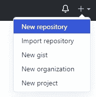
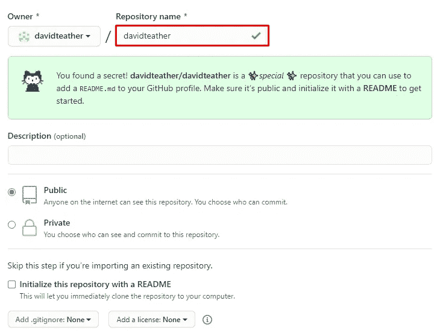
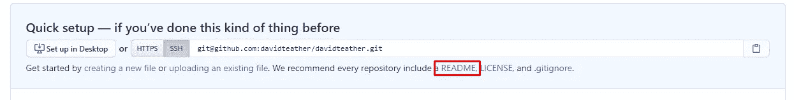
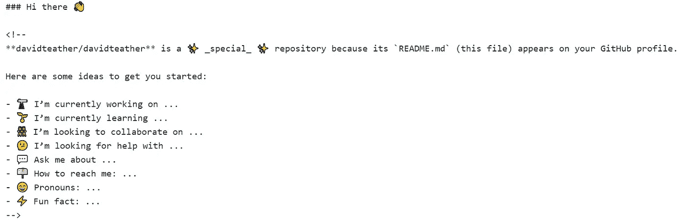
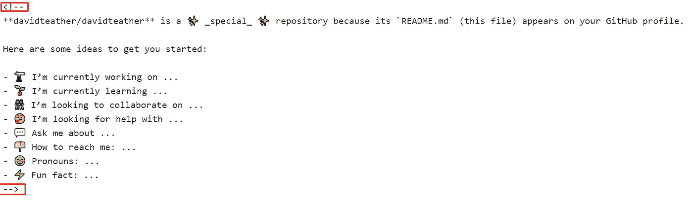
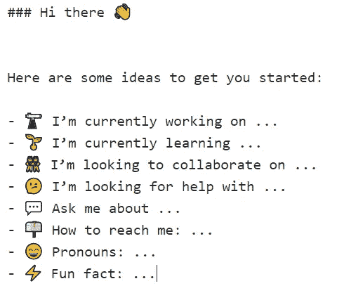
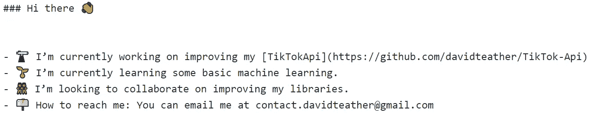

# 如何创建自定义 GitHub 配置文件

> 原文：<https://blog.devgenius.io/how-to-create-a-custom-github-profile-9a8e3a89694d?source=collection_archive---------6----------------------->

卡莱布·怀特在 [Unsplash](https://unsplash.com/s/photos/github?utm_source=unsplash&utm_medium=referral&utm_content=creditCopyText) 上的照片

GitHub 最近发布了一个更新，允许任何人创建高度定制的配置文件。在这篇文章中，我们将创建自己的漂亮的个人资料。

查看我的 [YouTube 频道](https://www.youtube.com/c/davidteather)更多与编程和工程相关的娱乐内容:)

首先登录你的 GitHub 账户。然后点击标题中的加号按钮并点击 new repository。

GitHub 会把你重定向到一个新的页面。让你的库名和你的 GitHub 用户名一样。

确保您的 GitHub 用户名是红色框中的名称。

完成后，向下滚动一点，直到找到 create repository 按钮，并单击它来创建一个新的存储库。

GitHub 会将您重定向到新的存储库，您应该会看到以下内容。

单击“README”按钮，该按钮在上图中用红框突出显示。

然后 GitHub 会为你的存储库创建一个新文件，这个文件会显示在你的个人资料中。GitHub 从一个模板开始。

在本教程中，我们将使用默认的 GitHub 模板，但是你可以随意更改。

GitHub 模板

在默认模板中，GitHub 已经注释掉了该模板，所以它不会显示在我们的个人资料中。我们需要删除下一个图像中突出显示的字符。

移除红色方框中的红色字符

你还应该删除声明这是一个特殊仓库的那一行，因为它不是超级专业的。

在这些变化之后，我们有以下内容

> 我们正在开发的文件支持 GitHub 的 markdown。你可以从 GitHub [这里](https://guides.github.com/features/mastering-markdown/)了解更多关于 markdown 的信息。

我决定将我的模板更改如下。

我的自述文件

滚动到页面底部，您可以指定一条提交消息，也可以点击“提交新文件”按钮。

创建新文件的按钮的图像。

现在，如果你去你的 GitHub 个人资料页面将会显示这个标记。

下面是我的个人资料页面的结果！

更改后我的个人资料的外观。

希望你能从这篇文章中学到一些东西。