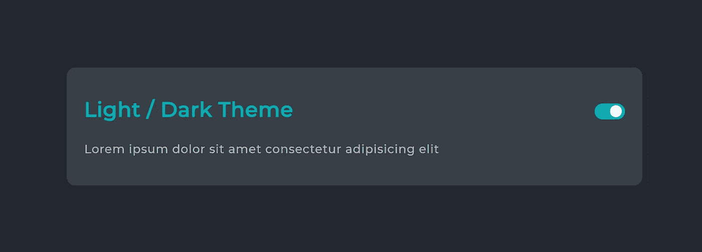
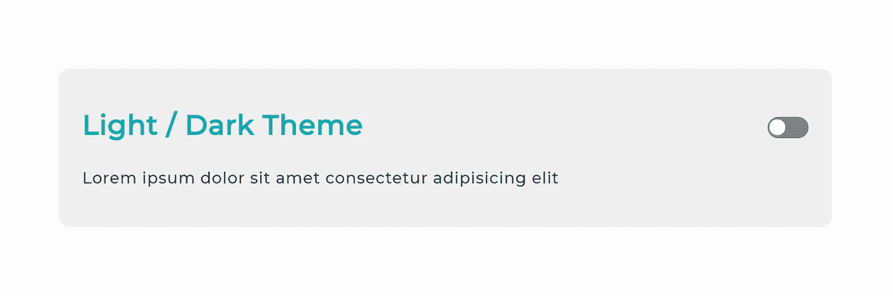

# 如何使用 HTML、CSS 和 JavaScript 创建暗/亮主题切换

> 原文：<https://blog.devgenius.io/how-to-create-a-dark-light-theme-switch-using-html-css-and-javascript-d8e466dcd979?source=collection_archive---------0----------------------->

在开始主题之前，我想告诉你为什么黑暗主题在你的网站上是必不可少的。在过去的 3-5 年里，黑暗模式变得很流行，因为公司开始推出这些模式，让夜间用户和亮屏用户受益。你知道黑暗模式在 ios，android，windows 等系统中无处不在..如果它无处不在，并不意味着你应该有一个，那么为什么它很重要。假设一些用户在晚上访问你的网站阅读一篇文章，较浅的颜色会使用户的眼睛疲劳。所以，我认为黑暗模式是每个网站必不可少的功能。

下面是使用深色主题的好处:

*   提高了文本的可读性
*   更好的对比度
*   减少眼睛疲劳
*   闪烁减少(如果存在问题)
*   蓝光更少
*   不易引发畏光
*   可以节省少量的电力

这里是我们最终项目的预览或者查看工作预览[这里](https://phanendraguptha.github.io/darktheme/)



黑暗主题



轻音乐主题

```
<html>
 <head>
  <title>Dark Mode</title>
  <link href="[https://fonts.googleapis.com/css2?family=Montserrat:wght@500&display=swap](https://fonts.googleapis.com/css2?family=Montserrat:wght@500&display=swap)" rel="stylesheet">
  <link rel="stylesheet" href="./style.css">
  <meta name="viewport" content="width=device-width, initial-scale=1.0">
 </head>
 <body>

 <div class="box">
  <h2>Light / Dark Theme
   <span>
    <form>
     <input onclick="toggle(this.form)" id="checkbox" name="checkbox" type="checkbox" /><label for="checkbox">Toggle</label>
    </form>
   </span>    
  </h2>
  <p>Lorem ipsum dolor sit amet consectetur adipisicing elit</p>
 </div>  

 <script src="./script.js"></script>
 </body>
</html>
```

> 创建一个名为 **style.css** 的文件，并粘贴下面的代码

```
/* light theme colors */
 html{
   --bg: #FCFCFC;
   --bg-panel: #EEEEEE;/*box container*/
   --color-headings: #00ADB5;/*heading*/
   --color-text: #393e46;/*paragraph*/
   height:100%;
   display:grid;
   align-items:center;
   justify-content:center;
   margin: 0;
   padding: 0;
 }
 /* dark theme colors */
 html[data-theme='dark']{
   --bg: #232931;
   --bg-panel: #393E46;
   --color-headings: #00ADB5;
   --color-text: #B5B5B5;
 }
 body{
   font-family: 'Montserrat', sans-serif;
   background-color: var(--bg);
 }
 /* box container */
 .box{
   display:grid;
   grid-template-rows: auto auto;
   border-radius: 15px;
   padding:30px;
   width:60vw;
   background-color: var(--bg-panel);
   letter-spacing: 0.05rem;
 }
 h2{
   font-size: 2.18rem;/*35px*/
   margin: 20px 0;
   color:var(--color-headings);
 }
 div h2 span{
   float: right;
 }
 div p{
   font-size: 1.25rem;/*20px*/
   margin-top: 5px;
   margin-bottom: 20px;
   color: var(--color-text);
 }
 form{  
   margin-top: 0.7rem;
 }
 /* checkbox toggler */
 input[type=checkbox]{
     height: 0;
   width: 0;
     visibility: hidden;
 }
 label {
     cursor: pointer;
     text-indent: -9999px;
     width: 52px;
     height: 27px;
     background: grey;
     float: right;
     border-radius: 100px;
     position: relative;
 }
 label:after {
     content: '';
     position: absolute;
     top: 3px;
     left: 3px;
     width: 20px;
     height: 20px;
     background: #fff;
     border-radius: 90px;
     transition: 0.3s;
 }
 input:checked + label {
     background: var(--color-headings);
 }
 input:checked + label:after {
     left: calc(100% - 5px);
     transform: translateX(-100%);
 }
 label:active:after {
     width: 45px;
 }
 /* transition */
 html.transition,
 html.transition *,
 html.transition *:before,
 html.transition *:after {
   transition: all 750ms **!important**;
   transition-delay: 0 **!important**;
 }
```

> 创建一个名为 **script.js** 的文件，并粘贴下面的代码

```
window.onload=function(){
   var theme = localStorage.getItem('data-theme');
   if(theme=='light'){
     document.documentElement.setAttribute('data-theme', 'light');
   }else if(theme==''){
     document.documentElement.setAttribute('data-theme', 'light');
   }else if(theme=='dark'){
     document.documentElement.setAttribute('data-theme' , 'dark');
     document.getElementById("checkbox").checked = true;
   }
 }
 function toggle(a){
   if(a.checkbox.checked==true){
     document.documentElement.classList.add('transition');
     document.documentElement.setAttribute('data-theme', 'dark');
     localStorage.setItem('data-theme','dark');
   }
   else if(a.checkbox.checked==false){
     document.documentElement.classList.add('transition');
     document.documentElement.setAttribute('data-theme', 'light');
     localStorage.setItem('data-theme','light');
   }
 };
```

# 下面解释一下上面的代码是如何工作的。

```
<input onclick="toggle(this.form)" id="checkbox" name="checkbox" type="checkbox" /><label for="checkbox">Toggle</label>
```

当用户点击切换按钮时，就会触发这个 JavaScript 函数。

```
function toggle(a){
   if(a.checkbox.checked==true){
     document.documentElement.classList.add('transition');
     document.documentElement.setAttribute('data-theme', 'dark');
     localStorage.setItem('data-theme','dark');
   }
   else if(a.checkbox.checked==false){
     document.documentElement.classList.add('transition');
     document.documentElement.setAttribute('data-theme', 'light');
     localStorage.setItem('data-theme','light');
   }
 };
```

最初，我们的网站将在轻模式。如果复选框被选中，我们的功能将设置数据主题为黑暗。由于数据主题设置为黑色，我们的网站使用下面的 CSS 变量，并相应地更新网页。

```
html[data-theme='dark']{
   --bg: #232931;
   --bg-panel: #393E46;
   --color-headings: #00ADB5;
   --color-text: #B5B5B5;
 }
```

如果复选框没有被选中，我们的功能将设置数据主题为轻。由于数据主题设置为轻，我们的网站使用下面的 CSS 变量。

```
html{
   --bg: #FCFCFC;
   --bg-panel: #EEEEEE;/*box container*/
   --color-headings: #00ADB5;/*heading*/
   --color-text: #393e46;/*paragraph*/
 }
```

> **查看 CSS 变量概念** [**此处**](https://developer.mozilla.org/en-US/docs/Web/CSS/Using_CSS_custom_properties)

```
document.documentElement.classList.add('transition');
```

上面的代码有助于使用下面的转换代码为我们的网站添加个性。您可以自由使用自己的过渡属性。

```
html.transition,
 html.transition *,
 html.transition *:before,
 html.transition *:after {
   transition: all 750ms **!important**;
   transition-delay: 0 **!important**;
 }
```

## 存储用户偏好以备将来访问

```
localStorage.setItem('data-theme','dark');
localStorage.setItem('data-theme','light');
```

使用本地存储的基本思想是将用户偏好存储在浏览器中(使用本地存储)。

> **查看本地存储** [**此处**](https://www.taniarascia.com/how-to-use-local-storage-with-javascript/)

当页面加载后，我们会检查之前是否选择了主题，并相应地更新网站界面。为此，我们使用下面的代码。

```
window.onload=function(){
   var theme = localStorage.getItem('data-theme');
   if(theme=='light'){
     document.documentElement.setAttribute('data-theme', 'light');
   }else if(theme==''){
     document.documentElement.setAttribute('data-theme', 'light');
   }else if(theme=='dark'){
     document.documentElement.setAttribute('data-theme' , 'dark');
     document.getElementById("checkbox").checked = true;
   }
 }
```

如果你想使用任何其他调色板，这里有你应该考虑的资源。

```
[https://colorhunt.co/palette/183903](https://colorhunt.co/palette/183903)
[https://colorhunt.co/palette/117601](https://colorhunt.co/palette/117601)
[https://colorhunt.co/palette/2763](https://colorhunt.co/palette/2763)
```

一定要在 [**Github**](https://github.com/phanendraguptha/darktheme) **上查看源文件。**

学习曲线对成长至关重要。所以，上船去找一些有趣的东西来帮助你提高学习曲线。