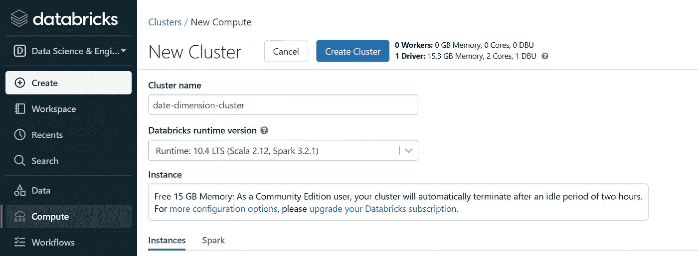

# 如何使用数据块创建日期维度？

> 原文：<https://blog.devgenius.io/how-to-create-a-date-dimension-using-databricks-4867858eb20f?source=collection_archive---------6----------------------->

在创建数据湖解决方案时，考虑数据模型的所有对应表是很重要的，无论我们是采用星型模式还是雪花模式，其中一个需要的重要维度是日期维度。

本文将展示如何在 Databricks 中使用 Spark Scala 构建日期维度表的扩展版本。

*   登录社区数据库:[https://community.cloud.databricks.com/](https://community.cloud.databricks.com/)
*   通过点击左侧面板上**计算**选项中的**创建集群**选项来创建集群。



最终样本数据

*   下一步是为日期维度列创建基本模板。为此，我们要创建一个 scala case 类，你可以在同一个主笔记本中创建它，也可以作为一个单独的笔记本。[https://tinyurl.com/dim-date](https://tinyurl.com/dim-date)

```
case class dim_date_schema(
                       date_key: Int,
                       date: String,
                       day: Int,
                       day_suffix: String,
                       week_day: Int,
                       week_day_name: String,
                       week_day_name_short: String,
                       week_day_name_first_letter: String,
                       day_of_year: Int,
                       week_of_month: Int,
                       week_of_year: Int,
                       month: Int,
                       month_name: String,
                       month_name_short: String,
                       month_name_first_letter: String,
                       quarter: Int,
                       quarter_name: String,
                       year: Int,
                       yyyymm: String,
                       month_year: String,
                       is_weekend: Int,
                       is_holiday: Int,
                       first_date_of_year: String,
                       last_date_of_year: String,
                       first_date_of_quarter: String,
                       last_date_of_quarter: String,
                       first_date_of_month: String,
                       last_date_of_month: String,
                       first_date_of_week: String,
                       last_date_of_week: String,
                       last_12_month_flag: Int,
                       last_6_month_flag: Int,
                       last_month_flag: Int
                     )
```

*   一旦我们为表格准备好了模板，我们将开始编写逻辑来填充各个列。为此，我们将创建一个 utils 对象[https://tinyurl.com/date-time-utils](https://tinyurl.com/date-time-utils)

```
import java.time.LocalDate
import java.time.format.DateTimeFormatter
import scala.collection.mutable.ListBuffer

object date_time_utils {
  val default_format = "yyyy-MM-dd"

  def check(start_date: String, end_date: String): Boolean = {
    val start = LocalDate.parse(start_date, DateTimeFormatter.ofPattern(default_format))
    val end = LocalDate.parse(end_date, DateTimeFormatter.ofPattern(default_format))
    end.isAfter(start)
  }

  def convert_string_to_date(current_date: String, input_format: String, output_format: String) = {
    val input_formatter = DateTimeFormatter.ofPattern(input_format)
    val output_formatter = DateTimeFormatter.ofPattern(output_format)
    output_formatter.format(input_formatter.parse(current_date))
  }

  def get_day_suffix(current_date: String) = {
    val day = convert_string_to_date(current_date, default_format, "d").toInt
    day match {
      case 1 => "st"
      case 21 => "st"
      case 31 => "st"
      case 2 => "nd"
      case 22 => "nd"
      case 3 => "rd"
      case 23 => "rd"
      case _ => "th"
    }
  }

  def get_quater_name(current_date: String) = {
    val quater = convert_string_to_date(current_date, default_format, "Q").toInt
    quater match {
      case 1 => "Q1"
      case 2 => "Q2"
      case 3 => "Q3"
      case 4 => "Q4"
    }
  }

  def is_weekend(current_date: String) = {
    val week_day_name = convert_string_to_date(current_date, default_format, "EEEE")
    week_day_name match {
      case "Saturday" => 1
      case "Sunday" => 1
      case _ => 0
    }
  }

  def get_date_of_year(current_date: String, position: String) = {
    val year = convert_string_to_date(current_date, default_format, "u")
    position match {
      case "first" => year + "-01-01"
      case "last" => year + "-12-31"
    }
  }

  def get_first_date_of_quarter(current_date: String) = {
    val quater = convert_string_to_date(current_date, default_format, "QQ")
    val year = convert_string_to_date(current_date, default_format, "u")
    quater match {
      case "01" => year + "-01-01"
      case "02" => year + "-04-01"
      case "03" => year + "-07-01"
      case "04" => year + "-10-01"
    }
  }

  def get_last_date_of_quarter(current_date: String) = {
    val quater = convert_string_to_date(current_date, default_format, "QQ")
    val year = convert_string_to_date(current_date, default_format, "u")
    quater match {
      case "01" => year + "-03-31"
      case "02" => year + "-06-30"
      case "03" => year + "-09-30"
      case "04" => year + "-12-31"
    }
  }

  def get_first_date_of_month(current_date: String) = {
    val month = convert_string_to_date(current_date, default_format, "MM")
    val year = convert_string_to_date(current_date, default_format, "u")
    year + "-" + month + "-01"
  }

  def get_last_date_of_month(current_date: String) = {
    val converted_date = LocalDate.parse(current_date, DateTimeFormatter.ofPattern(default_format))
    val last_day_of_month = converted_date.withDayOfMonth(converted_date.getMonth.length(converted_date.isLeapYear))
    last_day_of_month.toString
  }

  def get_first_date_of_week(current_date: String) = {
    val converted_date = LocalDate.parse(current_date, DateTimeFormatter.ofPattern(default_format))
    val day_backward = convert_string_to_date(current_date, default_format, "e").toInt - 1
    converted_date.minusDays(day_backward).toString
  }

  def get_last_date_of_week(current_date: String) = {
    val converted_date = LocalDate.parse(current_date, DateTimeFormatter.ofPattern(default_format))
    val day_forward = 7 - convert_string_to_date(current_date, default_format, "e").toInt
    converted_date.plusDays(day_forward).toString
  }

  def get_last_12_month_list() = {
    var last_12_month_list = ListBuffer[String]()
    var i = 0
    for( i <- 1 to 12){
      last_12_month_list += DateTimeFormatter.ofPattern("yyyyMM").format(LocalDate.now.minusMonths(i))
    }
    last_12_month_list
  }

  def get_last_12_month_flag(yyyyMM: String) = {
    if (get_last_12_month_list().contains(yyyyMM)) 1 else 0
  }

  def get_last_6_month_flag(yyyyMM: String) = {    
    if (get_last_12_month_list().slice(0,6).contains(yyyyMM)) 1 else 0
  }

  def get_last_month_flag(yyyyMM: String) = {
    if (get_last_12_month_list()(0).equals(yyyyMM)) 1 else 0
  }

  def get_calendar_end_date(plus_month:Int) = {
    get_last_date_of_month(DateTimeFormatter.ofPattern("yyyy-MM-dd").format(LocalDate.now.plusMonths(plus_month)))
  }
}
```

*   现在，当我们定义了为日期维度生成行的所有基本函数后，我们将创建 dim 日期生成器记事本[https://tinyurl.com/dim-date-generator](https://tinyurl.com/dim-date-generator)

```
def dim_date_generator(current_date: String): dim_date_schema ={
  val default_format = "yyyy-MM-dd"
  val date_key = date_time_utils.convert_string_to_date(current_date, default_format, "yyyyMMdd").toInt
  val date = current_date
  val day = date_time_utils.convert_string_to_date(current_date, default_format, "d").toInt
  val day_suffix = date_time_utils.get_day_suffix(current_date)
  val week_day = date_time_utils.convert_string_to_date(current_date, default_format, "e").toInt
  val week_day_name = date_time_utils.convert_string_to_date(current_date, default_format, "EEEE")
  val week_day_name_short = date_time_utils.convert_string_to_date(current_date, default_format, "E").toUpperCase
  val week_day_name_first_letter = date_time_utils.convert_string_to_date(current_date, default_format, "E").substring(0, 1)
  val day_of_year = date_time_utils.convert_string_to_date(current_date, default_format, "D").toInt
  val week_of_month = date_time_utils.convert_string_to_date(current_date, default_format, "W").toInt
  val week_of_year = date_time_utils.convert_string_to_date(current_date, default_format, "w").toInt
  val month = date_time_utils.convert_string_to_date(current_date, default_format, "M").toInt
  val month_name = date_time_utils.convert_string_to_date(current_date, default_format, "MMMM")
  val month_name_short = date_time_utils.convert_string_to_date(current_date, default_format, "MMM").toUpperCase
  val month_name_first_letter = date_time_utils.convert_string_to_date(current_date, default_format, "MMM").substring(0, 1)
  val quarter = date_time_utils.convert_string_to_date(current_date, default_format, "Q").toInt
  val quarter_name = date_time_utils.get_quater_name(current_date)
  val year = date_time_utils.convert_string_to_date(current_date, default_format, "u").toInt
  val yyyyMM = date_time_utils.convert_string_to_date(current_date, default_format, "yyyyMM")
  val month_year = date_time_utils.convert_string_to_date(current_date, default_format, "yyyy MMM").toUpperCase
  val is_weekend = date_time_utils.is_weekend(current_date)
  val is_holiday = 0
  val first_date_of_year = date_time_utils.get_date_of_year(current_date, "first")
  val last_date_of_year = date_time_utils.get_date_of_year(current_date, "last")
  val first_date_of_quarter = date_time_utils.get_first_date_of_quarter(current_date)
  val last_date_of_quarter = date_time_utils.get_last_date_of_quarter(current_date)
  val first_date_of_month = date_time_utils.get_first_date_of_month(current_date)
  val last_date_of_month = date_time_utils.get_last_date_of_month(current_date)
  val first_date_of_week = date_time_utils.get_first_date_of_week(current_date)
  val last_date_of_week = date_time_utils.get_last_date_of_week(current_date)
  val last_12_month_flag = date_time_utils.get_last_12_month_flag(yyyyMM)
  val last_6_month_flag = date_time_utils.get_last_6_month_flag(yyyyMM)
  val last_month_flag = date_time_utils.get_last_month_flag(yyyyMM)
  dim_date_schema(date_key, date, day, day_suffix, week_day, week_day_name, week_day_name_short, week_day_name_first_letter,
    day_of_year, week_of_month, week_of_year, month, month_name, month_name_short, month_name_first_letter, quarter,
    quarter_name, year, yyyyMM, month_year, is_weekend, is_holiday, first_date_of_year, last_date_of_year, first_date_of_quarter,
    last_date_of_quarter, first_date_of_month, last_date_of_month, first_date_of_week, last_date_of_week, last_12_month_flag, last_6_month_flag, last_month_flag)
}
```

*   最后一步是创建最终笔记本，我们将从“2017–01–01”开始我们的维度开始日期，直到当前年份+ 5，[https://tinyurl.com/dim-date-t](https://tinyurl.com/dim-date-t)

```
import org.apache.spark.sql.functions._
import org.apache.spark.sql.DataFrame

def create_final_df(): DataFrame = {

  //Start Date
  var start_date = "2017-01-01"

  //End Date
  val end_date = date_time_utils.get_calendar_end_date(60)

  //Mutable list to store dim date
  var dim_date_mutable_list = new ListBuffer[dim_date_schema]()

  while (date_time_utils.check(start_date, end_date)) {
    val dim_date_schema_object = dim_date_generator(start_date)
    dim_date_mutable_list += dim_date_schema_object
    start_date = LocalDate.parse(start_date, DateTimeFormatter.ofPattern("yyyy-MM-dd")).plusDays(1).toString
  }

  val dim_date_list = dim_date_mutable_list.toList
  val dim_date_df = spark.createDataset(dim_date_list)
  dim_date_df.select(col("date_key")
    , col("date").cast("date")
    , col("day")
    , col("day_suffix")
    , col("week_day")
    , col("week_day_name")
    , col("week_day_name_short")
    , col("week_day_name_first_letter")
    , col("day_of_year")
    , col("week_of_month")
    , col("week_of_year")
    , col("month")
    , col("month_name")
    , col("month_name_short")
    , col("month_name_first_letter")
    , col("quarter")
    , col("quarter_name")
    , col("year")
    , col("yyyymm")
    , col("month_year")
    , col("is_weekend")
    , col("is_holiday")
    , col("first_date_of_year").cast("date")
    , col("last_date_of_year").cast("date")
    , col("first_date_of_quarter").cast("date")
    , col("last_date_of_quarter").cast("date")
    , col("first_date_of_month").cast("date")
    , col("last_date_of_month").cast("date")
    , col("first_date_of_week").cast("date")
    , col("last_date_of_week").cast("date")
    , col("last_12_month_flag")
    , col("last_6_month_flag")
    , col("last_month_flag")
    , current_timestamp().as("load_date"))
}
```

*   你可以从 git 库[https://github.com/aakashjainiitg/date-dimension](https://github.com/aakashjainiitg/date-dimension)下载整套笔记本

为了在基于 PowerBI、Tableau 或 QlikView 构建的前端仪表板上创建过滤器，创建日期维度对于数据分析解决方案非常重要。