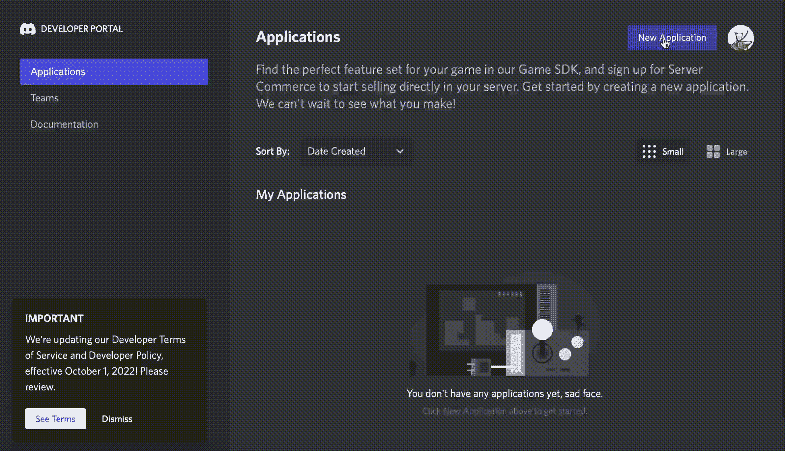
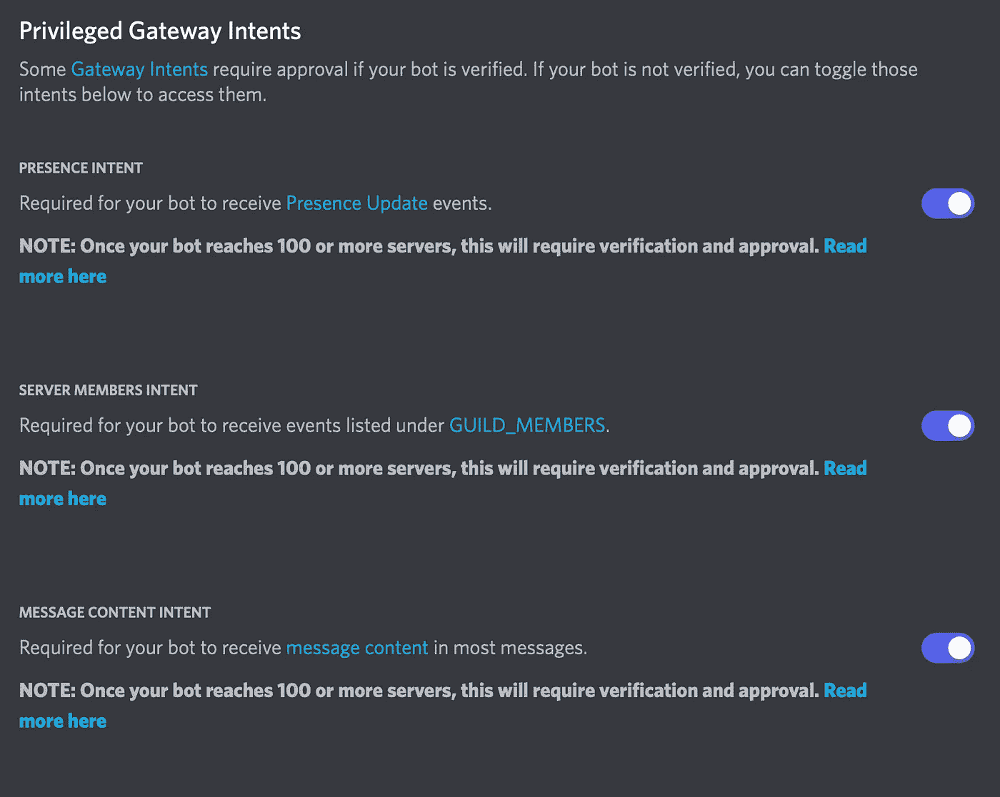
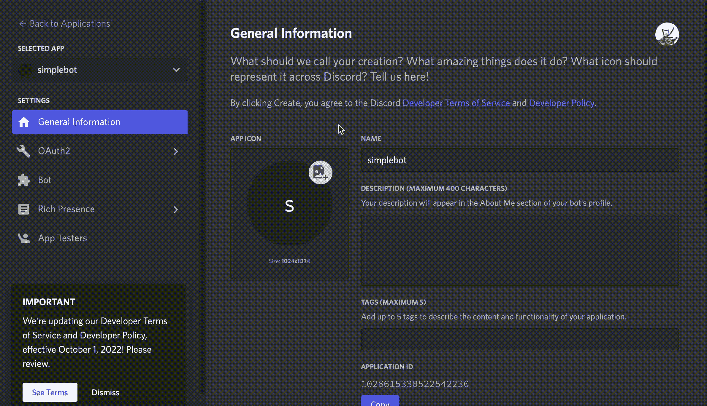
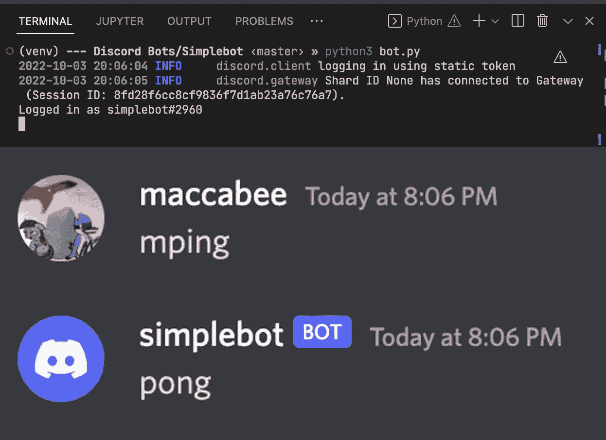

# 如何用 Python 创建一个不和谐机器人

> 原文：<https://blog.devgenius.io/how-to-create-a-discord-bot-in-python-948c64d50ba6?source=collection_archive---------7----------------------->

利用 discord.py 开始您的 discord bot 开发之旅！

[](https://unsplash.com/photos/TsHSW89wjGU)

凯蒂·波兰斯基在 Unsplash 上的原始照片，由作者编辑

*本文假设你已经安装了 Python，以及一个 discord 账户。*

## 步骤 1:配置您的环境

前往 [Discord 开发者门户](https://discord.com/developers/applications)，创建一个新的应用



在 discord 开发者门户上创建一个新的机器人

当您按下“重置令牌”时，它将为您重新生成一个令牌，您现在可以复制该令牌。

警告:不要共享这个令牌。否则任何人都可以作为你的机器人登录。



在机器人菜单中，确保启用所有你可能需要的特权意图

在代码编辑器中，创建一个名为'的新文件。env ',并像这样放置您的令牌:

用您的令牌替换“令牌”



让我们也抓住链接，我们需要添加我们的机器人到服务器

如果您计划使用比简单发送消息更多的功能，请通过单击相应的框在此链接中注明它们。


太好了！

让我们也安装我们需要开始的所有软件包

```
$ python3 -m venv venv
$ source venv/bin/activate
$ pip3 install python-dotenv discord.py
```

现在，我们准备编码

## 第二步:编写你的机器人代码

打开名为“bot.py”的新文件

首先，我们将导入我们计划在代码中使用的所有依赖项。

Discord 实施了一个名为“意图”的新许可系统。为了简单起见，我们可以保存我们可能需要的所有意图的列表，并在已经激活它们的情况下运行 bot。

接下来我们运行' load_dotenv()'这个函数带来了我们在。env 文件放入作用域，这样我们就可以在代码中使用它们。这是访问我们的 discord bot 令牌的首选方式，这样我们就不会意外地公开它。

接下来我们来定义一下机器人。我们正在创建一个新的 bot 对象，它将使用前缀' m '和我们预定义的意图。前缀可以是你在命令前输入的任何东西，这样机器人就可以运行它，常见的前缀包括“！”, '?'，和'-'。为了避免触发你的服务器中已经有的任何机器人，我在本教程中使用“m”。

现在我们定义我们的第一个 bot 事件，“on_ready()”Discord 有许多我们可以读到的事件，由文档中的[事件参考](https://discordpy.readthedocs.io/en/stable/api.html#event-reference)概述。使用这个事件引用，我们将打印出机器人一旦准备好接受命令就已经成功登录

接下来，我们使用第一个 bot 命令。这个函数不是在事件上运行，而是在用户调用命令时运行。我们的命令叫做“ping”，机器人运行后会用“pong”来响应用户。这是一个简单的例子来说明一个不和谐机器人的一些特性，你可以在这里的方法中了解更多的[。](https://discordpy.readthedocs.io/en/stable/ext/commands/api.html#bots)

最后，`bot.run(TOKEN)`将推出我们的不和谐机器人

让我们运行`python3 bot.py`看看会发生什么！



我们的机器人成功运行了！

## 结论

恭喜你！你刚刚制造了你的第一个不和谐机器人！

虽然这个机器人不是最复杂的，但它为你打开了一扇门，让你可以开始更高级的项目。

如果你对让一个 24/7 托管的机器人连接到数据库感兴趣，你应该看看[这篇文章](https://medium.com/@danielkoganx/how-to-create-an-advanced-discord-bot-using-mongodb-aws-and-docker-eb2d2f21c888)，这篇文章正好讨论了这个问题！

[](https://medium.com/@danielkoganx/how-to-create-an-advanced-discord-bot-using-mongodb-aws-and-docker-eb2d2f21c888) [## 如何使用 MongoDB、AWS 和 Docker 创建一个高级的 Discord Bot

### 了解如何在云上托管一个 discord bot，使用一个数据库来实现完整的 CRUD 功能。

medium.com](https://medium.com/@danielkoganx/how-to-create-an-advanced-discord-bot-using-mongodb-aws-and-docker-eb2d2f21c888) 

此外，我们今天为 simplebot 编写的代码可以在[这个库](https://github.com/daminals/Simplebot)中找到，如果你想仔细看看的话！

[](https://github.com/daminals/Simplebot) [## GitHub - daminals/Simplebot:一个基本的不和谐机器人

### 一个基本的不和谐机器人，可以作为更高级操作的基础

github.com](https://github.com/daminals/Simplebot)