# 如何用 NextJS 创建动态 WhatsApp FAVICON

> 原文：<https://blog.devgenius.io/how-to-create-a-dynamicwhatsapp-favicon-with-nextjs-dd97181bac94?source=collection_archive---------8----------------------->

马頔·索罗明在 [Unsplash](https://unsplash.com?utm_source=medium&utm_medium=referral) 上拍摄的照片

如今，现代浏览器和新的开发框架让我们有可能创建解决方案，这些解决方案以前执行起来比较复杂，现在对产品的可用性有很大帮助。

举一个例子，WhatsApp 应用程序允许我们观察何时有人给我们发送了一条消息或我们有几条未读消息，WhatsApp 会发出不同类型的通知，从声音、推送通知到简单显示未读消息数量的图标。

**在这篇文章中，我们将讨论图标中的通知，它直观地向我们展示了没有阅读的通知的数量。**

# 我们将使用什么？

NextJS
查克拉伊

## 我们需要做的第一件事是通过运行以下命令在 NextJS 中创建我们的项目。

> yarn create next-app
> 或
> Npx create-next-app @ latest
> 或
> Pnpm create next-app

一旦我们的项目被创建，我们导航到我们的项目容器文件夹来安装和配置 **Chakra**

## 现在我们安装查克拉。

*纱加@ chakra-ui/react @ emotion/react @ @ emotion/styled @framer-motion@⁶*

当这个过程完成后，下一件事就是配置我们的脉轮，在项目文件夹中我们执行下面的命令。

*代码。*

这个命令将打开我们的项目，现在在我们的文件夹结构中我们寻找 pages 文件夹，在其中我们寻找名为 _app.js
的文件，我们继续打开它并导入我们的 chakra 库，我们将得到以下结果。

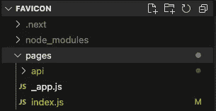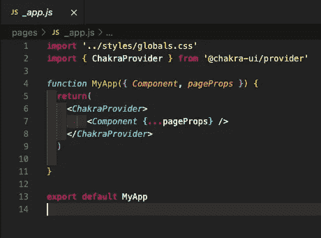

脉轮结构

如果我们运行我们的服务器，我们可以看到一切工作正常。

# 下一步，我们开始开发我们的网站图标的功能。

我们从 index.js 中的 Chakra-ui 导入按钮、Flex 和框组件
我们从 index.js 中的 react 导入 useState 和 useEffect

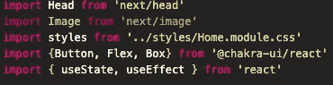

我们创建我们需要的两个变量

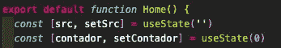

我们用 WhatsApp 通知的 SVG 图像创建变量。

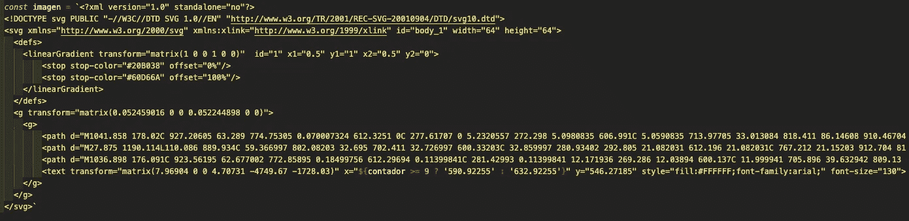

WhatsApp SVG 图标

我们创建了从 SVG 图像生成 BLOB 文件的函数。

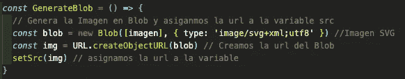

我们创建一个函数来更新计数器并执行 BLOB 函数

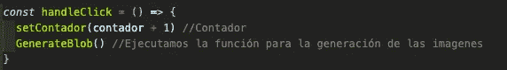

我们初始化我们的第一次运行来创建我们的第一个图像

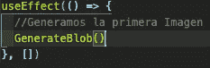

最后，我们创建我们的 HTML 结构

在标签<title>中，我们将做一些小的改动，如下所示。 标签内的<链接>我们也做了相应的修改，以便能够检测到相应的图标，它应该看起来像下面这样。</title>

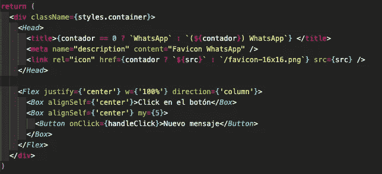

是时候运行我们的项目了！

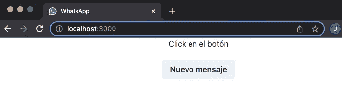

如果一切顺利，如果我们按下按钮，我们会看到我们的图标开始随着我们的计数器一起变化。

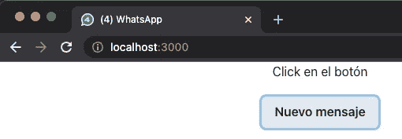

# 太好了！

## 结论
我们可以通过改变 WhatsApp SVG 并添加更复杂的功能，在我们的实际项目中使用这一功能。

# **剩下的就看你的了……**

在[https://github.com/mostrilio/favicon_dynamic_next](https://github.com/mostrilio/favicon_dynamic_next)下载源代码