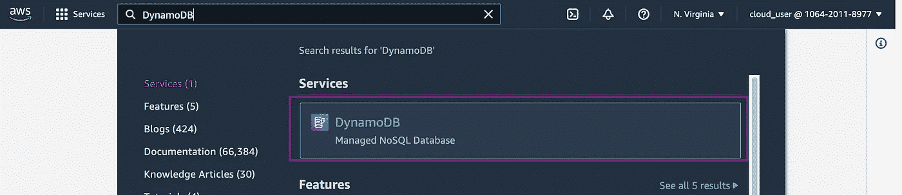
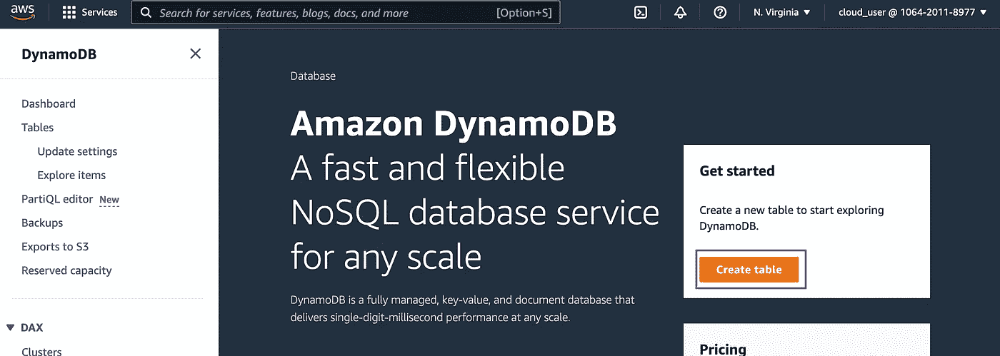
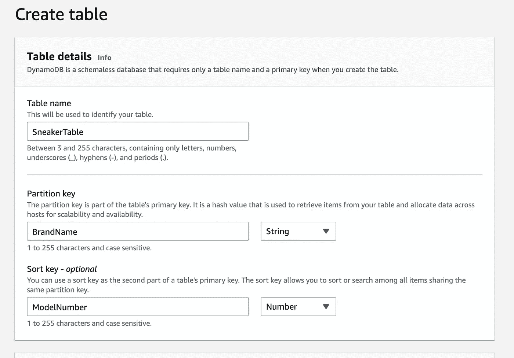
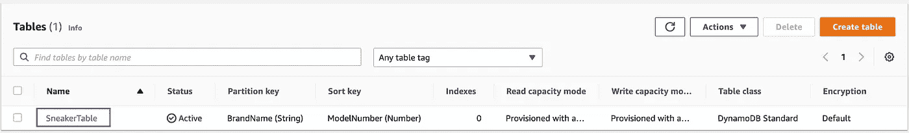
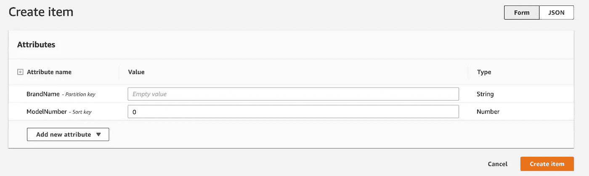
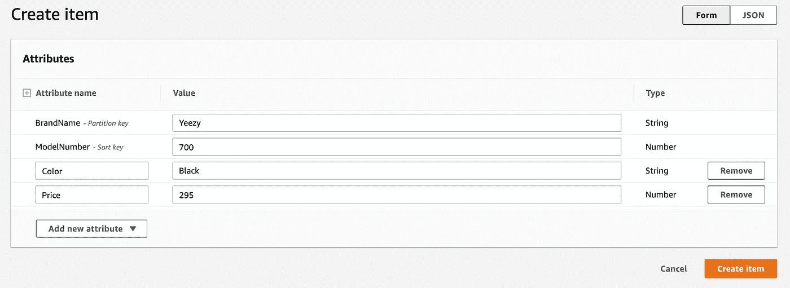

# 如何创建 DynamoDB 表

> 原文：<https://blog.devgenius.io/how-to-create-a-dynamodb-table-940b88cb0afc?source=collection_archive---------7----------------------->

Amazon DynamoDB 是一个完全托管的、低延迟、高可用的 NoSQL 数据库，提供一位数毫秒级的性能。DynamoDB 是无服务器的，将根据性能需求自动扩展。DynamoDB 适用于广泛的用例，例如游戏、移动和 IOT 设备等等。

本教程将介绍如何在 AWS 管理控制台上创建一个简单的 DynamoDB 表。将创建一个分区键和一个排序键来形成一个复合主键。

*什么是复合主键？*

复合主键是由两个属性(分区和排序键)组成的键，用于唯一标识表中的每一项。

**先决条件:**

*   具有 DynamoDB 权限的 IAM 用户帐户

# 步骤 1:创建 DynamoDB 表

在 AWS 控制台上，通过在管理控制台的搜索栏中键入“DynamoDB ”,导航到 DynamoDB 仪表板。

单击创建表格。

接下来，输入一个表名。这将用于识别您的表。

选择了表名之后，需要选择分区键和排序键。在具有复合主键的表中，多个项目可能具有相同的分区键，但是它们不能具有相同的排序键。

对于本教程，将使用品牌名称作为分区键，型号作为排序键来创建一个运动鞋表。对于文本输入，选择“字符串”，对于数字输入，选择“数字”。

其余项目的默认选择适合本教程的目的。

单击页面底部的创建表格。

# **第二步:向表中添加项目**

一旦您的表完成预配，请单击您的表名将其打开。

单击右上角的浏览表格项目，然后选择创建项目。

在这个页面上，您会注意到列出了分区键和排序键属性。

让我们向表中再添加几个属性。

单击创建项目。

重复此步骤，将其他项目添加到表格中。