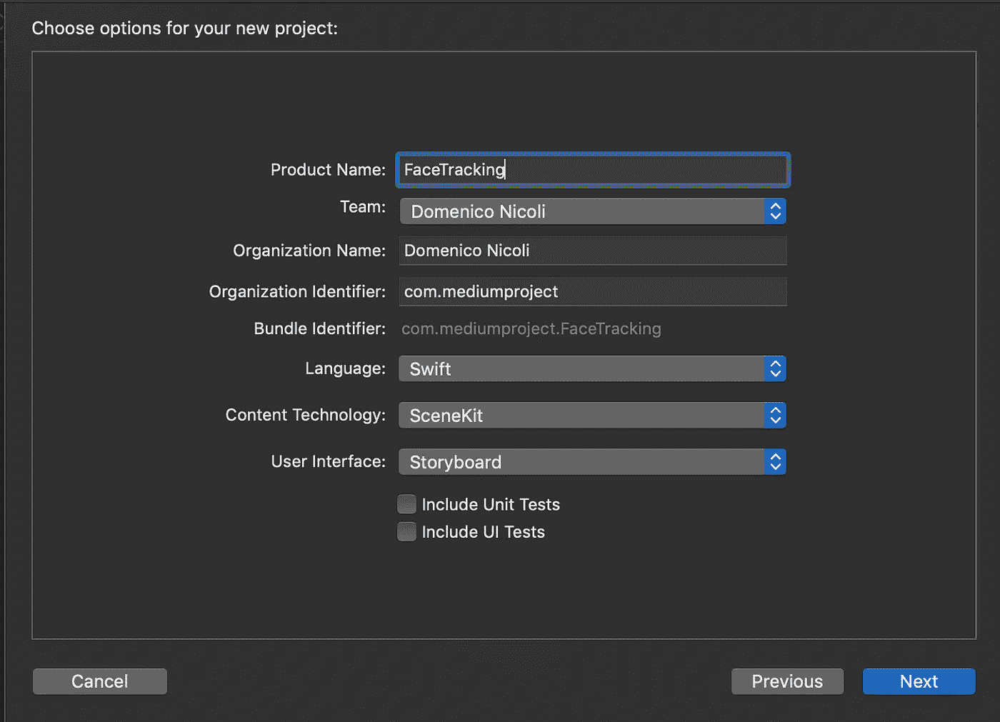
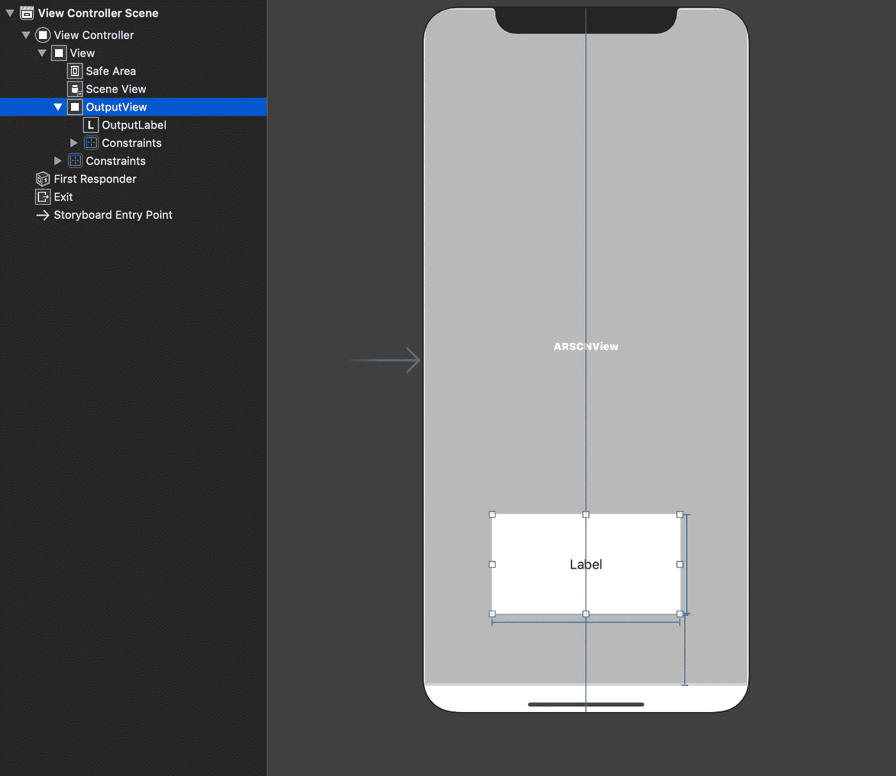
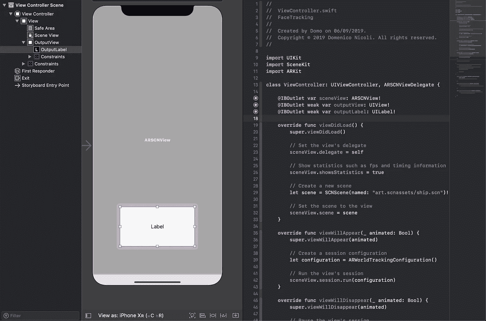
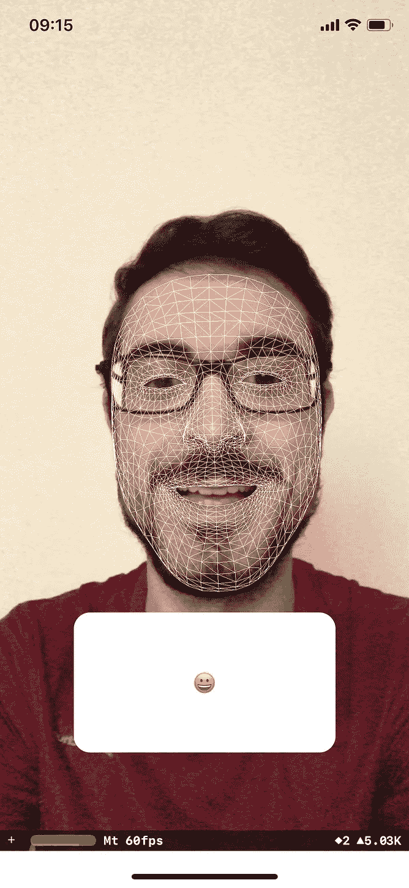
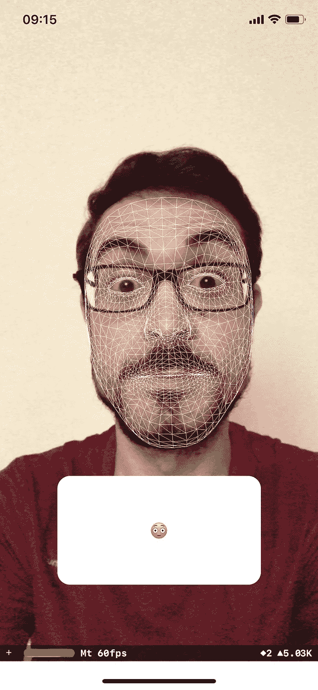
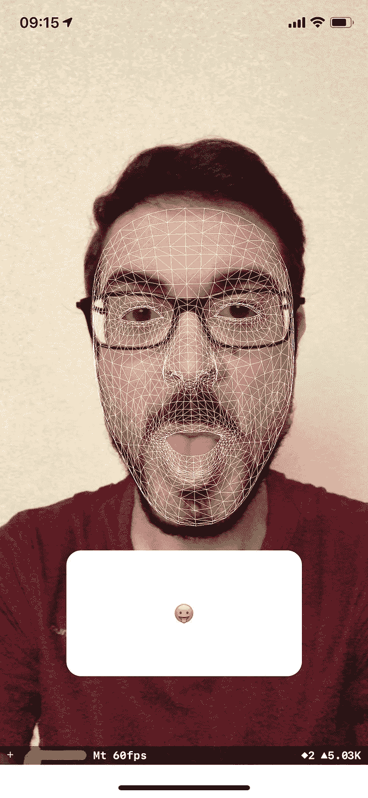

# 如何在 Swift 中用原深感摄像头创建人脸表情识别器

> 原文：<https://blog.devgenius.io/how-to-create-a-face-expression-recognizer-with-truedepth-camera-in-swift-7ddef0db51de?source=collection_archive---------1----------------------->

## 释放面部跟踪的力量，识别用户表情并转换为表情符号

[wccftech.com](https://wccftech.com/apparently-animoji-on-the-iphone-x-does-not-need-the-truedepth-camera-to-work/)

# 介绍

两年前，通过 iPhone X，苹果推出了一种新的摄像头和生物识别设备。名为[原深感摄像头](https://developer.apple.com/search/?q=truedepth)，它包含一个点红外投影仪，通过用 3 万个不可见的点映射你的脸来识别你。由于这种准确性，我们也可以识别不同的面部运动。今天我会告诉你这有多简单！

# 入门指南

首先，打开 [Xcode](https://developer.apple.com/xcode/) ，新建一个 Xcode 项目。一定要选择 iOS 下的增强现实 App。

现在转到`Main.storyboard`文件，并在其中添加一个 UIView 和标签。这将显示我们的文本输出。

创建两个新出口，一个用于视图，另一个用于输出标签。

转到`ViewController.swift`文件，用下面的代码替换`viewDidLoad`方法。这比自动创建的更简单，对于我们今天要实现的目标来说已经足够了。

现在让我们来关注一下`viewWillAppear`方法。我们需要改变`ARFaceTrackingConfiguration()`中的`ARWorldTrackingConfiguration()`。第一个用于增强现实，但在这种情况下，我们不需要它；我们想使用面部追踪技术。

然后，添加下面的代码:`// MARK: - ARSCNViewDelegate`注释。这段代码的第一部分被称为 when `ARSCNViewis rendered`，将创建 3D 人脸几何图形，并将其放在用户的脸上。第二部分，每次`sceneView`更新时调用，刷新 3D 面锚点。

运行该应用程序，您会看到类似以下内容:

# 欢乐时光

好了，现在我们用线条做的面具遮住了我们的脸，但是我们能用它做什么呢？

首先，添加一个全局字符串变量，命名为`facePoseResult`。然后，用下面的代码更新`renderer(_didUpdate:)`方法:

最后，添加每次刷新都会调用的`facePoseAnalyzer`方法，它将处理我们的面部表情。然后，它会用一个类似的表情符号更新标签。

运行应用程序，这应该是结果！

# 完整代码

你可以在 [GitHub](https://github.com/domeniconicoli/FaceTracking/tree/master) 上找到完整代码。

# 结论

探索所有可用的[混合形状](https://developer.apple.com/documentation/arkit/arfaceanchor/blendshapelocation)，并尝试根据自己的面部表情添加更多表情符号！请记住，每个形状返回不同的值(有时是意想不到的)，所以请参考 Apple 文档或在您的代码中放置一些断点，以便更好地理解要使用的正确值。

感谢您的阅读。如果你有任何问题或建议，请在评论中告诉我。