# 如何在 Unity 中创建装载场景

> 原文：<https://blog.devgenius.io/how-to-create-a-loading-scene-in-unity-19589666df82?source=collection_archive---------1----------------------->

## 异步操作和进度条

Unity 有 [**AsyncOperation**](https://docs.unity3d.com/2021.1/Documentation/ScriptReference/AsyncOperation.html) 可以用来加载 [**场景**](https://docs.unity3d.com/2021.1/Documentation/ScriptReference/SceneManagement.SceneManager.LoadSceneAsync.html)[**资产**](https://docs.unity3d.com/2021.1/Documentation/ScriptReference/AssetBundle.LoadAssetAsync.html)[**资源**](https://docs.unity3d.com/2021.1/Documentation/ScriptReference/Resources.LoadAsync.html) 。这些操作的目的是当游戏继续运行时，Unity 中的资产可以在后台用协程加载。大型资产的加载需要几秒甚至几分钟的时间，这取决于运行它的硬件的互联网速度(如果从互联网加载)。在 Unity 中使用正常的加载功能可以让它看起来像游戏被破坏了一样。

我的游戏关卡需要几秒钟才能加载。当游戏加载时，我会显示一个带有进度条的加载屏幕，这样玩家就可以看到游戏没有被破坏，它只是在加载。

# 场景设置

在 unity 中显示任何类型的进度条的基础是拥有一个**图像类型**设置为填充的图像。

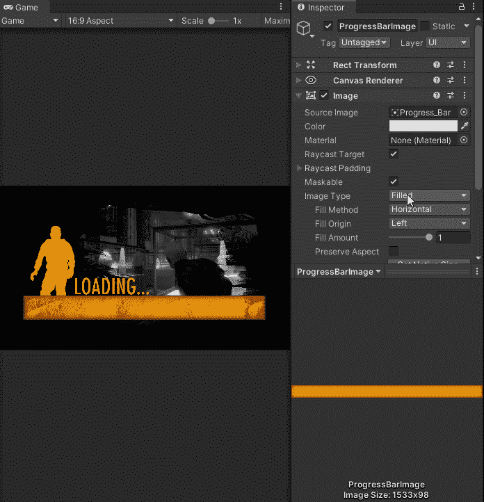

有几种不同的**填充方法**和不同的**填充原点**可以用来控制**图像**的填充方式。圆形样式填充也有顺时针选项。正如你所看到的，Unity 有一个非常强大且易于使用的系统，可以处理大多数类型的灌装。因为我有一个水平栏，我想让它从左向右填充，所以我将使用`**Fill Method**=Horizontal`和`**Fill Origin**=Left`

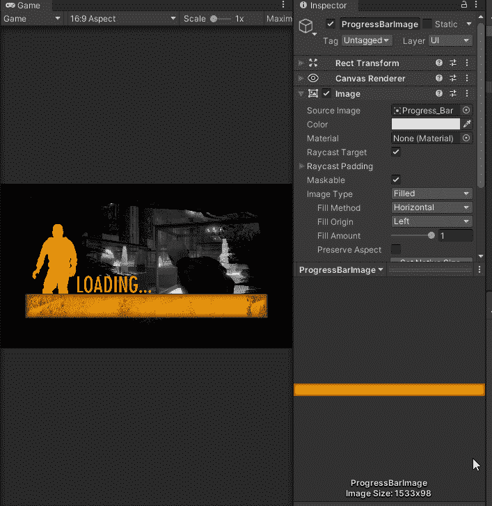

更改填充代码非常简单，只需获取对图像的引用，并将填充量设置为 0 到 1 之间的浮点数，0 表示空，0.5 表示一半，1 表示满。恰好 Unity 中的 [**AsyncOperation**](https://docs.unity3d.com/2021.1/Documentation/ScriptReference/AsyncOperation.html) 方法有一个 [**Progress**](https://docs.unity3d.com/2021.1/Documentation/ScriptReference/AsyncOperation-progress.html) 属性，返回一个 0 到 1 之间的数字。

# 代码

我需要一个从 Start 方法启动的协程

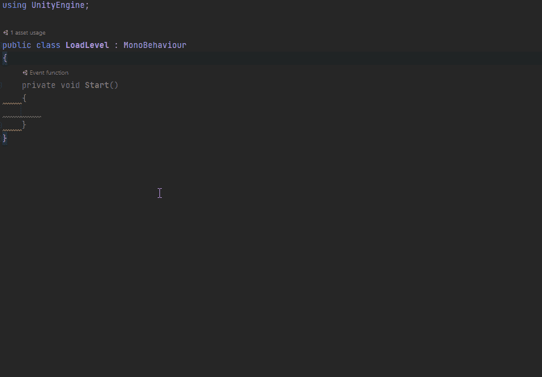

加载场景需要一个字符串作为场景名称，或者一个 int 作为构建索引。我需要一种方法来与负载级场景之外的其他场景进行交流，有几种方法可以做到这一点，即脚本化对象或静态变量。我将使用一个公共的静态 Int 变量。我还需要一个有填充类型的图像。

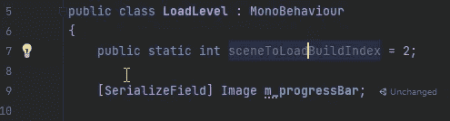

在 Start 方法中，我做了一些错误检查，以确保我有进度条图像。

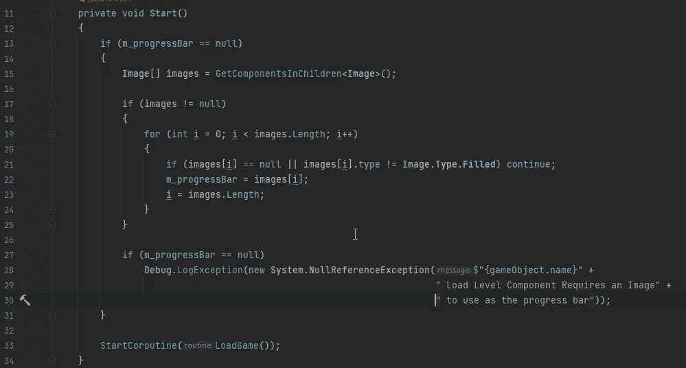

在加载场景协程中，我需要从 [**加载场景异步**](https://docs.unity3d.com/2021.1/Documentation/ScriptReference/SceneManagement.SceneManager.LoadSceneAsync.html) 方法中获取 [**异步操作**](https://docs.unity3d.com/2021.1/Documentation/ScriptReference/AsyncOperation.html) 。

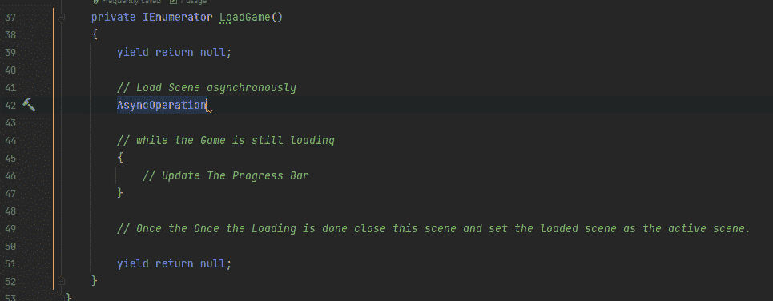

现在我可以使用 [**异步操作**](https://docs.unity3d.com/2021.1/Documentation/ScriptReference/AsyncOperation.html) 来显示场景加载的进度。

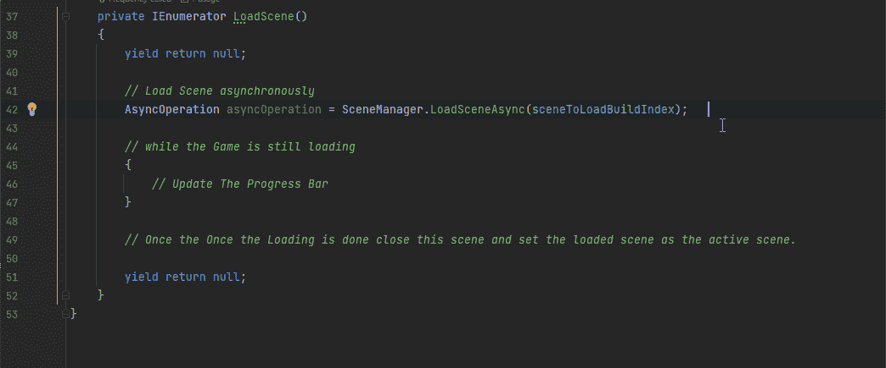

现在我需要从我的主菜单行为中使用加载场景。我为加载屏幕的构建索引添加了一个变量， [**场景属性**](/making-the-inspector-look-better-175baf39ada0) ，这样我就可以从下拉列表中选择场景。我必须更改方法的名称，这样我才能访问负载级别行为。我将场景设置为加载，然后加载加载场景。

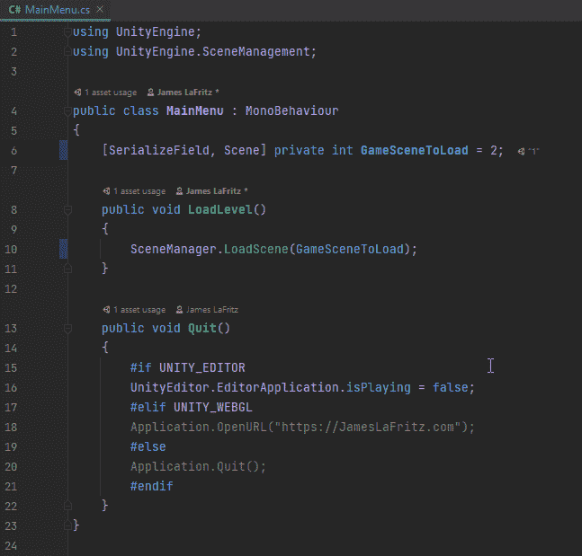

在主菜单场景中，我需要修复 Start 按钮，因为我更改了它正在使用的方法的名称，丢失了对该方法的引用。

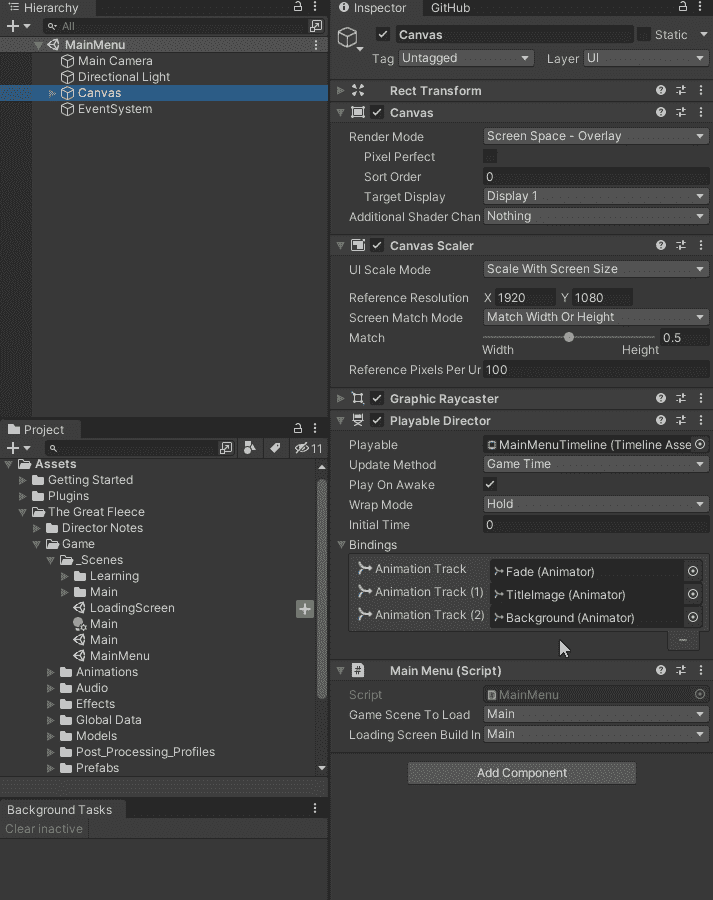

现在我需要确保加载屏幕在构建设置中。然后我可以在下拉列表中设置它。

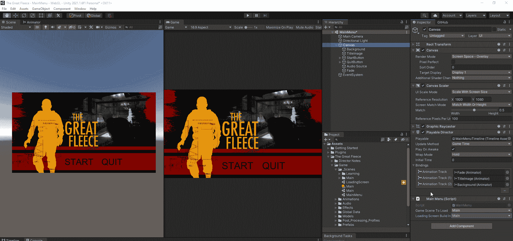

现在开始游戏有一个很好的过渡。

我甚至可以使用 UI 管理器中的加载屏幕。这样做的好处是，我不需要担心当前场景的场景索引是什么，因为它已经在静态场景中加载构建索引了。

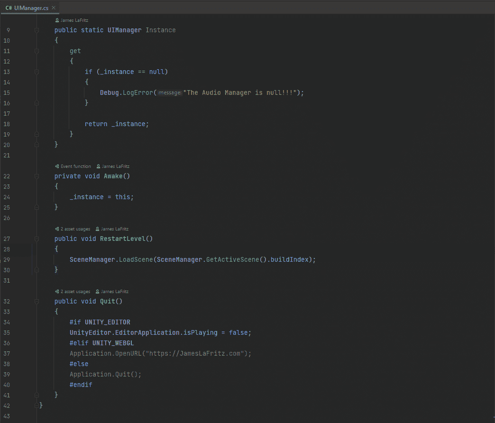

固定装载杆。因此，进度返回值 0 到 0.9，因为最后的 0.1 实际上是在场景激活过程中完成的，我实际上从来没有看到过，因为完成设置为 true。为了让我的进度条在卸载加载场景之前完全显示，我需要通过除以 0.9，然后使用 Mathf 将其箝位，将进度条转换为 0 到 1 之间的数字。夹具 01

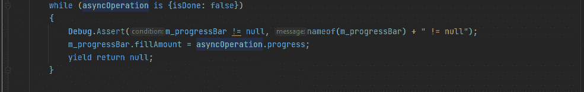

# [**允许场景操作**](https://docs.unity3d.com/2021.1/Documentation/ScriptReference/AsyncOperation-allowSceneActivation.html)

[**异步操作**](https://docs.unity3d.com/2021.1/Documentation/ScriptReference/AsyncOperation.html) 也有 [**允许场景操作**](https://docs.unity3d.com/2021.1/Documentation/ScriptReference/AsyncOperation-allowSceneActivation.html) 允许我保持下一个场景不完全加载。我可以用它来做一些其他有趣的事情，比如显示关于游戏或游戏知识的提示。我不会在我目前的游戏中使用这个。为了使用它，我在 while 循环之前将它设置为 false，在 while 循环中，我需要添加一个条件，一旦进度达到 0.9 就将它设置为 true，例如，我可以等待一段时间，进入另一个 while 循环，等到玩家按下空格键，等待另一个 Corutine 完成。

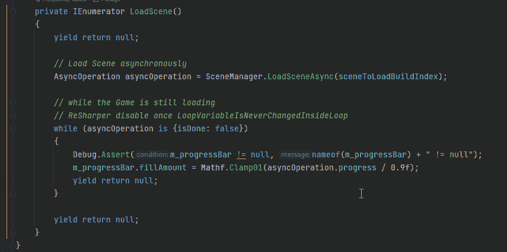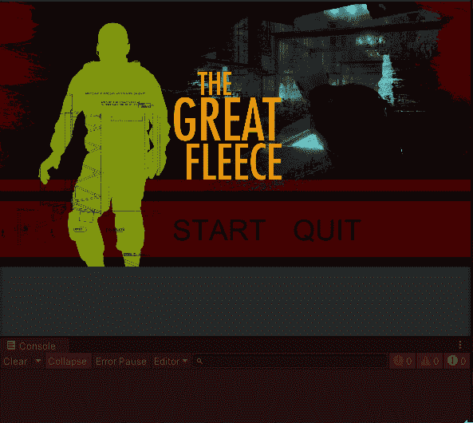