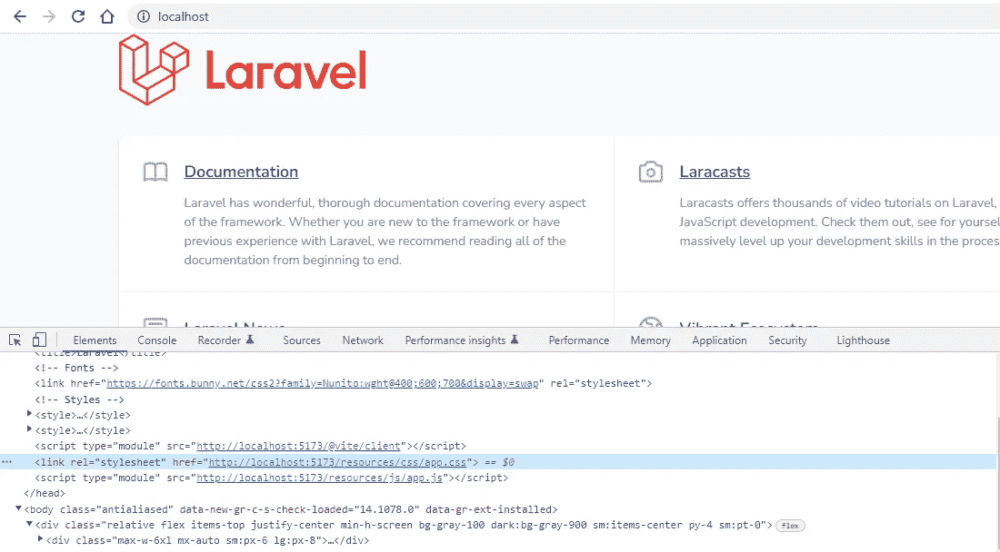
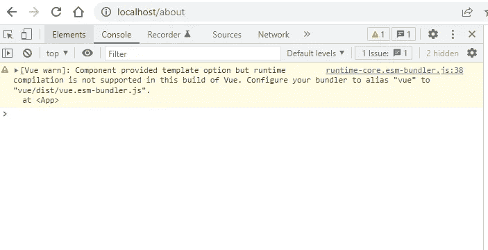
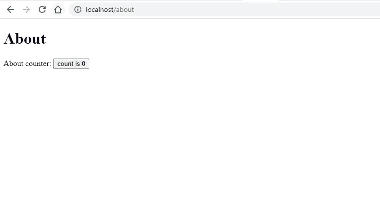

# 如何用 Laravel 和 Vue 3 创建多页面应用程序

> 原文：<https://blog.devgenius.io/how-to-create-a-multiple-page-application-with-laravel-9-and-vue-3-9d3026797fc2?source=collection_archive---------2----------------------->

## laravel——用 Vitejs 构建 Vue 3 多页面应用程序


照片由[塔玛拉·加克](https://unsplash.com/@tamara_photography?utm_source=medium&utm_medium=referral)在 [Unsplash](https://unsplash.com?utm_source=medium&utm_medium=referral) 上拍摄

Laravel 和 Vue 是打造 SPA 的绝佳组合。但是 Vue 2 用于许多普通的多页面应用程序。在这篇博客中，我们将使用最新的 Laravel 9 和 Vue 3 创建一个多页面应用程序。

# 1.拉勒韦尔装置

[Laravel 帆](https://github.com/laravel/sail)用于 Laravel 安装。什么是帆？ [Sail](https://laravel.com/docs/8.x/sail) 是一个内置的解决方案，用于使用 [Docker](https://www.docker.com/) 运行您的 Laravel 项目。

```
curl -s https://laravel.build/multi-page-app | bashcd multi-page-app

./vendor/bin/sail up
```

# 2.如何用 Vite 在 Laravel 9 中安装 Vue 3

## 2.1 安装 Vue 3

现在我们将在我们的项目中安装 Vue 3

```
./vendor/bin/sail npm install vue@next
```

## 2.2 安装 vitejs/plugin-vue

@vitejs/plugin-vue Vite 插件提供了 Vue 3 单文件组件支持。

```
./vendor/bin/sail npm install @vitejs/plugin-vue
```

## 2.3 更新 vite 配置

当使用 Vue 插件和 Laravel 插件时，您需要在`vite.config.js`配置文件中包含一些额外的选项:

```
import { defineConfig } from 'vite';
import laravel from 'laravel-vite-plugin';
import vue from '@vitejs/plugin-vue';
export default defineConfig({
    plugins: [
        laravel({
            input: ['resources/css/app.css', 'resources/js/app.js'],
            refresh: true,
        }),
        vue({
            template: {
                transformAssetUrls: {
                    base: null,
                    includeAbsolute: false,
                },
            },
        }),
    ],
});
```

## 2.4 运行 Vite 开发服务器

您可以通过`dev`命令运行开发服务器，这在本地开发时非常有用。

```
npm run dev
```

[](/start-using-strict-typing-in-php-897301e54e3d) [## 开始在 PHP 中使用严格类型

### PHP 中什么是严格类型化？

blog.devgenius.io](/start-using-strict-typing-in-php-897301e54e3d) 

# 3.在 Blade 中加载脚本和样式

`@vite()`刀片指令用于在刀片文件中包含脚本和样式。

为了测试配置，在`welcome.blade.php`文件中添加下面一行

```
<!DOCTYPE html>
<html lang="{{ str_replace('_', '-', app()->getLocale()) }}">
    <head>
        .
        .
        .
        .
        @vite(['resources/css/app.css', 'resources/js/app.js'])
    </head>
```

现在打开浏览器，验证脚本和样式。



# 4.创建多个页面

我们的主要目标是将 Vue 3 添加到多页面站点中。所以在 routes/web.php 中创建一些路由

```
Route::get('/about', function () {
    return view('pages/about');
});Route::get('/contact', function () {
    return view('pages/contact');
});
```

我们创建了一个通用布局，并为“关于”和“联系人”页面创建了视图。

## 4.1 创建布局

在资源/视图/布局文件夹中复制并创建下面的 app.blade.php 布局

资源/视图/布局/app.blade.php

```
<!DOCTYPE html>
<html lang="{{ str_replace('_', '-', app()->getLocale()) }}">
    <head>
        <meta charset="utf-8">
        <meta name="viewport" content="width=device-width, initial-scale=1">
        <title>App Name - @yield('title')</title>
        @vite(['resources/css/app.css', 'resources/js/app.js'])
        @stack('scripts')
    </head>
    <body>
        <div class="container">
            <div id="app">
                @yield('content')
            </div>
        </div>
    </body>
</html>
```

## 4.2 创建视图

现在为两个页面创建刀片视图文件。

资源/视图/页面/about.blade.php

```
@extends('layouts.app')

@section('title', 'About')

@section('content')
    <h1>About</h1>
@endsection
```

resources/views/pages/contact . blade . PHP

```
@extends('layouts.app')

@section('title', 'Contact')

@section('content')
    <h1>Contact</h1>
@endsection
```

# 5.创建一个组件

我们将为“关于”和“联系”页面创建一个新的 Vue 应用

## 5.1 关于组件

在 components 文件夹中创建一个 About 组件

resources/js/components/about . vue

```
<script setup>
import { ref } from 'vue'
const count = ref(0)
</script>

<template>
    About counter: <button type="button" @click="count++">count is {{ count }}</button>
</template>
```

在 about.js 文件上创建一个新的应用程序，并添加 about 组件

资源/js/pages/about.js

```
import { createApp } from 'vue'
import About from '@/components/About.vue'

const app = createApp({});
app.component('about', About);
app.mount('#app');
```

## 5.2 接触组件

类似于“关于组件”创建接触组件。

资源/js/components/Contact.vue

```
<script setup>
import { ref } from 'vue'
const count = ref(0)
</script>

<template>
    Contact counter: <button type="button" @click="count++">count is {{ count }}</button>
</template>
```

资源/js/pages/contact.js

```
import { createApp } from 'vue'
import Contact from '@/components/Contact.vue'

const app = createApp({});
app.component('contact', Contact);
app.mount('#app');
```

# 6.包括脚本和组件

## 6.1 在 vite 配置中添加 js

在`vite.config.js`配置中添加 js 文件

```
input: [
    'resources/css/app.css', 
    'resources/js/app.js',
    'resources/js/pages/about.js',
    'resources/js/pages/contact.js'
],
```

## 6.2 在视图中包含脚本和组件

在相应的视图中包含脚本和组件

资源/视图/页面/about.blade.php

```
@extends('layouts.app')

@section('title', 'About')

@section('content')
    <h1>About</h1>
    <about />
@endsection

@push('scripts')
    @vite('resources/js/pages/about.js')
@endpush
```

resources/views/pages/contact . blade . PHP

```
@extends('layouts.app')

@section('title', 'Contact')

@section('content')
    <h1>Contact</h1>
    <contact />
@endsection

@push('scripts')
    @vite('resources/js/pages/contact.js')
@endpush
```

重启 Vite 开发服务器并验证页面



在控制台中获得别名警告。所以我们需要在 vite 配置中添加 vue 的别名。`vite.config.js`的最终版本

```
import { defineConfig } from 'vite';
import laravel from 'laravel-vite-plugin';
import vue from '@vitejs/plugin-vue';

export default defineConfig({
    plugins: [
        laravel({
            input: [
                'resources/css/app.css', 
                'resources/js/app.js',
                'resources/js/pages/about.js',
                'resources/js/pages/contact.js'
            ],
            refresh: true,
        }),
        vue({
            template: {
                transformAssetUrls: {
                    base: null,
                    includeAbsolute: false,
                },
            },
        }),
    ],
    resolve: {
        alias: {
            'vue': 'vue/dist/vue.esm-bundler.js'
        },
    },
});
```



我们成功地创建了一个多页面 Vue 3 Laravel 应用程序。

感谢您的阅读。

敬请关注更多内容！

*跟我来*[](https://balajidharma.medium.com/)*。*

*[](/browser-testing-with-laravel-dusk-aeef2e8b30f8) [## 用 Laravel Dusk 进行浏览器测试

### Laravel 从头开始创建管理面板——第 17 部分

blog.devgenius.io](/browser-testing-with-laravel-dusk-aeef2e8b30f8)*