# 如何使用 React 路由器创建导航栏

> 原文：<https://blog.devgenius.io/how-to-create-a-navbar-using-react-router-51b78bc6ce51?source=collection_archive---------0----------------------->

作为 React 的新手，当您第一次接触编码时，弄清楚如何在不同的元素之间切换以在 DOM 上呈现不同的东西可能会有点令人兴奋。然而，通过一些阅读和实践的应用，它可以是一个非常简单的过程！

在这篇文章中，我将介绍如何使用 Browser Router 为元素创建链接，以及如何使用这些链接为 React 项目创建一种菜单栏。

## 什么是 React 路由器？

 [## 反应路由器

### React 路由器 v6 在这里。React 路由器 v6 吸取了以前版本的最佳特性——以及它的姐妹项目 Reach…

reactrouter.com](https://reactrouter.com/docs/en/v6) 

如果你不熟悉 React Router 是什么，那么这篇文章介绍了 React Router v6 的所有内容，非常值得一读。我在下面创建的例子是根据我在阅读这些文章时学到的知识完成的，所以我绝对推荐这作为你的起点。下面，我将提供一个简单的步骤，可以用在你的 React 项目。

## React 路由器的应用

第一步是创建一个 react 应用程序！您可以使用以下命令来完成此操作:

> npx 创建-反应-应用程序示例-应用程序

“example-app”是我们正在创建的应用程序的名称，因此它可以是您希望项目命名的任何名称。

从这里开始，您将使用以下命令:

> npm 开始

这将在浏览器中显示您的 react 应用程序。

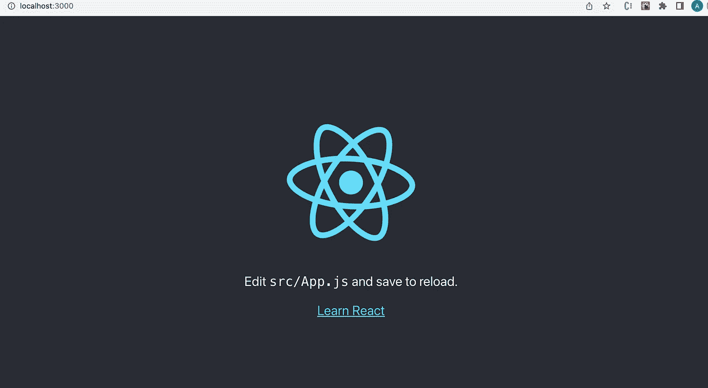

现在，在你的应用程序中，你可以创建你想要在你的导航栏中的 react 元素。对于这个例子，我们将有一个 HomePage.js、EventsPage.js 和 ReviewsPage.js。如果使用 rfce+tab 命令，这是一个很好的提示，它将为您填写一个元素的模板。

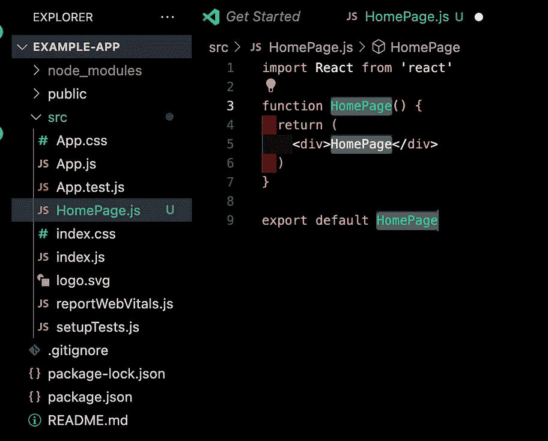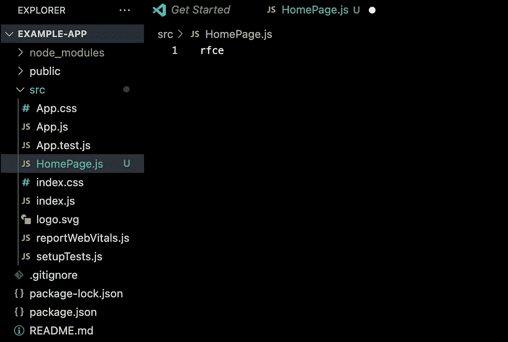

一旦你有了每个元素，就该创建你的浏览器路由器了。首先，运行命令:

> npm 添加反应路由器 dom

以确保你有所需的包裹。

您可以将路由器组件命名为能够告诉您您的路由器在该文件中的名称。对于这个例子，我们将把它命名为 AppRouter.js。

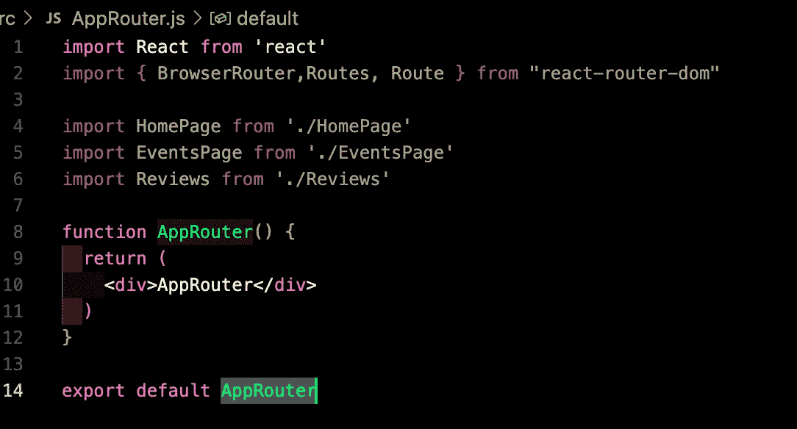

接下来，确保在您的路由器中导入您想要的元素，以及来自 react-router-dom 的 BrowserRouter、Routes 和 Route。现在，您将设置路由器模板，为您想要在导航栏中包含的每个元素创建一个路由。

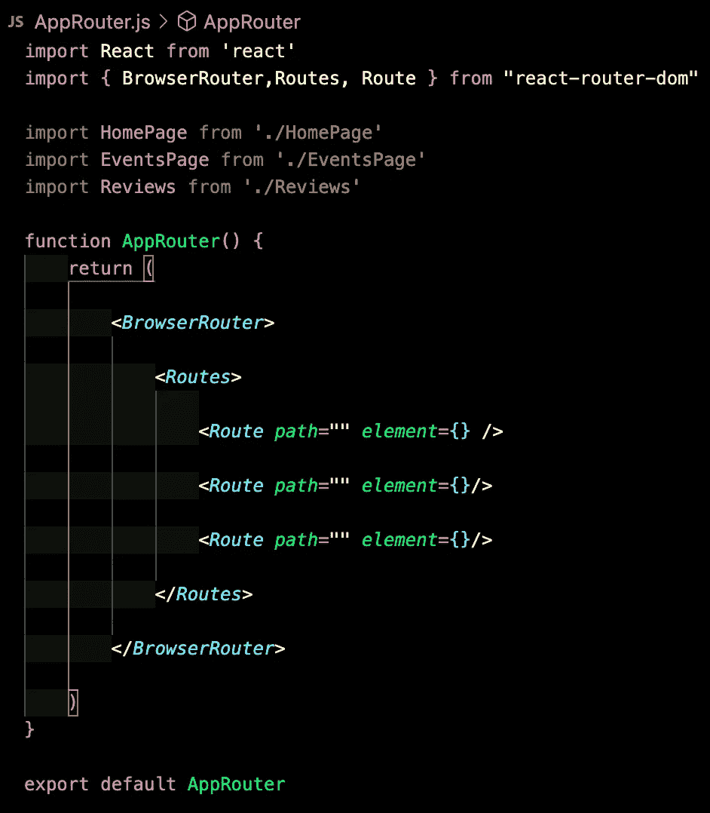

因为我们有 3 个元素，所以我们有 3 条空路线。现在，我们可以开始添加元素，并为每个元素创建路径。这是我们的示例完成后的样子:

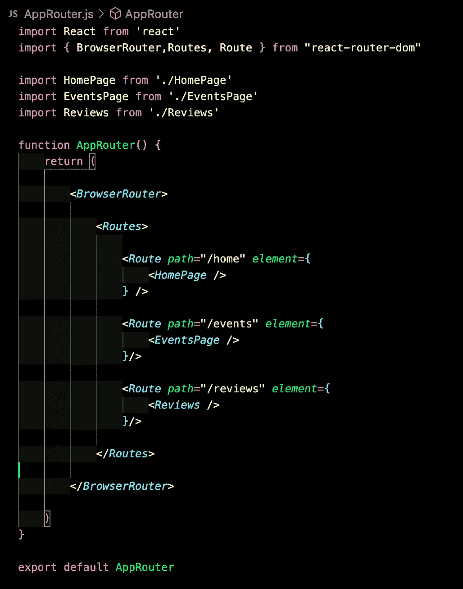

既然我们的 AppRouter 已经完成，我们现在可以将它导入到我们最高等级的元素中，来呈现我们的其他元素。这是我们的 App.js 文件:

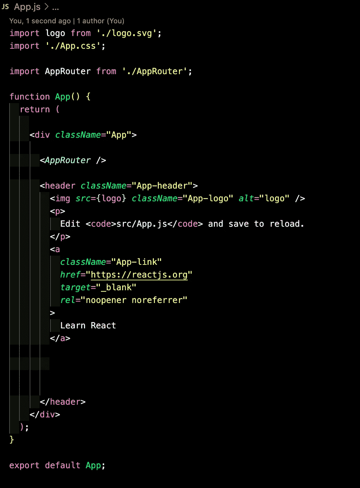

一旦我们将这些更改保存到 App.js 中，我们就可以在浏览器中测试我们的路径了。

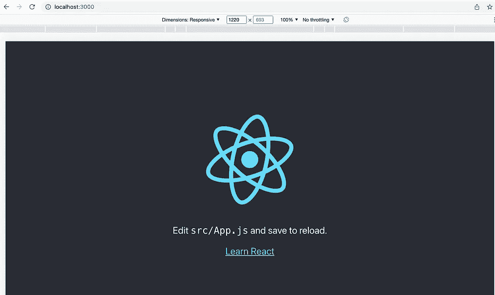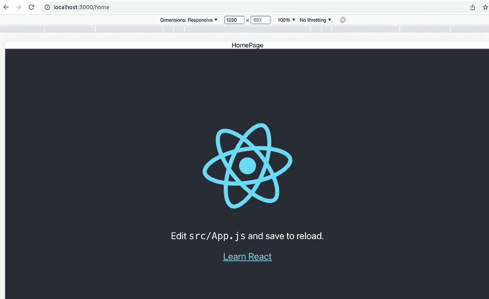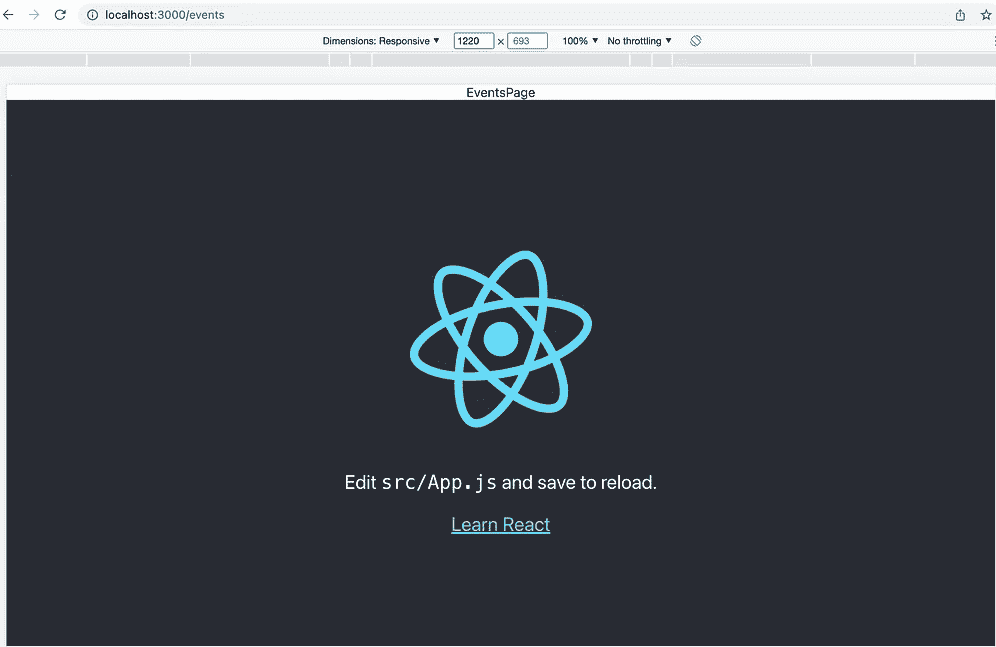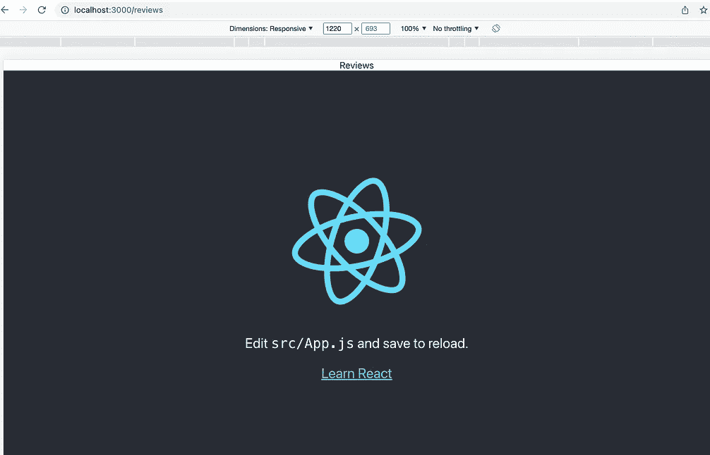

正如您所看到的，在第一幅图中，当我们打开 react 应用程序时，它会呈现 App.js 中的文本。然而，当我们更改路径时，我们可以看到我们的 BrowserRouter 正在我们给定的路径上成功地呈现每个元素。

现在，我们希望提供对客户端的访问，以便轻松地在这些路径之间切换。在 App.js 中，我们将删除 React 提供给我们的代码，并为每个路径创建一个带有

*   的无序列表。此外，为每个列表项添加一个。一旦我们这样做了，这就是我们的示例应用程序的样子。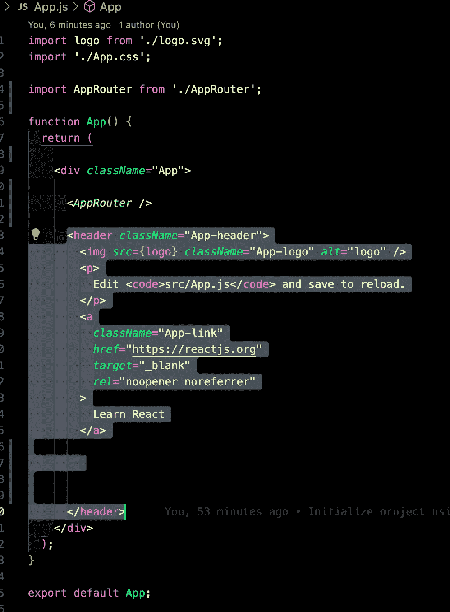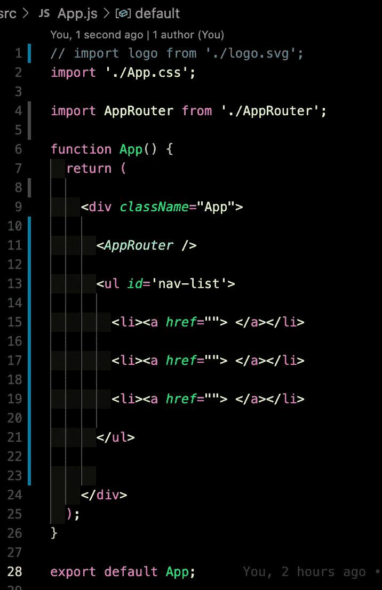

现在，将每个元素的路径复制到 href 标记中，并放入对应于该链接的文本。

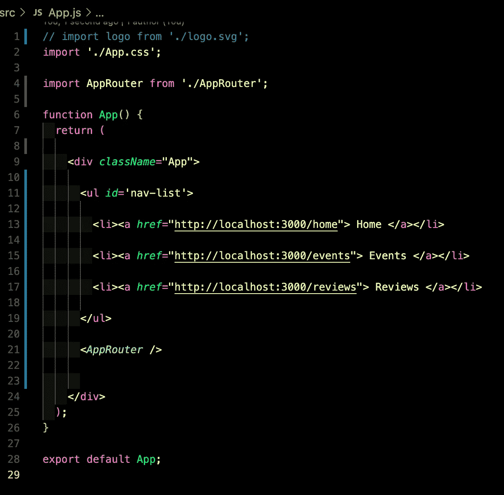

这是我们的示例 App.js 完成后的样子。确保你的 AppRouter 在你的列表下面，也就是导航列表/导航条。这将确保您的导航停留在页面的顶部，并且每个路径呈现的元素将显示在其下方。这是我们的浏览器将向我们展示的。

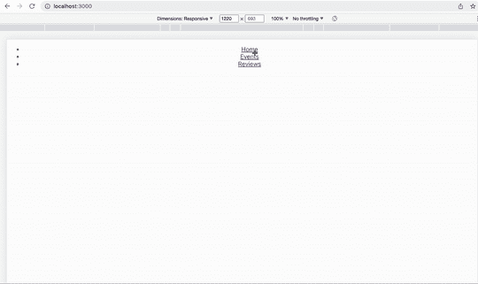

你现在有一个导航菜单！