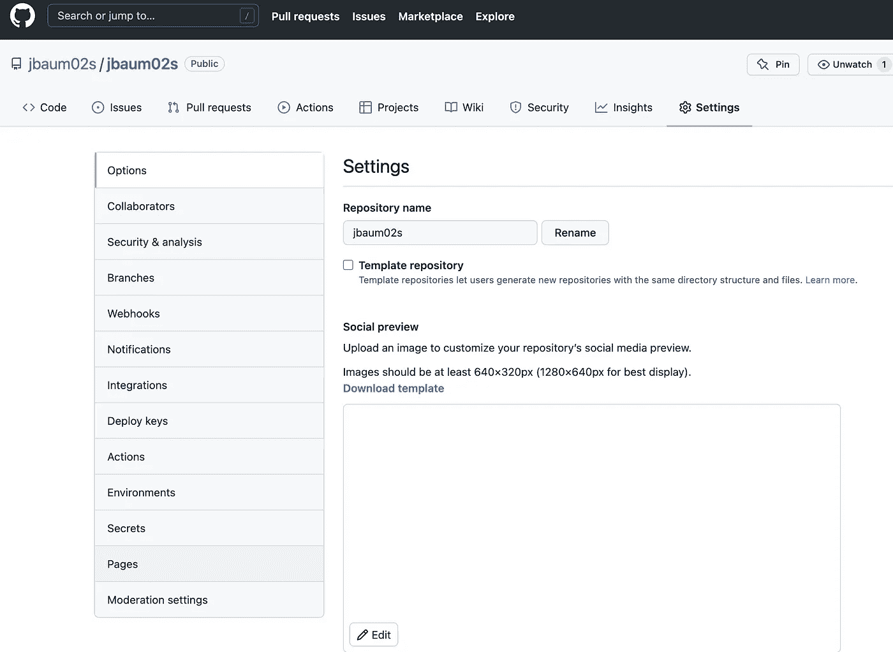
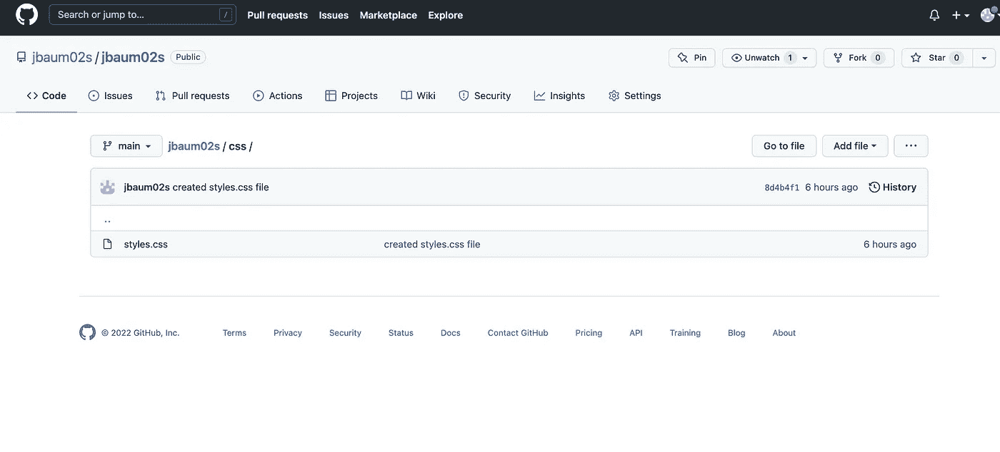

# 如何用 GitHub 页面创建个人网站

> 原文：<https://blog.devgenius.io/how-to-create-a-personal-website-with-github-pages-7a29abc4a02b?source=collection_archive---------0----------------------->

您可以使用 GitHub pages 创建和托管一个个人网站，供公众访问。GitHub pages 是一个免费的资源，你可以用它来展示你的才华和你的作品。

> “GitHub 是一个用于版本控制和协作的代码托管平台。它可以让你和其他人在任何地方一起工作。”
> ~Github Hello World

# 入门指南

按照以下步骤创建您的项目。如果你不知道一些术语，不要担心。请继续阅读下面的术语定义。

1.  前往 https://github.com[点击“注册”按钮。按照提示输入您的信息。](https://github.com)


2.创建项目的存储库。登录你的 GitHub 账户，进入[https://github.com/new](https://github.com/new)或者点击仓库旁边的绿色“新建”按钮。


3.在存储库字段中输入您的用户名。你会看到一个绿色的信息，说你发现了一个秘密。


保留默认设置为公共，并选中“添加自述文件”框。


4.通过单击“在桌面中设置”按钮下的“创建新文件”链接来创建新文件。


5.在用户名旁边的字段中输入 index.html。


6.在“编辑新文件”窗口中输入以下内容，用大写字母更新您的姓名和电子邮件地址:

```
 <!DOCTYPE html>
<html>
 <head>
   <title>YOUR NAME Portfolio</title>
 </head>
 <body>
   <nav>
     <ul>
       <li><a href=”/”>Home</a></li>
       <li><a href=”/about”>About</a></li>
       <li><a href=”/resume”>Resume</a></li>
       <li><a href=”/blog”>Blog</a></li>
     </ul>
   </nav>
   <div class=”container”>
     <div class=”blurb”>
       <h1>Hi, I am YOUR NAME!</h1>
       <p>This is my first page for my personal website!</a></p>
     </div>
   </div>
   <footer>
   <ul>
     <li><a href=”mailto:YOUREMAIL”>YOUREMAIL</a></li>
   </ul>
   </footer>
 </body>
</html> 
```

7.滚动到窗口底部，并在“提交新文件”下的字段中添加一条消息。然后单击绿色的“提交新文件”按钮。


然后，您将被重定向到您的项目存储库，在那里您将看到 README.md 文件和 index.html 文件。

**恭喜你！您已经创建了自己的个人网页。将页面重定向到存储库后，选择“设置”链接。**


8.然后在左侧边栏菜单中选择“页面”。



9.在 **Source** 下，选择下拉菜单并选择主分支，保留默认为 root，然后单击“保存”按钮。然后，您将看到一条确认消息，其中包含指向新网站的链接。例如:[https://jbaum02s.github.io/jbaum02s/](https://jbaum02s.github.io/jbaum02s/)。请访问链接查看您的新页面。


您将看到代码的内容，没有应用任何样式。


10.要设置内容的样式，请单击“添加文件”>“创建新文件”按钮。创建一个名为`css/styles.css`的新文件。文件名前的`css/`会在你输入时自动创建一个名为`css`的子目录。


11.将以下内容粘贴到“编辑新文件”窗口中:

```
body {
    margin: 60px auto;
    width: 70%;
}
nav ul, footer ul {
    font-family:'Helvetica', 'Arial', 'Sans-Serif';
    padding: 0px;
    list-style: none;
    font-weight: bold;
}
nav ul li, footer ul li {
    display: inline;
    margin-right: 20px;
}
a {
    text-decoration: none;
    color: #999;
}
a:hover {
    text-decoration: underline;
}
h1 {
    font-size: 3em;
    font-family:'Helvetica', 'Arial', 'Sans-Serif';
}
p {
    font-size: 1.5em;
    line-height: 1.4em;
    color: #333;
}
footer {
    border-top: 1px solid #d5d5d5;
    font-size: .8em;
}

ul.posts { 
    margin: 20px auto 40px; 
    font-size: 1.5em;
}

ul.posts li {
    list-style: none;
}
```

然后，您将被重定向到包含新文件的 css 目录。你可以点击你的用户名回到主文件夹。



现在，我们需要在 index.html 文件中链接新的 css 文件，以便显示你的样式。链接到 HTML 文档的中的 CSS 文件。

12.点击你的 index.html，选择“编辑”按钮，这是一个在文件窗口右侧的铅笔。


13.在您的 index.html 文件中，在标题后面的和标签之间输入以下内容

```
<link rel="stylesheet" href="css/styles.css">
```


添加消息并提交您的更改。

回到你的网页，刷新你的浏览器。现在你应该看到你的页面，菜单水平显示，字体大小不同，等等。


像前面的步骤一样，可以通过浏览器直接添加其他文件，也可以将它们上传到存储库。选择“添加文件”>“上传文件”即可。


# GitHub 术语定义

**存储库** — 包含您项目的所有文件以及每个文件的修订历史。

**提交** —创建一个提交就像给你的存储库拍一个快照。这些提交是您的整个存储库在特定时间的快照。

**分支** —当您在 GitHub.com 上创建一个包含内容的存储库时，GitHub 会创建一个包含单个分支的存储库。存储库中的第一个分支是默认分支。默认分支是任何人访问您的存储库时 GitHub 显示的分支。默认分支也是当有人克隆存储库时 Git 在本地检出的初始分支。除非您指定了不同的分支，否则存储库中的默认分支是新的拉请求和代码提交的基本分支。

**GitHub Page** —是一个静态的站点托管服务，它直接从 GitHub 上的一个存储库中获取 HTML、CSS 和 JavaScript 文件，通过一个构建过程选择性地运行这些文件，并发布一个网站。默认情况下，GitHub 会在任何新的存储库中命名默认分支 *main* 。

# 资源

[](https://docs.github.com/en/get-started/quickstart/hello-world) [## Hello World - GitHub Docs

### GitHub 是一个用于版本控制和协作的代码托管平台。它让你和其他人一起工作…

docs.github.com](https://docs.github.com/en/get-started/quickstart/hello-world) [](https://docs.github.com/en/pages/quickstart) [## GitHub 页面快速入门- GitHub 文档

### GitHub 页面是通过 GitHub 托管和发布的公共网页。启动并运行的最快方式是通过…

docs.github.com](https://docs.github.com/en/pages/quickstart)