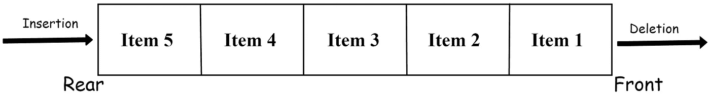
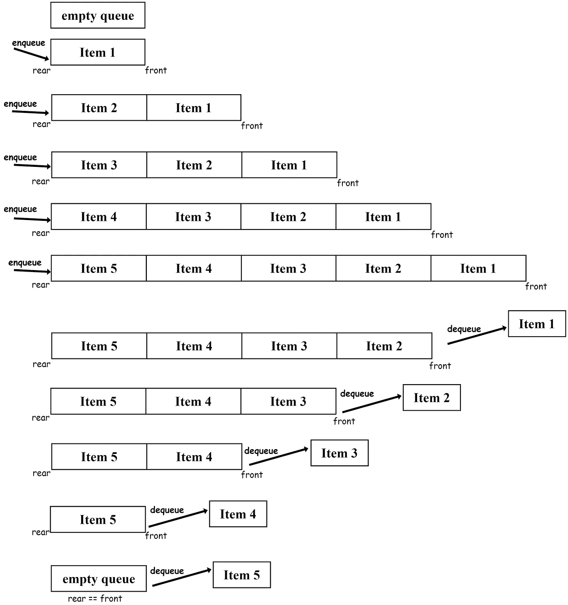

# 如何在 Python 中创建队列

> 原文：<https://blog.devgenius.io/how-to-create-a-queue-in-python-8ff2fd18b200?source=collection_archive---------1----------------------->

## 使用 Python 实现队列数据结构


来自[像素](https://www.pexels.com/photo/person-in-black-sweater-hold-a-grey-road-bike-122477/?utm_content=attributionCopyText&utm_medium=referral&utm_source=pexels)的[freestocks.org](https://www.pexels.com/@freestocks?utm_content=attributionCopyText&utm_medium=referral&utm_source=pexels)的照片

[**队列**](https://en.wikipedia.org/wiki/Queue_(abstract_data_type)) 是遵循**先进先出(FIFO)** 原则的线性数据结构。这意味着添加到队列中的第一个元素是第一个被删除的元素。它与 stack 有相似之处。队列和栈经常被放在一起研究。但是为了使事情简单和简短，我决定就它们写两篇独立的文章。下面是我关于如何用 Python 创建堆栈的文章:

[](https://python.plainenglish.io/how-to-create-a-stack-in-python-from-scratch-86350d0c15d0) [## 如何在 Python 中从头开始创建堆栈

### 在不使用任何库的情况下用 Python 实现堆栈

python .平原英语. io](https://python.plainenglish.io/how-to-create-a-stack-in-python-from-scratch-86350d0c15d0) 

但是在本文中，我们将学习如何创建队列。我们开始吧！

# 队列数据结构

排队的一个很好的例子是乘客排队等公共汽车。队伍中的第一个人将首先上车。这正是队列的工作方式。队列的第一个元素将首先被删除。这就是队列的 FIFO 特征。它也是一种动态数据结构。这意味着队列有能力扩大或缩小它的大小。让我们试着直观地理解队列:



队列数据结构|作者图片

这里的`Item 1`是队列中最老的元素。这意味着它是先插入的。对于 FIFO 特性，`Item 1`也将首先被删除。

# 需要关注的要点

*   队列的插入和删除发生在不同的端点。所以我们需要跟踪队列的**前端**和**后端**。
*   虽然队列有扩展其大小的能力，但是队列也可能有最大大小。如果我们试图插入一个超出其最大容量的元素，就会导致**溢出**。
*   如果我们试图从一个空队列中删除一个元素，将会导致**下溢**。
*   一个**入队**操作将向队列中插入一个元素。一个`enqueue()`操作的时间复杂度是 O(1)。
*   一个**出列**操作将从队列中删除一个元素。一个`dequeue()`操作的时间复杂度也是 O(1)。

# 使用列表实现队列

我们可以使用 Python 列表来创建队列。我们将使用 list 的`append()`和`pop()`方法来实现一个队列。默认情况下，`append()`方法将从队列的后端插入一个元素。但是要从前端移除一个元素，我们必须在`pop()`方法中指定位置。让我们创建一个使用列表创建队列的`Queue`类:

在我们运行代码后，它将给出以下输出:

```
Item 1
Item 2
Item 3
Item 4
Item 5
Queue is empty. Underflow!
```

队列中的插入和删除是按照 FIFO 顺序进行的。为了更好地理解，让我们将操作形象化:



按作者排列的队列|图像中的 enqueue()和 dequeue()操作

# 结论

在本文中，我分享了用 Python 创建队列的最简单的方法。使用列表来创建队列可能不是最有效的方式，但是它将帮助我们理解这种数据结构的基本原理。Python 中还有其他创建队列的选项:

*   使用`[collections.deque](https://docs.python.org/3/library/collections.html)`
*   使用`[queue.Queue](https://docs.python.org/3/library/queue.html)`

您也可以使用这些选项。

就是这样！我希望这篇文章对你有所帮助。感谢阅读。

# 资源

*   [https://www . hackere earth . com/practice/data-structures/queues/basics-of-queues/tutorial/](https://www.hackerearth.com/practice/data-structures/queues/basics-of-queues/tutorial/)
*   [https://www.geeksforgeeks.org/queue-in-python/](https://www.geeksforgeeks.org/queue-in-python/)
*   [https://www.javatpoint.com/queue-in-python](https://www.javatpoint.com/queue-in-python)