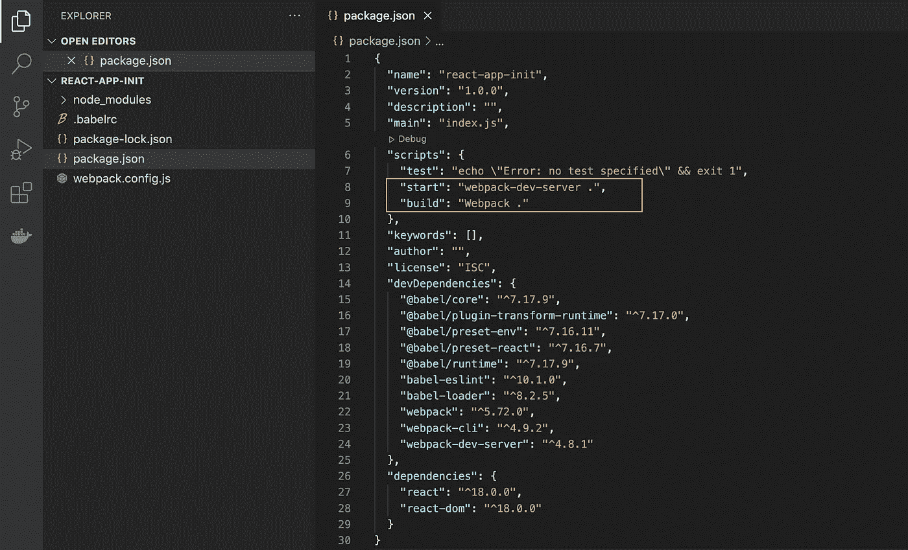

# 如何在不使用创建反应应用程序的情况下创建反应应用程序

> 原文：<https://blog.devgenius.io/how-to-create-a-react-app-without-using-create-react-app-c004a62b52fc?source=collection_archive---------3----------------------->

不使用创建反应应用程序创建反应应用程序

作为开发人员，我们都使用 create-react-app 来轻松快速地创建我们的 React App，而不会浪费太多时间，因为它允许我们通过在 CLI 中运行一行命令来生成一大堆项目文件。

因此，在本文中，我们将介绍如何在不使用 create-react-app 的情况下创建一个 react-app，这使我们能够了解实际的 React 是如何在海岸后面工作的。

如果你是一个初学者，我不建议你读这篇文章，至少你必须对基本的反应有所了解。

没有更多的介绍，让我们开始创建反应应用程序，而不使用创建-反应-应用程序。

首先，您需要在计算机中安装节点。检查您是否可以在命令行界面中运行以下命令。

用于检查节点版本的 CLI 命令

现在让我们使用 ***init*** 命令初始化我们的反应项目。

初始化新项目的 CLI 命令

**-y** 将对 init process 询问的所有问题给出“是”。下图显示了运行 init 命令后 CLI 的输出。

运行 npm init -y 命令后命令行界面的输出

先前的命令将在我们的项目文件夹中创建 ***包。这些文件保存了与项目相关的元数据，并用于管理项目的依赖关系、脚本、版本等等。***

现在我们必须为我们的反应项目安装相关的软件包。

首先，我们需要安装 webpack。如果你不知道什么是网络包，这就是谷歌说的，😉：

> Webpack 是一个免费的开源 JavaScript 模块捆绑器。它主要是为 JavaScript 编写的，但是如果包含相应的加载器，它可以转换前端资产，比如 HTML、CSS 和图像。Webpack 获取具有依赖关系的模块，并生成代表这些模块的静态资产。—[webpack.js.org](https://webpack.js.org)

安装 webpack 的 CLI 命令

上述命令将安装所有与 webpack 相关的依赖项。

现在我们需要安装主要由 react 需要的软件包，通常当我们使用 create-react-app 命令时，所有这些与 React 相关的依赖项都会自动安装，但是在这个过程中，我们需要单独安装它们。

安装 reactor & reactor-DOM 的 CLI 命令

现在我们需要安装所有与巴别塔相关的东西，而巴别塔是 javascript worls 中的另一个开源项目，它的主要目的基本上是将 javascript 代码转换成向后兼容的 javascript 版本，这将使所有的东西都能工作，因为一年中 Javascript 会自己更新很多次。所以我们需要类似这样的东西来确保我们的应用程序与所有版本的 Javascript 兼容。

命令行界面命令来安装与巴贝尔相关的依赖项

在安装了以上所有软件包之后，现在我们可以开始在项目文件夹中创建一些文件了。在您自己创建任何文件之前，您的项目文件夹必须如下所示。

项目文件夹手动创建任何文件或文件夹

我们要创建的前两个文件是巴贝尔和 webpack 的配置文件。

对于*巴别塔*我们需要创建文件 Calle ***。对于***和 *webpack* 来说，我们需要创建***webpack . config . js***

。babelrc 文件

webpack.config.js 文件

从以上两个文件来看，webpack.config.js 文件更为重要，因为它包含了许多有关 react 应用程序的重要方面。主要是我们的项目入口点(index.js)，是输出将是(公共文件夹)以及我们的项目将如何运行。所以这些是编译器要遵守的规则。

在完成上述文件创建过程后，现在我们需要更新我们的 package.json 文件。主要是更新我们需要的脚本。

更新 package.json 文件

**启动**脚本将运行***webpack-dev-server*****构建**脚本将使用 ***webpack。*** 命令制作构建版本。

现在，我们可以开始创建文件夹和其他文件，我们需要在我们的反应应用程序。

1.  公共文件夹
2.  Src 文件夹

这是我们需要创建的两个主要文件夹，在这些文件夹中，我们需要创建如下文件:

1.  公共文件夹

1.1 index.html
1.2 主

2.Src 文件夹

2.1 App.js
2.2 index.js

让我们看看 index.html 的文件:

index.html 档案

main.js 文件将在我们运行 build 命令后更新。所以你所要做的就是在公共文件夹中创建一个. js 文件。

以下是 App.js 文件:

App.js 文件

以下是 index.js 文件:

文件索引

创建所有这些文件并更新这些文件中的代码后，可以运行 build 命令来构建项目，然后可以启动应用程序。

npm build 命令来构建项目，这将更新您的 main.js

启动应用程序的 npm 启动命令

最后，您会看到新创建的应用程序正在端口号 **3000 :** 下运行

应用程序的最终输出

单击此处查看 Github 回购计划👉:[链接](https://github.com/shehan96/create-react-app-from-scratch)