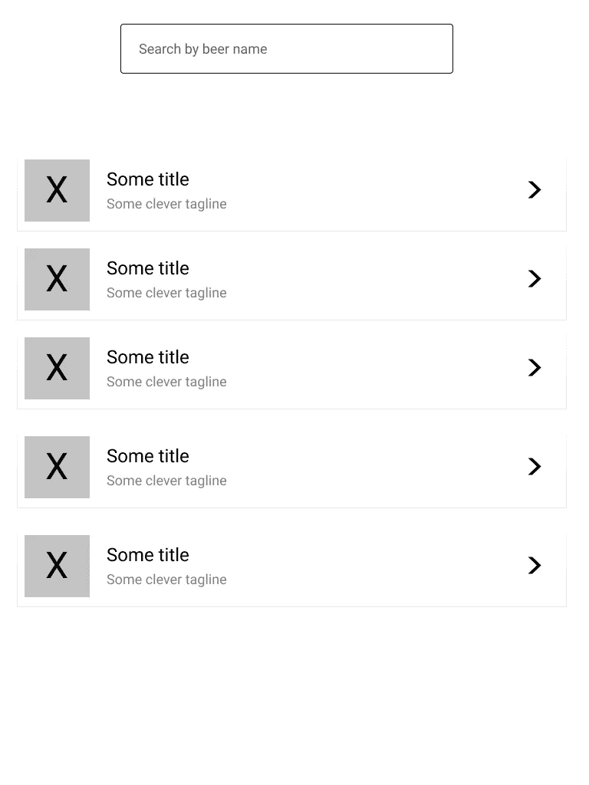
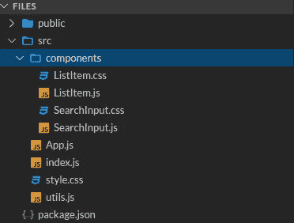
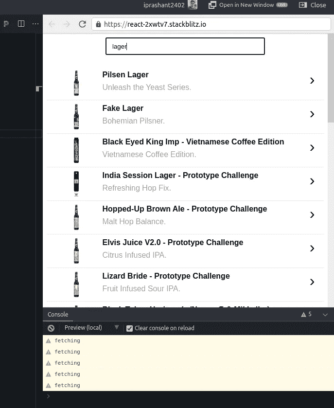
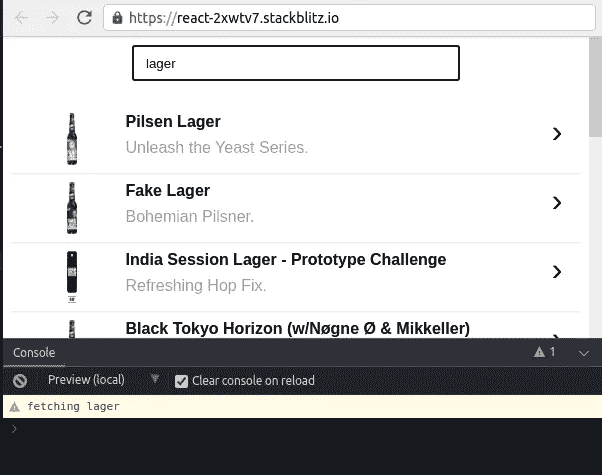

# 如何在 react.js 中使用去抖创建实时搜索

> 原文：<https://blog.devgenius.io/how-to-create-a-real-time-search-using-debounce-in-react-js-846a62ad2198?source=collection_archive---------0----------------------->


本文展示了如何在 react 应用程序中使用去抖动来创建实时搜索功能，其中搜索结果会随着用户的输入而实时更新。

**我们在建造什么？**

我们将创建一个搜索页面，其中包含一个搜索框(用户在其中输入查询)和一个包含搜索结果的列表(随着用户输入而实时更新)。

看起来像这样…



让我们从创建一个 react 项目开始-

```
> npx create-react-app my-app 
> cd my-app 
> npm start
```

这是这个项目的结构



我们 react 应用的项目结构

由于本文关注的是前端，我们将只使用一个公共 API(而不是创建我们自己的 API ),它返回一个啤酒列表，给定啤酒名称作为查询参数。

**API 终点**——[https://api.punkapi.com/v2/beers](https://api.punkapi.com/v2/beers)

**查询参数** —啤酒名称(字符串)

**API 文件**——[https://punkapi.com/documentation/v2](https://punkapi.com/documentation/v2)

首先，让我们创建一个文件 utils.js，它导出从 API 获取响应的函数。

**utils.js**

```
export const BASE_URL = 'https://api.punkapi.com/v2';/* This function takes query as a param and returns the array of beer objects.*/export const fetchSearchResults = async query => {if (query && query.length > 0) {/* replaces all whitespaces in the query with + symbol in order to 
send it as a query param in the GET request */
const parsedQuery = query.replaceAll(' ', '+');const url = `${BASE_URL}/beers?beer_name=${parsedQuery}`;const res = await fetch(url);.search-container {
display: flex;
justify-content: center;
margin-bottom: 24px;
}.search-container input {height: 32px;
width: 300px;
padding: 0px 12px 0px 12px;
}const resJson = res.json();return resJson;} else {return [];}};
```

现在，我们需要我们的列表项，所以让我们创建一个组件 **ListItem** 。

**ListItem.js**

```
import React from 'react';
import './ListItem.css';const ListItem = ({ title, caption, imageUrl }) => {return (<div class="list-item-container">
 <div className="left">
  
 </div>
 <div className="center">
  <h4>{title}</h4>
  <p>{caption}</p>
 </div>
 <div className="right">
  <p>&#8250;</p>
 </div>
</div>);
};export default ListItem;
```

**ListItem.css**

```
.list-item-container {
 display: flex;
 padding: 8px;
 border-bottom: 1px solid #e6e6e6;
}.center {
 flex: 4;
}.left {
 flex: 1;
 display: flex;
 justify-content: center;
}.right {
 flex: 0.2;
}.right p {
 font-size: 32px;
 color: #000;
}.thumbnail {
 width: 10px;
}p,h4 {
 margin-block-start: 0px;
 margin-block-end: 8px;
 font-family: 'Segoe UI', Tahoma, Geneva, Verdana, sans-serif;
}h4 {
 font-weight: 600;
}p {
 color: #a1a1a1;
}
```

我们还需要一个搜索框，用户可以输入查询，

**SearchInput.js**

```
import React from 'react';import './SearchInput.css';const SearchInput = ({ value, onChangeText }) => {React.useEffect(() => {

  /* Adds an event listener which fires whenever the value of our 
  input field changes and call the onChangeText function passed
  in as a prop to our component */
  let input = document.querySelector('input');
  input.addEventListener('input', onChangeText);

  /* Don't forget to return a cleanup function */  
  return input.removeEventListener('input', onChangeText);

 }, []);return (
 <div class="search-container">
  <input
   type="text"
   value={value}
   onChange={onChangeText}
   placeholder="Search beer by name"
  />
 </div>
);};export default SearchInput;
```

**SearchInput.css**

```
.search-container {
 display: flex;
 justify-content: center;
 margin-bottom: 24px;
}.search-container input {
 height: 32px;
 width: 300px;
 padding: 0px 12px 0px 12px;
}
```

**到目前为止我们所做的-**

1.  定义一个函数来调用 API 并返回结果。
2.  创建一个将呈现单个搜索结果的 ListItem。
3.  创建用户可以输入查询的搜索输入。

下一步是在 App.js 中呈现这些组件，并调用我们的 fetchSearchResults 函数来获得结果。

**App.js**

```
import React from 'react';
import './style.css';
import { fetchSearchResults } from './utils';
import ListItem from './components/ListItem';
import SearchInput from './components/SearchInput';export default function App() {const [query, setQuery] = React.useState('');
const [results, setResults] = React.useState([]);const fetchData = async () => {
  const res = await fetchSearchResults(query);
  setResults(res);
};React.useEffect(() => {
  fetchData();
}, [query]);return (
<div>
 <SearchInput
  value={query}
  onChangeText={e => {
  setQuery(e.target.value);
  }}
 />
 {results.map((result, index) => (
  <div key={index}>
   <ListItem
    title={result.name}
    imageUrl={result.image_url}
    caption={result.tagline}
   />
  </div>
 ))}
</div>
);
}
```

这是整个画面—

1.  最初，我们只是让搜索输入框呈现在屏幕上，因为`results`状态数组是空的。
2.  当用户输入查询时，附加到输入框的事件监听器触发并调用带有事件细节的`onChangeText`函数，我们从中获取搜索框的当前值，并将其设置为状态变量`query` **的值。**
3.  每当`query`的值改变时，对 useEffect 的回调执行`fetchData()`,其结果填充到`results`数组中。
4.  一旦`results`数组有了一些条目，react 就会为数组的每个成员渲染`<listItem />`。

现在，我们有我们的实时搜索工作，但有一个问题。让我们在我们的`fetchData()`中添加一个`console.warn('fetching')`并运行。



`fetchData`对长度为 5 的查询运行五次。

问题是，每当用户输入一个字符或删除一个字符时，它都会向后端发送一个 API 请求。太多的请求，这是不可取的，尤其是当你处理大规模的产品时。

**所以，解决方案——去抖。**

去抖是让一个函数在一定的时间间隔内只触发一次的行为。关于 javascript 中去抖的更详细解释，请参考文章 [**去抖——如何在 JavaScript 中延迟一个函数(JS ES6 示例)**](https://www.freecodecamp.org/news/javascript-debounce-example/)**by[**Ondrej polen sky**](https://www.freecodecamp.org/news/author/ondrej/)**。****

**例如，我们希望`fetchData()`函数等待一段时间(以毫秒为单位),以便它只在用户输入一些字符后触发，而不是在输入框的每次编辑后触发。**

**安装`lodash.debounce`**

```
$ npm i --save lodash.debounce
```

**让我们通过将`fetchData`函数作为回调传递给`lodash.debounce`提供的`debounce(fn, milliseconds)`来消除它的抖动。**

****app . js 内部—****

```
...import debounce from 'lodash.debounce';const fetchData = async (query, cb) => {
 const res = await fetchSearchResults(query);
 cb(res);
};const debouncedFetchData = debounce((query, cb) => {
 fetchData(query, cb);
}, 500);export default function App() {const [query, setQuery] = React.useState('');
const [results, setResults] = React.useState([]);React.useEffect(() => {
 debouncedFetchData(query, res => {
  setResults(res);
 });
}, [query]);return (...);
}
```

**我们修改了`fetchData`函数，以接受查询字符串和回调函数作为其参数，并执行回调函数。注意，回调函数也接受 API 结果数组作为参数。**

**`debouncedFetchData`是指`debounce()`返回的`fetchData`的去抖版本。**

**此外，`fetchData`已被移出功能组件，并且`debouncedFetchData`也被定义在组件外。这样做是因为功能组件中的局部变量在重新渲染时不会被保留。**

**最后，每当`query`的值改变时，我们在`useEffect`内调用`debounceFetchData`，将`query`和`seResults`回调函数作为参数传入。**

**就这样，结束了。让我们来看看不同之处——**

****

**现在，`fetchData`对于长度为 5 的字符串只被调用一次，而以前它是针对每个字符被调用的。**

**这是完整的源代码—**

**[](https://stackblitz.com/edit/react-debounce-search?embed=1&file=src/App.js) [## 反应-去抖-搜索-堆栈

### 导出到 create-react-app CLI 的 React 应用程序的启动项目。

stackblitz.com](https://stackblitz.com/edit/react-debounce-search?embed=1&file=src/App.js)** 

**感谢阅读，我希望你觉得这篇文章有趣。**

***如果您觉得这篇文章有帮助，请点赞并分享。在* [*中*](https://medium.com/@iprashant2402) *上关注我，以便在我发表新文章时获得定期更新。也可以在*[*LinkedIn*](https://www.linkedin.com/in/prashant-singh-a51574123)*上联系我，查看我的*[*Github*](https://www.github.com/iprashant2402)*。***

***另外，我很乐意听到你的任何反馈。***