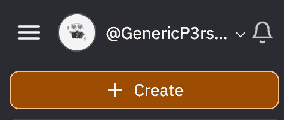
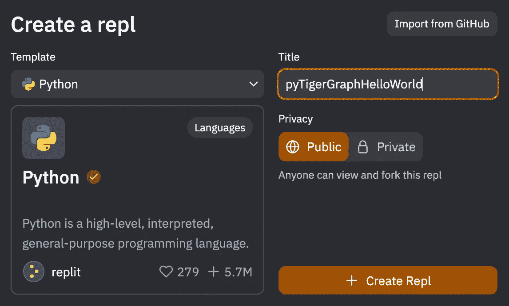
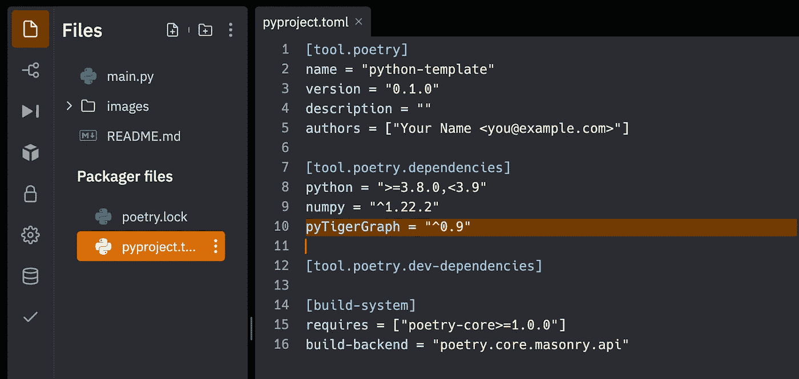
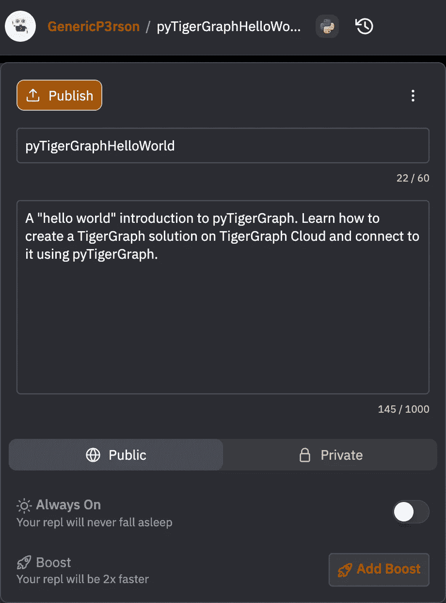
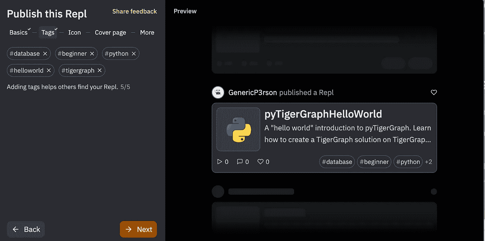
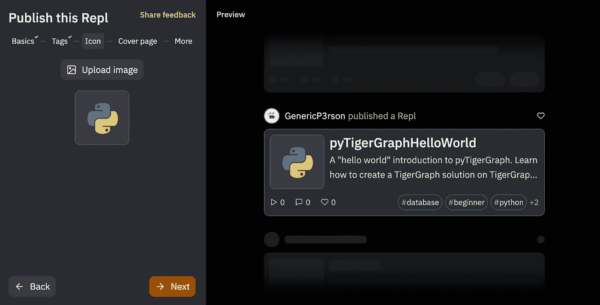
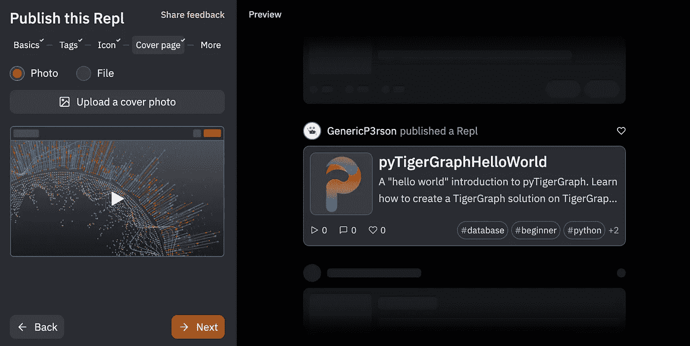
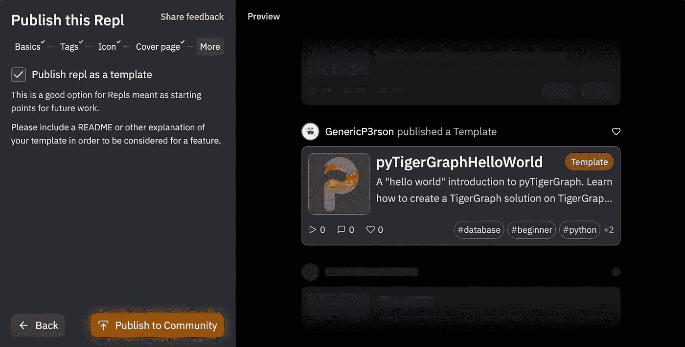

# 如何创建 Repl.it 模板

> 原文：<https://blog.devgenius.io/how-to-create-a-repl-it-template-d94d88fd6f5d?source=collection_archive---------5----------------------->

## 在 Repl.it 上创建“Hello World”pyTigerGraph 模板的分步指南


图片来自 [Pixabay](https://pixabay.com/illustrations/idea-empty-paper-pen-light-bulb-1876659/)

# 介绍

[Repl.it](https://replit.com/) 是一个很棒的在线 IDE，通常是我进行同步协作编程的首选。在它的各种特性中，Repl.it 提供了模板，用户可以在创建新程序时选择代码。以前，只有某些用户可以创建模板，但现在任何人都可以创建模板！本博客将以 pyTigerGraph“hello world”模板为例，介绍如何创建您的第一个 Repl.it 模板。

# 辅导的

## 创建新的副本

首先，创建一个 [Repl.it 帐户](https://replit.com/)。登录后，按“创建”按钮创建一个新的副本。



创建新的副本

因为我将使用 Python 作为模板，所以我选择 Python 作为模板，然后将其命名为`pyTigerGraphHelloWorld`。



选择模板类型并命名为 Repl

## 创建模板

接下来，编辑并创建模板！我写了[一个很长的 README.md 文件](https://replit.com/@GenericP3rson/pyTigerGraphHelloWorld#README.md)和一些简单的 pyTigerGraph 代码。

```
import pyTigerGraph as tgconn = tg.TigerGraphConnection(host = "[https://SUBDOMAIN.i.tgcloud.io/](https://SUBDOMAIN.i.tgcloud.io/)", graphname = "GRAPHNAME") # Adjust based on graph. For example in README, the connection would be: conn = tg.TigerGraphConnection(host = "[https://replit-template.i.tgcloud.io/](https://replit-template.i.tgcloud.io/)", graphname = "MyGraph")print(conn.echo()) # Hello GSQLconn.apiToken = conn.getToken(conn.createSecret()) # Creates a tokenprint(conn.gsql('''LS''')) # First GSQL interaction!
```

请注意，我确实必须导入 pyTigerGraph。为了确保为用户自动上传库，将其添加到`pyproject.toml`文件中。



将 pyTigerGraph 添加为依赖项

## 发布！

当您对整个 Repl 满意时，请按 Repl 的名称。这将带来一个关于 Repl 信息的框。如果您还没有描述，请添加描述。当你对一切都满意时，按“发布”按钮。



添加描述并按“发布”

接下来，您需要经历几个步骤来完成您的回复。第一个选项卡只是名称和描述，因此您不需要更改任何内容。按下“下一步”

在第二个选项卡上，创建标签以帮助用户找到您的 Repl。如果没有标签符合您的需要，您可以创建一个新的！



添加标签！

在图标选项卡上，上传图像。



上传图标图像

封面将是您回复的登录页。添加照片或选择文件。



添加封面照片或选择文件

最后，在最后一页，选中将 Repl 发布为模板的选项。



将文件发布为模板！

最后，点击“发布到社区”按钮，这样就完成了！祝贺你创建了你的第一个复制模板！

# 结论

总的来说，将 Repl 代码发布为模板的过程相当简单明了。我很高兴任何人都可以创建模板，能够回馈 Repl 社区真是太棒了。

最后一点要注意的是，Repl 已经正式推出了一个模板 jam 来鼓励每个人创建模板。Repl 最近也发布了 Nix，允许用任何语言配置模板。如果你喜欢这篇关于创建模板的博客，我推荐你试试他们的模板挑战！

[](https://blog.replit.com/template-jam) [## 模板堵塞 2022

### 自从我们推出模板以来，你们中的许多人都要求参与进来。我们有一些很棒的社区模板…

blog.replit.com](https://blog.replit.com/template-jam)