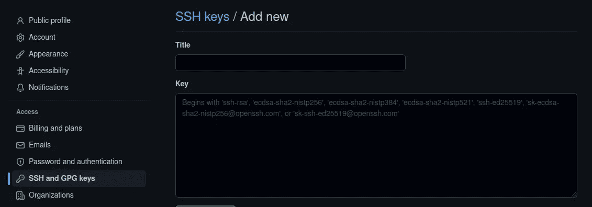
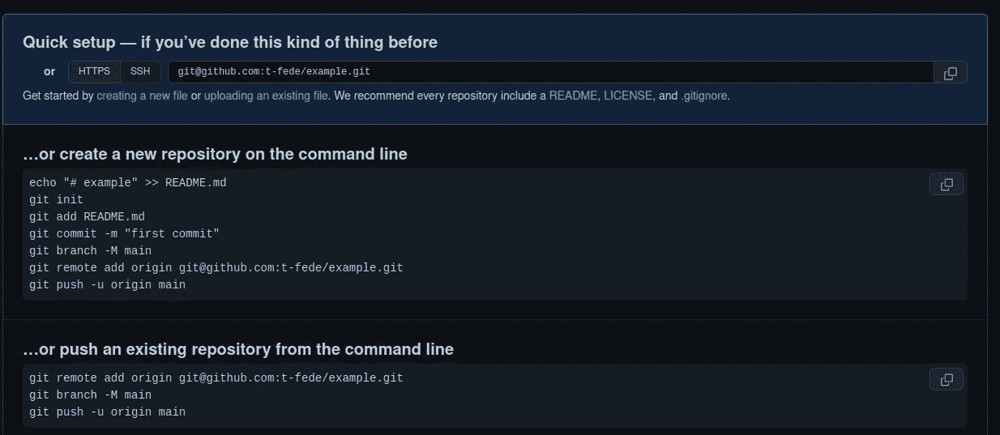

# 如何在 GitHub 上创建存储库

> 原文：<https://blog.devgenius.io/how-to-create-a-repository-on-github-5a5ce219ddba?source=collection_archive---------9----------------------->

一步一步的指导，从连接你的本地库到 GitHub 到你的第一次提交


罗曼·辛克维奇在 [Unsplash](https://unsplash.com/s/photos/github?utm_source=unsplash&utm_medium=referral&utm_content=creditCopyText) 上拍摄的照片

由于我从事文档工作多年，我非常清楚当文档需要更改时，需要定义文档的修订索引。因此，当我第一次读到版本控制时，相对于代码，我可以立即理解它的重要性，即使这与文档修订不是完全相同的事情。

学习数据科学时要做的一件好事是对版本控制充满信心，特别是出于两个原因:

*   当一个项目需要修改时，版本控制让我们有可能看到所有的先前版本
*   一个系统版本控制，比如 GitHub，让你可以在本地工作，甚至在线存储版本，这样你就可以向世界展示你的项目，分享知识，等等…

那么，让我们看看如何在 GitHub 上创建一个存储库。

# 1.创建一个 GitHub 帐户并在你的电脑上安装 Git

第一步，创建 GitHub 账号；这里可以做[。](https://github.com/)

之后，你必须在你的电脑上安装 Git。这里可以下载[。](https://git-scm.com/downloads)

现在，打开终端，通过键入以下代码来设置您的电子邮件:

```
git config --global user.email YOUR_EMAIL
```

当然，“*你的 _EMAIL* ”是你完整的邮箱地址；确保在设置 Git 和注册 GitHub 时使用相同的电子邮件地址。

现在，通过键入以下代码设置您的 Git 名称(我们仍然在我们的终端上):

```
git config --global user.name YOUR_NAME
```

其中“您的姓名”是…您的姓名。它可以是你的全名，也可以是昵称:由你决定。我决定用我的全名。

现在，Git 已经设置和配置好了。下一步是创建 SSH 密钥；这似乎有点难做到，但我们会一步一步来。

# 2.创建一个 SSH 密钥

SSH 密钥只是在访问远程 PC 时保护您的一个项目，实际上，它发生在您将 PC 连接到 GitHub 帐户时；这种密钥可以保证您免受网络攻击。

无论如何，让我们看看如何设置一个 SSH 密钥。

打开另一个终端，键入以下代码:

```
ssh-keygen -t ed25519 -C "YOUR_EMAIL"
```

在上述代码中，使用您在前面步骤中使用的电子邮件，并按照我键入的方式正确使用" "。

现在，在您键入这个命令之后，您将会看到许多代码。我想指定这个命令生成一个私钥和一个公钥，当然，我们将只使用公钥。

在继续之前，要检查一切是否正常，请键入以下命令:

```
eval `ssh-agent`
```

如果你得到类似这样的信息:

```
Agent pid 125746
```

这意味着一切正常，我们可以继续了。

现在，我们可以获得公共 SSH 密钥。如果你看到之前输入“`ssh-keygen -t ed25519 -C "YOUR_EMAIL"`”命令后生成的代码，你可以很容易地找到一行类似于:

```
Your public key has been saved in /home/YOUR_PC/.ssh/id_ed25519.pub
```

它定义了存储密钥的文件夹。无论如何，如前所述，我们只需要公钥。要得到它，我们可以在终端中键入(这是为 Ubuntu 用户准备的。如果您不是 Ubuntu 用户，您可以导航到该文件并打开它。或者，你可以尝试在 Windows 上使用 Ubuntu，如[本文](https://medium.com/codex/how-to-easily-create-an-alias-in-bash-to-speed-up-your-work-even-on-windows-1f3b18bfa8e4)所示:

```
cat ~/.ssh/id_ed25519.pub
```

我们得到了:

```
ssh-ed25519 NUMBERS_AND_LETTERS
```

现在，复制这个结果:我们将它粘贴到 GitHub 上。

转到 GitHub 并登录您的帐户。进入“设置”，然后点击“SSH 和 GPG 密钥”，并点击“新的 SSH 密钥”；这是你将会看到的:



在 GitHub 上添加 SSH 密钥。图片由作者提供。

给它一个标题(随便你；例如“我的电脑”)并在 key 选项卡下复制密钥(ssh-ed25519 数字和字母)。

就是这样。

现在，我们可以创建第一个本地存储库，并将其连接到 GitHub 上的远程存储库。

# 3.你的第一个仓库

现在，让我们在 GitHub 上创建我们的远程存储库。让我们继续“新知识库”，让我们给它一个名字，让我们称之为“例子”;假设我们希望它是公开的(这样任何人都可以看到)。这就是你看到的:



你的第一个仓库。图片由作者提供。

您现在唯一需要做的就是复制最后三行代码:

```
git remote add origin git@github.com:t-fede/example.git
git branch -M main
git push -u origin main
```

把这些行复制下来:我们马上会把它们粘贴到终端上。

现在，在你的电脑上创建一个文件所在的本地文件夹；我们将该文件夹命名为“example ”,这样本地和远程存储库就有了相同的名称。你只需右击文件夹并选择(在终端中打开)。另一种方法是转到文件夹属性并复制其路径，然后打开终端，键入“cd”并粘贴您的文件夹的路径。

现在，我们将使用 Git。

在终端上键入以下内容:

```
git init
```

这将使您的本地文件夹成为存储库。然后，您可以通过键入以下命令来查看其状态:

```
git status
```

您将看到存储库的状态；因为是新的，终端会告诉你没有提交。此外，终端会告诉你文件夹中的所有文件。假设您有一个文件“my_file.py ”,这是您希望保存在存储库中的文件(本地文件，您希望它保存在 GitHub 的远程文件中)。您可以选择要提交的文件；在这种情况下，我们只有一个，所以我们键入:

```
git add my_file.py
```

现在，我们承诺:

```
git commit -m 'initial version'
```

这意味着“修订版的名称”是“初始版本”，但您可以随意称呼它。

最后我们把 GitHub 上复制的台词贴上；让我们再次抓住他们:

```
git remote add origin git@github.com:t-fede/example.git
git branch -M main
git push -u origin main
```

我们完了。如果你现在在你的 GitHub 库(名为‘example’)中看到你会看到‘my _ example . py’文件。现在，您只需要添加一个自述文件！

最后…你是否有大量文件需要加载到你的 GitHub 远程存储库中，并且不知道如何继续？[看文章](https://levelup.gitconnected.com/do-you-need-to-load-heavy-files-on-github-try-this-4fa415eebe1c)！

*考虑成为会员:你可以支持我，不需要额外的费用。点击* [*这里*](https://federicotrotta.medium.com/membership) *成为会员，每月不到 5 美元，你就可以解锁所有的故事，并支持我的写作。*