# 如何创建可重用的本地化框架

> 原文：<https://blog.devgenius.io/how-to-create-a-reusable-localization-framework-2454c9df13e0?source=collection_archive---------2----------------------->

如果您正与支持同一公司的多个应用程序和平台的开发团队合作，或者正在编写包含本地化的开源框架。

建议在框架中提供可重用的本地化，以扩大您的潜在客户群。

集中化本地化将简化本地化过程并确保一致性。

在本教程中，您将学习创建一个可重用的本地化框架 **LocalizationFramework** 和**在 **MyLocalizedApp 中使用它，**使用 **Swift** 和 **CocoaPods** 。**

# 入门指南

[**下载启动器项目**](https://github.com/ysadiq/MyLocalizedApp-starter) 。然后，构建并运行 **MyLocalizedApp** 。

你会看到一个简单的应用程序，有两个标签。目前，这款应用仅支持**英语**语言。首先，您将创建可重用的本地化框架。

# 创建本地化框架

创建一个框架很简单，就像创建一个新的应用程序项目，你只需要选择**框架**而不是**单视图应用程序。**

打开 Xcode，文件→新建→项目，然后勾选**框架**，命名为**本地化框架**。保存在 **MyLocalizedApp-starter** 文件夹所在的同一个根文件夹下。

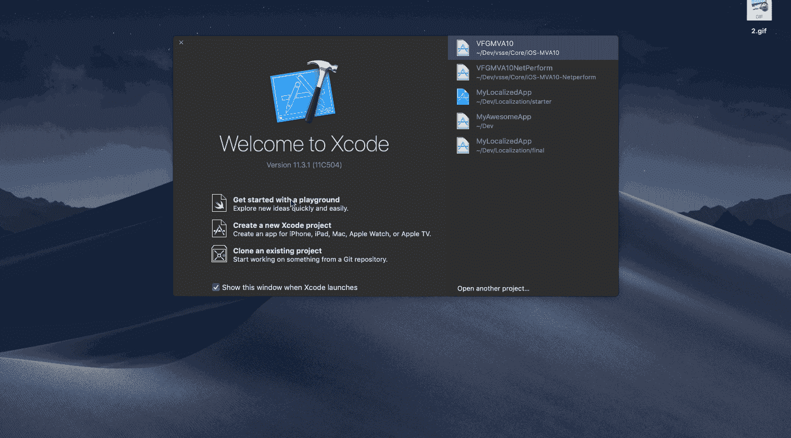

# 添加新本地化

默认情况下，Xcode 会生成英语作为主要本地化语言。你应该添加**阿拉伯语**如下图。

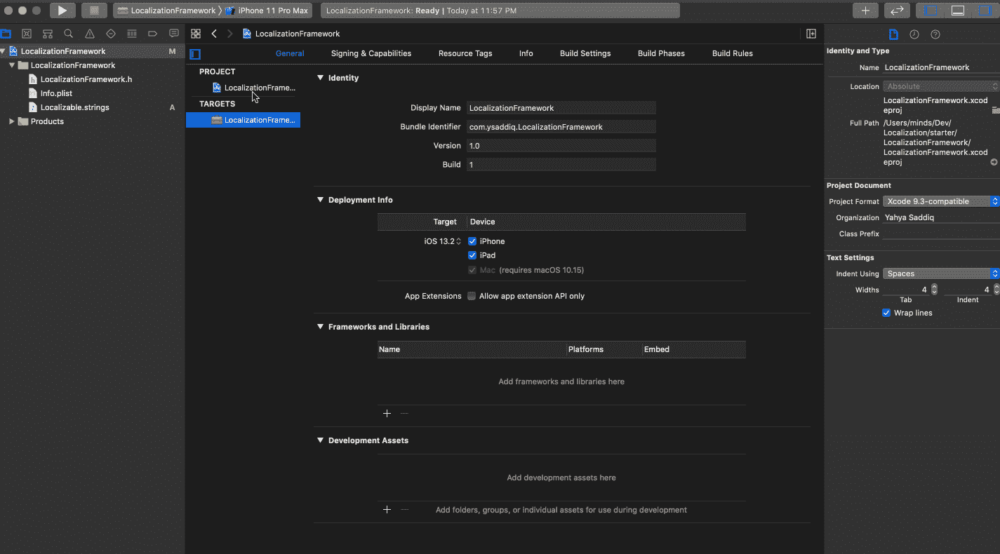

# 添加可本地化的字符串文件

**Localizable.strings** 文件是您添加翻译数据作为键值对的地方。

在 **LocalizationFramework** 中创建一个 **Localizable.strings** 文件，如下所示。

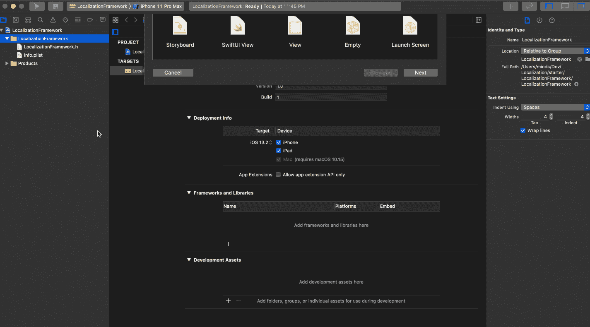

现在，您有了一个 **Localizable.strings** 文件，但是它没有被本地化。接下来，您将对其进行本地化。

## 本地化**可本地化字符串**

要将 **Localizable.strings** 本地化为英语和阿拉伯语，选择文件并按下 Xcode 右侧**文件检查器**中的**本地化**按钮，如下图所示。

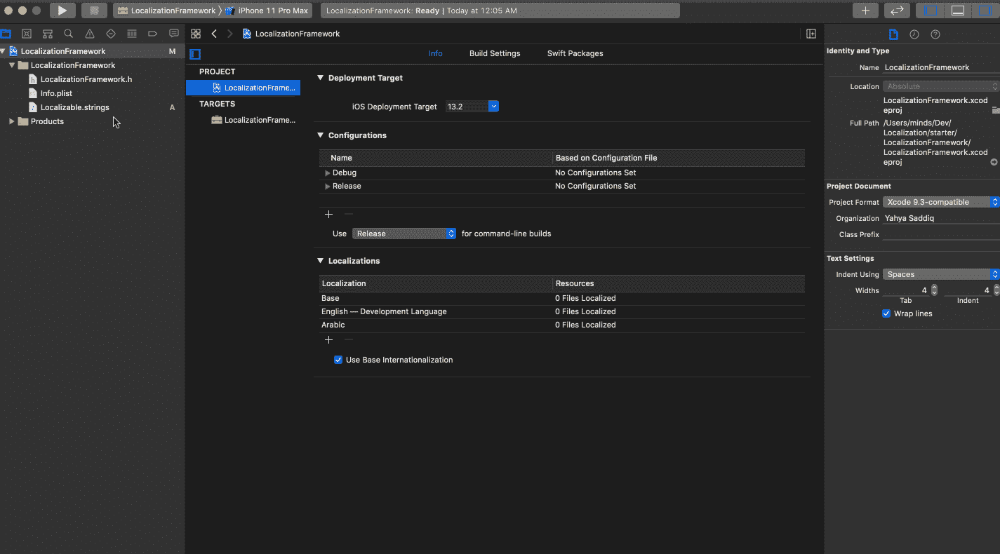

这将在*/localization framework***en . lproj**和 **ar.lproj** 文件夹下创建两个 **Localizable.strings** 文件夹。每个文件夹包含一个单独的**字符串**文件。

## 向字符串文件添加内容

打开**localizable . strings(English)**，添加以下按键。

此外，将以下键添加到 **Localizable.strings(阿拉伯语)**

这些是您需要在 **MyLocalizedApp** 中为每个 UI 元素设置的值。

# 创建本地化。swift

在**/**localization framework**，**创建 **Localization.swift** ，并添加以下代码。

下面是上述代码中每个带编号的注释所发生的情况:

1.  这包装了 localizedString，允许您对任何字符串值调用`.localized()`来查找本地化。
2.  为要提供的本地化定义公共常数的枚举。

现在，您的本地化框架已经准备好了，很简单，对吗？！🤔

接下来，您将为您的框架创建一个 pod。

# 创建本地化框架窗格

在构建 iOS 应用程序时添加第三方库是一种常见的场景，管理它们的最佳方式是使用一个*依赖管理器*，如 [*CocoaPods*](https://cocoapods.org/) 。

您将使用 **CocoaPods** 创建一个 pod，并使从本地 pod(开发 pod)安装**本地化框架**框架成为可能。

现在，打开终端，导航到 **LocalizationFramework** 所在的路径。键入以下内容以创建 pod。

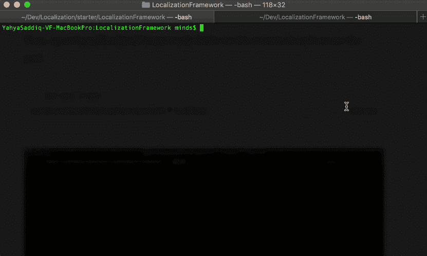

您应该看到在 localization framework . pod spec 处创建的*规范，以确保已经创建了一个 pod。*

## 配置本地化框架 Podspec

转到 **LocalizationFramework** 文件夹，将**localization framework . pod spec**内容替换为以下内容。

**注:**要了解 podspec 语法，请查看 **Cocoapods** 参考:[https://guides . cocoa pods . org/syntax/pod spec . html # specification](https://guides.cocoapods.org/syntax/podspec.html#specification)

太好了！💪🏽您创建了您的本地化 pod。接下来，您将把您的本地化窗格链接到 **MyLocalizedApp** 中。

# 向应用程序添加 LocalizationFramework

现在，关闭 **Xcode** ，然后打开终端，导航到 **MyLocalizedApp** 所在的路径。键入 ***pod init*** 来创建一个 *Podfile。*

打开 **MyLocalizedApp** 文件夹中的**pod 文件**，包含**localization framework**pod，如下图所示:

这里您指定了 **LocalizationFramework** 的 podspec 文件所在的路径。假设 **LocalizationFramework** 项目的根文件夹就是 **MyLocalizedApp** 项目文件夹所在的位置。

**注意**:如果你看到上面的错误，请确认 **LocalizationFramework** 文件夹存在于 **MyLocalizedApp** 的同一级中，并且在 *LocalizationFramework/中存在一个 podspec 文件。*

然后，返回到终端并键入 ***pod install*** 来安装**MyLocalizedApp**sole dependency。

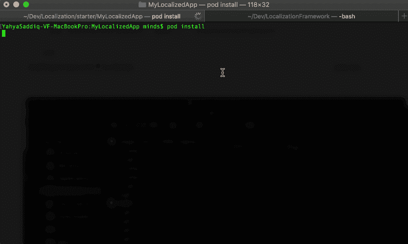

现在，打开**mylocalizedapp . xc workspace**(不是 MyLocalizedApp.xcodeproj)，你应该会发现 LocalizationFramework 添加到了 Pods/Development Pods 中。

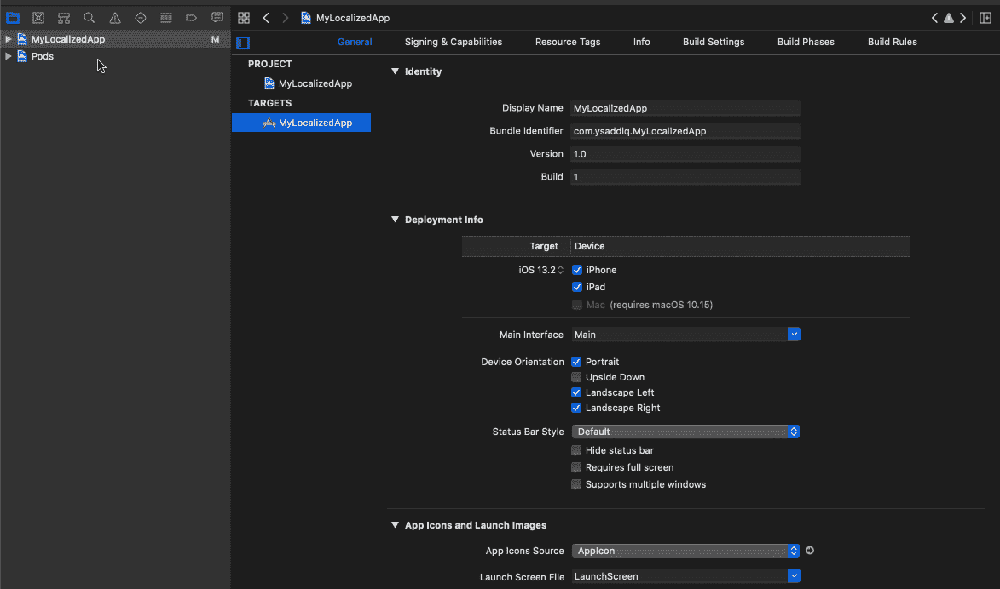

## 使用本地化框架

太好了，现在你应该把你的可重用的**本地化框架**投入使用了。

打开 **ViewController.swift** :

1.  导入**本地化框架**
2.  并用**本地化**枚举替换出口静态字符串。

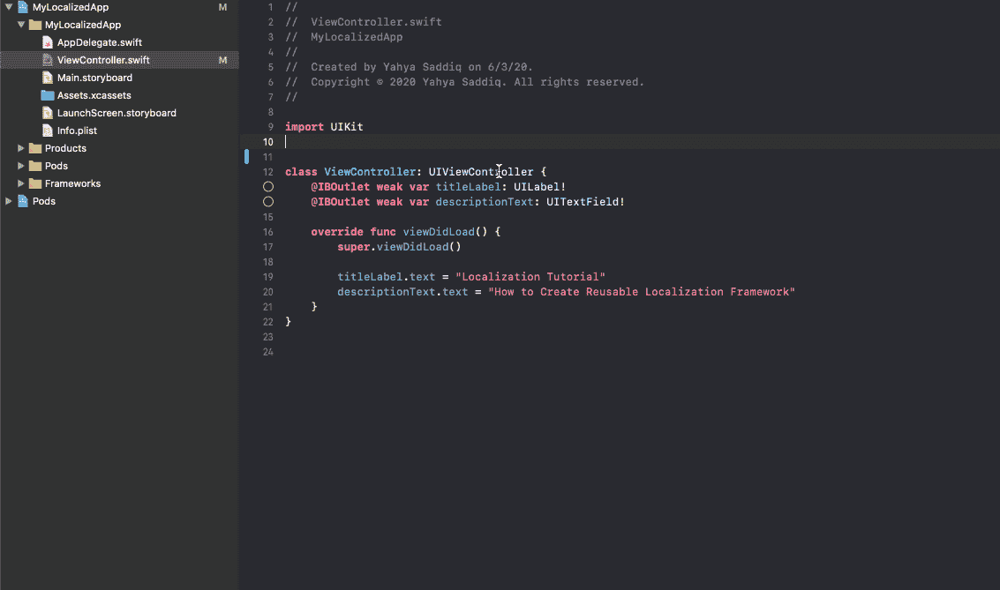

构建并运行。

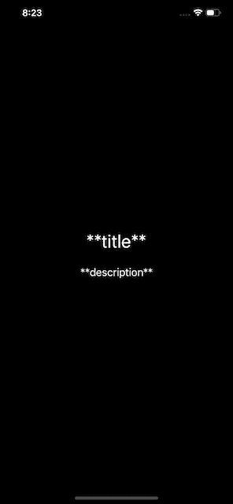

哎呀！😲内容在哪里？

## 为什么本地化内容缺失？

问题出在 **Localization.swift.**

如上所示，字符串扩展包装的 **localizedString(:)** 正在使用应用程序的主包。而 **Localizable.strings** 在框架的捆绑包中。

要修复它，你需要添加 **bundle** 扩展来获取框架的 Bundle，而不是 **Bundle.main** 来获取应用的 Bundle。

## 添加包扩展

打开 **LocalizationFramework** 项目，创建**localization framework+bundle . swift**。

这里您使用框架的包标识符来获得正确的包。如果失败，它会退回到主包。

**注意**:*org . cocoapods . localization framework*是 **LocalizationFramework 的包标识符，**您应该将其更改为 pod 目标设置中定义的任何值。

## 使用本地化框架包

打开 **Localization.swift** ，将***bundle . main****替换为***bundle . localization framework****，如下图。**

*现在，打开**终端**，和再次安装 **MyLocalizedApp** ，这样**localization framework+bundle . swift**被添加到 **MyLocalizedApp 中。***

*清理 **MyLocalizedApp** ，然后构建并运行。*

***注意**:在 CocoaPods 开发中，除非进行一次干净的构建，否则 pod 不会被更新。*

*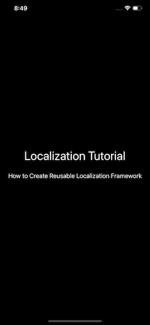*

*完美！😎你成功地连接了框架。现在的问题是，本地化行得通吗？接下来，您将测试阿拉伯语本地化内容。*

# *测试阿拉伯语内容*

*编辑 **MyLocalizedApp** 的方案，使用**阿拉伯语**作为应用程序语言，如下所示。*

*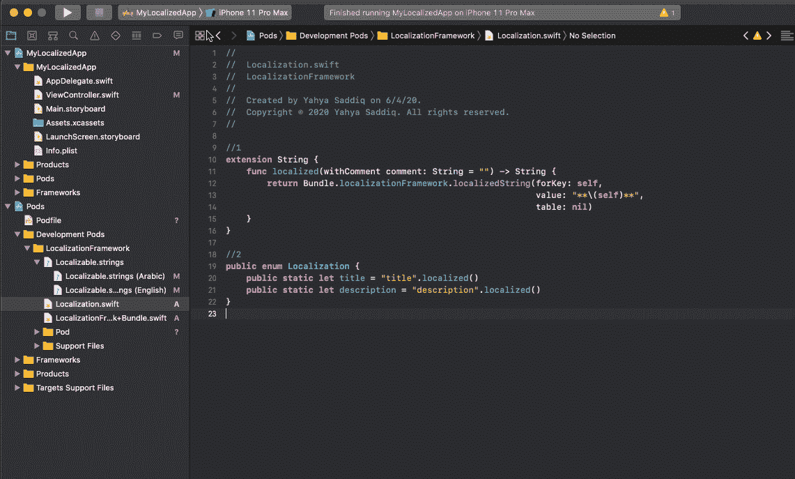*

*构建并运行。*

**

*瞧啊。👏🏽您的本地化框架是可重用的，应用程序是本地化的。*

*你几乎完成了，最后一步是让应用程序选择一种首选语言，如果它运行在切换到法语或任何其他语言的 iPhone 上。*

# *定义首选语言*

*又😏，编辑 **MyLocalizedApp** 的方案，使用**法语**作为应用语言。*

*构建并运行。*

**

*如上所示，本地化框架没有找到指定的键。因为 **Localizable.strings(法语)**文件不存在。*

*因此，您可以通过支持 iOS 中的所有语言来解决这个问题😝或者选择一种首选语言。*

*打开 **LocalizationFramework** 中的**localization framework+Bundle**，将***current language(of:)****静态函数替换为下面的。**

**下面是上面代码中发生的情况:**

1.  **提取**本地化框架**支持的所有语言。**
2.  **如果当前应用程序语言不在支持的语言列表中，则将 **currentLanguage** 设置为首选语言。**

**清理 **MyLocalizedApp** ，然后构建并运行。**

****

**厉害！🥳**

# **从这里去哪里？**

**下载完成版本的 [app](https://github.com/ysadiq/MyLocalizedApp) 和[框架](https://github.com/ysadiq/LocalizationFramework)。**

**我希望你喜欢这个教程。如果你有任何问题或意见，不要犹豫，只要把它放在这里🤗。**