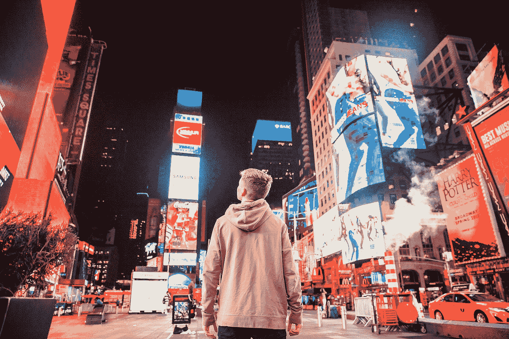
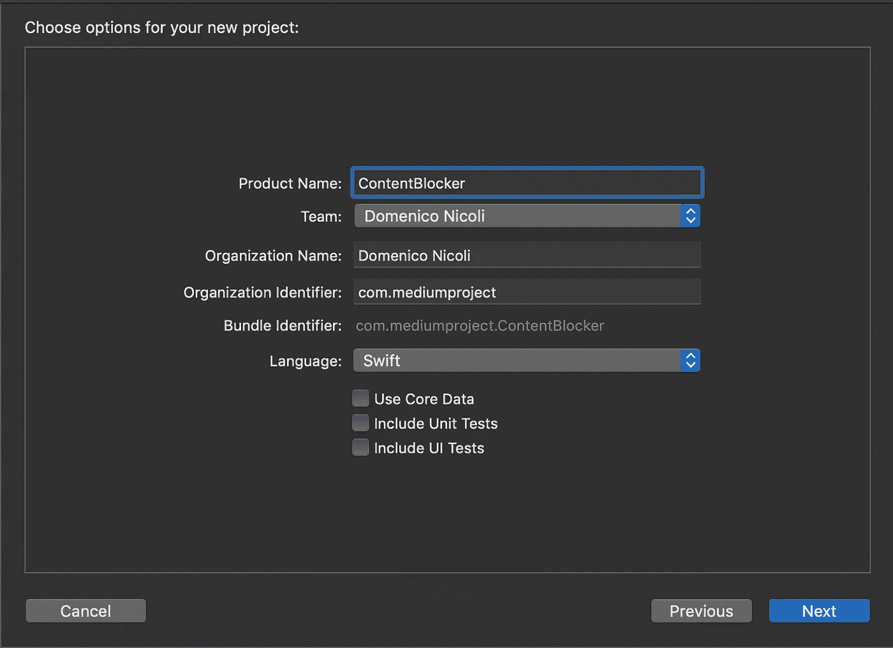
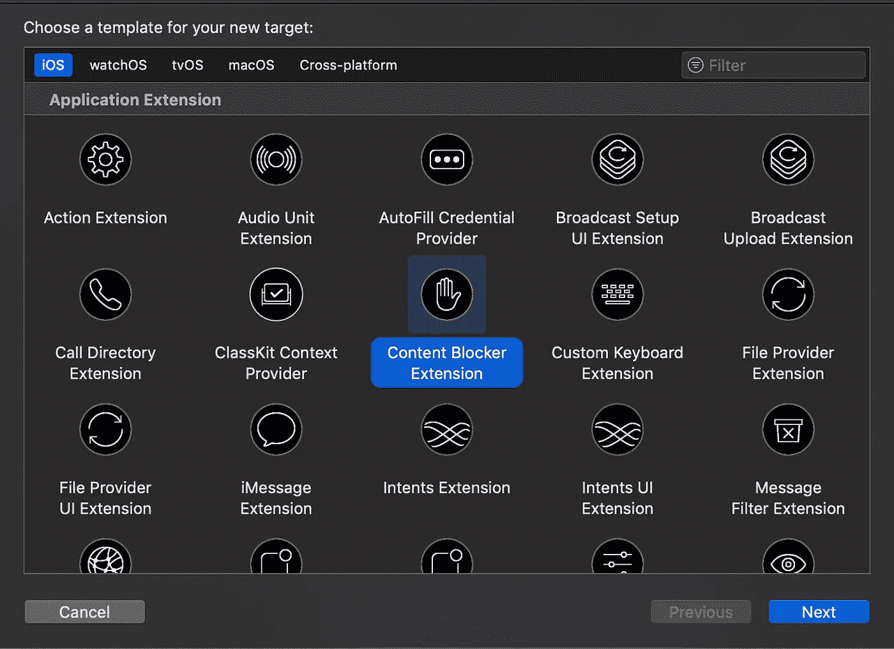
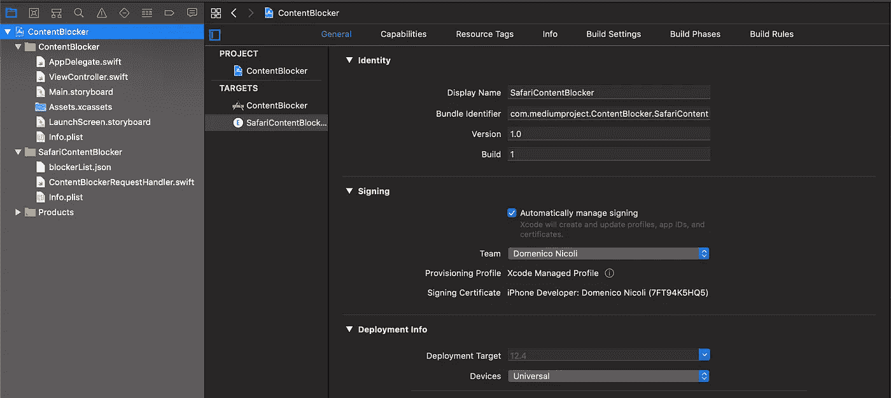
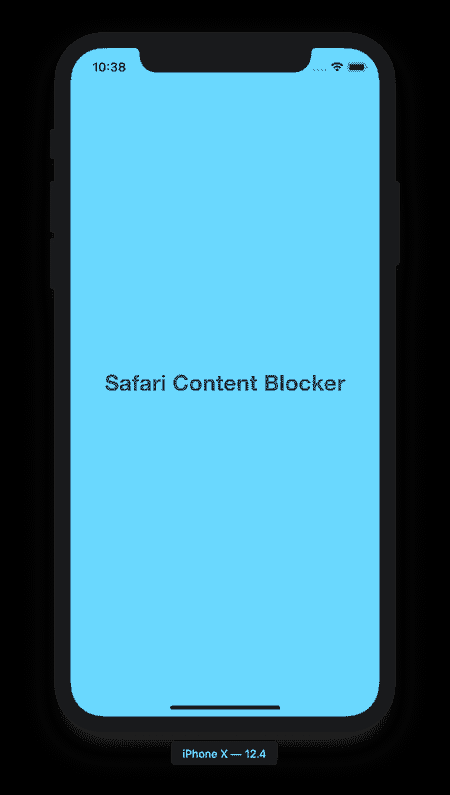
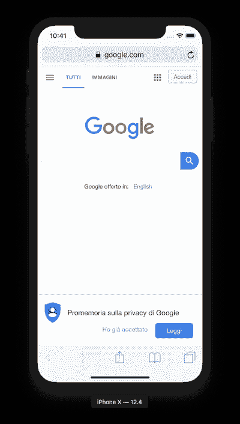
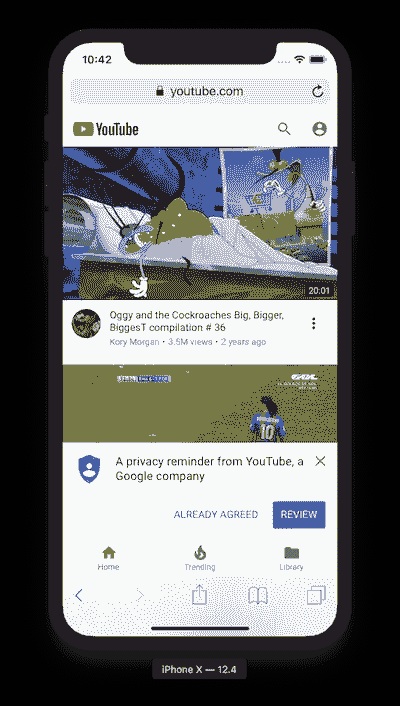
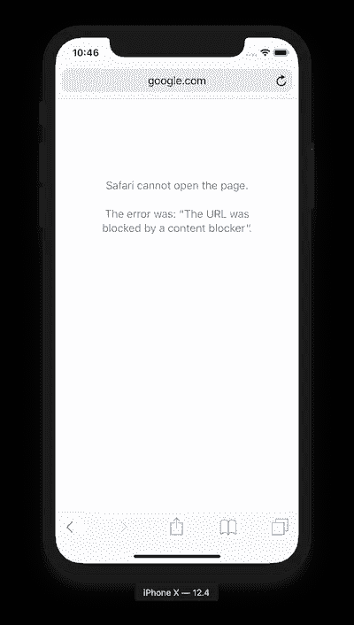
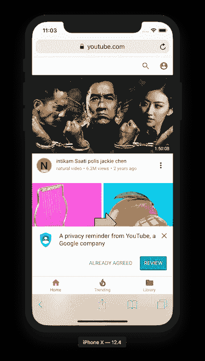

# 如何使用 Swift 为 iOS 创建 Safari 广告拦截器

> 原文：<https://blog.devgenius.io/how-to-create-a-safari-ad-blocker-for-ios-using-swift-8dda420ed3b7?source=collection_archive---------0----------------------->

## 广告无处不在，但它们不一定出现在你的浏览器中

由[约书亚·厄尔](https://unsplash.com/@joshuaearle?utm_source=medium&utm_medium=referral)在 [Unsplash](https://unsplash.com?utm_source=medium&utm_medium=referral) 拍摄的照片

说实话:我们在日常生活中每天都会看到很多广告。平均而言，我们每天会看到[5000 个广告](https://stopad.io/blog/ads-seen-daily)，如果你觉得太多了，试着想想你最后一次看到广告是什么时候。大概是五分钟前。

如今广告无处不在:城市纸板、LED 大屏幕、报纸、收音机、互联网和移动应用只是广告商接触消费者的一些主要方式。

为了缓解这个问题(至少在 Safari 上)，在 iOS 9 中，苹果增加了使用内容拦截器的可能性，内容拦截器可以做四件重要的事情，可以针对单个域进行定制:

*   块域
*   阻止 cookies
*   通过 CSS 隐藏页面元素
*   HTTPS 部队

下面你可以找到一个示例项目，但要了解更多信息和详细了解它是如何工作的，你可以在这里找到苹果文档。

# 介绍

首先，新建一个 Xcode 项目。可以从单视图 app 开始。

现在进入文件→新建→目标，并选择内容拦截器扩展。单击 Next，在命名项目之后，单击 Finish。

您的项目应该如下所示:

深入研究，我们可以看到在我们刚刚添加的扩展中自动创建的两个文件。我们有:

*   这个`ContentBlockerRequestHandler`将加载包含所有配置的文件，并返回主应用程序。
*   JSON 文件包含一个列表，其中包含我们之前解释过的所有内容拦截器规则。

# **找点乐子**

好了，现在我们可以开始玩了。尝试添加一些域名到你的`blockerList.json`文件中。下面你可以找到一个 JSON 文件需要什么结构的例子。

在这个例子中，我屏蔽了 Google 并隐藏了 YouTube 的标志。

# 最后试验

我添加了一个标签，并更改了`ViewController` 上的背景，这样我就不会在启动时出现黑屏。现在让我们试着运行它，看看在模拟器上会发生什么。

我们的应用程序正在运行，但如果我们打开 Safari，我们仍然可以打开谷歌和 YouTube 仍然有一个标志，对不对？

那么，我们还缺少什么来完成我们的内容拦截应用程序呢？我们需要配置 Safari 才能使用它。

进入“设置”→“Safari”→“内容拦截器”,在这里我们应该会看到需要启用的应用程序扩展。

然后回到 Safari，再试一次。下面你可以看到我们的工作成果。

谷歌屏蔽了，Youtube 的标志也不见了

**你可以在这里** **找到** [**的完整代码。**](https://github.com/domeniconicoli/ContentBlocker)

# 未来的改进

在本指南中，我解释了如何为 Safari 配置内容拦截器，但这样一来，规则是针对应用捆绑包内的静态内容 **t** 的。如果在应用程序发布后，我们发现我们屏蔽了真正的谷歌，而不是一个诈骗网站，会怎么样？

现在我们必须修改 JSON 文件，上传一个新版本到`AppStoreConnect`，等待 24 到 48 小时进行审查，然后祈祷我们的用户在删除我们的应用程序或给我们留下 0 星评级之前升级到最新版本。

## 我们如何解决这个问题？

我们需要在我们的主应用程序(不是在扩展中)上添加逻辑，从远程服务器下载列表(例如，对于一个开源项目，您可以使用 GitHub)。本地保存文件，然后刷新 Safari 规则，调用[Safari content blocker](http://SFContentBlockerManager.reloadContentBlockerWithIdentifier)*方法。*

*你觉得这很辛苦吗？别担心。不是的！试着一步一步来，有问题就在下面留言评论吧！*