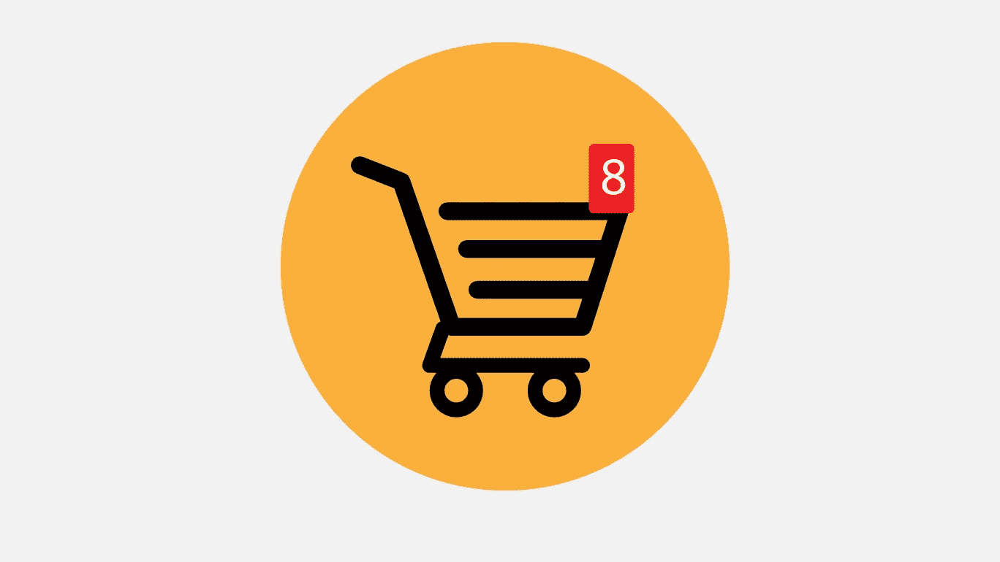
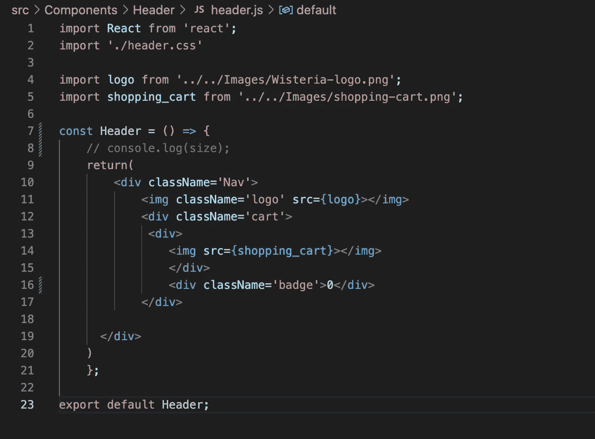
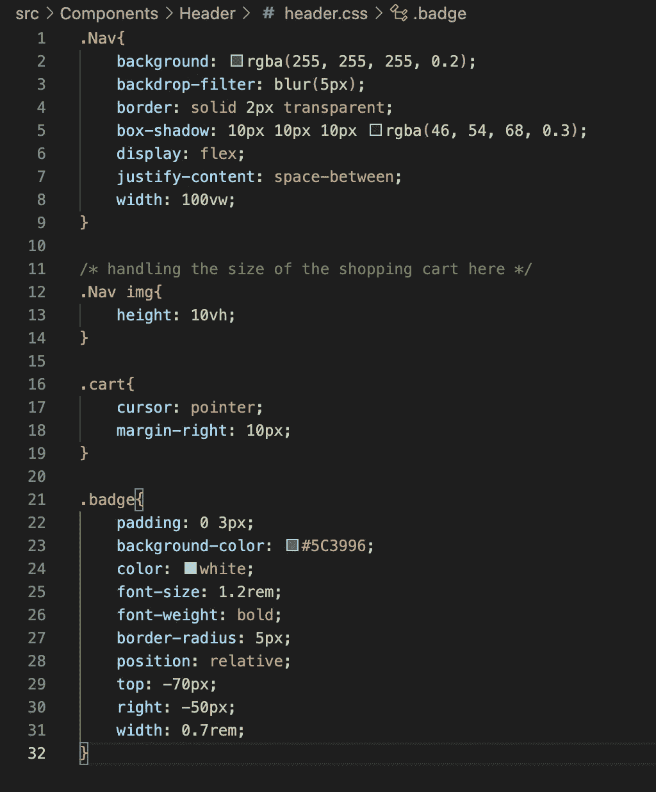
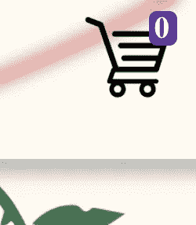
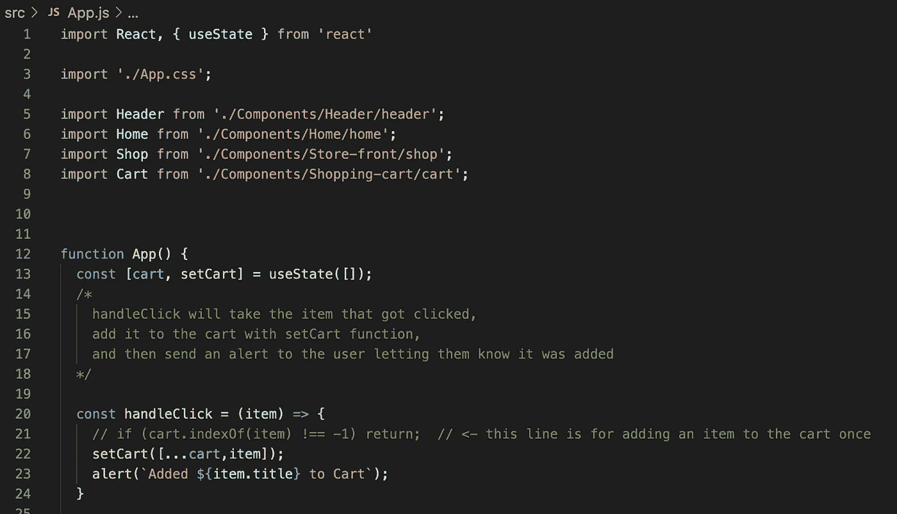
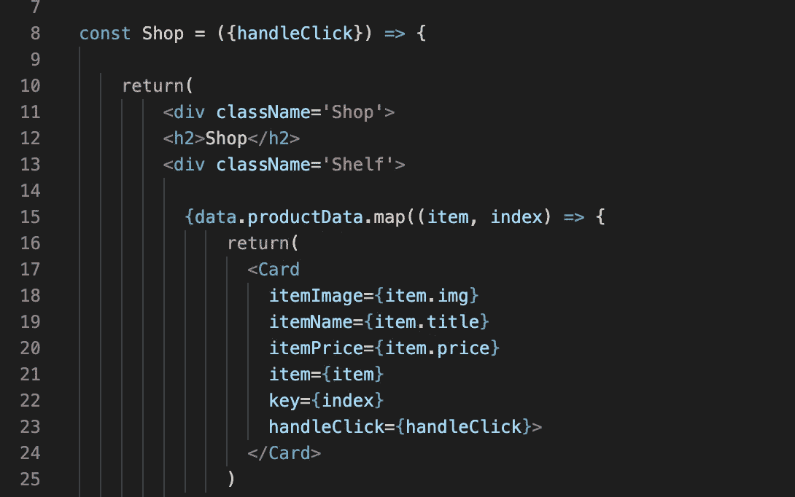
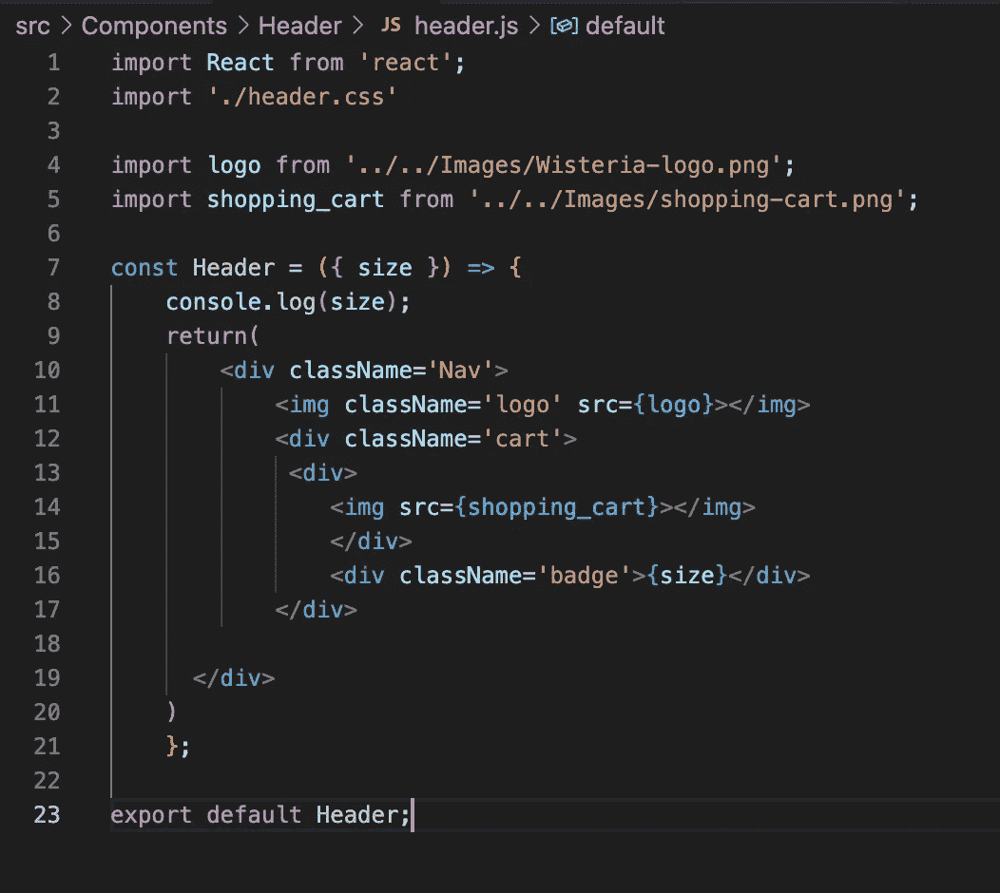

# 如何创建带有徽章🛒的购物车

> 原文：<https://blog.devgenius.io/how-to-create-a-shopping-cart-with-a-badge-34ec6dafe40f?source=collection_archive---------4----------------------->

电子商务一直呈上升趋势，尤其是在新冠肺炎时期(或者我喜欢称之为“瘟疫😷").购物车是用户体验的重要组成部分。所有最好的电子商务城市都有购物车，标明购物车中有多少物品，但你自己是如何制作的呢？这个例子将向你展示如何用 React、JavaScript 和 CSS 编写这样一个购物车。我们开始吧！

**第一步:将购物车图像添加到你的导航栏中**

将购物车图像导入到您的导航栏组件中。在你的导航栏中创建一个名为“cart”的 div 标签。在这个购物车 div 中，添加两个 div 标记:一个用于购物车图像，一个用于徽章。一定要给徽章一个类名，这样我们就可以在 CSS 中直接调用它。现在，您可以随意在徽章 div 中输入一个数字作为占位符。您的代码应该如下所示:

**第二步:✨CSS 时间！！！！✨**

现在转到导航栏的 CSS 页面，将购物车图像设置为合理的大小。我把我的图片高度设为 10vh，但是做最适合你的应用的。现在要制作徽章，通过它的类名调用徽章，并将背景色设置为您选择的粗体、高对比度颜色，这将是您的徽章的颜色。将边框半径设置为 5px，文本颜色设置为最能突出背景颜色的颜色。设置字体大小和重量，我分别用 1.2 雷姆和粗体。现在，为了确保徽章与购物车稍微重叠，位置必须是相对的。然后设置徽章的顶部和左侧位置。对我来说，顶部:-70px 和右侧:-50px 看起来最好，但你可以随意摆弄它，直到你觉得合适为止。我还将宽度设置为 0.7 雷姆。在必要的地方添加填充。您的代码应该如下所示:

您的购物车图像应该如下所示:

**第三步:现在是 JavaScript 部分**

因此，为了让导航栏了解商店中发生的任何事情并做出反应，代码必须位于 App.js 中。我们还需要从 react 导入 useState，以便使用“cart”和“setCart”。将这两者设置为等于 useState([])的常量，与调用 props 的方式相同。现在我们将创建一个名为 handleClick 的函数，它接受一个我们称之为 item 的参数。我们将调用 setCart，包含已经在带有“…cart”的购物车中的所有内容，以及 item。我添加了一个警告，弹出来说，该项目已被添加到购物车，但这是没有必要的。您的代码应该如下所示:

现在我们需要将 handleClick 函数传递到您加载产品卡的任何地方，以及我们的购物车的长度(使用状态购物车，这么多购物车！).应该是这样的:

**第四步:把所有东西都挂在一起**

现在我们需要进入我们装载产品的地方，我称我的为“商店”，并使 handleClick 成为一个参数。一定要在产品卡本身中调用它。

现在回到你的标题，将 size (cart.length)作为导航条的一个参数。删除占位符数字，并设置其大小。

第五步:享受购物车徽章的荣耀吧！

 [## 商店应用程序演示

youtube.com](https://youtube.com/shorts/tGFI4b5Hnog?feature=share) 

我希望这有所帮助！编码快乐！

这是我这个项目的 GitHub:【https://github.com/ReaganADavenport/Shop-app 