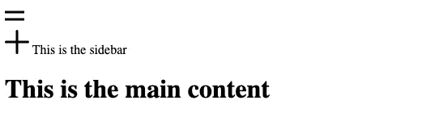
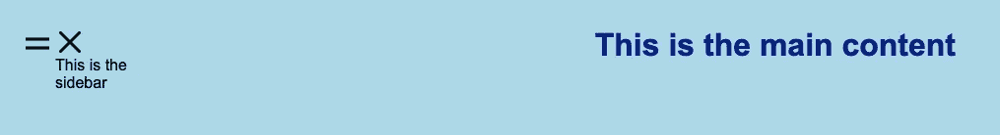
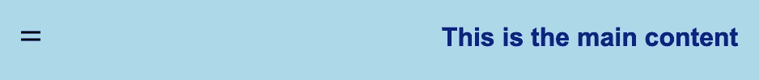

# 如何创建一个带有定制选项的简单侧边栏

> 原文：<https://blog.devgenius.io/how-to-create-a-simple-sidebar-with-customization-options-658ba06c7282?source=collection_archive---------6----------------------->

在现代 web 开发中，侧边栏元素已经相当流行，并且经常在许多网站中使用。侧边栏可以包含内容的上下文元素，如导航菜单、注册表单、额外信息等。


照片由[内森·达席尔瓦](https://unsplash.com/@silvawebdesigns?utm_source=medium&utm_medium=referral)在 [Unsplash](https://unsplash.com?utm_source=medium&utm_medium=referral) 上拍摄

在这篇文章中，我们将会看到如何创建一个侧边栏来配置侧边栏滑动的方向。

这就是我们创建侧边栏所需的全部内容:

1.  一个侧边栏(当然，咄！)
2.  显示或隐藏边栏的按钮。

就是这样！很甜蜜，是吧？

让我们开始吧。

首先，我们将查看 HTML 以创建布局，并添加将用作侧栏的元素。

1.  在上面的 HTML 中，我们有一个包含类`container`的`<div>`标签，它保存了整个布局。
2.  它包括一个带有类`menu-icon`的`<a>`标签，在它里面，我们使用`<svg>`来创建汉堡图标。我们还将`onclick`事件绑定到`<a>`标签，并调用方法`showSidebar('left')`，我们将在后面详细讨论。
3.  然后，我们有了`<aside>`标签，它将成为我们的侧边栏，包含另一个`<a>`标签和侧边栏内容。
4.  标签将包含布局的其余部分。

目前为止，我们的布局是这样的:



不带 CSS 的 HTML 预览

好了，现在我们已经准备好了基本框架，现在让我们给它添加样式。

首先，让我们添加一些布局相关的样式，并让事情定位得很好。

```
* {
  margin: 0;
  padding: 0;
  box-sizing: border-box;
}
body {
  background-color: lightblue;
  font-family: Arial;
}
.container {
  display: flex;  
  padding: 2em;
} 
main {
  padding: 0 1em;
  flex-basis: 100%;
  height: 100vh; h1 {
    color: navy;
    text-align: center;
  }
}
```

我们还需要一些样式来定位我们将要用来显示或隐藏侧边栏的图标。让我们把那个也加上。

```
.menu-icon {
  cursor: pointer;
}
.cross-icon {
  display: block;
  cursor: pointer;
  width: 20px;
  height: 20px;
  margin-bottom: 10px;

  > svg {
    transform: rotate(45deg);
  }
}
```

好了，现在的布局是这样的:



坚持住！我们还有最重要的元素，侧边栏。

```
.sidebar {
  width: var(--sidebar-width);
  padding: 2em;
  position: absolute;
  background-color: #fff;
  height: 100%;
  top: 0;
  transition: all 0.2s ease-in-out;

  &[data-direction="left"] {
    left: calc(-1 * var(--sidebar-width));
  }
  &[data-direction="right"] {
    right: calc(-1 * var(--sidebar-width));
  }
  &.active {
    &[data-direction="left"] {
      left: 0;
    }
    &[data-direction="right"] {
      right: 0;
    }
  }
}
```

理解那里发生的事情有问题吗？我们来详细讨论一下:

1.  `sidebar`正在使用`position: absolute`,所以它被从文档流中移除，并且不占用其容器中的任何空间。
2.  属性将使我们的侧边栏显示或隐藏一些动画。
3.  `data-direction`作为自定义属性添加到侧边栏上，我们可以在这里指定侧边栏滑动的方向。`left` 属性用于`[data-direction=”left”]`属性，`right`用于`[data-direction=”right”]`属性。
4.  为了从容器中完全隐藏，`left` & `right`属性的值应该使用与侧边栏宽度相同的值。
5.  因为我们希望侧边栏位于容器之外，所以我们使用 CSS `calc()` [函数](https://developer.mozilla.org/en-US/docs/Web/CSS/calc())将值转换为负值。
6.  `active`类将被用在工具条上，工具条将调整`left` & `right`属性值，工具条将出现在容器中。
7.  `active`默认情况下，类不会应用于侧边栏。

这是我们现在的布局:



与之前的预览版没有太大的不同，但是侧边栏在哪里？🤔

没错！侧边栏仍然存在，但被放置在容器之外，这使得它不可见，这就是我们想要的，对吗？让我们看看如何让我们的侧边栏再次可见，这样我们就需要在页面中添加一点 JavaScript。

```
function showSidebar(direction) {
  const sidebar = document.querySelector(`.sidebar[data-direction="${direction}"]`);

  if (!sidebar) return; 

  if (sidebar.classList.contains('active')) {
    sidebar.classList.remove('active');
  } else {
    sidebar.classList.add('active');
  }
}
```

那是什么？

1.  我们已经定义了一个名为`showSidebar`的函数，它带有一个参数`direction`。定义参数完全是可选的。
2.  然后，我们声明了一个变量`sidebar`,它将存储 DOM 中的目标元素，该元素将根据调用方法时传递给`direction`参数的值来选择。
3.  方法中添加了一个条件检查，如果您刚刚定义的`sidebar`元素在 DOM 中不存在，方法的其余部分将停止执行。
4.  最后，如果定义了`sidebar`并且通过了检查，那么我们将在`sidebar`上切换`active`类。
5.  我们的侧边栏现在应该可以正常工作了。

> 请确保在调用该函数时将正确的值传递给`direction`参数。如果在侧边栏元素上使用了`[data-direction="left"]`属性，那么在调用方法`showSidebar(‘left’)`时需要指定`left`值。只有这样，你才能看到侧边栏工作正常或如预期的那样。

**HTML**

用于创建带有侧边栏的布局的 HTML

**CSS**

CSS 来设置布局和侧边栏的样式

**JavaScript**

切换侧边栏的 JavaScript

**这是我们刚刚构建的全功能侧边栏:**

功能侧栏的 Codepen 代码片段

## 结论

因此，我们已经在这篇文章中看到了如何轻松地创建带有定制选项的侧边栏。我们可以进一步向侧边栏添加更多的定制选项，并以许多其他方式控制它的行为。

我希望这篇文章能帮助你建立一个你自己的边栏，可以在你的项目中使用。请留下掌声👏如果你喜欢这篇文章，并在评论中分享你的反馈或建议。

更多文章和更新请关注我的 [**中**](https://anishdhingra.medium.com/) 和 [**推特**](https://twitter.com/anishddesigner) 。