# 如何在没有外部库的情况下用 React 创建一个小的自动转盘？

> 原文：<https://blog.devgenius.io/how-to-create-a-small-automatic-carousel-with-react-without-external-libraries-9c39d040ac39?source=collection_archive---------3----------------------->

几个月前，我为我的一个项目创建了一个 carousel，因为我更喜欢从零开始构建，而不是选择一个 npm 包，(我发现从零开始清理代码比快速的 npm 包具有更好的可维护性和持久性)。当某个功能需要针对某件事情时，最好自己开发该功能，而不是选择一个外部解决方案，该方案可能不适合该功能未来的时间变化，或者不能保证 6 个月后该包将完美无缺或仍在开发中。

所以，让我们从头开始开发这个项目…

本教程是一个 javascript 教程，css 将只是简单地讨论，媒体查询部分在这里没有详细说明。

我们今天将发展什么？

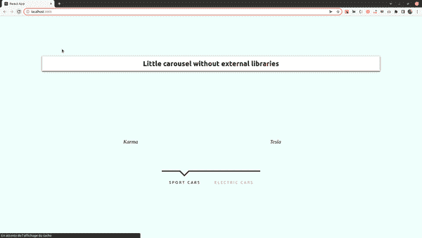

这就是我们将要创造的。

转盘包含两个类别，“跑车品牌”和“电动车品牌”。

在运动类别中，有四个图像和文本…
,在电动类别中，有三个图像和文本

传送带是自动的，但是类别是可以点击的！

让我们开始吧…

首先，我用命令创建一个 react 应用程序:

```
npx create-react-app automated-carousel
```

这是一个像这样的基本应用程序:

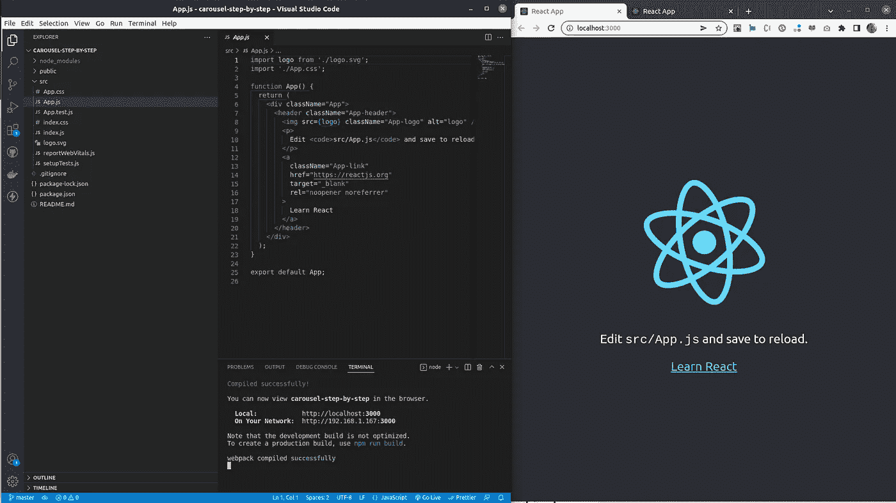

yarn start 或 npm start 运行开发服务器

让我们从创建一些文件夹开始，以便构建我们的项目。

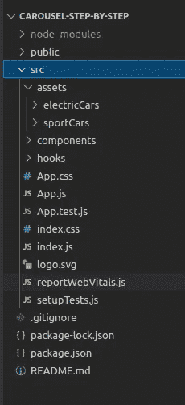

在项目的 src 文件夹中，我创建了一个 assets 文件夹，其中包含两个文件夹，第一个名为“electricCars ”,第二个名为“sportCars”。
然后，在同一个文件夹(/src)中，我创建了一个组件文件夹和另一个钩子文件夹。

我们项目的结构已经准备好了，现在让我们导入图像…

“电动”标志的链接:

[](https://github.com/rodolphe37/carousel-tuto-step-by-step/tree/main/src/assets/electricCars) [## 旋转木马-tuto-逐步/src/主杆处的资产/电动车 37/旋转木马-tuto-逐步

### 在 GitHub 上创建一个帐户，为 rodolphe 37/carousel-tuto-step-by-step development 做贡献。

github.com](https://github.com/rodolphe37/carousel-tuto-step-by-step/tree/main/src/assets/electricCars) 

“sport”标志的链接:

[](https://github.com/rodolphe37/carousel-tuto-step-by-step/tree/main/src/assets/sportCars) [## carousel-tuto-step/src/assets/sport cars at main rodolphe 37/carousel-tuto-step

### 在 GitHub 上创建一个帐户，为 rodolphe 37/carousel-tuto-step-by-step development 做贡献。

github.com](https://github.com/rodolphe37/carousel-tuto-step-by-step/tree/main/src/assets/sportCars) 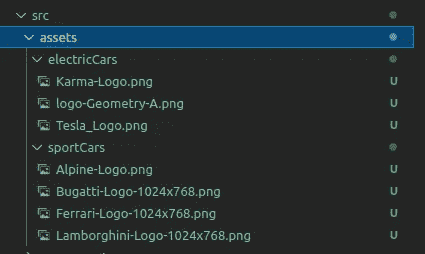

然后，在 assets 文件夹(在它包含的两个文件夹旁边)中，我创建了一个文件，命名为 picturesExport.js.
这将使导入图像到我的组件中变得更加容易和快速。

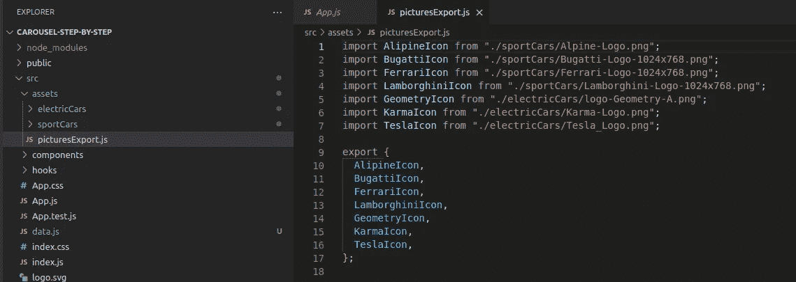

这个文件的内容相对简单，我导入图像，然后导出代表图像的变量。

之后，我在/scr 文件夹中创建一个 data.js 文件，创建两个表示类别的对象数组。

每个对象由一个 id、一个图像、一个文本和一个宽度组成。

正如您所看到的，关于这个文件中图像的导入，我只导入在上一步中创建的导出文件的变量。这使得代码更加易读和干净。
让我们继续…

现在我将创建两个组件，一个名为 Banner.js，另一个名为 Slider.js

横幅组件基础如下所示:

滑块组件如下所示:

然后，在 App.js 文件中，我将默认内容替换为以下内容:

让我们在 App.css 文件中创建一些样式，

默认情况下，将此文件的内容替换为以下内容:

由于这篇文章是关于一个自动旋转木马的开发，css 将不会被详细解释，因为你可以“用多种方式做它”，相反，我将解释 React 的操作，关注点分离的原则和可重用组件。这次就够了。

项目这一级别的结果如下所示:

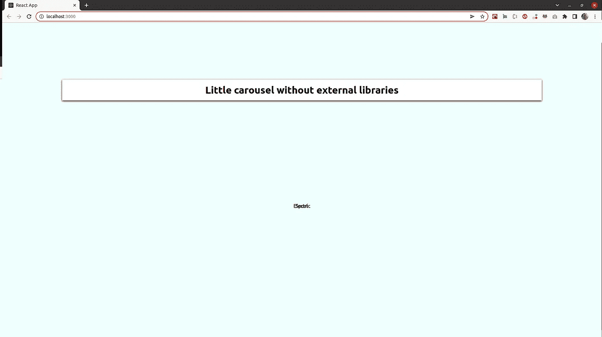

如您所见，两个类别的文本重叠在一起，


这是由于 ul 的绝对位置和文本对齐:中心，这正是我们在这个发展阶段想要的。

下一步…

我们现在将创建一个可重复使用的组件，用于按类别显示我们的徽标。

让我们创建一个名为 CarBrandsSlide.js
的文件，添加以下内容:

代码解释:

这个组件以一个参数作为道具，这个参数是一个数组(dataArray)。
然后我映射数组，定义一个键，放置宽度为样式的图像，最后创建一个包含文本的 h4 标签。

我返回到我的 Silder.js 组件，导入我的可重用组件(CarBrandsSlide ),分别使用 props、sportCarsArray 和 electricCarsArray，不要忘记为包含该组件的每个 ul 定义一个 id，为呈现运动品牌列表的组件定义“ListSport ”,为另一个组件定义“ListElectric”。

然后，我当然从之前创建的数据文件中导入我的数组。

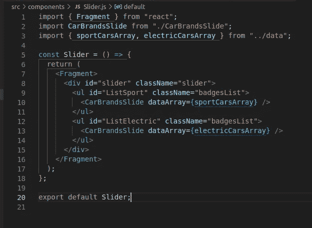

好了，在这个阶段，没有图像出现，这是正常的，css 代码已经到位，但还没有逻辑…

因此，让我们创建一个自定义钩子 useSliderAnimated.js 来实现必要的逻辑。

这个文件的内容是:

代码解释:

首先，我创建了 4 个状态，2 个布尔型(用于每个类别的“单击”动作)和 2 个字符串，其中包含根据动画(屏幕的进入或退出)应用的类的名称

```
const [clickedSportCars, setClickedSportCars] = useState(true);const [clickedElectricCars, setClickedElectricCars] = useState(false);const [sportListClassName, setsportListClassName] = useState("");const [elecListClassName, setelecListClassName] = useState("");
```

如您所见，clickedSportCars 设置为 true，而其他类别设置为 false 作为默认值。

然后，我实现了一个 handleClickAction 函数，该函数同时将两个类别的状态从 true 更改为 false 和从 false 更改为 true。

```
const handleClickAction = () => {setClickedSportCars((clickedSportCars) => !clickedSportCars);setClickedElectricCars((clickedElectricCars) => !clickedElectricCars);};
```

那么在 useEffect 中有 2 个条件:
如果 clickedSportCars 为真，那么用图像输入的 css 类名称设置对应的状态(字符串)——>moveToLeft。
相同的逻辑应用于布尔 clickedElectricCars，但是 css 类不同- > moveFromRight。
(两个阶层从相反的方向出现)

```
useEffect(() => {if (clickedSportCars) {setsportListClassName("moveFromLeft");}if (clickedElectricCars) {setelecListClassName("moveFromRight");}}, [clickedSportCars, clickedElectricCars]);
```

不要忘记在这个函数的第二个参数的依赖项数组中输入 useEffect 的依赖项(状态)。

这个阶段的结果是:

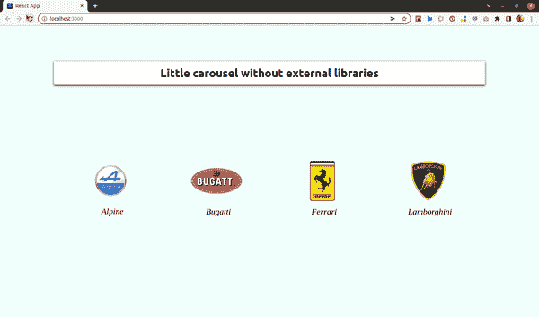

体育类别在屏幕上

正如您所看到的，每幅图像与之前的图像相比都有几毫秒的轻微延迟，
这是由于 App.css 文件中实现的延迟

```
.slider ul.moveToLeft li:first-child,.slider ul.moveFromRight li:first-child,.slider ul.moveToRight li:nth-child(4),.slider ul.moveFromLeft li:nth-child(4) {animation-delay: 0ms;}.slider ul.moveToLeft li:nth-child(2),.slider ul.moveFromRight li:nth-child(2),.slider ul.moveToRight li:nth-child(3),.slider ul.moveFromLeft li:nth-child(3) {animation-delay: 90ms;}.slider ul.moveToLeft li:nth-child(3),.slider ul.moveFromRight li:nth-child(3),.slider ul.moveToRight li:nth-child(2),.slider ul.moveFromLeft li:nth-child(2) {animation-delay: 180ms;}.slider ul.moveToLeft li:nth-child(4),.slider ul.moveFromRight li:nth-child(4),.slider ul.moveToRight li:first-child,.slider ul.moveFromLeft li:first-child {animation-delay: 270ms;}
```

创建从一个类别到另一个类别的导航…

我创建了一个 SliderNav.js 文件

代码解释:

这个组件接受我们将在 Slider.js 组件中实现的道具。
道具是，运动和电动类别的两个布尔值，然后是 handleClickAction 函数。
(这些道具都来自前面实现的自定义钩子)。

然后，为每个 css 类实现一个条件，如果布尔值为真，则将 selected 设为 class，否则为 none。
最后，在这个组件中，函数 onClick={handleClickAction}用于导航标签中包含的每个 span。

然后，对 Slider.js 文件进行一些更改:

我已经从自定义钩子添加了新的导入:

```
const {sportListClassName,elecListClassName,clickedSportCars,handleClickAction,clickedElectricCars,} = useSliderAminated();
```

我为 id 为 ListSport 的 ul 实现了动态的类
:

```
className={`badgesList  ${sportListClassName}`}
```

对于 id 为 ListElectric 的 ul:

```
className={`badgesList ${elecListClassName}`}
```

我已经添加了 SliderNav 组件和必要的道具:

```
import SliderNav from "./SliderNav";......<SliderNavclickedSportCars={clickedSportCars}handleClickAction={handleClickAction}clickedElectricCars={clickedElectricCars}/>
```

好的，让我们试试这个…

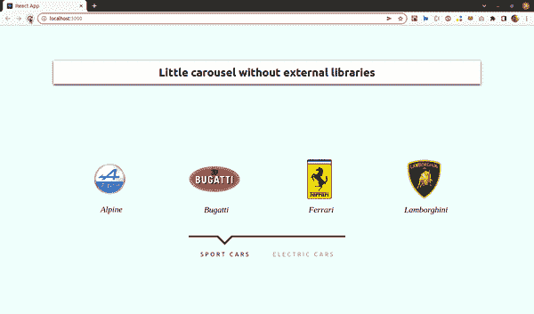

好吧，让我们看看发生了什么！

结果:

类别导航栏看起来很好，好…
点击每个选项都可以正常工作…很好，
在屏幕上输入我的图像也可以，酷…
但是…图像的输出丢失了！

这就是我们现在要实现的。

让我们进入自定义钩子 useSliderAnimated.js 来添加一些代码。

用以下内容修改 useEffect:

我将 moveToRight 类添加到了电动车类别中(这是该类别的图像屏幕输出的代码)。在相反的情况下，对于类 moveToLeft 也是如此。

现在让我们看看结果:

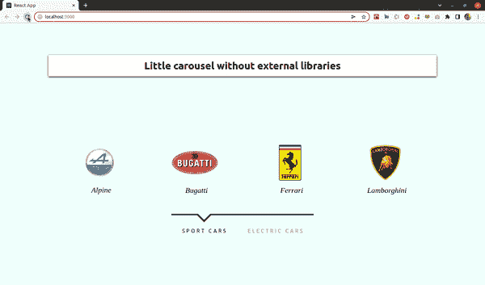

是工作…但是！

好了，一切正常，但是如果你仔细看，你会注意到运动组件的输入动画和电动组件的输出动画是叠加在一起的。
我们需要在每个动画之间添加一个延迟…
让我们回到 useSliderAnimated.js 文件！

让我们修改 useEffect 来实现这一点。

我改变了什么？

让我们以 clickedSportCars:
为例，当这个的布尔值为真时，那么我给逆向组件(setElecListClassName->move right)一个类，它将这个部分的屏幕输出动画化。然后，在 500 毫秒后，我将类 moveFromLeft 设置为 sport 部分，这一次在屏幕上动画显示该部分的条目…

对于另一个布尔值，逻辑是相同的，但用 moveToLeft 来动画显示 sport 部分的输出，然后 500ms 后，我为 electric 部分应用 moveFromRight 类。

结果是:

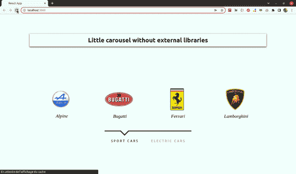

果然是工作，爽！

正如你所看到的，首先是屏幕退出动画，然后是 500 毫秒后的屏幕进入动画…一切都如预期的那样工作！

最后一步，创建自动动画！

有什么变化？

```
const autoSlideTimer = setInterval(() => {handleClickAction();}, 3700);
```

我添加了 autoSlideTime，每次类别更改之间的时间间隔为 3700 ms。

重要的事情:

当在 useEffect 中处理异步任务时，有必要实现一个清理函数，如下所示:

```
return () => {clearInterval(autoSlideTimer);clearTimeout(setTimeout);};
```

每次组件被卸载时，异步任务都被销毁，不管它们是否完成，这避免了内存泄漏，这就是为什么有必要这样做。

和..最终结果:

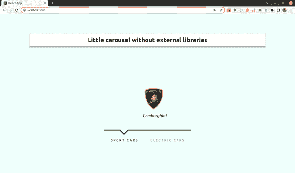

多田…

就这样，所有工作(自动和点击)正确，如预期的那样。

本教程 repo 的链接:

[](https://github.com/rodolphe37/carousel-tuto-step-by-step) [## GitHub-rodolphe 37/carousel-tuto-逐步

### 这个项目是用 Create React App 引导的。在项目目录中，您可以运行:在…中运行应用程序

github.com](https://github.com/rodolphe37/carousel-tuto-step-by-step) 

我希望这篇文章对你有用，让你不要再摆弄不必要的 npm 包。

感谢阅读本教程。

下一期 React js 教程再见。