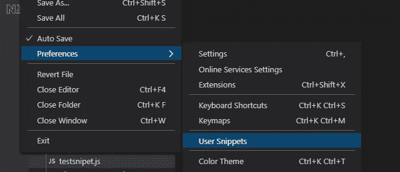
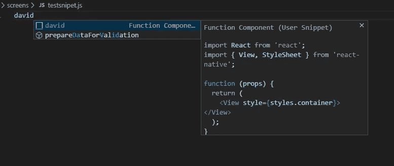

# 如何创建代码段以提高您在 Visual Studio 代码中的工作效率。

> 原文：<https://blog.devgenius.io/how-to-create-a-snippet-to-improve-your-productivity-in-visual-studio-code-da6190f33f34?source=collection_archive---------26----------------------->

console.log("code what is great ")

“我们都有经常使用的那段代码，在编辑之前，我们总是要打包从另一个文件中复制和粘贴。在这里，我将向您展示如何使用代码片段来帮助您更快地编码。”

**1。没有的话可以在这里下载 Visual Studio 代码** [。](https://code.visualstudio.com/)

它是一个非常棒的工具，可以帮助你添加许多扩展，帮助你更快地编写干净的代码。

**2。安装后，您可以执行以下操作**

在你的终端上，

# mkdir myApp

#cd myApp

#代码。

这将在 visual code studio 中将该文件夹作为工作区打开。

**3。转到首选项>用户片段**

**4。选择要为其创建代码片段的语言。**

在我的例子中，我使用的是 Javascript。(不要忘记用扩展名命名文件)。并添加您经常使用的函数或代码片段。

**5。现在，当你打开一个新文件，你可以很容易地导入它。**

当您键入名称(上图中的前缀)时

恭喜你…你成功了！

*“如果你喜欢我的文章，请不要忘记喜欢并关注，以鼓励我与你一起写更多的东西”*

图片:由马丁·施瑞德在 Unsplash 上拍摄