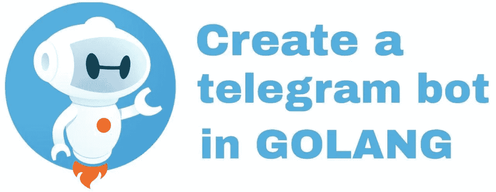
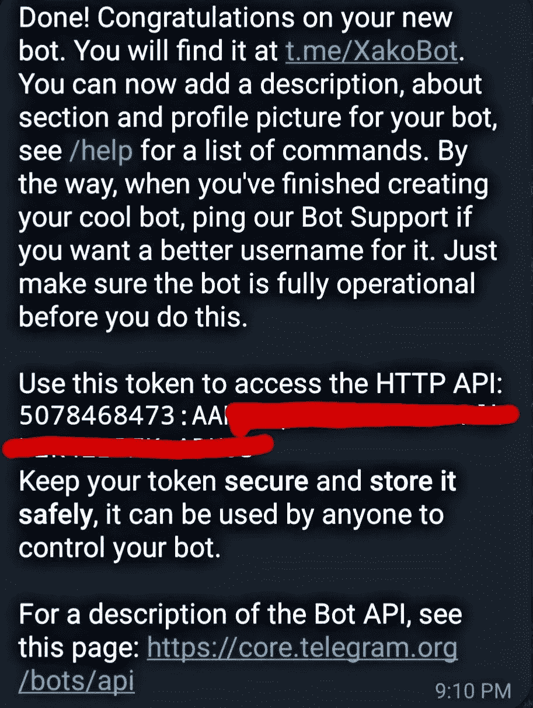

# 如何在 GOLANG 中创建电报机器人

> 原文：<https://blog.devgenius.io/how-to-create-a-telegram-bot-in-golang-d30ce8b1bd58?source=collection_archive---------2----------------------->

Telegram 是一个每天都在增长的信使应用程序。它有包括机器人在内的大量功能。机器人可以与用户、组、超级组和频道进行交互。



在这篇文章中，我们将学习如何在 golang 中创建一个电报机器人。

# **要求**

*   **电报账号**:你需要一个电报账号来使用 botfather(稍后描述)创建机器人。
*   **telego 模块** : [Telego](https://github.com/SakoDroid/telego) 是一个在 golang 中创建电报应用的新库。

# **安装模块**

要安装 telegot，您需要使用 **go get** 命令将它安装到您的 GOPATH 中。只需在您的终端中键入以下内容进行安装:

```
go get -u github.com/SakoDroid/telego
```

**创建机器人**

首先你需要使用 [bofather](https://t.me/botfather) 创建一个新的机器人。下面的步骤将告诉你如何做:

1.  启动[机器人父亲](https://t.me/botfather)机器人。
2.  向机器人父亲发送/newbot 命令。
3.  为您的机器人选择一个唯一的名称。
4.  如果一切正常，你会收到一条信息，如下图所示。它包含一个**令牌**，我们稍后会用到它，所以把这个令牌写在某个地方。



现在你已经创建了机器人。让我们转到编码部分。

# **写代码**

为了用 golang 编写机器人代码，我们将使用前面提到的 **telego** 库。

我们将一步一步地学习这一部分:

**第一步:导入库**。只需导入以下库:

```
package main

import (
	bt "github.com/SakoDroid/telego"
	cfg "github.com/SakoDroid/telego/configs"
	objs "github.com/SakoDroid/telego/objects"
)
```

**步骤 2:创建机器人配置。Bot configs 是一个结构，它有一些用于配置 Bot 动作的字段。这些配置位于作为 **cfg** 导入的**配置**包中。如果你不想弄乱配置，这个包有一些默认值。Bot 配置有一个名为 **UpdateConfigs** 的字段，其中包含与从 API 服务器请求和接收更新相关的配置。现在让我们看一下代码:**

```
package mainimport (
	bt "github.com/SakoDroid/telego"
	cfg "github.com/SakoDroid/telego/configs"
	objs "github.com/SakoDroid/telego/objects"
)//This the token you receive from botfather
const token string = "5078468473:AAHLCQfMnJTIFM25rFlbU2k5432kYD46dhs"//The instance of the bot
var bot *bt.Botfunc main() { //Update configs
	up := cfg.DefaultUpdateConfigs()

    //Bot configs
	cf := cfg.BotConfigs{
      BotAPI: cfg.DefaultBotAPI, 
      APIKey: token, UpdateConfigs: up, 
      Webhook: false, 
      LogFileAddress: cfg.DefaultLogFile
    }

}
```

关于 BoConfigs 字段:

1. **APIKey:** 这是你创建 bot 的时候从 botfather 那里收到的令牌。

2. **BotAPI:** 这是 BotAPI 服务器的地址。如果您没有运行本地 api 服务器，请使用 **cfg。该字段的 DefaultBotApi** 常量。

3.**更新配置:**这是更新相关的配置，例如更新频率(默认:300 毫秒)。可以用 **cfg。此字段的 DefaultUpdateConfigs()** 方法。

3. **Webhook:** 如果要使用 Webhook 接收更新，则传递 true。(Telego 目前不支持 webhook)。

4.**日志文件地址:**机器人的日志会保存在这个文件中。

**步骤 3:创建机器人实例。**现在我们已经创建了配置，是时候创建机器人了。只需将您创建的配置传递给 telego 包的 **NewBot** 方法(作为 **bt** 导入)。创建完机器人后。您需要调用 **Run()** 以便 bot 启动并开始从 API 服务器接收更新。

```
package mainimport (
	"fmt"

	bt "github.com/SakoDroid/telego"
	cfg "github.com/SakoDroid/telego/configs"
	objs "github.com/SakoDroid/telego/objects"
)const token string = "5078468473:AAHLCQfMnJTIFM25rFlbU2k5432kYD46dhs"//The instance of the bot.
var bot *bt.Botfunc main() { up := cfg.DefaultUpdateConfigs()

	cf := cfg.BotConfigs{
      BotAPI: cfg.DefaultBotAPI, 
      APIKey: token, UpdateConfigs: up, 
      Webhook: false, 
      LogFileAddress: cfg.DefaultLogFile
    }

    var err error

    //Creating the bot using the created configs
    bot, err = bt.NewBot(&cf)

    if err == nil {

    	//Start the bot.
    	err = bot.Run()

        if err == nil{
			start()
        }else {
			fmt.Println(err)
		}
	} else {
		fmt.Println(err)
	}

}func start(){
	//Described in later sections
}
```

**步骤 4:接收更新并与客户端交互。** Telego 提供了两种方式来处理从 API 服务器收到的更新:

1.  经理人
2.  Go 频道
3.  **处理程序:**处理程序可以用于文本消息和回调查询(一种内嵌键盘按钮)。您可以指定正则表达式模式、聊天类型和函数。每次从指定的聊天类型接收到文本消息时，将调用该函数并向其传递更新。聊天类型可以是“私人”、“群组”、“超级群组”、“频道”和“全部”。您可以指定多种聊天类型。让我们为文本消息“/start”添加一个处理程序，并响应“嗨，我是电报机器人！" :

```
package mainimport (
	"fmt"

	bt "github.com/SakoDroid/telego"
	cfg "github.com/SakoDroid/telego/configs"
	objs "github.com/SakoDroid/telego/objects"
)const token string = "5078468473:AAHLCQfMnJTIFM25rFlbU2k5432kYD46dhs"//The instance of the bot.
var bot *bt.Botfunc main() { up := cfg.DefaultUpdateConfigs()

	cf := cfg.BotConfigs{
      BotAPI: cfg.DefaultBotAPI, 
      APIKey: token, UpdateConfigs: up, 
      Webhook: false, 
      LogFileAddress: cfg.DefaultLogFile
    }

    var err error

    //Creating the bot using the created configs
    bot, err = bt.NewBot(&cf)

    if err == nil {
    	err = bot.Run()
        if err == nil{
			start()
        }else {
			fmt.Println(err)
		}
	} else {
		fmt.Println(err)
	}

}func start(){
	bot.AddHandler("/start", func(u *objs.Update) {

    	//Sends the message to the chat that the message has been received from. The message will be a reply to the received message.
		_,err := bot.SendMessage(u.Message.Chat.Id,"hi i'm a telegram bot!","",u.Message.MessageId,false,false)
        if err != nil{
        	fmt.Println(err)
        }

	}, "private","group")
}
```

因为我们已经将“private”和“group”传递给了 **AddHandler** 方法，所以只有当收到的消息来自私聊或群聊时，这个处理程序才会工作。

**2。Go 频道:**在 Telego 中，您可以注册特定聊天的频道并更新类型。更新类型是更新包含的文件。它可以包含消息、编辑消息、内嵌查询等。您可以注册一个频道，当更新包含指定字段时，该频道将被更新。您也可以指定一个聊天，这意味着频道将根据该聊天进行更新。这两个参数可以组合在一起，以创建专用于特定聊天中特定更新类型的频道。

在下面的代码中，我们注册了一个只接收消息更新的通道。由于我们没有指定聊天 id，所有包含消息字段的聊天的所有更新都将被传递到该频道。让我们来看看:

```
package mainimport (
	"fmt"

	bt "github.com/SakoDroid/telego"
	cfg "github.com/SakoDroid/telego/configs"
	objs "github.com/SakoDroid/telego/objects"
)const token string = "5078468473:AAHLCQfMnJTIFM25rFlbU2k5432kYD46dhs"//The instance of the bot.
var bot *bt.Botfunc main() { up := cfg.DefaultUpdateConfigs()

	cf := cfg.BotConfigs{
      BotAPI: cfg.DefaultBotAPI, 
      APIKey: token, UpdateConfigs: up, 
      Webhook: false, 
      LogFileAddress: cfg.DefaultLogFile
    }

    var err error

    //Creating the bot using the created configs
    bot, err = bt.NewBot(&cf)

    if err == nil {

    	err = bot.Run()

        if err == nil{
			start()
        }else {
			fmt.Println(err)
		}
	} else {
		fmt.Println(err)
	}

}func start(){ //Register the channel
	messageChannel, _ := bot.AdvancedMode().RegisterChannel("", "message")

    for {

    	//Wait for updates
		up := <- *messageChannel

        //Print the text
        fmt.Println(up.Message.Text) 
    }
}
```

这段代码将通过**消息通道**接收更新并打印文本。

# **与用户互动**

现在我们知道了如何接收更新，我们如何向用户发送消息、媒体和其他东西呢？

Telego 有很多方法发回文本、照片、视频、贴纸等。它们都是从**发送**开始的，比如 **SendMessage** 会发送文本消息，或者 **SendPhoto** 会发送照片。

对于发送媒体，调用相关方法将返回一个 **MediaSender** 。根据 [telegram bot API 文档](https://core.telegram.org/bots/api)，媒体可以通过三种方式发送:

1.  使用已存储在电报服务器中的文件的文件 id。
2.  使用 HTTP url。
3.  使用计算机中的文件。

MediaSender 涵盖了所有这三种方式。它有两种方法:**sendbyfileidourl**和 **SendByFile。**

SendByFileIdOrUrl 将接受一个字符串，该字符串可以是文件 id 或 Url。 **SendByFile** 获取文件并上传至电报服务器。

****** 由于所有的发送方法都返回发送的消息，您可以保存返回消息中的文件 id 以备后用，避免每次都上传媒体。

(要发送其他信息，如投票和位置，您可以在这里阅读 Telego 的完整文档

现在让我们创建一个代码，每当收到文本消息“pic”时，它将发送两张图片。其中一个是 HTTP URL，另一个是存储在运行 bot 的计算机中的文件。在这种情况下，我们将使用处理程序(代码的其他部分如上所示，此处删除) :

```
func start(){
	bot.AddHandler("pic", func(u *objs.Update) {

      //ChatId of this chat
      chatId := u.Message.Chat.Id //Received message if. We will use it's id to reply to it
      messageId := u.Message.MessageId //Create a media sender for sending a URL
      mediaSender1 := bot.SendPhoto(chatId,messageId,"this is the caption","")//Send the URL
      _,err := mediaSender1.SendByFileIdOrUrl("http://example.com/funny_cat.jpg",false,false)
      if err2 != nil{
          fmt.Println(err)
      } //Create a media sender for sending a file
      mediaSender2 := bot.SendPhoto(chatId,messageId,"this is the caption","") //Open the file. error is ignored to simplify the code
      file,_ := os.Open("funny_cat.jpg")//Send the file
      _,err = mediaSender2.SendByFile(file,false,false) if err != nil{
          fmt.Println(err)
      }

	}, "private")
}
```

就这样，你只发了两张照片！

发送其他媒体的代码与上面的代码类似，但你只需调用机器人的相关方法(如 **SendVideo** 或 **SendGif** )。

# 关于键盘

Telegram 提供两种类型的键盘:

1.  自定义键盘:这种键盘将显示给用户，而不是字母键盘。(您可以在它们之间切换)
2.  嵌入式键盘:该键盘将显示在发送信息的下方。

Telego 有一个工具可以创建两种键盘，而且非常容易使用。创建一个定制键盘你需要调用 **CreateKeyboard 方法**，创建一个内嵌键盘你可以调用 **CreateInlineKeyboard** 方法。这个方法将返回一个键盘指针，其中有几个方法可以添加按钮。完成键盘输入后，您可以将它们与消息一起发送给用户。要发送它们，只需将键盘传递给高级 bot 的 **Send** 方法的**键盘**参数即可。

我们将用示例代码来介绍它们。

## **定制键盘**

下面的代码创建了一个自定义键盘，并将其与文本消息一起发送:

```
func start(){
	bot.AddHandler("/start", func(u *objs.Update) {

    	    //Create the custom keyboard
            kb := bot.CreateKeyboard(false, false, false, "type ...") //Add buttons to it. First argument is the button's text and the second one is the row number that the button will be added to it. kb.AddButton("button1", 1) kb.AddButton("button2", 1)kb.AddButton("button3", 2)

            //Pass the keyboard to the send method
            _, err := bot.AdvancedMode().ASendMessage(u.Message.Chat.Id, "hi to you too, send me a location", "", u.Message.MessageId, false,false, nil, false, false, kb) if err != nil { fmt.Println(err) } }, "private","group")
}
```

当每个按钮被按下时，包含按钮文本的文本消息被发送到机器人。因此，为了处理每个按钮，您可以为按钮包含的文本添加一个处理程序。

## 嵌入式键盘

嵌入式键盘有几种类型的按钮。Telego 有添加所有这些按钮的方法。源代码中完整地记录了这些方法。现在让我们创建一个直列键盘:

```
func start(){ bot.AddHandler("/start", func(u *objs.Update) { //Creates a inline keyboard
           kb := bot.CreateInlineKeyboard() //Adds a url button, when this button is pressed the url will be opened.
           kb.AddURLButton("url", "https://google.com", 1) //Adds a button which will send back a callback query containing the data we give to this function, to the bot when it's pressed.
           kb.AddCallbackButton("call back without handler", "callback data 1", 2) //Adds a button which will send back a callback query containing the data we give to this function, to the bot when it's pressed. The difference between this method and the last method is that this method adds a handler for the callback of this button.
           kb.AddCallbackButtonHandler("callabck with handler", "callback data 2", 3, func(u *objs.Update) { _, err3 := bot.AdvancedMode().AAnswerCallbackQuery(u.CallbackQuery.Id, "callback received", true, "", 0) if err3 != nil { fmt.Println(err3) } }) //Pass the keyboard to the send method
           _, err := bot.AdvancedMode().ASendMessage(u.Message.Chat.Id, "hi to you too, send me a location", "", u.Message.MessageId, false,false, nil, false, false, kb) if err != nil { fmt.Println(err) } }, "private","group")
}
```

在本文中，我们介绍了在 golang 中使用 telego 库创建 bot 的基础知识。为了进一步阅读，你可以阅读 [telego 文档](https://github.com/SakoDroid/telego)以了解更多关于使用 golnag 的 telego 库创建机器人的信息。