# 如何为 EC2 实例创建 Terraform 定制模块

> 原文：<https://blog.devgenius.io/how-to-create-a-terraform-custom-module-for-an-ec2-instance-ea30a1d4b1f8?source=collection_archive---------3----------------------->

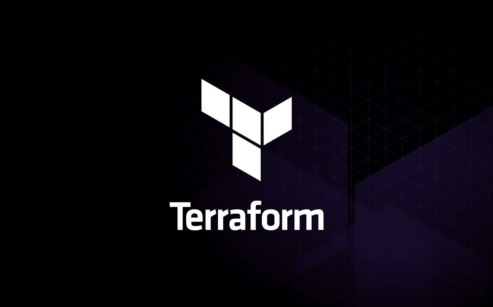

什么是 Terraform？
**Terraform** 是一款开源的基础设施代码(IaC)工具，用于自动供应、配置和管理各种云提供商的基础设施。

什么是 Terraform 模块？
一个**地形模块**是**的集合。tf** 配置文件放在专用目录下。有两种类型的模块
1。根模块:配置的主模块。
2。子模块:被调用以包含其资源的模块。

在本项目中，我们将…
1。以 **ec2.tf** 模板为起点，在本地派生并克隆这个 repo，在这里创建 EC2 [。
2。从资源块中为 EC2 创建一个定制模块，您可以将它用作可重复的基础设施。
3。将新创建的模块和 **ec2.tf** 文件推送到您的 repo](https://github.com/LevelUpInTech/terraformec2.git)

> ***先决条件:***
> [terra form](https://learn.hashicorp.com/tutorials/terraform/install-cli)已安装
> [AWS 帐号](https://aws.amazon.com/premiumsupport/knowledge-center/create-and-activate-aws-account/)
> AWS CLI 已安装
> [GitHub](https://github.com/) 帐号
> 您首选的 IDE (Cloud9)

# 步骤 1:派生和克隆存储库

使用这个 [*链接*](https://github.com/LevelUpInTech/terraformec2.git) *来叉库。*

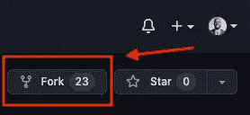

通过在 IDE 终端中输入以下命令来克隆存储库。我用的是云 9。

```
git clone **<your_repo_url>**
```

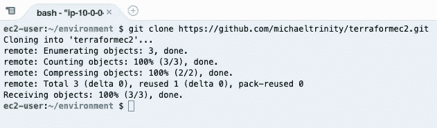

移动到名为 terraformec2 的新目录中。(O *ur 根模块)*

```
cd terraformec2
```

# 步骤 2:设置地形模块

为您的模块创建一个新目录，并移入其中:

```
mkdir **<name_of_newdirectory>**cd **<name_of_newdirectory>**
```

我把我的新目录命名为 **ec2-module。** (O *ur 子模块)*

在新目录中创建 **main.tf** 和 **providers.tf** 文件。它应该是这样的:

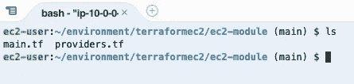

将*提供程序块*复制并粘贴到 **providers.tf** 文件中。

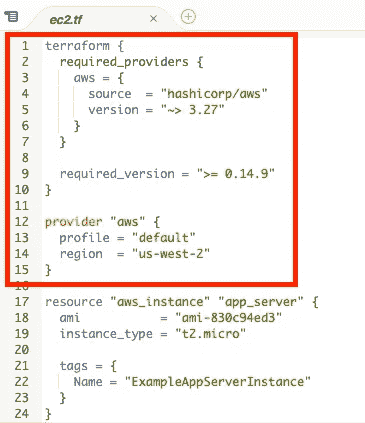

将*资源块*复制粘贴到 **main.tf** 文件中。

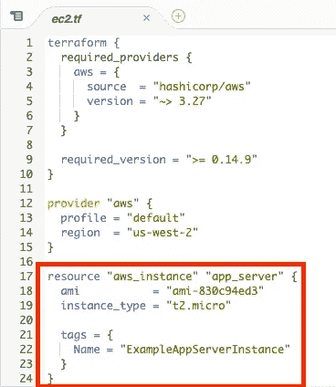

确保您修改了资源块的 AMI！在 AWS 控制台中，获取 EC2 下的 AMI ID。它应该是这样的:

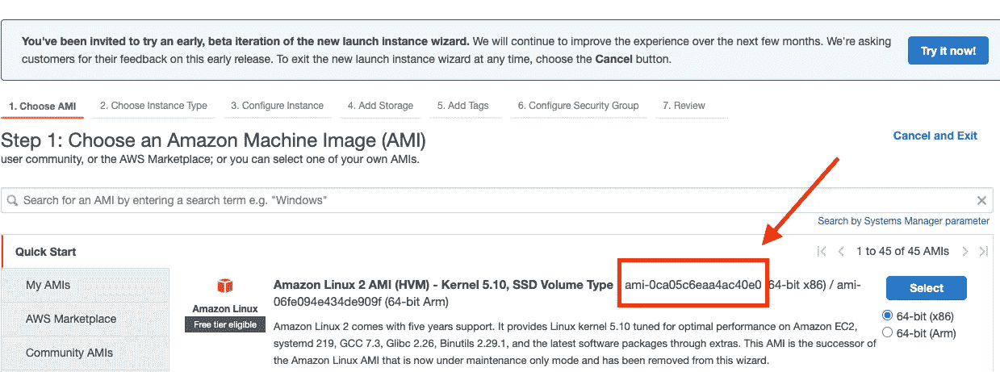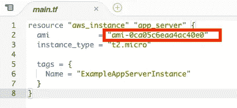

**如果不替换 AMI ID，以后会得到这个错误信息！**

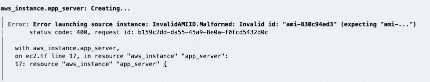

为了引用我们的**ec2-模块**，替换 **ec2.tf** 文件中的*资源块*和*提供者块。使用下面的代码*。**

移动到 terraformec2 目录并验证您的配置:

*   运行`terraform init`初始化 Terraform。
*   运行`terraform fmt`来确保你的格式是正确的，它会修改代码让你匹配。
*   运行`terraform validate`以确保没有语法错误。
*   运行`terraform plan`查看将创建哪些资源。
*   运行 `terraform apply`来创建你的基础设施。出现提示时，键入`yes`。

打开 AWS 控制台，查看 EC2 实例是否启动并运行。
***确保您所在的地区是美国-西俄勒冈州。***

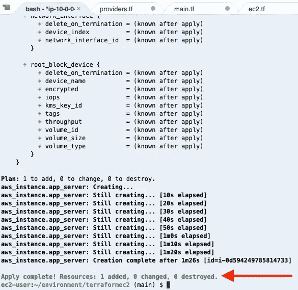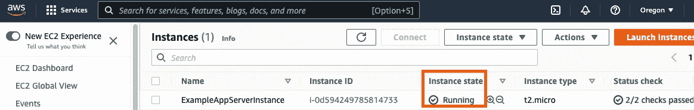

验证之后，运行一个`terraform destroy --auto-approve`来终止 EC2 实例。

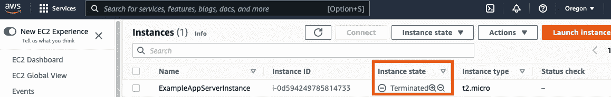

# 步骤 3:将代码更改推送到 GitHub

我们将把代码推回 GitHub。在这样做之前，我们需要创建一个 [**。gitignore 根目录内的**](https://www.freecodecamp.org/news/gitignore-what-is-it-and-how-to-add-to-repo/) 文件。这个文件确保 Git 忽略所有我们不想推送的文件。

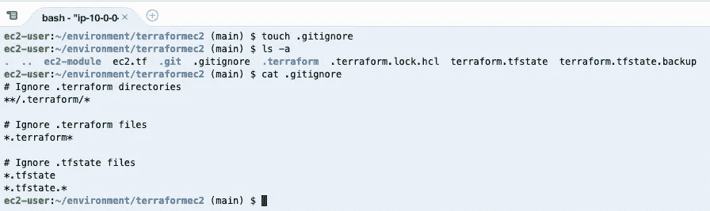

现在，让我们通过输入命令来推送我们的代码:

```
git add .
git commit -m “**<insert comment>**”
git push -u origin
```

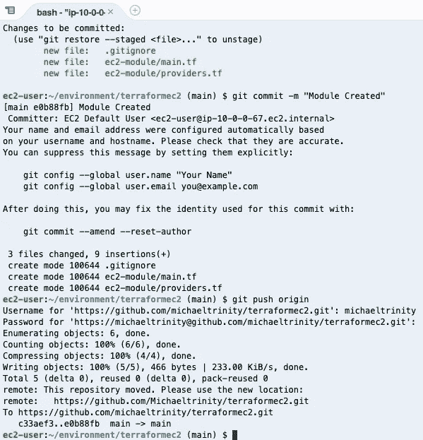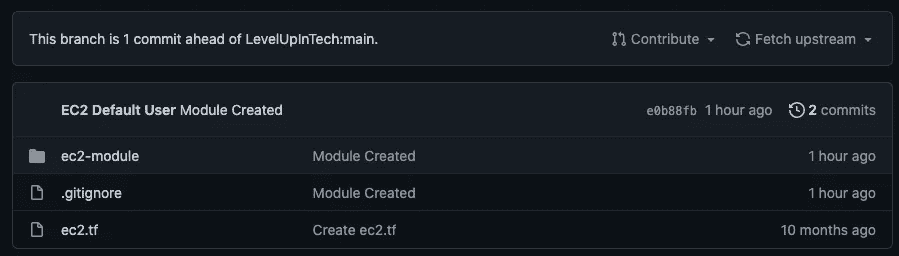

恭喜你，你做到了！你分叉克隆了 repo 模板，创建了 EC2 的自定义模块，并将新建的模块和 **ec2.tf** 文件推送到 GitHub！