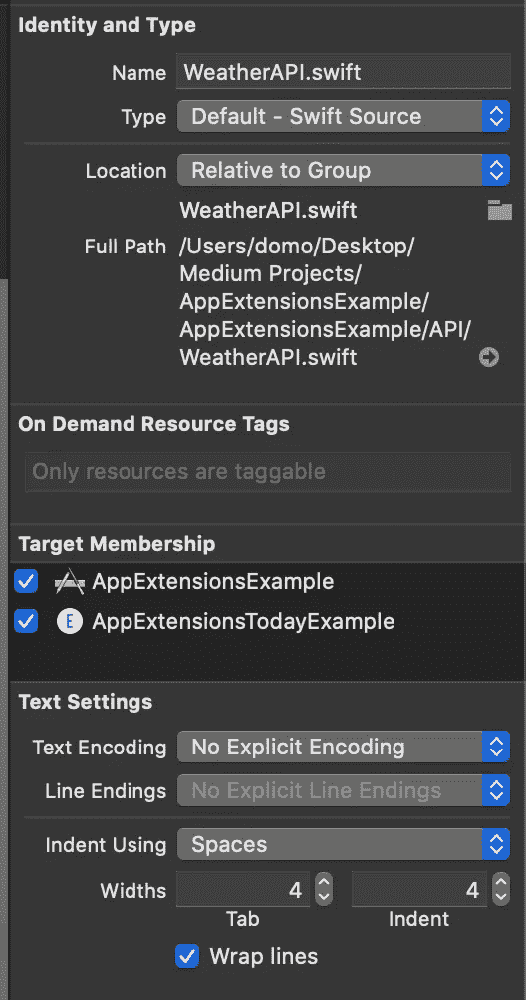

# 如何在 Swift 中创建今日扩展小部件

> 原文：<https://blog.devgenius.io/how-to-create-a-today-extension-widget-in-swift-8892fcd30ea8?source=collection_archive---------0----------------------->

## 关于如何创建“今日”扩展以在通知中心显示信息的教程


照片由 [Jantine Doornbos](https://unsplash.com/@jantined?utm_source=medium&utm_medium=referral) 在 [Unsplash](https://unsplash.com?utm_source=medium&utm_medium=referral) 上拍摄

iOS 8 上引入的应用程序扩展使用户可以通过 iOS 在其他应用程序中访问你的应用程序的功能。例如，您可以将您的应用程序添加到“今日”屏幕，并在动作表上添加新动作，创建新的自定键盘，或者添加 Siri 命令，用户可以使用它来进行语音控制动作。

目前 iOS 支持以下扩展:共享、今日、照片编辑、自定义键盘、文件提供程序、动作、文档提供程序、finder 同步和音频。

# 入门指南

首先，打开 [Xcode](https://developer.apple.com/xcode/) ，新建一个项目。选择单视图应用程序。


然后创建一个新类，命名为`WeatherAPI.swift`。在这里，我们把我们将用来从 [MetaWeather](https://www.metaweather.com) 获取天气预报的方法。

转到`Main.Storyboard`文件，在屏幕中间添加三个标签和一个`UIImageView`。


现在，我们需要得到伦敦的天气预报。将以下代码放入您的`WeatherAPI.swift`文件中:

```
import Foundation

class WeatherAPI {

    // 44418 - London
    // Read here https://www.metaweather.com/api/ to know how to get you city
    let weatherAPIEndpoint = "https://www.metaweather.com/api/location/44418/"

    func getWeather(result: @escaping (WeatherResponse?) -> ()) {

        let request = NSMutableURLRequest(url: NSURL(string: weatherAPIEndpoint)! as URL,
                                                cachePolicy: .useProtocolCachePolicy,
                                            timeoutInterval: 10.0)
        request.httpMethod = "GET"

        let session = URLSession.shared
        let dataTask = session.dataTask(with: request as URLRequest, completionHandler: { (data, response, error) -> Void in
            if (error != nil) {
                print(error)
            } else {

                do {
                    let responseJSON = try JSONDecoder().decode(WeatherResponse.self, from: data!)
                    result(responseJSON)
                } catch {
                    print("error")
                }

            }
        })

        dataTask.resume()

    }

}
```

为响应添加一个新文件，并将以下代码放入其中:

```
import Foundation

// MARK: - Post
class WeatherResponse: Codable {
    let consolidatedWeather: [ConsolidatedWeather]
    let time, sunRise, sunSet, timezoneName: String
    let parent: Parent
    let sources: [Source]
    let title, locationType: String
    let woeid: Int
    let lattLong, timezone: String

    enum CodingKeys: String, CodingKey {
        case consolidatedWeather = "consolidated_weather"
        case time
        case sunRise = "sun_rise"
        case sunSet = "sun_set"
        case timezoneName = "timezone_name"
        case parent, sources, title
        case locationType = "location_type"
        case woeid
        case lattLong = "latt_long"
        case timezone
    }

    init(consolidatedWeather: [ConsolidatedWeather], time: String, sunRise: String, sunSet: String, timezoneName: String, parent: Parent, sources: [Source], title: String, locationType: String, woeid: Int, lattLong: String, timezone: String) {
        self.consolidatedWeather = consolidatedWeather
        self.time = time
        self.sunRise = sunRise
        self.sunSet = sunSet
        self.timezoneName = timezoneName
        self.parent = parent
        self.sources = sources
        self.title = title
        self.locationType = locationType
        self.woeid = woeid
        self.lattLong = lattLong
        self.timezone = timezone
    }
}

// MARK: - ConsolidatedWeather
class ConsolidatedWeather: Codable {
    let id: Int
    let weatherStateName, weatherStateAbbr, windDirectionCompass, created: String
    let applicableDate: String
    let minTemp, maxTemp, theTemp, windSpeed: Double
    let windDirection, airPressure: Double
    let humidity: Int
    let visibility: Double
    let predictability: Int

    enum CodingKeys: String, CodingKey {
        case id
        case weatherStateName = "weather_state_name"
        case weatherStateAbbr = "weather_state_abbr"
        case windDirectionCompass = "wind_direction_compass"
        case created
        case applicableDate = "applicable_date"
        case minTemp = "min_temp"
        case maxTemp = "max_temp"
        case theTemp = "the_temp"
        case windSpeed = "wind_speed"
        case windDirection = "wind_direction"
        case airPressure = "air_pressure"
        case humidity, visibility, predictability
    }

    init(id: Int, weatherStateName: String, weatherStateAbbr: String, windDirectionCompass: String, created: String, applicableDate: String, minTemp: Double, maxTemp: Double, theTemp: Double, windSpeed: Double, windDirection: Double, airPressure: Double, humidity: Int, visibility: Double, predictability: Int) {
        self.id = id
        self.weatherStateName = weatherStateName
        self.weatherStateAbbr = weatherStateAbbr
        self.windDirectionCompass = windDirectionCompass
        self.created = created
        self.applicableDate = applicableDate
        self.minTemp = minTemp
        self.maxTemp = maxTemp
        self.theTemp = theTemp
        self.windSpeed = windSpeed
        self.windDirection = windDirection
        self.airPressure = airPressure
        self.humidity = humidity
        self.visibility = visibility
        self.predictability = predictability
    }
}

// MARK: - Parent
class Parent: Codable {
    let title, locationType: String
    let woeid: Int
    let lattLong: String

    enum CodingKeys: String, CodingKey {
        case title
        case locationType = "location_type"
        case woeid
        case lattLong = "latt_long"
    }

    init(title: String, locationType: String, woeid: Int, lattLong: String) {
        self.title = title
        self.locationType = locationType
        self.woeid = woeid
        self.lattLong = lattLong
    }
}

// MARK: - Source
class Source: Codable {
    let title, slug: String
    let url: String
    let crawlRate: Int

    enum CodingKeys: String, CodingKey {
        case title, slug, url
        case crawlRate = "crawl_rate"
    }

    init(title: String, slug: String, url: String, crawlRate: Int) {
        self.title = title
        self.slug = slug
        self.url = url
        self.crawlRate = crawlRate
    }
}
```

现在回到你的`ViewController.swift`文件，添加下面的变量作为全局变量。我们将使用它来获取徽标图像:

```
let imageEndpointURL = "https://www.metaweather.com/static/img/weather/png/#IMAGE#.png"
```

然后添加以下函数，并在`viewDidLoad`上调用它:

```
func loadWeather() {
        let API = WeatherAPI()
        API.getWeather { (response) in

            DispatchQueue.main.async() {

                // get tomorrow object
                let tomorrowWeather = response?.consolidatedWeather[1]
                guard let unwTomorrowWeather = tomorrowWeather else {
                    return
                }

                // set city name
                self.cityLabel.text = response?.title

                // get image
                let weatherStateAbbr = tomorrowWeather?.weatherStateAbbr
                guard let unwWeatherStateAbbr = weatherStateAbbr else {
                    return
                }
                let imageString =  self.imageEndpointURL.replacingOccurrences(of: "#IMAGE#", with: unwWeatherStateAbbr)
                let imageUrl = URL(string: imageString)
                guard let unwImageUrl = imageUrl else {
                    return
                }
                let data = try? Data(contentsOf: unwImageUrl)

                // set weather image
                if let imageData = data {
                    self.weatherImage.image = UIImage(data: imageData)
                }

                // set weather label
                self.weatherLabel.text = unwTomorrowWeather.weatherStateName
            }

        }
    }
```

现在，如果我们启动应用程序，结果应该是这样的:


# 履行

我们的应用程序已经准备好了，但是这个教程应该解释如何创建一个 Today 扩展，对吗？

首先，进入你的项目设置，点击底部的+按钮，选择今日扩展:


现在，您的项目导航器中应该添加了三个新文件:


选择`MainInterface.storyboard`文件，添加两个标签和一个图像。


选择`WeatherAPI.swift`和`WeatherResponse.swift`文件，并在目标中添加 Today 扩展名。

这是从扩展访问该方法所必需的。



现在，进入您的`TodayViewController.swift`文件，添加以下变量作为全局变量。我们将使用它来获取徽标图像:

```
let imageEndpointURL = "https://www.metaweather.com/static/img/weather/png/#IMAGE#.png"
```

然后在`viewDidLoad`上，添加下面一行…

```
extensionContext?.widgetLargestAvailableDisplayMode = .expanded
```

…以及以下功能，以便允许小部件扩展:

```
func widgetActiveDisplayModeDidChange(_ activeDisplayMode: NCWidgetDisplayMode, withMaximumSize maxSize: CGSize) {
      let expanded = activeDisplayMode == .expanded
      preferredContentSize = expanded ? CGSize(width: maxSize.width, height: 200) : maxSize
    }
```

最后，添加从[metaweither](https://www.metaweather.com)获取数据并在 Today 扩展中显示数据的代码:

```
let API = WeatherAPI()
        API.getWeather { (response) in

            DispatchQueue.main.async() {
                // get tomorrow object
                let tomorrowWeather = response?.consolidatedWeather[1]
                guard let unwTomorrowWeather = tomorrowWeather else {
                    return
                }

                self.cityLabel.text = response?.title

                // set city name
                self.cityLabel.text = response?.title

                // get image
                let weatherStateAbbr = tomorrowWeather?.weatherStateAbbr
                guard let unwWeatherStateAbbr = weatherStateAbbr else {
                    return
                }
                let imageString =  self.imageEndpointURL.replacingOccurrences(of: "#IMAGE#", with: unwWeatherStateAbbr)
                let imageUrl = URL(string: imageString)
                guard let unwImageUrl = imageUrl else {
                    return
                }
                let data = try? Data(contentsOf: unwImageUrl)

                // set weather image
                if let imageData = data {
                    self.weatherImage.image = UIImage(data: imageData)
                }

                // set weather label
                self.weatherLabel.text = unwTomorrowWeather.weatherStateName

            }
        }
```

# 试验

最后，我们准备测试应用程序。

运行模拟器。在通知中心，点击编辑，并添加新的小部件。如果你都做对了，结果应该是这样的:

[](https://www.buymeacoffee.com/nicolidomenico)

# 完整代码

你可以在 [GitHub](https://github.com/domeniconicoli/AppExtensionsExample) 上找到完整的代码。感谢您的阅读。