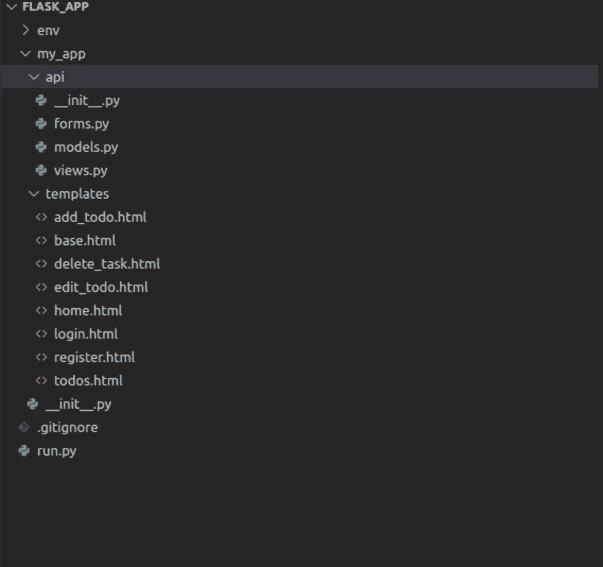
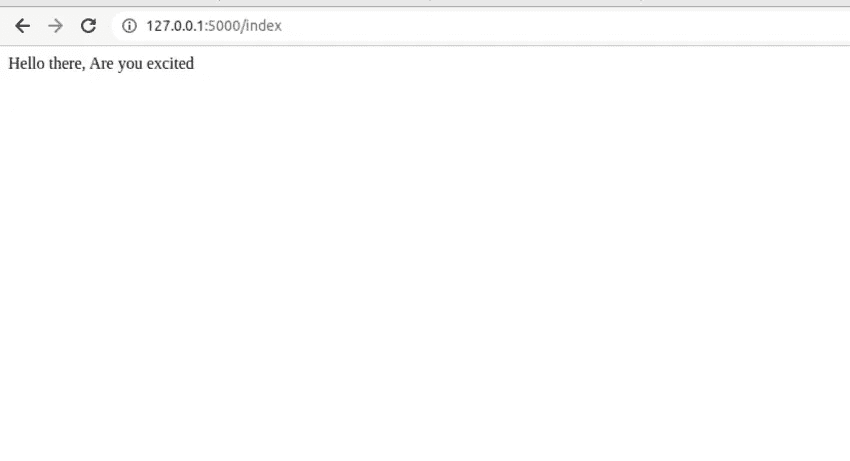
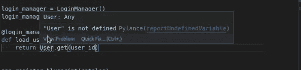
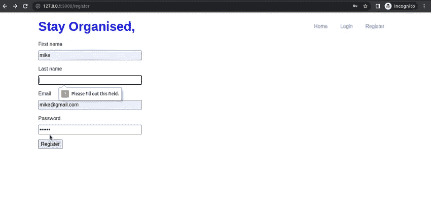
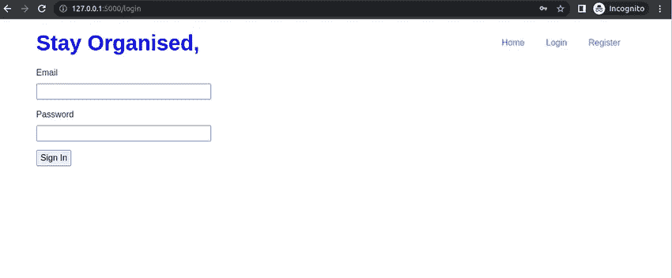
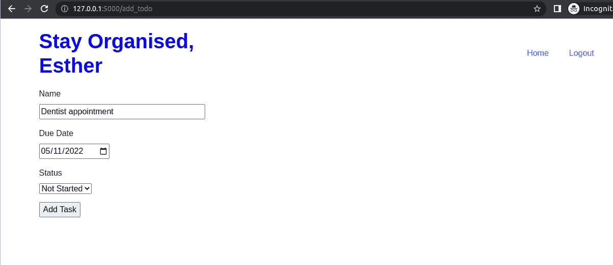
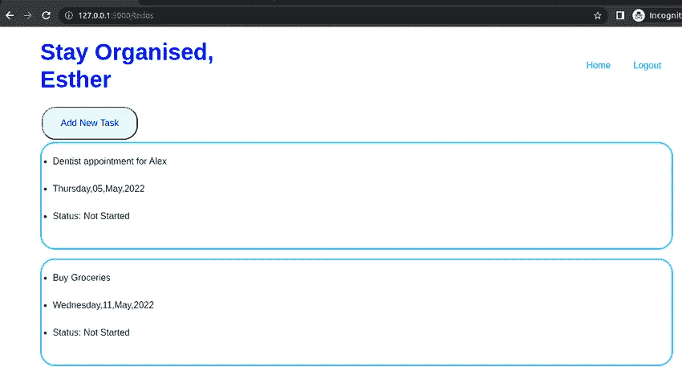
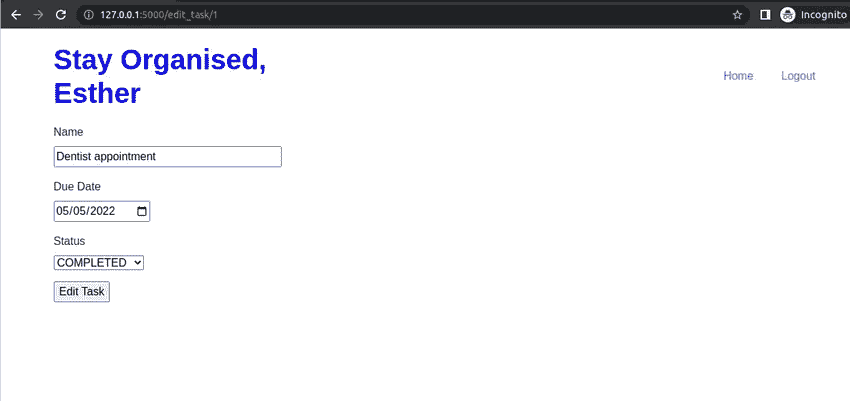
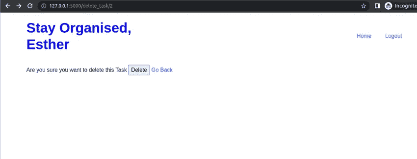

# 如何用 Flask 创建 ToDo 应用程序

> 原文：<https://blog.devgenius.io/how-to-create-a-todo-application-with-flask-21b71651c7dc?source=collection_archive---------1----------------------->

使用 Flask 构建 Todo 应用程序的分步教程


照片由宝琳娜·科瓦列娃拍摄:[https://www . pexels . com/photo/white-notebook-in-特写-摄影-5717421/](https://www.pexels.com/photo/white-notebook-in-close-up-photography-5717421/)

Todo 应用程序是每个开发人员都应该拥有的项目。待办事项应用程序涵盖了所有标准功能，让你可以练习技能并取得成功。

在本教程中，您将构建一个功能完整的待办事项应用程序，用户将能够:

*   注册、登录和注销
*   添加待办事项
*   编辑待办事项
*   删除待办事项
*   查看所有待办事项

## 目标

本教程结束时，您将能够:

*   使用蓝图创建并运行 flask 应用程序
*   将 flask 应用程序配置为使用 SQLite 数据库
*   创建数据库表之间的关系
*   创建用户管理系统
*   使用 WTF 表单创建表单
*   使用表单获取用户输入的数据并将数据添加到数据库中
*   从数据库中检索数据

## 项目设置

因此，首先创建一个项目文件夹，您的项目将存放在其中。

```
mkdir flask_app
```

接下来，创建一个虚拟环境。

```
python3 -m venv env
```

激活虚拟环境。

```
source env/bin/activate
```

安装所需的依赖项

```
pip install flask flask_sqlachemy flask_login
```

在`flask_app`目录中，创建如下所示的项目目录结构。



首先，打开根文件`___init__py`并添加以下代码。

在上面的代码中，我们创建了一个应用程序实例，初始化数据库并将应用程序绑定到数据库，`db.create__all()` 将根据模型创建数据库，如果有的话。我们还创建了一个返回简单文本的简单端点。打开 run.py 并添加以下代码。

```
from my_app import appapp.run(debug=True)
```

要运行服务器，发出以下命令

```
python3 run.py
```

导航到 http://127.0.0.1:5000/index ，您应该会看到以下页面



## 烧瓶登录

用户管理是任何应用程序的支柱；幸运的是，flask 提供了 Flask-Login 扩展，它负责管理用户所需的所有功能

*   登录和注销用户
*   存储用户 id
*   将受保护的内容限制于登录用户
*   处理“记住我”功能
*   保护用户会话免受黑客攻击

既然您已经安装了 flask login，那么让我们来看看它的功能。Flask login 使用 Login Manager 类，您需要定义一个 Login Manager 对象。打开 __init__。py 并添加以下代码。

```
**from** flask_login **import** LoginManager
login_manager = LoginManager**()**
```

创建登录管理器对象后，将其绑定到应用程序，在本例中是 flask 应用程序实例

```
login_manager.init_app(app)
```

接下来，定义一个生成当前用户 id 的 userloader 回调。打开`__init__.py`并添加以下代码

```
from my_app.api.models import User@login_manager.user_loaderdef load_user(user_id): return User.query.get(int(user_id))
```

因为我们还没有定义用户模型类，所以您应该会看到一个错误

`User is not defined`



## 用户模型

用户模型需要实现这些属性和方法:

*   是活动的
*   已经过身份验证
*   get_id()

默认情况下，您将从实现这些方法的`[UserMixin](https://flask-login.readthedocs.io/en/latest/#flask_login.UserMixin)` 类继承，而不是实现所有这些方法。打开 models.py 并添加用户模型

## 任务模型

接下来，您将创建任务模型，每个用户可以有许多待办事项，因此您将在用户和任务模型之间创建一对多的关系

向用户模型添加一个 backref。

```
todos = db.relationship('TodoItem', backref='owner')
```

## 烧瓶设计图

根据文件:

> Flask 使用*蓝图*的概念来制作应用程序组件，并支持应用程序内或跨应用程序的通用模式。蓝图可以极大地简化大型应用程序的工作方式，并为 Flask extensions 提供一种在应用程序上注册操作的中央方法。一个`[***Blueprint***](https://flask.palletsprojects.com/en/2.1.x/api/#flask.Blueprint)`对象的工作方式类似于一个`[***Flask***](https://flask.palletsprojects.com/en/2.1.x/api/#flask.Flask)`应用程序对象，但它实际上不是一个应用程序。相反，它是如何构建或扩展应用程序的蓝图。

更简单地说，蓝图提供了一种将代码分解到其他目录的方法，而不是将所有代码都写在一个文件中，每个蓝图都注册在主文件中。例如，在我们的应用程序中，打开 views.py 并创建一个名为 tasks 的新蓝图和一个返回字符串的简单视图。

```
from flask import Blueprint
tasks = Blueprint('tasks', __name__)@tasks.route('/home')def home(): return "Welcome Home."
```

去 `__init__.py` 备案登记蓝图。

```
from my_app.api.views import tasksapp.register_blueprint(tasks)
```

现在你将使用`tasks.route()`而不是`app.route()`来为你的观点服务

通过导航到[http://127 . 0 . 0 . 1:5000/home](http://127.0.0.1:5000/home)来测试视图是否工作

# 烧瓶 WTF

Flask WTF 提供了 [Flask](https://www.palletsprojects.com/p/flask) 和 [WTForms](https://wtforms.readthedocs.io/) 的简单集成。WTForms 是一个在 Python 中提供表单呈现和验证的库。烧瓶 WTf 还负责形状保护机制。要开始安装，请按如下方式安装 pip。

```
pip install pip install -U Flask-WTF
```

## 用户注册表单

您将从创建用户注册表单开始。打开 forms.py 并添加以下代码。

在上面的代码中，首先导入字段类型，每个字段代表一个数据类型。您通常会创建这些字段，以便它们与用户模型相匹配。WTForms
还提供了验证器，确保输入符合某些标准；例如，`DataRequired`验证器将确保输入不为空。

接下来，将表单添加到`register.html`模板中。打开`register.html`，添加下面的代码。

所有模板都继承自 base.html 模板，如下所示:

## 注册视图

注册过程的最后一步是编写呈现和从注册表单获取数据的逻辑。打开 views.py 并添加以下代码。

如果是上面代码中的 GET 请求，Flask 将呈现 register.html 模板。对于 POST 请求，您获取用户详细信息并将它们保存到数据库中。然后用户被重定向到登录页面，这个页面我们还没有创建。因为密码不应该以纯文本的形式存储，所以我们使用 generate_password_hash 来散列密码。

该表单现在看起来像这样:



## 用户登录表单

打开 forms.py 并创建一个表单以登录用户。

接下来，打开 login.html 并添加表单

## 登录视图

我们获取为登录视图提交的电子邮件和密码数据，然后使用 flask_login 中的`login_user()`函数验证用户。用户登录后，他们将被重定向到我们稍后将创建的 todos 页面。

登录页面现在看起来像这样。



## 用户注销

使用 flask_login logout_user()函数注销用户，然后将用户重定向到主页。

更新 base.html 文件，以便在用户登录时显示注销链接。

## 添加新任务表单

用户现在可以注册、登录和注销，但不能添加任务。我们来处理一下。打开 form.py 并创建用于添加新任务的表单。

接下来，在模板中呈现表单。打开`add_todo.html`，添加以下代码。

## 添加任务视图

最后一步是编写呈现和从表单获取数据的逻辑。打开 views.py 并添加以下代码。

用于编辑任务的页面现在如下所示:



## 显示所有任务

为了显示用户的所有任务，我们查询属于当前用户(当前登录的用户)的所有任务，并将数据传递给模板。

现在打开 `todos.html`渲染数据。

显示任务的页面现在看起来像这样:



## 编辑和删除任务

用户可以添加新任务并查看他们的所有任务。接下来，实现编辑和删除特定任务的能力

## 编辑任务表单

用户将能够编辑特定任务的所有细节。打开 forms.py 并创建 EditTaskForm

## 编辑表单视图

打开 views.py 并添加视图以呈现和获取表单中的数据。

在上面的代码中，函数将任务的 id 作为参数；如果 tas 存在，您可以将数据作为 GET 方法中的输入进行传递。您获得为 POST 方法提交的数据，并将其保存到数据库中。比如你要编辑一个 id =1 的任务，那么网址就会是[http://127 . 0 . 0 . 1:5000/edit _ task/1](http://127.0.0.1:5000/edit_task/1)

接下来，在模板中呈现表单。打开`edit_todo.html`并添加以下代码

编辑表单现在看起来像这样:



## 删除任务视图

要删除一个任务，您将传递该任务的 id 并将其从数据库中删除。

模板看起来像这样

要删除特定任务，例如 id =2 的任务，导航到[http://127 . 0 . 0 . 1:5000/delete _ task/2](http://127.0.0.1:5000/delete_task/2)



该项目的源代码可以在这个 [repo](https://github.com/essykings/flask_todo_application/tree/main) 中找到。

## 结论

本教程涵盖了用 Flask 创建一个全功能的 Todo 应用程序所需的所有概念。为了使您的应用程序更好，捕捉代码中的异常是非常重要的。

[](https://betterprogramming.pub/how-to-handle-exceptions-in-flask-b1d9c151875b) [## 如何处理 Flask 中的异常

### 更好的警报处理有助于更好的编程

better 编程. pub](https://betterprogramming.pub/how-to-handle-exceptions-in-flask-b1d9c151875b) 

如果你喜欢读这篇文章，你可能会喜欢？

[](https://betterprogramming.pub/how-to-build-a-todo-application-with-django-ac675811d77b) [## 如何用 Django 构建 Todo 应用程序

### 了解如何构建 CRUD web 应用程序

better 编程. pub](https://betterprogramming.pub/how-to-build-a-todo-application-with-django-ac675811d77b)