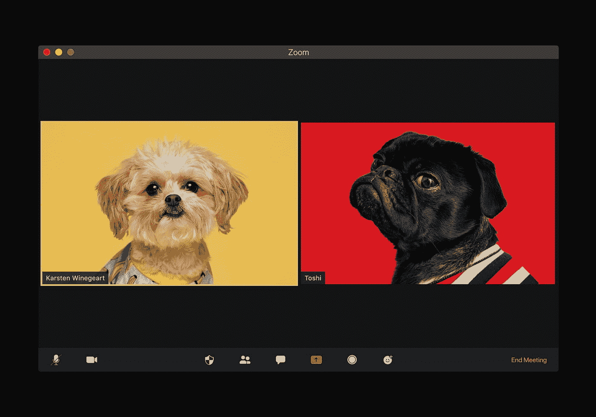
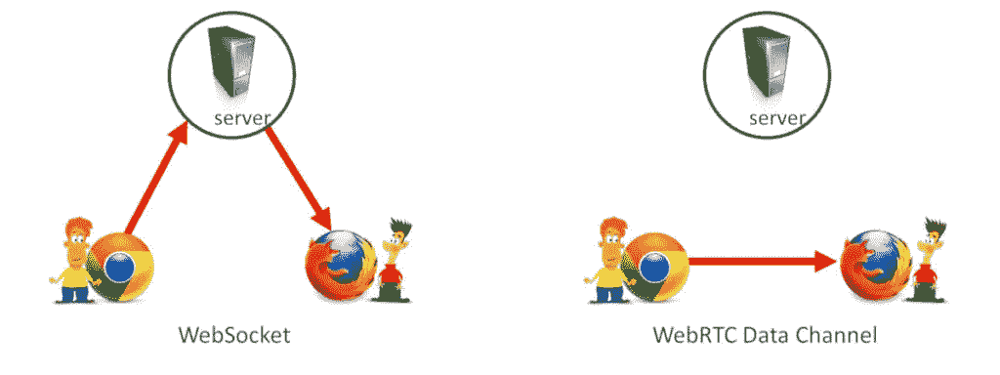
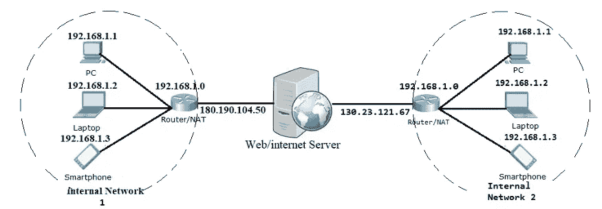
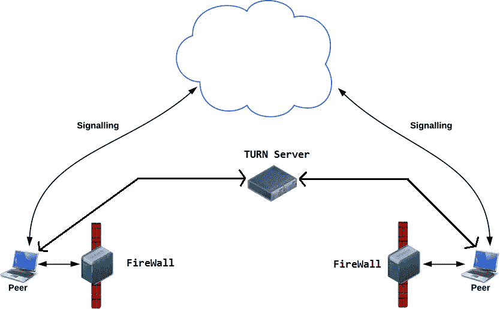
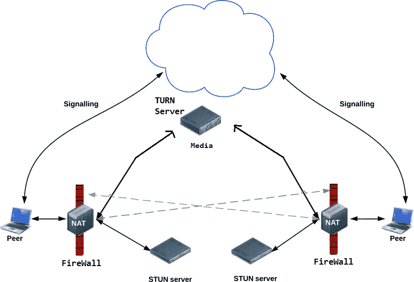

# 如何创建一个视频聊天应用程序与自定义眩晕和转向服务器

> 原文：<https://blog.devgenius.io/how-to-create-a-video-chat-application-with-a-custom-stun-and-turn-server-8c6258542324?source=collection_archive---------0----------------------->

构建我们自己的应用程序很酷。今天我们将开发我们自己的视频聊天应用程序。在这里，我们将开发一个只为 2 个用户的应用程序。



[Unsplash](https://unsplash.com?utm_source=medium&utm_medium=referral) 上[视觉](https://unsplash.com/@visuals?utm_source=medium&utm_medium=referral)的照片

# 内容

1.  基础
2.  使用的技术。
3.  了解 WebRTC。
4.  什么是信号？
5.  WebRTC 是如何工作的(举例)？
6.  我们面临的问题
7.  设置 TURN 和 STUNServer。
8.  我们来编码吧。

# 基础

*   **IP** :连接到互联网的每台设备都使用 IP 地址进行识别。
*   **端口**:系统中的每个进程都有一个端口号，使用该端口号可以将来自互联网的数据定向到设备中的正确位置。

**知识**:有 65536 个端口可用。

# **使用的技术**

1.  WebRTC
2.  NodeJS
3.  ExpressJs
4.  Socket.io(用于信令)
5.  AWS & Kurento(用于设置 STUN 和 TURN 服务器)

# **了解 WebRTC**

在这一部分中，我们将了解使用 WebRTC 开发应用程序所需的各种概念。

在聊天网络应用中，当两个或更多的设备开始发送信息时，它们在到达接收者之前会通过服务器。但是在音频和视频通信之间有一个服务器会导致滞后。因此，我们需要实时数据传输来实现完美的通信。因此，我们使用 WebRTC 这种开源框架为应用程序提供实时通信。

WebRTC 开发人员在开发易于使用的 API 方面做了出色的工作。

WebRTC 代表 Web 实时通信。它支持点对点(设备到设备)通信，中间没有任何服务器，并允许在连接的设备之间交换数据。在 WebRTC 中，服务器的角色仅限于帮助两个或更多设备发现彼此并建立直接连接。



# **信令**

在人们开始相互交流之前，他们的系统需要知道很多关于场景的信息，比如

*   如果有任何其他设备可用于通信。
*   其他设备的网络数据，如 IP 和端口。
*   错误消息。
*   会话控制消息。
*   关于将由另一设备发送的数据的媒体元数据。

信令是一个术语，用于描述协调初始通信并实现设备间元数据发送的机制。一旦建立了直接连接，此后就没有信令的作用了。

默认情况下，WebRTC 不使用任何信号机制。我们使用 socket.io 进行信号传输。

**会话描述协议**

会话描述协议是一种格式，媒体元数据以这种格式传输，以便 WebRTC 发挥作用。

# WebRTC 如何工作(示例)

让我们考虑 Liks 和 karth 决定进行视频聊天。Karth 让 liks 打电话。让我们讨论一下后端是如何工作的

1.  Liks 创建一个`RTCPeerConnection`对象。
2.  Liks 使用`RTCPeerConnection` `createOffer()`方法创建报价(SDP 会话描述)。
3.  Liks 调用`setLocalDescription()`将创建的 offer(会话描述)设置为将要创建的连接中的本地媒体的描述。
4.  Liks stringifies 提供并使用信号机制发送给 Karth。
5.  Karth 打电话给`setRemoteDescription()`告诉他 Liks 的报价，这样他的`RTCPeerConnection`就知道 Liks 的设置了。
6.  Karth 调用`createAnswer()`,这个成功的回调函数被传递一个本地会话描述——Karth answer。
7.  Karth 通过调用`setLocalDescription()`将其答案设置为本地描述。
8.  然后，Karth 使用信号机制将他的字符串答案发送给 Liks。
9.  Liks 使用`setRemoteDescription()`将 Karth answer 设置为远程会话描述。

现在 Liks 和 Karth 也需要交换网络信息。“寻找候选者”是指使用 ICE 框架寻找网络接口和端口的过程。

1.  Liks 用一个`onicecandidate`处理程序创建了一个`RTCPeerConnection`对象。
2.  当网络候选变得可用时，调用该处理程序。
3.  在处理程序中，Liks 通过它们的信令通道向 Karth 发送字符串化的候选数据。
4.  当 Karth 从 Liks 获得候选消息时，他调用`addIceCandidate()`将候选消息添加到远程对等描述中。

# 我们面临的问题

如果设备连接到同一个网络，我们就不会遇到 NAT 问题。

*   精灵
*   防火墙

**NAT**

IP 是标识连接到互联网的设备的地址。从逻辑上讲，您可能会认为每台连接到互联网的设备都必须有一个唯一的 IP 地址。但这并不完全正确。

IPv4 地址有 32 位长，这意味着大约有 40 亿个唯一的地址。截至 2018 年底，约有 220 亿台设备连接到互联网。哦，等等，这怎么可能，这个问题的答案是纳特。

维护互联网的人把整个 IPv4 地址范围分成两组

*   公共 IP 地址
*   私有 IP 地址。

现在，每个公有 IP 地址只能分配给一台设备，而私有 IP 地址则不能。更多细节请看下图。



这就是 NAT 的工作方式

因此，在某种程度上，我们可以说每台设备都有两个 IP 地址私有 IP 地址和公共 IP 地址。

这可能会给 WebRTC 带来问题，因为网络 ICE 候选包含设备的私有 IP 地址，而不是公共 IP 地址。因此，我们必须找到一种方法让浏览器知道公共 IP 地址，以便它可以创建包含公共 IP 地址的候选地址。解决方案是一个 STUN 服务器。当一个设备请求 STUN 服务器时，STUN 服务器用一条包含该设备所连接的路由器的公共 IP 的消息来响应。

**防火墙**

系统使用防火墙来阻止可疑和危险的端口和应用程序。由于 WebRTC 使用几个非标准端口，一些防火墙不允许在两个浏览器之间建立直接连接。

因此，为了解决这个问题，我们需要一个 TURN 服务器。TURN 服务器基本上充当中继服务器，即如果直接连接失败，则在两个对等体之间直接中继流量。



这就是转弯的原理

要将 TURN 和 STUN 与 WebRTC 集成，我们只需将包含 TURN 和 STUN 服务器 URL 的对象作为参数传递给 RTCPeerConnection()。



这是建筑的样子

# **设置回合和眩晕服务器**

1.  设置您的 AWS 帐户。
2.  创建一个 EC2 实例(我更喜欢使用 Ubuntu 免费层)
3.  **打开安全组中的防火墙端口**

*3478 TCP & UDP 端口*

*49152–65535 UDP 端口*

4.**旋转安装**

*sudo apt-get 更新
sudo apt-get 安装返回*

5.**在启动时启动 Coturn 守护进程**

```
sudo nano /etc/default/coturn
```

找到下面一行，通过删除#来取消注释，以将 Coturn 作为自动系统服务守护程序运行。

```
#TURNSERVER_ENABLED=1
```

保存并关闭文件。然后，您可以通过运行以下命令来启动 Coturn 服务

```
$ systemctl start coturn
```

**6。创建一个用户转到下一步，编辑主配置文件。**

然后打开或创建/etc/turnserver.conf 文件，粘贴以下内容。将<username>、<password>和<public_ip_address>值替换为各自的值。</public_ip_address></password></username>

```
# TURN fingerprints in messages.
fingerprint
#TURN static user account for long-term credential mechanism.
user=<USERNAME>:<PASSWORD>
#TURN long-term credential mechanism
lt-cred-mech
#TURN realm used for the long-term credential mechanism
realm=<YOUR_DOMAIN>
#Setting up log file
log-file=/var/log/turnserver/turnserver.log
#Disable log file rollover and use log file name as-is
simple-log
#The external IP address of this server.
external-ip=<AWS_PUBLIC_IP_ADDRESS>
```

7。 **重启返回服务**

```
$ sudo service coturn restart
```

8。让我们测试我们的工作

进入涓流冰页面，输入你自己的服务器详情。

```
STUN or TURN URI: turn:<PUBLIC_IP_ADDRESS>:3478
TURN username: <USERNAME>
TURN password: <PASSWORD>
```

然后单击添加服务器，然后单击“收集候选人”按钮。如果您已经正确配置了所有内容，那么您应该会看到“Done”作为最终结果。

# 让我们编码吧

1.  **下载节点。Js**
2.  **创建一个节点项目**

*   创建一个新文件夹。这个文件夹将是我们项目的根目录。
*   打开该文件夹中的 terminal/CMD 并运行 npm init 命令。
*   输入提示的详细信息或跳过它们
*   这将在项目的根目录下创建一个 package.json 文件。这个文件将包含关于我们的项目的所有必要信息，如项目依赖性。

3.**安装依赖项**

*   `npm install express socket.io --save`

4.**创建文件和文件夹**

*   在根文件夹中创建 index.js 文件
*   在根文件夹中创建公共和视图文件夹
*   在视图文件夹中创建一个索引。ejs 文件

5.**index . js 中的编码后端(在根文件夹中)**

```
'use strict';

//Loading dependencies & initializing express
var os = require('os');
var express = require('express');
var app = express();
var http = require('http');
//For signalling in WebRTC
var socketIO = require('socket.io');

app.use(express.static('public'))

app.get("/", function(req, res){
	res.render("index.ejs");
});

var server = http.createServer(app);

server.listen(process.env.PORT || 8000);

var io = socketIO(server);

io.sockets.on('connection', function(socket) {

	// Convenience function to log server messages on the client.
	// Arguments is an array like object which contains all the arguments of log(). 
	// To push all the arguments of log() in array, we have to use apply().
	function log() {
	  var array = ['Message from server:'];
	  array.push.apply(array, arguments);
	  socket.emit('log', array);
	}

    //Defining Socket Connections
    socket.on('message', function(message, room) {
	  log('Client said: ', message);
	  // for a real app, would be room-only (not broadcast)
	  socket.in(room).emit('message', message, room);
	});

	socket.on('create or join', function(room) {
	  log('Received request to create or join room ' + room);

	  var clientsInRoom = io.sockets.adapter.rooms[room];
	  var numClients = clientsInRoom ? Object.keys(clientsInRoom.sockets).length : 0;
	  log('Room ' + room + ' now has ' + numClients + ' client(s)');

	  if (numClients === 0) {
		socket.join(room);
		log('Client ID ' + socket.id + ' created room ' + room);
		socket.emit('created', room, socket.id);

	  } else if (numClients === 1) {
		log('Client ID ' + socket.id + ' joined room ' + room);
		io.sockets.in(room).emit('join', room);
		socket.join(room);
		socket.emit('joined', room, socket.id);
		io.sockets.in(room).emit('ready');
	  } else { // max two clients
		socket.emit('full', room);
	  }
	});

	socket.on('ipaddr', function() {
	  var ifaces = os.networkInterfaces();
	  for (var dev in ifaces) {
		ifaces[dev].forEach(function(details) {
		  if (details.family === 'IPv4' && details.address !== '127.0.0.1') {
			socket.emit('ipaddr', details.address);
		  }
		});
	  }
	});

	socket.on('bye', function(){
	  console.log('received bye');
	});

  });
```

**6。在公共场所创建文件和文件夹**

*   在 public 中创建 CSS 文件夹，并在其中创建 styles.css 文件。
*   在 public 中创建 Js 文件夹，并在其中创建 main.js 和 config.js 文件。

**7。更新索引中的前端代码。视图文件夹中的 ejs**

```
<!DOCTYPE html>
<html>

<head>

  <meta name="viewport" content="width=device-width, initial-scale=1.0">

  <!-- Import Google Fonts -->
  <link href="https://fonts.googleapis.com/css2?family=Baloo+Tamma+2:wght@400;500;600&family=Josefin+Slab&display=swap" rel="stylesheet">

  <!-- Import CSS file -->
  <link rel="stylesheet" href="/css/styles.css">

  <!-- <link rel="stylesheet" href="/css/main.css" /> -->

</head>

<body class="h-100">
  <div class="h-100" id="video_display">
	<div id ="video_container" class="align-items-center" style="margin-top: 10%;">
      		<div class="local_div" id="div1" style="">
			<!-- For playing local video -->
			<video id="localVideo" class="" autoplay muted playsinline></video>
		</div>
		<div class="remote_div" id="div2">
			<!-- For playing local audio -->
			<video id="remoteVideo" class="" autoplay playsinline></video>
		</div>
    	</div>
  </div>

  <!-- Import SocketIO for signalling -->
  <script src="/socket.io/socket.io.js"></script>

  <!-- Import WebRTC adapter for compatibility with all the browsers  -->
  <script src="https://webrtc.github.io/adapter/adapter-latest.js"></script>

  <!-- Import TURN config -->
  <script src="js\config.js"></script>

  <!-- Import script containing WebRTC related functions -->
  <script src="js\main.js"></script>

</body>

</html>
```

**8。styles.css 代码**

```
*, ::after, ::before {
    box-sizing: border-box;
}

html {
	display: block;
	line-height: 1.15;
}

div {
	display: block;
}

body {
	margin: 0;
    line-height: 1.5;
    color: #212529;
    text-align: left;
	display: block;
	background-color: #0080AD;
	font-family: 'Baloo Tamma 2', cursive;
}

.h-100 {
	height: 100%!important;
}

.row {
    display: -ms-flexbox;
    display: flex;
    -ms-flex-wrap: wrap;
    flex-wrap: wrap;

}

.ml-auto, .mx-auto {
    margin-left: auto!important;
}

.mr-auto, .mx-auto {
    margin-right: auto!important;
}

.font-weight-bold {
    font-weight: 600!important;
}

.text-center {
    text-align: center!important;
}

.jumbotron {
    background-color: #e9ecef;
}

.align-items-center {
    -ms-flex-align: center!important;
    align-items: center!important;
}

.container {
    margin-right: auto;
    margin-left: auto;
}

/* For Desktop  */
	.col-12 {
		position: relative;
		width: 40%;
	}

	.jumbotron {
		padding: 2rem 1rem;
		margin-bottom: 2rem;
		border-radius: .3rem;
	}

	#h1 {
		font-size: 1.5rem;
		font-weight: 300;
		line-height: 1.2;
		margin-bottom: 1rem!important;
		margin-top: 0px!important;
	}

@media (orientation: landscape) {
	.btn-danger {
		display:block;
		font-size : 15px;
		margin:auto;
		width: 15%;
		height: 25px;
		color: #fff;
		background-color: #25274d;
		border-color: #25274d;
	}

	.btn {
		display:block;
		font-size : 15px;
		margin:auto;
		margin-right:0px;
		width: 15%;
		height: 25px;
		color: #fff;
		background-color: #25274d;
		border-color: #25274d;
	}

	.btn_option {
		display:block;
		font-size : 15px;
		margin:auto;
		width: 50%;
		height: 25px;
		color: #fff;
		background-color: #25274d;
		border-color: #25274d;
	}

	#room_value {
		margin-left: 20px;
	}

	.local_div {
		width:33%;
		float:left
	}

	.remote_div {
		width:33%;
		float:left
	}

	.remote2_div {
		width:33%;
		float:left
	}

	#video_container {
		display: flex;
		width: 85%;
		margin: auto;
		height: 80% 
	}

	video {
		width:100%;
	}

}
/* For Mobile */

@media (orientation: portrait)
{
	.row {
		margin-right: -15px;
		margin-left: -15px;
	}

	.col-12 {
		padding-right: 15px;
		padding-left: 15px;
		position: relative;
		width: 100%;
	}

	.container {
		max-width: 310px;
		padding-right: 5px;
		padding-left: 5px;
	}

	.jumbotron {
		/* padding: 0.02rem 2rem; */
		padding: 2rem 1rem;
		margin-bottom: 2rem;
		border-radius: .3rem;
	}

	#h1 {
		font-size: 1.5rem;
		font-weight: 300;
		line-height: 1.2;
		margin-bottom: 1rem!important;
		margin-top: 0px!important;
	}

	#label_name {
		font-size: 17px;
		width: 100%;
	}

	.form-group {
    margin-bottom: 1rem;
	}

	.form-control {
		height:35px;
		font-size:20px;
		display: block;
		width: 100%;
		padding: .375rem .75rem;
		font-weight: 400;
		line-height: 1.5;
		color: #495057;
		background-color: #fff;
		background-clip: padding-box;
		border: 1px solid #ced4da;
		border-radius: .25rem;
		transition: border-color .15s ease-in-out,box-shadow .15s ease-in-out;
	}

	.btn {
		font-size : 16px;
		width: 100%;
		height: 35px;
		color: #fff;
		background-color: #25274d;
		border-color: #25274d;
	}

	.local_div {
		display: flex
		;
		width: 100%;
		position:relative;
    overflow:hidden;
    z-index:-1;
	}

	.remote_div {
		width: 120px;
		display: block;
		position:absolute;
		top:0px;
		right:0px;
		z-index:1;
	}

	.remote2_div {
		width: 120px;
		display: block;
		position:absolute;
		top:95px;
		right:0px;
		z-index:1;
	}

	#video_container {
		height: 80%;
		position:relative;
		display:flex;
		flex-wrap:wrap
	}

	.remote_div video {
		-ms-flex: 0 0 100%;
		flex: 0 0 100%;
		max-width: 100%;
	}

	.remote2_div video {
		-ms-flex: 0 0 100%;
		flex: 0 0 100%;
		max-width: 100%;
	}

	.btn-danger {
		font-size : 16px;
		width: 100%;
		height: 35px;
		color: #fff;
		background-color: #25274d;
		border-color: #25274d;
	}

}
```

**9。更新 main.js 文件**

```
'use strict';

//Defining some global utility variables
var isChannelReady = false;
var isInitiator = false;
var isStarted = false;
var localStream;
var pc;
var remoteStream;
var turnReady;

//Initialize turn/stun server here
//turnconfig will be defined in public/js/config.js
var pcConfig = turnConfig;

//Set local stream constraints
var localStreamConstraints = {
    audio: true,
    video: true
  };

// Prompting for room name:
var room = prompt('Enter room name:');

//Initializing socket.io
var socket = io.connect();

//Ask server to add in the room if room name is provided by the user
if (room !== '') {
  socket.emit('create or join', room);
  console.log('Attempted to create or  join room', room);
}

//Defining socket events

//Event - Client has created the room i.e. is the first member of the room
socket.on('created', function(room) {
  console.log('Created room ' + room);
  isInitiator = true;
});

//Event - Room is full
socket.on('full', function(room) {
  console.log('Room ' + room + ' is full');
});

//Event - Another client tries to join room
socket.on('join', function (room){
  console.log('Another peer made a request to join room ' + room);
  console.log('This peer is the initiator of room ' + room + '!');
  isChannelReady = true;
});

//Event - Client has joined the room
socket.on('joined', function(room) {
  console.log('joined: ' + room);
  isChannelReady = true;
});

//Event - server asks to log a message
socket.on('log', function(array) {
  console.log.apply(console, array);
});

//Event - for sending meta for establishing a direct connection using WebRTC
//The Driver code
socket.on('message', function(message, room) {
    console.log('Client received message:', message,  room);
    if (message === 'got user media') {
      maybeStart();
    } else if (message.type === 'offer') {
      if (!isInitiator && !isStarted) {
        maybeStart();
      }
      pc.setRemoteDescription(new RTCSessionDescription(message));
      doAnswer();
    } else if (message.type === 'answer' && isStarted) {
      pc.setRemoteDescription(new RTCSessionDescription(message));
    } else if (message.type === 'candidate' && isStarted) {
      var candidate = new RTCIceCandidate({
        sdpMLineIndex: message.label,
        candidate: message.candidate
      });
      pc.addIceCandidate(candidate);
    } else if (message === 'bye' && isStarted) {
      handleRemoteHangup();
    }
});

//Function to send message in a room
function sendMessage(message, room) {
  console.log('Client sending message: ', message, room);
  socket.emit('message', message, room);
}

//Displaying Local Stream and Remote Stream on webpage
var localVideo = document.querySelector('#localVideo');
var remoteVideo = document.querySelector('#remoteVideo');
console.log("Going to find Local media");
navigator.mediaDevices.getUserMedia(localStreamConstraints)
.then(gotStream)
.catch(function(e) {
  alert('getUserMedia() error: ' + e.name);
});

//If found local stream
function gotStream(stream) {
  console.log('Adding local stream.');
  localStream = stream;
  localVideo.srcObject = stream;
  sendMessage('got user media', room);
  if (isInitiator) {
    maybeStart();
  }
}

console.log('Getting user media with constraints', localStreamConstraints);

//If initiator, create the peer connection
function maybeStart() {
  console.log('>>>>>>> maybeStart() ', isStarted, localStream, isChannelReady);
  if (!isStarted && typeof localStream !== 'undefined' && isChannelReady) {
    console.log('>>>>>> creating peer connection');
    createPeerConnection();
    pc.addStream(localStream);
    isStarted = true;
    console.log('isInitiator', isInitiator);
    if (isInitiator) {
      doCall();
    }
  }
}

//Sending bye if user closes the window
window.onbeforeunload = function() {
  sendMessage('bye', room);
};

//Creating peer connection
function createPeerConnection() {
  try {
    pc = new RTCPeerConnection(pcConfig);
    pc.onicecandidate = handleIceCandidate;
    pc.onaddstream = handleRemoteStreamAdded;
    pc.onremovestream = handleRemoteStreamRemoved;
    console.log('Created RTCPeerConnnection');
  } catch (e) {
    console.log('Failed to create PeerConnection, exception: ' + e.message);
    alert('Cannot create RTCPeerConnection object.');
    return;
  }
}

//Function to handle Ice candidates generated by the browser
function handleIceCandidate(event) {
  console.log('icecandidate event: ', event);
  if (event.candidate) {
    sendMessage({
      type: 'candidate',
      label: event.candidate.sdpMLineIndex,
      id: event.candidate.sdpMid,
      candidate: event.candidate.candidate
    }, room);
  } else {
    console.log('End of candidates.');
  }
}

function handleCreateOfferError(event) {
  console.log('createOffer() error: ', event);
}

//Function to create offer
function doCall() {
  console.log('Sending offer to peer');
  pc.createOffer(setLocalAndSendMessage, handleCreateOfferError);
}

//Function to create answer for the received offer
function doAnswer() {
  console.log('Sending answer to peer.');
  pc.createAnswer().then(
    setLocalAndSendMessage,
    onCreateSessionDescriptionError
  );
}

//Function to set description of local media
function setLocalAndSendMessage(sessionDescription) {
  pc.setLocalDescription(sessionDescription);
  console.log('setLocalAndSendMessage sending message', sessionDescription);
  sendMessage(sessionDescription, room);
}

function onCreateSessionDescriptionError(error) {
  trace('Failed to create session description: ' + error.toString());
}

//Function to play remote stream as soon as this client receives it
function handleRemoteStreamAdded(event) {
  console.log('Remote stream added.');
  remoteStream = event.stream;
  remoteVideo.srcObject = remoteStream;
}

function handleRemoteStreamRemoved(event) {
  console.log('Remote stream removed. Event: ', event);
}

function hangup() {
  console.log('Hanging up.');
  stop();
  sendMessage('bye',room);
}

function handleRemoteHangup() {
  console.log('Session terminated.');
  stop();
  isInitiator = false;
}

function stop() {
  isStarted = false;
  pc.close();
  pc = null;
}
```

**10。更新 config.js 文件**

```
turnConfig = {
    iceServers: [
    {   
      urls: [ "stun:<YOUR_URL>" ]
    }, 
    {   
      username: "likhith",   
      credential: "password",   
      urls: [       
        "turn:<YOUR_URL>:3478?transport=udp",       
        "turn:<YOUR_URL>:3478?transport=tcp",       
       ]
     }
   ]
}
```

# 恭喜你。！！！！！！！！！！

我们做到了！！！！！！！！！！！！！🥵🥵🥵🥵🥵🥵🥵🥵🥵🥵🥵

*   在我们项目的根目录下打开一个终端。
*   运行以下命令— node `index.js`。
*   打开谷歌浏览器，访问`localhost:8000`。输入房间名称(比如 foo)。你应该看看你的视频。
*   打开一个新标签页并访问`localhost:8000`。输入相同的房间名称(foo)。您现在应该会看到两个视频元素。