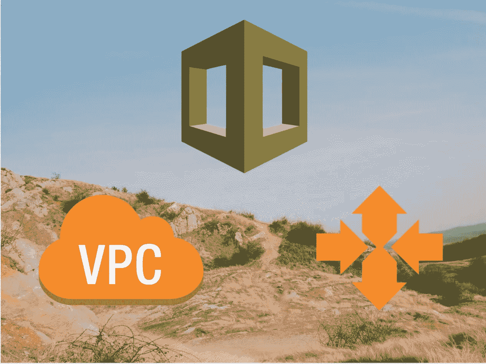
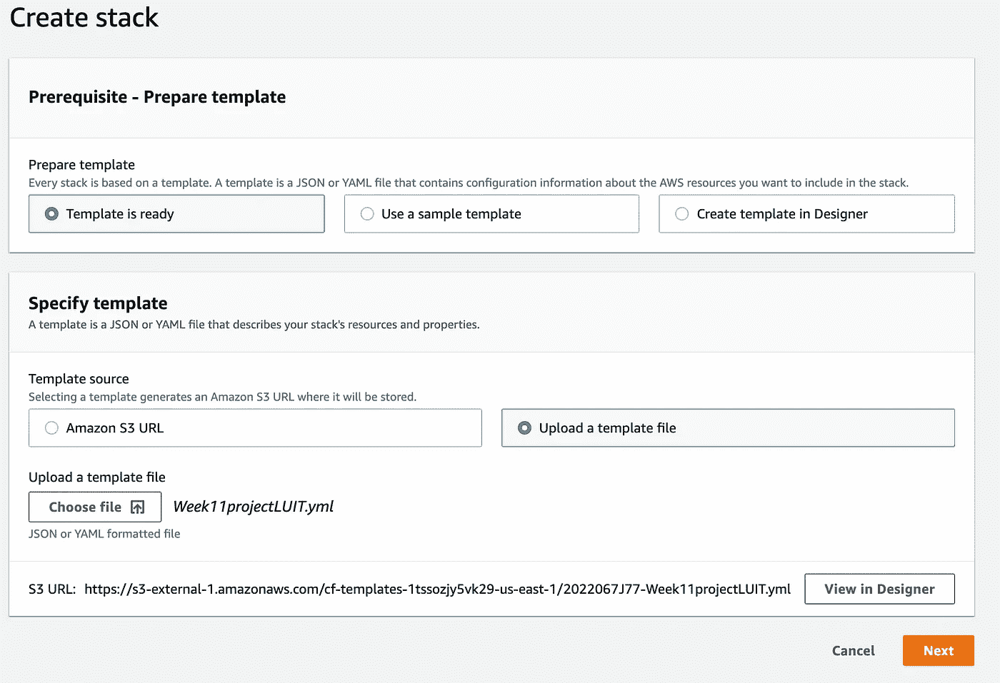
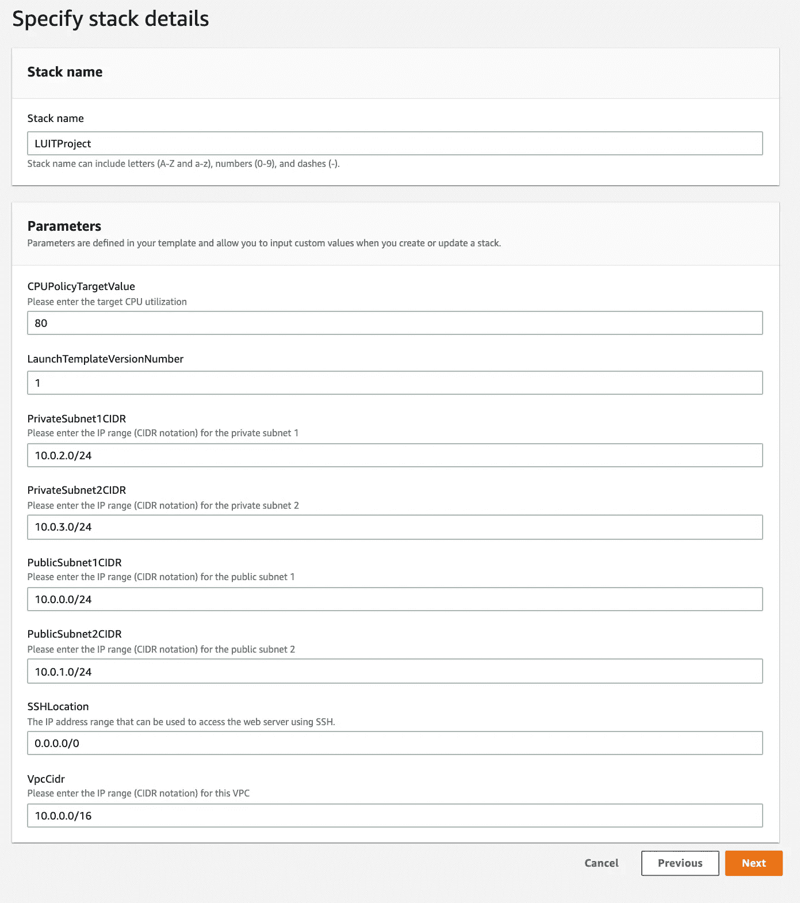
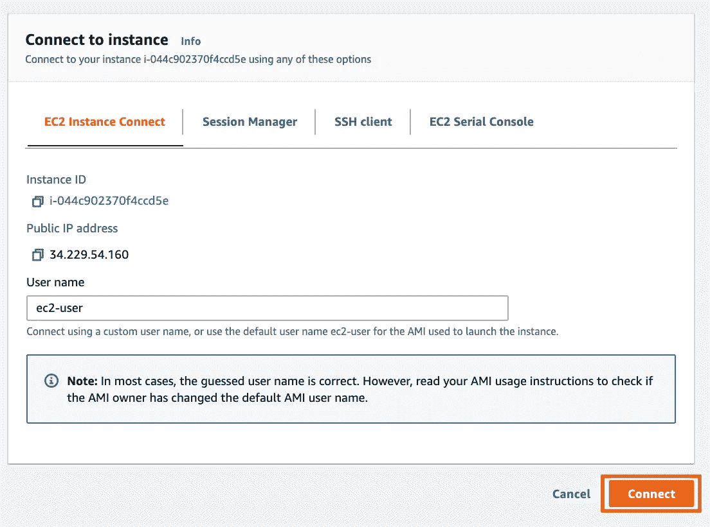

# 如何在 CloudFormation 中创建 VPC 和自动缩放组

> 原文：<https://blog.devgenius.io/how-to-create-a-vpc-and-auto-scaling-group-in-cloudformation-e3211b8ded5a?source=collection_archive---------4----------------------->



CloudFormation 是 AWS 提供的一项服务，它允许您以代码的形式提供基础设施。通过 CloudFormation 模板可以轻松创建资源，实现无缝自动化。

本教程将提供一个云形成模板，可用于创建一个 VPC 和自动缩放组。VPC 将包括两个公共和私有子网，以及一个允许通过互联网访问 EC2 实例的互联网网关。自动缩放组配置有最少两个、三个所需实例和最多五个实例。Auto Scaling 组的启动模板由 EC2 实例和用户数据组成，用于安装 Apache Web 服务器和压力工具。

**先决条件:**

*   完成本教程需要一个 AWS 帐户。
*   代码编辑器，如 Visual Studio。

**第一步:保存云形成模板**

将下面的 CloudFormation 模板以. yml 文件的形式复制并保存在您的计算机上。

**第二步:创建云形成堆栈**

在 AWS 控制台中，导航到 CloudFormation 仪表板。点击**创建堆栈。**

选择**模板就绪**选项。

在模板源下，选择**上传模板文件。**上传您在上一步中创建的 YAML 文件。

点击下一个的**。**



输入一个**堆栈名**。

默认情况下，自动扩展组的 CPU 目标跟踪利用率设置为 80。这可以调整或保持不变。这是目标跟踪策略的扩展指标。将根据此指标添加或删除容量。

滚动到底部并点击下一个的**。**



在配置堆栈选项页面上，点击下一个按钮**。**

在查看页面上，点击**创建堆栈**。

资源将需要几分钟的时间来调配。等待堆栈完成，然后继续执行步骤 3。

**步骤 3:压力测试 EC2 实例**

*堆栈创建完成后，再等几分钟，Apache Web 服务器和压力测试工具就会安装完毕。*

导航至 EC2 仪表板。

**点击**实例查看您的实例。

选中其中一个新创建的实例旁边的框，然后单击**连接**。


因为没有创建 KeyPair，所以您将使用 EC2 Instance Connect 连接到 EC2 实例。

点击**连接**。



由于压力工具是在引导时安装的，因此您可以使用以下命令运行该实用程序:

```
stress --cpu 80 --timeout 20000
```

对其他 EC2 实例重复上述步骤。

自动缩放组的默认冷却时间为 300 秒。五分钟后，您的自动扩展策略将生效，并将启动其他实例。