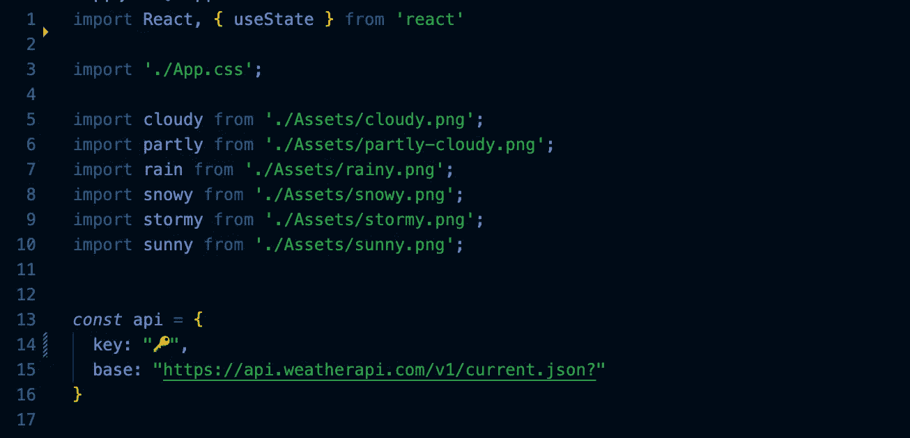
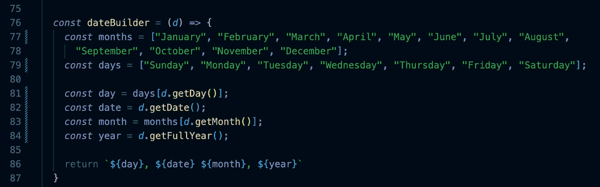
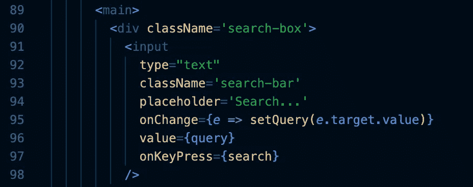
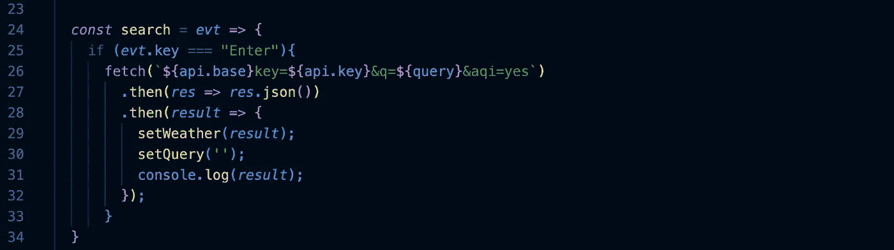
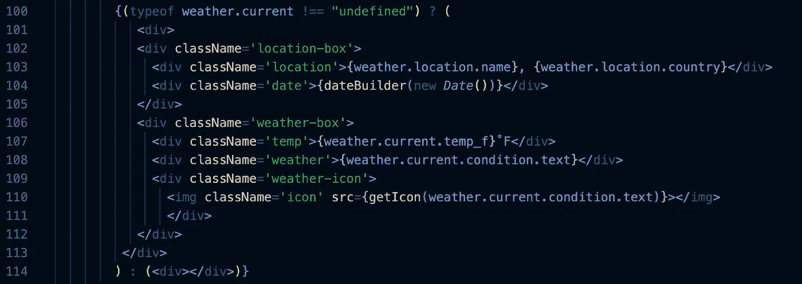
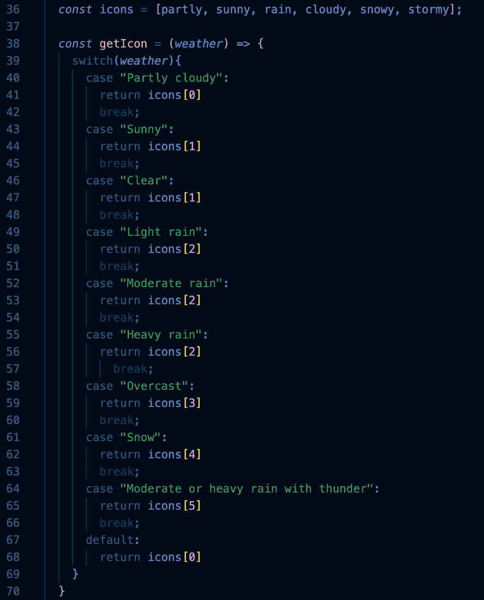
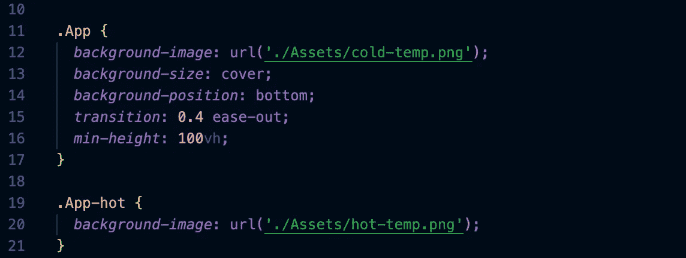

# 如何创建一个带有动态图标和背景的天气应用程序🌦

> 原文：<https://blog.devgenius.io/how-to-create-a-weather-app-with-dynamic-icons-and-background-380bb6bb77cd?source=collection_archive---------0----------------------->

天气应用程序的制作相对简单，所以让我们根据温度改变背景，根据天气情况改变图标，让它变得更有趣一些。让我们开始编码吧！👩‍💻

## 第一步:就位——把所有东西放在一起

阅读文档！我不能告诉你我在这个项目上损失了多少时间，因为在发现我使用的第一个需要纬度和经度之前，我没有阅读文档。没人有时间做这个。幸运的是，我找到了一个基本上可以接受任何内容的查询。这是我用过的:[https://www.weatherapi.com](https://www.weatherapi.com)(免费的！)

现在准备你想要的背景和天气图标。我做了自己的背景，但是我的图标是从 Figma 上弄来的。有兴趣的话下面是链接:[https://www . fig ma . com/file/xboq 9 zsat 4 chxuufea 1 kaq/磨砂玻璃-天气-图标-Figma？node-id=7%3A8](https://www.figma.com/file/xBOq9zsAT4CHXUUFEA1KAq/Frosted-Glass-Weather-Icons-Figma?node-id=7%3A8)

## 第二步:现在我们开始

这将包括 React 中的 useState 和天气图标。我们不需要弄乱背景，那会在后面出现。完成后，创建一个名为“api”的常量，我们将在这里存储 api 键和 api 调用的第一部分。

现在我们将声明并设置 useState。为 query 和 setQuery 声明一个 const，它们将被设置为 useState，并且将是空字符串(目前)。创建另一个 const，这次称为 weather 和 setWeather。这些也将被设置为 useState，但它们将是对象。

## 步骤 3:(可选)创建一个日期生成器

这完全是可选的，与天气无关，但如果你感兴趣，这是我的代码。

## 步骤 4:创建搜索栏

制作一个输入标签。将类型设置为 text，确保给它一个类名。如果愿意，可以添加一个占位符。将 onChange 设置为" e => setQuery(e.target.value)"，该值将被设置为 Query。设置按键搜索，我们将编码下一个。您的代码应该如下所示:

创建一个将事件作为参数的函数“search”。如果 event.key 等于“Enter ”,则使用我们之前创建的 api 常量为您的 api 获取适当的调用。它会因 api 的不同而不同，所以请阅读文档以了解它是什么。现在我们要做 2”。然后“陈述。第一个将接受 res 并返回 res.json，第二个会更复杂。我们将获取结果，并将天气变量设置为 result，将 setQuery 重置为空字符串，并 console.log 结果以确保一切顺利。

## 第五步:制作天气版

为温度添加一个 div，给它一个类名，根据文档，从天气中调用温度。做同样的天气条件，即。“部分多云”、“阴天”等。现在天气图标，将其设置为图像(不要像我一样是个傻瓜，忘记这样做，然后想知道为什么它不工作)。src 将被设置为 getIcon(我们接下来将这样做)，天气条件作为参数。

现在来制作 getIcon 函数。我建议为图标做一个数组，让生活变得简单一点。创建以天气为参数的函数。这将是一个简单的 switch 语句。同样，情况将取决于你的 api 如何引用不同类型的天气。提示:打开一张天气图，尝试不同条件的不同地点。这将显示您的案例中是否有任何空白。

## 步骤 6:根据温度改变背景

在 CSS 中，设置。应用到你的一个背景，我选择冷，因为我讨厌出汗。现在创建。App-warm 以区别于其他。

现在来看本质。回到 App.js，在返回的顶部，我们将有一个嵌套的三元组。首先，我们检查天气类型是否是未定义的。如果是这样，检查温度是否高于 75(或您选择的不同的热/冷截止温度)。如果是，显示暖背景，否则显示冷背景。最后，如果天气未定义，将其设置为您的默认背景。如果这还不清楚，这是我的代码:

测试一下，确保一切运行正常。

这里有一个演示视频:[https://www.youtube.com/shorts/6g_pYkoTn58](https://www.youtube.com/shorts/6g_pYkoTn58)

下面是我的 Github:【https://github.com/ReaganADavenport/weather-app】T2

编码快乐！👩‍💻