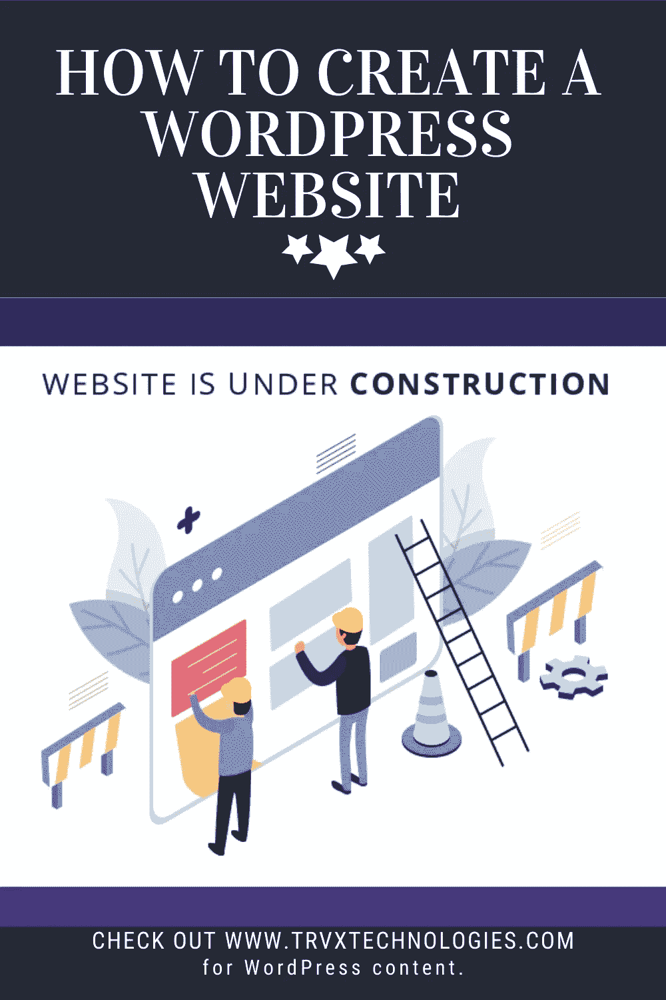

# 如何创建一个 WordPress 网站

> 原文：<https://blog.devgenius.io/how-to-create-a-wordpress-website-266c7476ee60?source=collection_archive---------10----------------------->

# 介绍

网站是帮助你的企业建立强大的在线形象的关键因素之一。在数字世界中，没有网站的企业会失去很多帮助企业发展的机会。万维网比任何形式的广告都有更广泛的影响力。例如，你可以利用社交媒体、博客和点击付费广告项目来帮助你的企业扩张。

网站也很重要，因为它有助于建立商业信誉。一个潜在的客户会在谷歌上查找你的网站，该网站应该提供一张地图和公司所在地的方向，以帮助客户更容易找到公司的位置。

对你的顾客来说，在购买之前了解产品或服务是很常见的。他们只需通过网站上的信息就知道你提供的产品的品牌、特点、尺寸和颜色。您的网站一天 24 小时都是可用和可访问的。因此，你可以接触到全球市场，让潜在客户在方便的时候看到你的产品。

互联网上有很多工具可以帮助你启动网站。**我将解释如何使用 Word Press 工具创建网站**

斯蒂芬·菲利普斯-Hostreviews.co.uk 在 [Unsplash](https://unsplash.com/s/photos/word-press?utm_source=unsplash&utm_medium=referral&utm_content=creditCopyText) 上的照片

# 为什么选择 Wordpress？

我收到的客户最常见的问题之一是:为什么我应该使用 WordPress 而不是其他内容管理系统(CMS)平台。这是一个很好的问题，所以我想为你分析一下使用 WordPress 的好处，希望能帮助你理解为什么我更喜欢使用 WordPress。我还要指出，我指的是 WordPress.org。这也被称为自托管 WordPress。人们经常把这和 WordPress.com 混淆，后者是一种托管服务。

虽然 WordPress 最初是一个博客，但它已经成长为一个完全成熟的内容管理系统。根据最近的一项调查，WordPress 为互联网上 32.3%的网站提供支持。这种受欢迎程度允许大企业，如塔吉特、迪斯尼、索尼等使用这个强大的平台。

使用像 WordPress 这样的网站构建器的一个优点是，它允许你简单地拖放内容来创建你的网站。只需点击几下，你就可以发布你的网站。

我希望我让你相信了 WordPress 是正确的选择。如果你在使用 WordPress 时遇到任何问题，只要打开谷歌，在你的问题后面加上“WP 初学者”就可以了。这将使得在 WordPress 网站上找到你的答案更加容易。

# 创建一个 WordPress 网站包括 5 个主要步骤

1.  域名购买
2.  托管服务器购买
3.  WordPress 安装
4.  WordPress 主题安装
5.  WordPress 插件安装

域名就是你的网站名称。该域名是互联网用户可以访问您的网站的地址。没有域名，你将不得不记住一串数字来访问一个特定的网站。域名的一个例子是:google.com。

域名必须先注册，然后才能使用。这是因为你不能有两个相同域名的网站。由于受可用性的影响，你应该在像 [Godaddy](https://godaddy.com/) 、 [Namecheap](https://namecheap.com/) 等网站上查看你想要的域名的可用性。去购买它们。域名的价格通常在每年 15-25 美元之间。

我会说域名是租来的，而不是买来的。你必须每年更新这个域名，或者你可以连续租用 10 年，然后在到期日之前更新。

# 2.虚拟主机购买

域名只是成功的一半，为了让网站上线，你还需要一个托管服务来托管你的网站。想想你网站上想要的照片和内容。这些文件将需要存储在托管服务。**我将使用 HostGator 来托管 WordPress 站点。**

为了获得技术，WordPress 运行在 PHP/MySQL 上，因此你必须意识到购买一个主机服务器来支持这项技术。大多数运行 linux 服务器的托管服务器都支持它们。

**系统要求**

**托管服务的预期功能:**

*   **电子邮件账户**:获得一个有效的域名后，你的主机服务应该允许你创建域名电子邮件账户。例如，username@yourwebsite.com
*   **FTP 访问**:FTP 的目的是允许你从本地计算机上传文件到你的网络服务器。如果你决定建立自己的网站，你的网站很可能包含 HTML 文件，这样你电脑上的 HTML 文件就可以通过 FTP 安全地传输到网络服务器上。这导致你的网站在互联网上被全世界看到。
*   WordPress 支持:WordPress 是我们将在本文中使用的平台，所以要确保你的网络服务器可以托管 WordPress 网站。

# 3.使用 HostGator 安装 WordPress

HostGator 可以让你在购买主机包时，通过简单的一键操作轻松安装 WordPress。我将在另一篇文章中详细介绍哪个计划适合你，因为我相信这个过程必须经过彻底研究才能满足你的需求。安装 WordPress 有两种方法。

1.  通过 Softaculous 安装 WordPress】我从实际的 HostGator 网站上找到了这个简洁的视频，如果你是一个视觉学习者，它将指导你完成这个过程。

2.手动安装 WordPress
如果你更喜欢通过 HostGator 手动安装 WordPress，看看这个视频 HostGator 的好奇心

# 4.WordPress 主题安装

有成千上万的 WordPress 主题可以提升你的网站的外观和感觉。它们有免费版和付费版。你可能需要尝试不同的主题，直到你找到合适的主题。

第一步是导航到你的 WordPress 管理仪表板。通常导航到你的 WordPress 管理仪表板的 URL 是以下形式的[***http://your websitename com/WP-admin/***](http://yourwebsitenamecom/wp-admin/)*当你在你的管理仪表板中时，导航到**外观> >主题**页面并点击添加新按钮。*

**

*然后 WordPress 会引导你进入下一个屏幕，让你在 WordPress 提供的无数主题中进行选择。我正在使用 Astra 主题，但是我建议尝试不同的主题。*

**

*一旦你找到了你想用于 WordPress 网站的主题，只需**点击“安装”**按钮。这将导致 WordPress 安装你的主题。下一步就是将鼠标悬停在**“激活”按钮上。***

# *5.WordPress 插件安装*

*一旦你安装完 WordPress，每个初学者应该知道的第一件事就是如何安装 WordPress 插件。你可以把 WordPress 插件想象成智能手机上的应用程序。需要为您的网站添加联系表单吗？你可以在 WordPress 插件市场上找到数千个插件。*

*导航回你的 WordPress 管理面板来安装插件。当您在仪表板页面时，导航到**插件>添加新插件。**它看起来应该类似于下面的照片。*

**

*选择符合您需求的插件。一旦你找到你的插件，这和安装一个主题的过程非常相似。点击**‘立即安装’>>‘激活’***

# *结论*

*恭喜你。你已经创建了你的第一个 WordPress。说到 WordPress，有很多东西要学，既然是开源，总有东西要学。我希望这给了你建立你的第一个 WordPress 网站的详细信息。请喜欢并分享。*