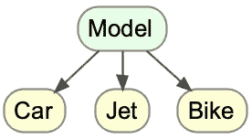
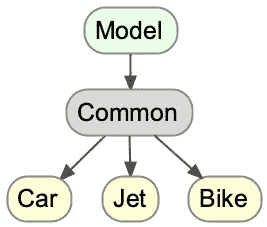

# 如何在 Django 中创建抽象模型类

> 原文：<https://blog.devgenius.io/how-to-create-an-abstract-model-class-in-django-e1e77048b3b7?source=collection_archive---------4----------------------->

# 介绍

Django 定义的抽象基类是什么:

> *“当你想把一些公共信息放入许多其他模型时，抽象基类是有用的。你写你的基类，把 abstract=True 放在元类里。这个模型将不会被用来创建任何数据库表。相反，当它被用作其他模型的基类时，它的字段将被添加到子类的字段中。*

[参观现场](https://docs.djangoproject.com/en/4.0/topics/db/models/#abstract-base-classes)

换句话说，抽象类是拥有公共属性(参数)的类，这些属性可以被其他类继承。

# 密码

在 Django 中创建抽象模型类相当容易！让我们看看下面的例子:



```
from django.db import modelsclass Car(models.Model):
    brand = models.CharField(max_length=100)
    doors = models.PositiveIntegerField()class Jet(models.Model):
    brand = models.CharField(max_length=100)
    wing_type = models.CharField(max_length=30)class Bike(models.Model):
    brand = models.CharField(max_length=100)
```

# 说明

在上面的代码中，我们声明了同一个属性`"brand"`三次。多次声明同一个属性在这里没什么大不了的，但是在更大的项目中，这可能会非常繁琐。

# 解决办法

我们可以使用下面的代码来代替:

```
class Common(models.Model):
    brand = models.CharField(max_length=100) class Meta:
        abstract = True
```

然后，我们可以相应地缩短课程:

```
class Car(Common):
    doors = models.PositiveIntegerField()class Jet(Common):
    wing_type = models.CharField(max_length=30)class Motorbike(Common):
    pass
```

**注意，我们在** `**"Jet"**` **类中添加了** `**"pass"**` **，因为没有属性需要声明。**

现在假设我们想要改变一个继承属性的某个特征，比如`"max_length"`。

我们只需覆盖继承的属性:

```
class Car(Common):
    doors = models.PositiveIntegerField()
    models.CharField(max_length=30)
```

# 结果



```
class Common(models.Model):
    brand = models.CharField(max_length=100) class Meta:
        abstract = Trueclass Car(Common):
    doors = models.PositiveIntegerField()
    brand = models.CharField(max_length=30)class Jet(Common):
    wing_type = models.CharField(max_length=30)class Bike(Common):
    pass
```

# 结论

抽象类非常强大，可以节省我们很多时间，

我们现在已经在 Django 中实现了一个抽象模型类，并且可以在任何需要的地方填充它。

快乐的生产编码！: )