# 如何使用 MongoDB、AWS 和 Docker 创建一个高级的 Discord Bot

> 原文：<https://blog.devgenius.io/how-to-create-an-advanced-discord-bot-using-mongodb-aws-and-docker-eb2d2f21c888?source=collection_archive---------11----------------------->

*了解如何在云上托管一个 discord bot，使用一个数据库来实现完整的 CRUD 功能。*

[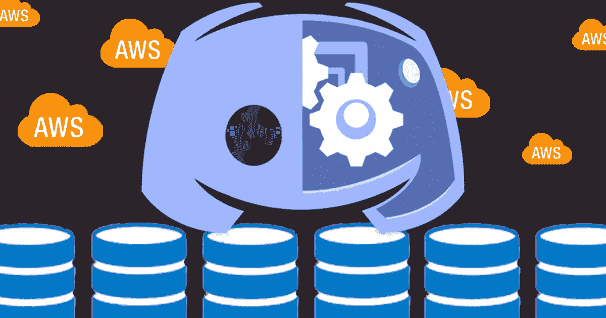](https://github.com/daminals/AdvancedDiscordBot)

查看该项目的 github！

*本文假设您知道如何创建并已经拥有一个简单的 discord bot，并且不会讨论如何使用 discord 开发者门户或设置一个初始 bot。你可以使用* [*这个资源库*](https://github.com/daminals/Simplebot) *中提供的基础不和谐 bot。*

一个高级的 discord bot 需要在这个“simplebot”模板上增加额外的设置和功能来运行更复杂的任务。为了扩展可用性，最重要的功能是数据库，我们将使用 MongoDB，以及永久主机，我们将使用 AWS 和 Docker。

# **步骤 1:配置您的数据库**

前往[mongodb.com/cloud/atlas/register](https://www.mongodb.com/cloud/atlas/register)创建一个新账户。之后你可以安装 [Atlas 命令行界面](https://www.mongodb.com/docs/atlas/cli/stable)。

安装后，到您的终端并输入

```
$ atlas setup
```

Atlas 将提示您使用刚刚创建的帐户登录。授权您的帐户后，它会询问您

```
$ Do you want to set up your first free database in Atlas with default settings (it’s free forever)? (Y/n)
```

输入 Y，给它时间来生成您的数据库

Atlas 还将为您提供一个数据库用户和密码，以及一个连接到您数据库的集群字符串。将此信息输入您的。env 如下

。环境文件

*注意:请务必将这些钥匙放在您的。env 文件，并确保它们不被张贴在任何地方。否则，恶意行为者可能会访问您的数据。*

现在，您已经成功地配置了数据库。

# 步骤 2:附加数据库

要将 MongoDB 附加到您的数据库，我们需要首先安装它。

让我们进入我们的虚拟环境

```
$ source venv/bin/activate
$ pip3 install “pymongo[snappy,gssapi,srv,tls]”
```

现在让我们将数据库连接到我们的机器人！

在 pymongo 中导入

添加 MongoClient，提供新的数据库和集合

现在让我们为我们的不和谐机器人创建一个新的命令，它将更新我们的数据库作为一个测试用例

使用 discord bot 函数创建新的数据库键:值对

用`python3 bot.py`运行它，然后在你的 discord 服务器中检查结果


Bot 报告已提交键:值对

当然，让我们检查一下我们的 Mongo Atlas 集群

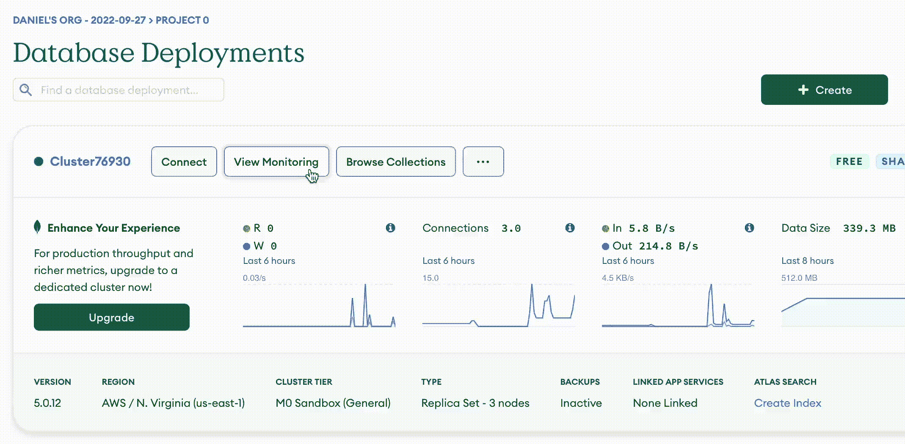

检查云数据库以确保数据通过

最后，在这个菜单中，让我们启用 IP 访问，以便我们的 AWS 主机能够访问我们的数据库

*警告:允许这意味着拥有您的环境变量的用户可以从任何位置连接。确保数据库密钥的安全，否则您的数据可能会暴露。*

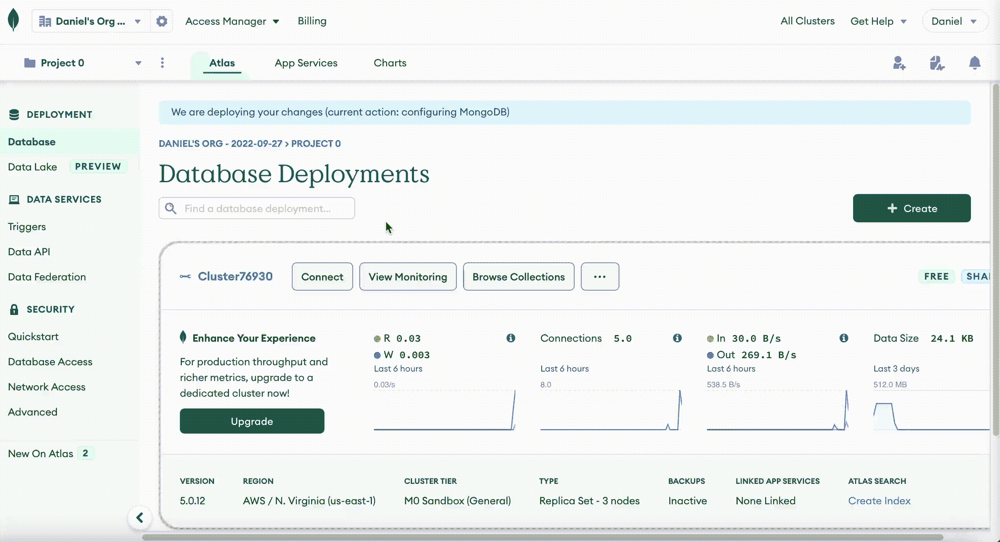

允许所有 IP 连接

# 步骤 3:实现 CRUD 功能

CRUD 指的是“创建、读取、更新、删除”我们将在 bot 命令中实现这些功能，以便它们可以作为我们的 bot 的一个功能来使用

## **创建**

让我们更新我们的创建函数。到目前为止，它只存储键:值对，让我们存储不一致的用户 id，以便我们可以很容易地引用命令的作者

好吧，让我们再次运行我们的函数，看看会发生什么！

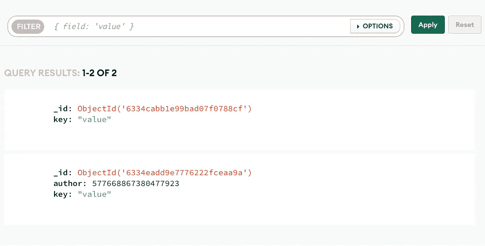

Author 现在是一个键，Discord 用户 ID 是一个值

## 阅读

让我们允许用户读取他们插入到数据库中的密钥

读取功能


有用！

成功！

## 更新

为了更新数据，我们不应该把它作为一个独立于 create 的功能。我们想要一个无缝的用户体验，他们可以简单地添加新的键到现有的数据点，或者创建一个新的，如果它不存在。所以让我们跳回我们的创建函数

正如你所看到的，函数很快变得有点复杂，所以让我们来分析一下这里发生了什么。

首先，我们查询数据库，看看作者是否有任何记录(第 3 行)。如果有，则更新它们的记录，并使用 set 函数“$set”来添加这个新键或更新数据库中现有的键。否则，像前面一样运行 create 函数。

现在让我们来测试一下

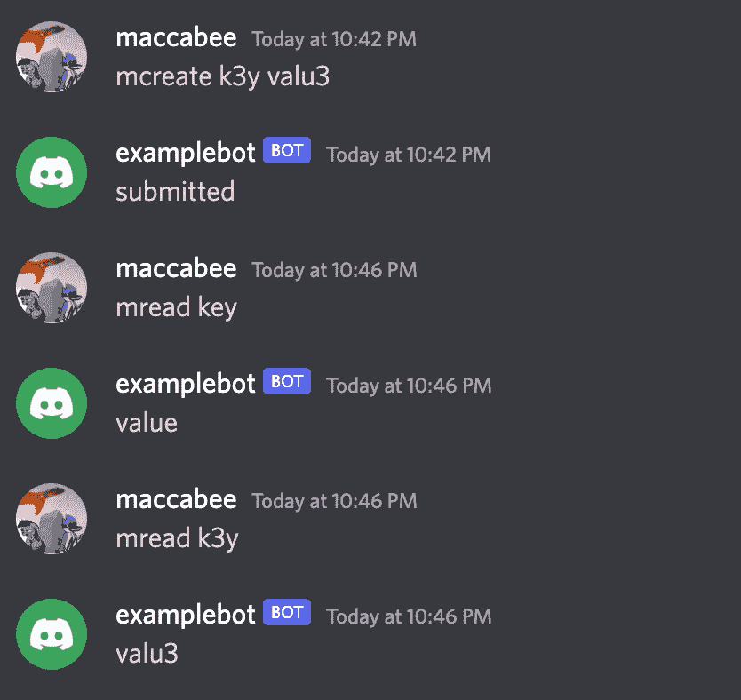

我们的数据库能够为我们的用户保存多个密钥

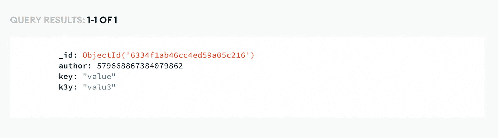

更新的数据库对象

## 删除

对于删除，我们的函数有两个潜在的含义。我们可以删除整个对象，也可以删除特定的键:值对。在本教程中，我们将两者都做

要删除特定的键:值对，让我们创建一个名为 remove 的新函数

这里，该函数使用$exists 操作来检查用户请求的键是否存在。如果是，使用$unset 操作删除该键。如果不存在，将该信息报告给用户

最后，让我们设置删除整个用户对象的函数，并将其命名为 delete

这里的代码与我们的 remove 函数几乎相同，但是我们使用了 delete_one api 调用，而不是一个未设置的操作

# 步骤 4:连接到云

既然我们已经有了一个全功能的 CRUD discord bot，我们的最后一步就是把它推到云端，而不是在你的个人设备上运行。

我们将使用 Docker 和 AWS 来实现这些目标

## 码头工人

Docker 是一个操作系统虚拟化工具，这意味着它在您的本地环境之上模拟一个特定的环境。这意味着不管你写什么代码，如果你把它 Docker 化，你可以在任何机器上用 Docker 运行它

这就是为什么我们将使用 Docker 来推送 AWS。

你可以从这里安装 Docker:【https://docs.docker.com/get-docker/ 

Docker 利用名为“Dockerfile”的文件类型来设置其环境。我们的应该是这样的:

用你的项目所在的目录名替换<yourrootfoldersname></yourrootfoldersname>

这是我们完整的文档。

它首先用 Python3.7 安装一个基本的 linux 操作系统，将我们的当前目录设置为工作目录，安装我们需要的模块，然后运行 discord bot。

到目前为止，我们只有一个问题，那就是我们的需求文件是空的。现在让我们用`pip3 freeze > requirements.txt`来解决这个问题

现在，我们可以通过在本地运行 dockerization 来测试它是否成功。运行`docker build -t examplebot .`来构建我们的容器，运行`docker run --env-file .env examplebot`。

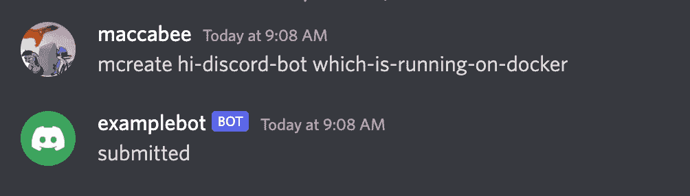

不和谐机器人正在我们的 docker 容器上本地运行

## 自动警报系统

在 aws.amazon.com[报名或登录](http://aws.amazon.com)。

至此，您将需要下载 AWS CLI 工具。

*您可以从*[*https://docs . AWS . Amazon . com/CLI/latest/user guide/install-CLI v2 . html*](https://docs.aws.amazon.com/cli/latest/userguide/install-cliv2.html)下载 AWS CLI

我们将创建一个新用户从您的控制台登录。打开[console.aws.amazon.com/iamv2](http://console.aws.amazon.com/iamv2)并用私钥创建一个新用户

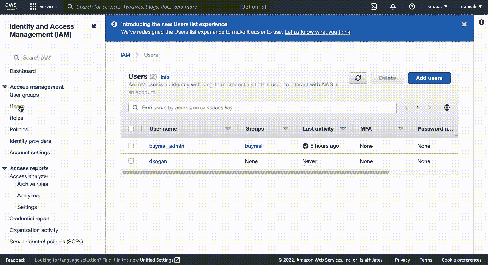

添加新用户

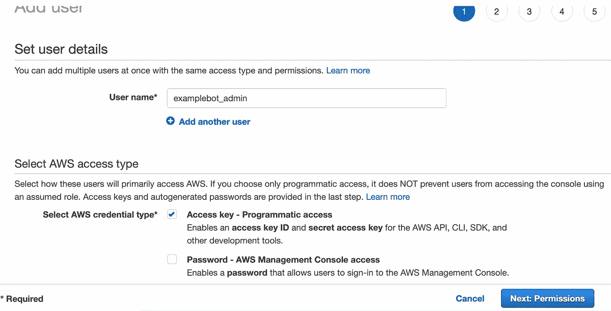

步骤 1:创建新用户

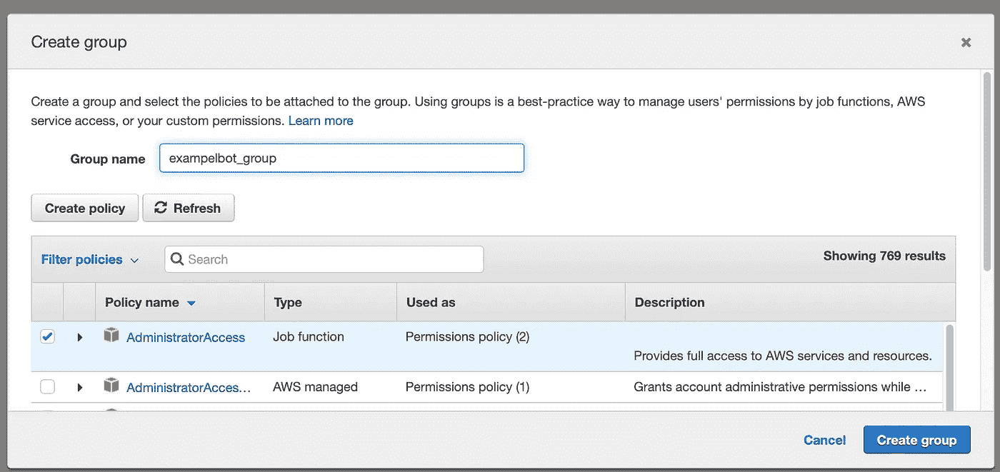

步骤 2:创建新组

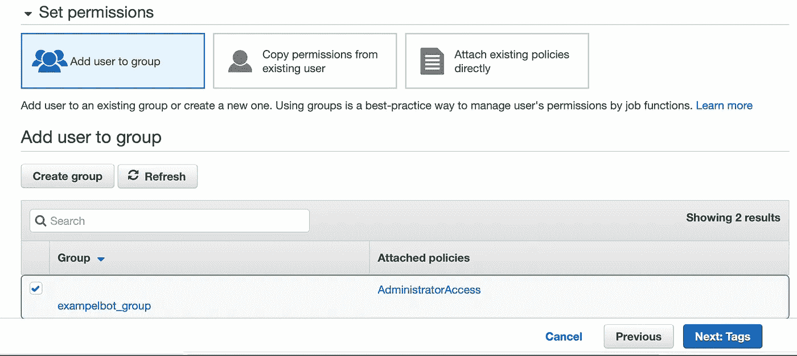

步骤 3:将用户添加到组中

*对于步骤 4，您可以跳过标签，我们不会添加任何标签。然后点击创建用户*

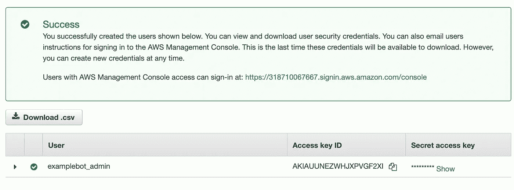

步骤 5:获取 API 密钥

太好了！现在去你的终端输入`aws configure`

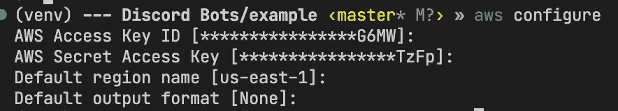

您可以将访问 ID 密钥和秘密访问密钥复制并粘贴到 AWS 配置中

CLI 连接到您的 AWS 帐户，我们将能够将我们的更改和 docker 映像推送到平台。

去[console.aws.amazon.com/elasticbeanstalk](http://console.aws.amazon.com/elasticbeanstalk)创建一个新环境

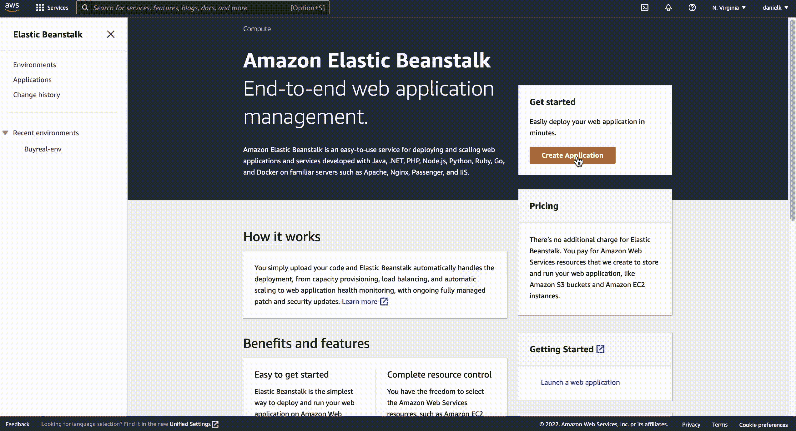

配置新的弹性 Beanstalk 环境

别忘了选择 Docker 配置！

在给环境几分钟的生成时间后，我们将在您的根目录下运行一些命令，然后一切就绪

```
$ pip3 install awsebcli
```

这将安装弹性豆茎(EB) cli

```
$ eb init
```

这将初始化一个本地 EB 存储库。

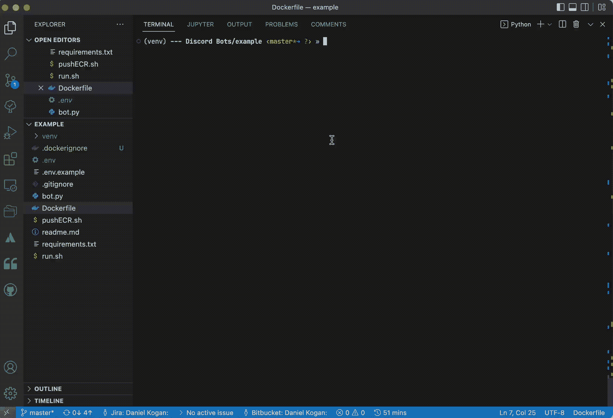

选择您的本地区域和远程环境

```
eb setenv `cat .env | sed '/^#/ d' | sed '/^$/ d'`
```

这将从您的。env 到弹性 Beanstalk 实例

```
eb deploy
```

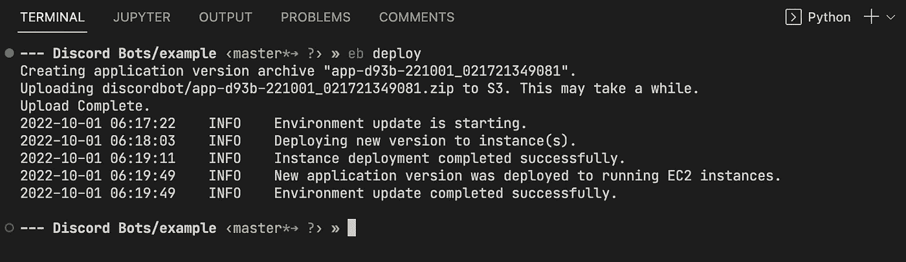

跳到 discord 来验证机器人正在工作

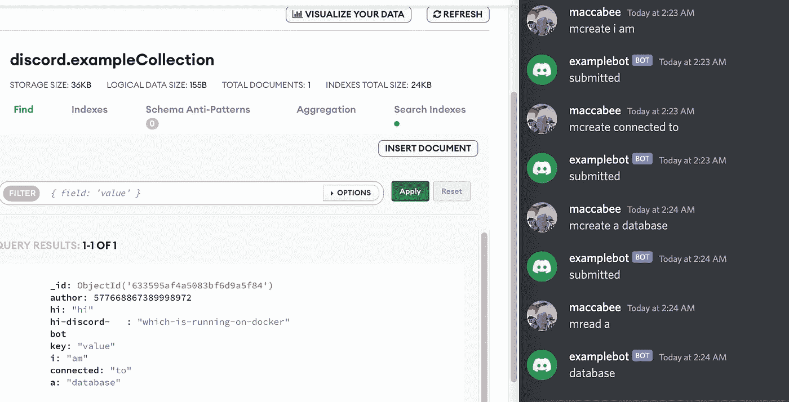

有用！

# 结论

恭喜你！现在，您有了一个连接到数据库并托管在云上的 discord bot！

本教程旨在帮助你建立一个基本的不和谐机器人，你可以扩展它来满足你的目标。有了数据库，你可以创建更加复杂的机器人，可以创建定制的用户/服务器设置，个性化的功能，等等。利用 AWS 托管可以减轻您的负担，让您专注于开发新功能，而不是维护 24 小时服务。

你可以在[本报告](https://github.com/daminals/AdvancedDiscordBot)查看本教程编写的所有代码

[](https://github.com/daminals/AdvancedDiscordBot) [## GitHub-da minals/advanced discordbot

### 此时您不能执行该操作。您已使用另一个标签页或窗口登录。您已在另一个选项卡中注销，或者…

github.com](https://github.com/daminals/AdvancedDiscordBot)