# 如何创建 Apple Card 支付拨号

> 原文：<https://blog.devgenius.io/how-to-create-an-apple-card-payment-dial-bdbae4017c21?source=collection_archive---------14----------------------->

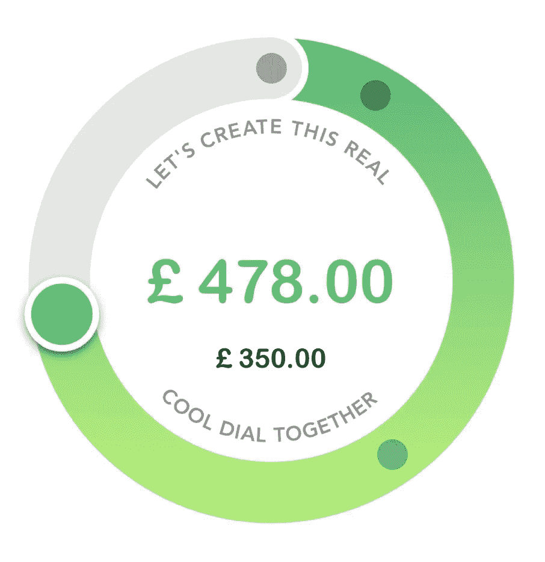

当苹果推出 Apple Card 时，我真的很喜欢你可以用表盘付款的方式。我问自己，我该如何发展它？

所以去年，我就这么做了，但什么也没做。

与其在我的项目文件夹中收集虚拟的灰尘，我现在想与你分享它。

我将把这个系列分成五个部分:

第 1 部分—表盘的接口。

[第 2 部分](https://medium.com/@hayder_41070/how-to-create-an-apple-card-payment-dial-part-2-ad056b8cf572) —表盘文字或如何在曲线上绘制文字。

[第三部分](https://medium.com/@hayder_41070/constraint-the-thumbs-center-to-it-s-super-view-how-to-create-an-apple-card-payment-dial-part-3-eb1e670ec49c) —用户互动。

[第四部分](https://medium.com/@hayder_41070/how-to-create-an-apple-card-payment-dial-part-4-c31342450c98) —基于用户交互的界面更新。

[第 5 部分](https://medium.com/@hayder_41070/how-to-create-an-apple-card-payment-dial-part-5-7b0b508c8a0f) —可访问性。

我想提一下，我在英国，不能使用 Apple Card Wallet 应用程序。所有的工作都是基于苹果公司分享的图片和视频的近似值。我也不知道你会怎么称呼这个界面元素，所以我只是把它称为一个表盘！

**假设**

在本系列中，我将假设您熟悉 Xcode 和 Interface Builder，并且对 Swift 有所了解。

说完了，让我们开始吧。

# 第 1 部分—拨号接口

使用 iOS 单视图应用程序模板创建一个新的 Xcode 项目。我把我的项目叫做 *PaymentDial。*

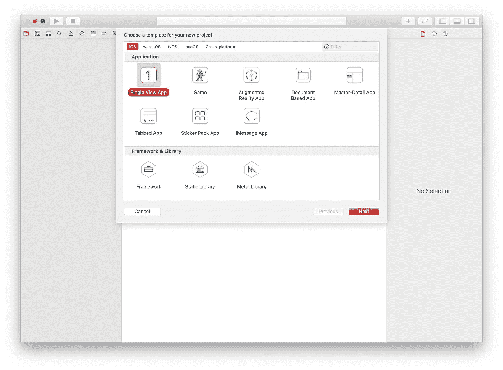

我是 Interface Builder 的忠实粉丝，如果我能在那里建立并运行一个自定义视图，我不会写一行代码。

创建一个新的 **Cocoa Touch 类**并将其命名为 *PaymentDialView* 。

创建一个新的 XIB 资源文件，也将其命名为 *PaymentDialView* 。

在左侧的**文档轮廓**窗格中选择**文件的所有者**。

> 如果在 Xcode 中看不到**文档轮廓**，打开*编辑器*菜单，选择*文档轮廓*。

选中**文件的所有者**后，打开右侧**检查器**窗格中的**自定义类**检查器，并将类设置为`PaymentDialView`。

> 如果看不到**检查员**窗格，打开*查看*菜单，然后进入*检查员*子菜单，选择*显示检查员*。

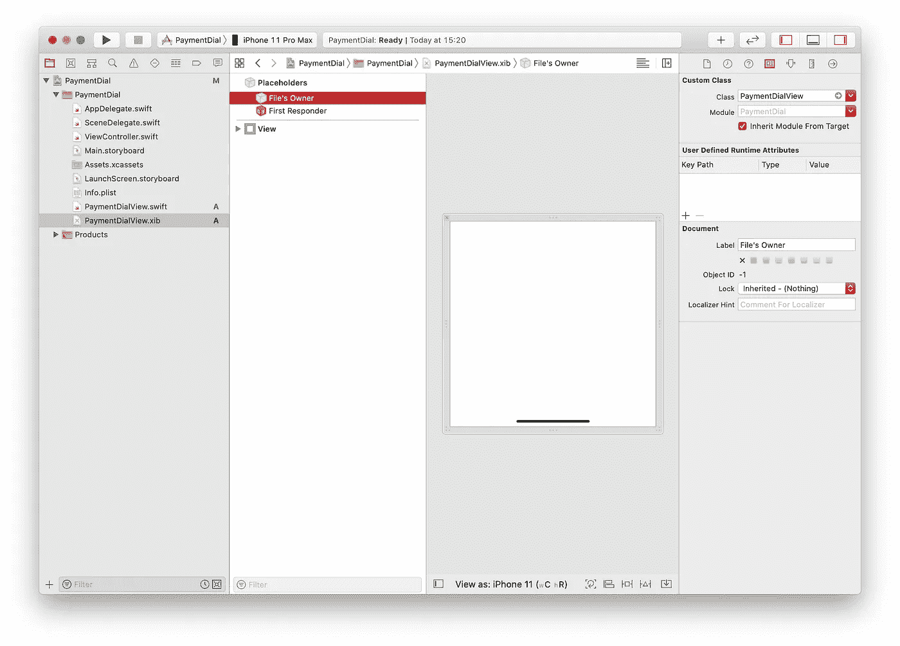

转到右侧**检查器**窗格中的**文件**检查器，取消勾选“使用安全区域布局指南”。

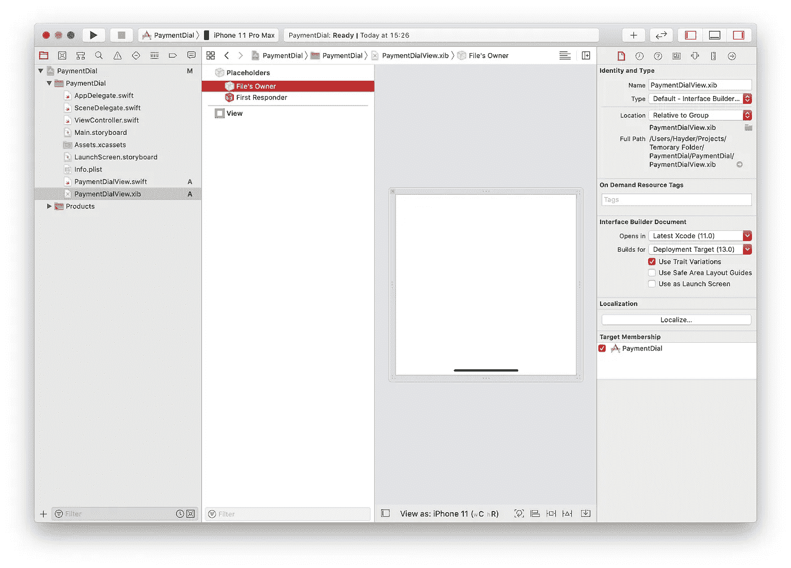

在左侧的**文档轮廓**面板中选择顶视图。使视图成为正方形。我的尺寸是 414 x 414，只要是正方形，你选择什么尺寸都没关系。

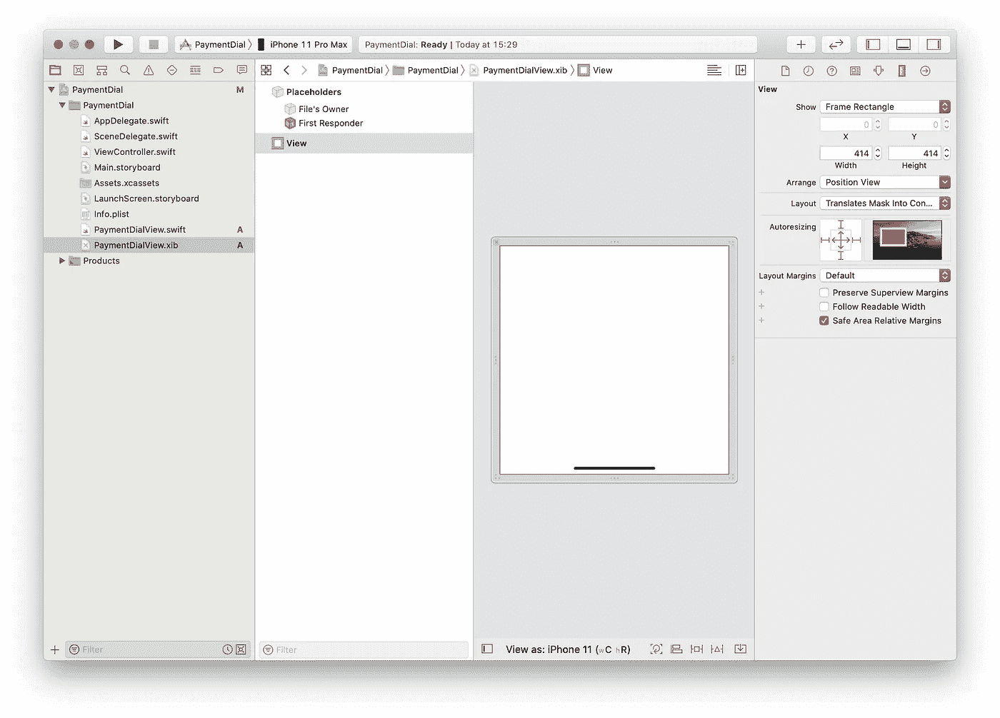

将一个视图添加到主视图中，并通过将它的所有约束设置为 5，将它固定到它的 superview。将**文档轮廓**面板中的视图标注为*表盘体*。

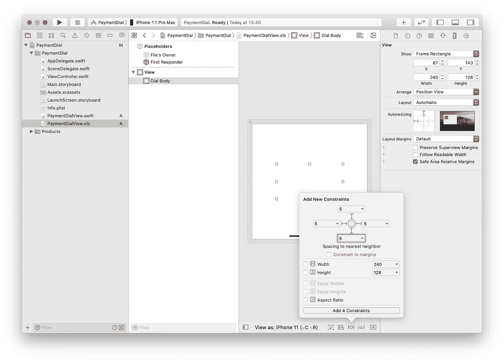

将*表盘主体*的背景颜色设置为十六进制值`#E6E5E6`或红色 230、绿色 229 和蓝色 230。

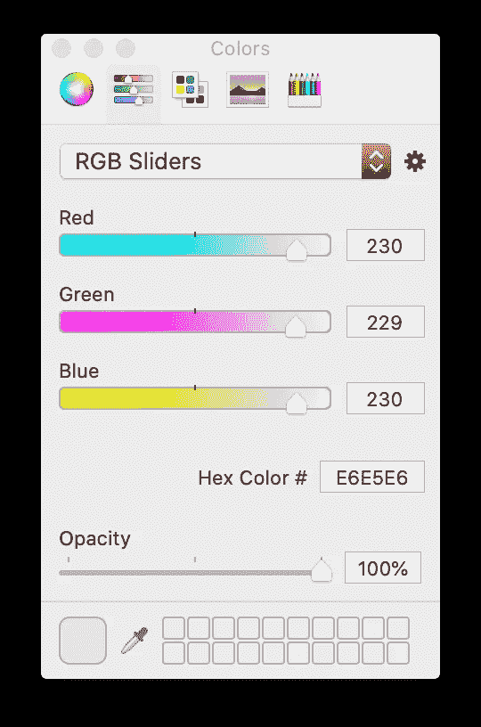

添加一个新的视图到主视图*而不是*到*表盘主体*，通过设置它的所有约束到 51 将其固定到它的超级视图。将**文档轮廓**面板中的视图标记为*文本视图*。

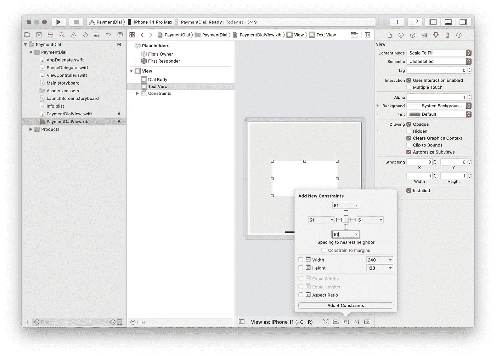

现在让我们在刚刚创建的*文本视图*中添加两个标签。第一个标签我们将在文本视图中居中，并将其字体设置为 *Ariel Round MT Bold* ，这是我发现的最接近的字体，看起来像 Apple Card 支付表盘中使用的字体。将字体大小设置为 45.0。将标签命名为*余额标签*，并将其文本值设置为 **128.00** ，可以随意使用您选择的货币。将该标签的约束设置为**在容器**中水平对齐和**在容器**中垂直对齐，两者的值都为 0。将标签的文本颜色设置为十六进制值`#E48072`或红色 228、绿色 128 和蓝色 114。

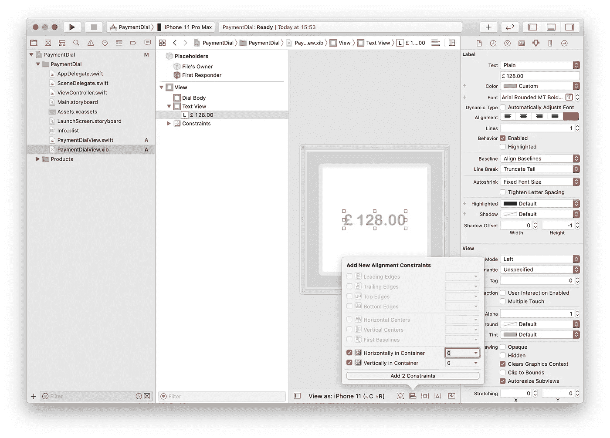

在前一个标签下面添加第二个标签，命名为*资助标签*。将字体设置为 *Ariel Round MT Bold* ，大小为 20。将文本颜色设置为黑色，并将文本值设置为 **5.00** 。关于其约束，用值 20 将它的顶部固定到*平衡标签*的底部，并添加一个值为 0 的**在容器**中水平对齐约束。

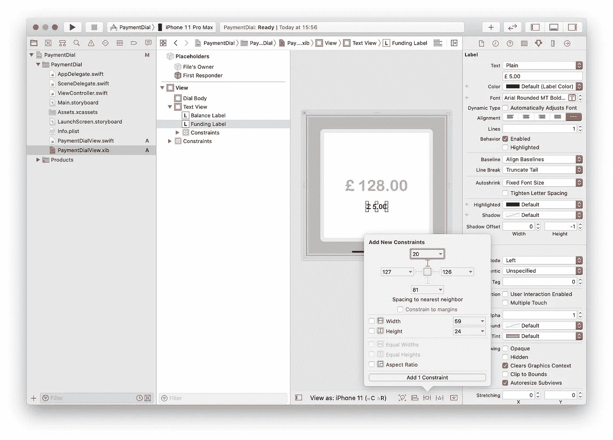

现在让我们定义一下我们的`IBOutlet`,你可以打开右边的编辑器，控制拖动每个视图，或者把它打印出来，然后在界面构建器中连接它们。

回到`PaymentDialView.swift`，我们需要在类被实例化时加载 nib。我们通过创建一个通用的初始化器`commonInit()`来做到这一点，每当`UIView`的初始化器之一被调用时，get 就会被调用。

为了获得一个圆形视图，我们需要更新`dialBody`和`textView`各自图层上的`cornerRadius`属性。我们通过向`PaymentDialView`添加以下代码来实现这一点:

现在让我们将我们的视图添加到 **Main.storyboard** 中。打开 **Main.storyboard** 并在**视图控制器**中添加一个空视图。将添加的视图设置为正方形，前后各 20 点，勾选“长宽比”(我们的目标是 1:1 的长宽比)。这样，我们的视图将正确地呈现在所有的肖像或*紧凑型*大小的类尺寸上。通过将视图的约束设置为**在容器中水平对齐**和**在容器中垂直对齐**，将视图居中，两者的值都为 0。
打开右侧 Inspector 面板中的**身份检查器**，将视图的*类*更改为`PaymentDialView`。

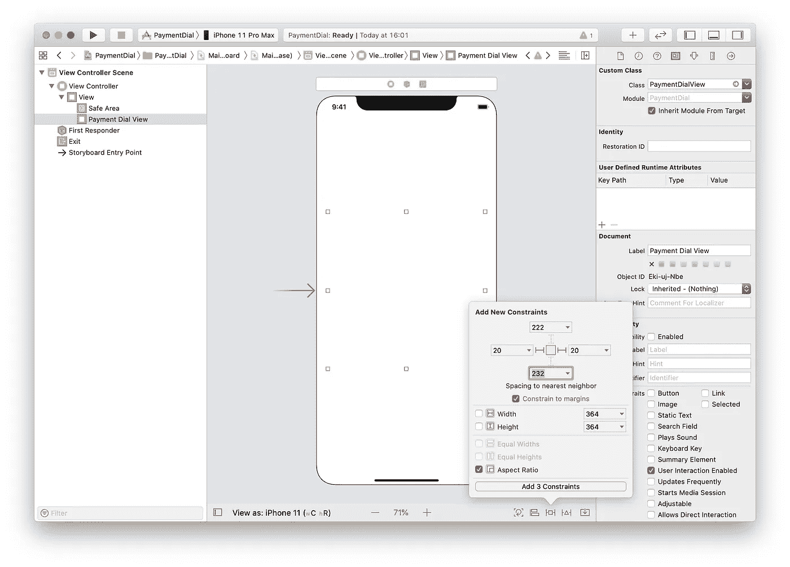

最后，让我们运行这个项目，看看我们的视图是如何工作的。模拟器应该是这样的。

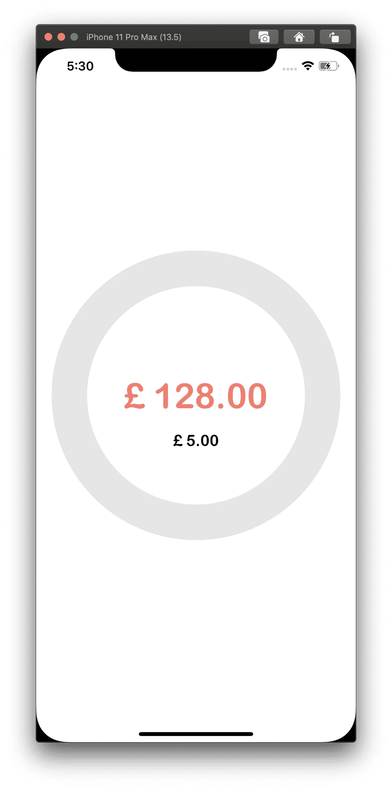

# 奖励材料

我们将视图添加到视图控制器的最后一个 Xcode 截图看起来是空白的，尽管它里面有一个视图，并且运行项目以查看最终结果是正常的。比我挠下巴花的时间还少。但是，如果我能在界面构建器中看到我的视图，会怎么样呢？这正是我们现在要做的。

让我们回到`PaymentDialView.swift`，将`@IBDesignable`添加到我们类声明的开头，如下所示:

```
@IBDesignable class PaymentDialView: UIView {
```

`@IBDesignable`让我们*界面构建器*实例化视图，并直接在画布上绘制视图的副本。
返回 **Main.storyboard** ，您应该会看到以下内容:

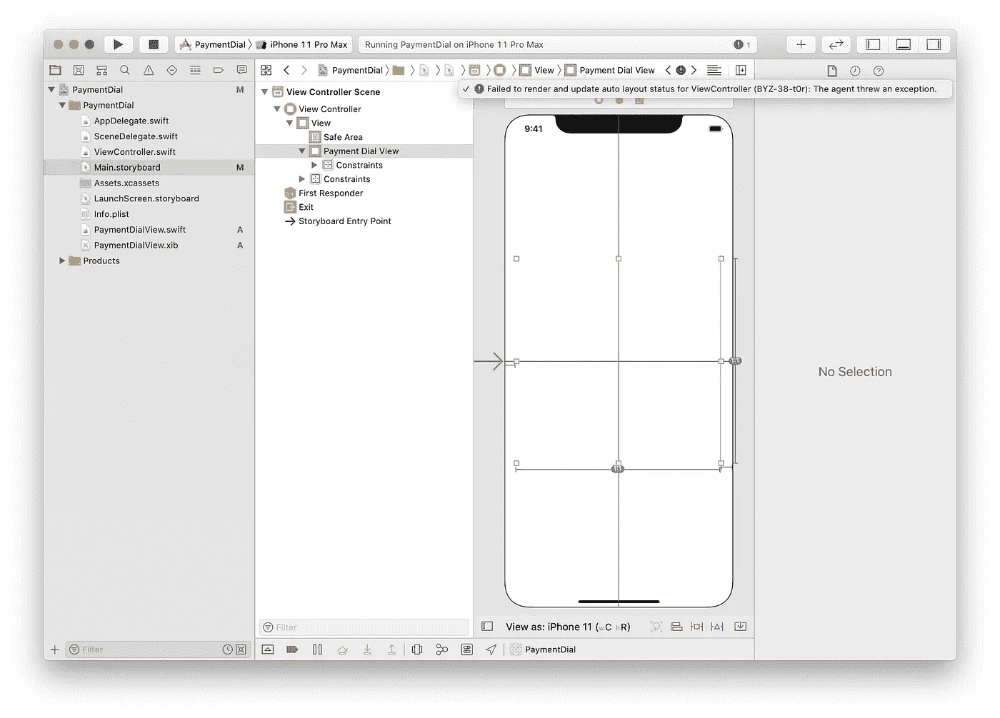

你会得到一个错误，指出一个*“代理抛出一个异常。”*搜网找答案，看*ibdesignableagent-iOS*日志，*ibdesignableagent*无法正确打开@IBOutlet 的，听起来好像无法正确加载我们的笔尖！这个问题的出现似乎是因为代理*ibdesignableagent*有自己的 *main* 包，当加载指向`Bundle.main`的代码时，它找不到视图。
幸运的是，修复是微不足道的。我们需要在`commonInit()`中更新我们的 nib 加载，通过执行以下操作让它知道正确的包在哪里:

我们在 **Main.storyboard** 中的视图控制器现在应该是这样的:

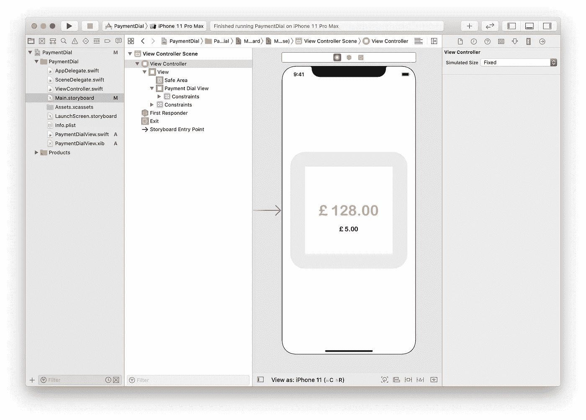

你会注意到视图仍然不是 100%正确。我们需要让*界面构建器*知道视图需要一些更新。为了在试图呈现视图时与*界面构建器*交互，向`PaymentDialView`类添加以下函数:

如果没有进入*编辑器*菜单并选择*自动刷新视图*，视图应该会自动刷新。你的 **Main.storyboard** 应该是这样的:

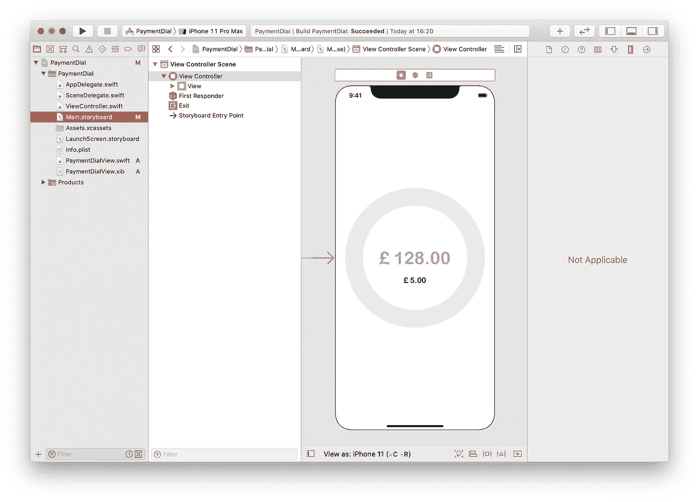

文本标签呢？如果我们可以直接从故事板中更新它们，而不是去查看视图的 nib 文件，这不是很酷吗？这正是我们接下来使用`@IBInspectable` s 要做的。
转到`PaymentDialView.swift`并添加以下属性:

转到 **Main.storyboard** ，在右侧**检查器**窗格中打开**属性**检查器。在顶部你会看到一个名为*支付拨号视图*的新部分，有两个文本字段。更改*平衡*文本字段的值，视图的`balanceLabel`将更新为新的字符串。

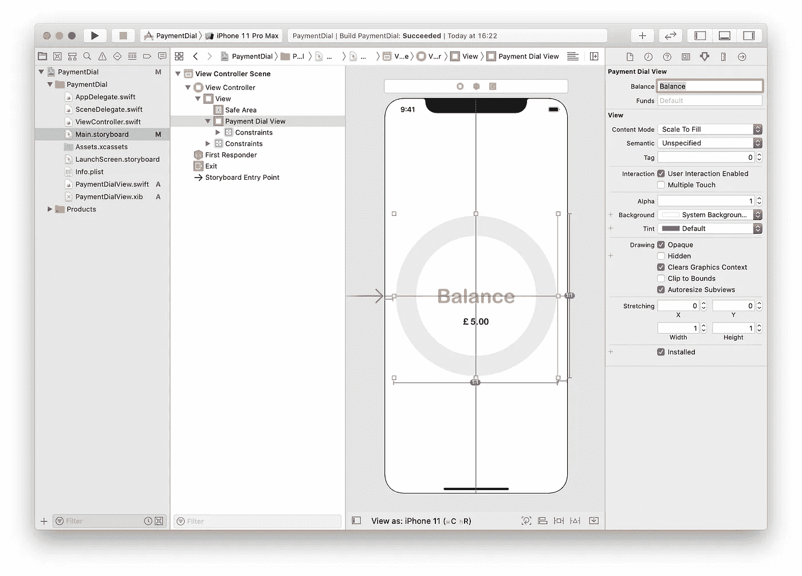

你可以从 [github](https://github.com/h4yder/PaymentDial) 下载代码。

第二部分见，我们将在视图中添加弯曲文本。