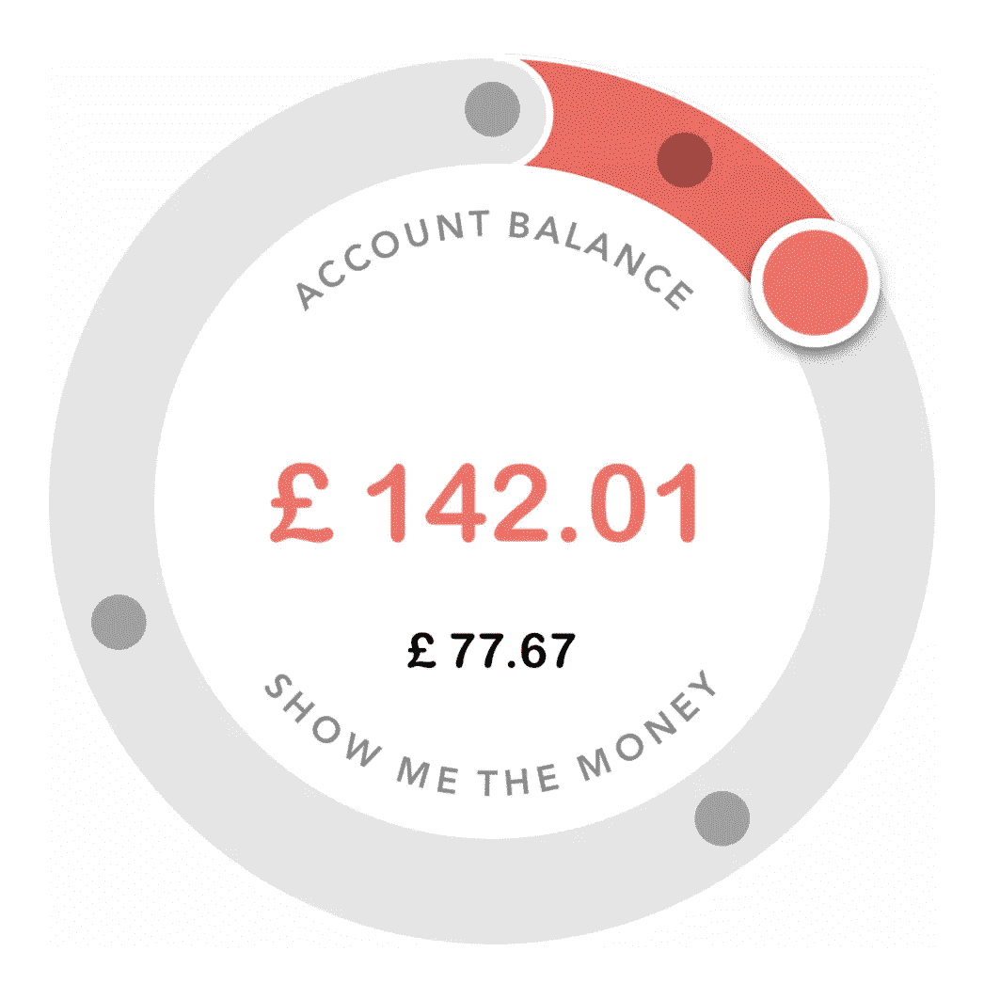
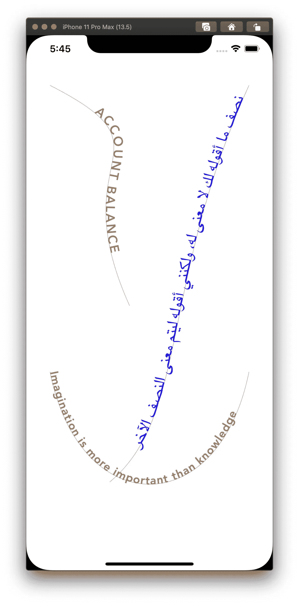
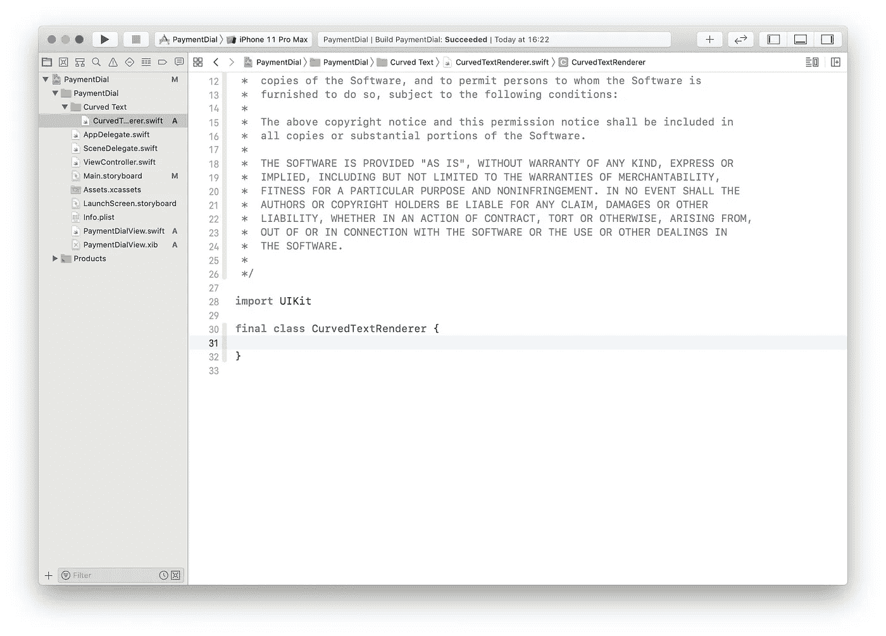
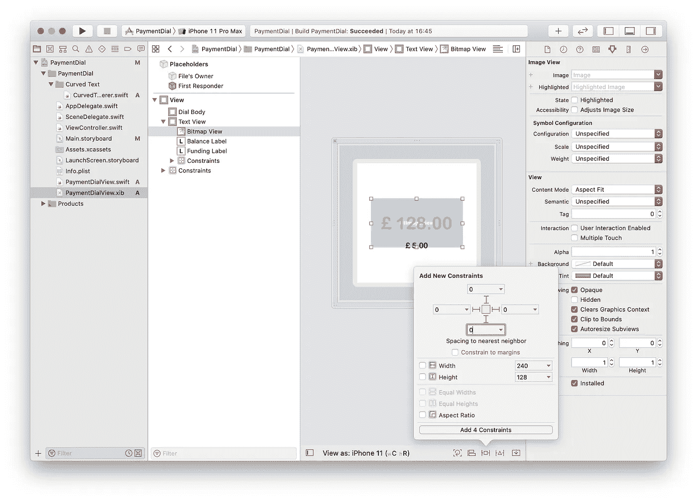
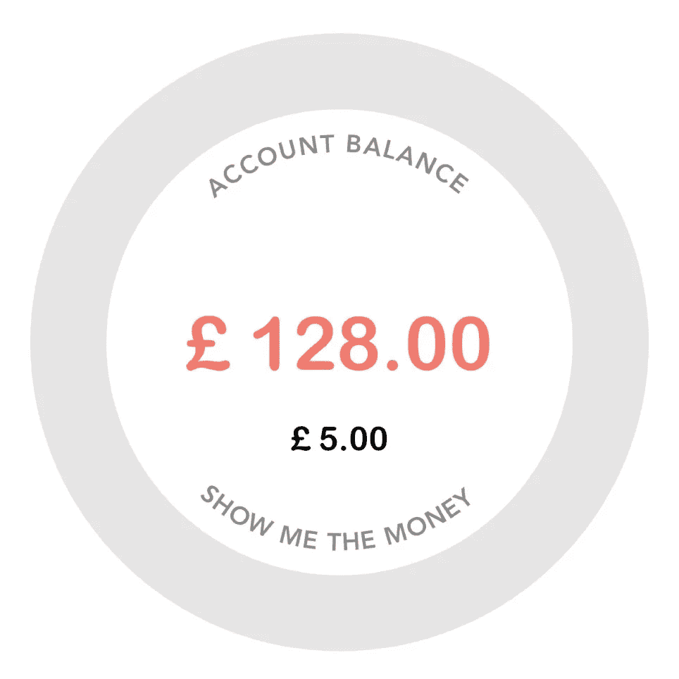
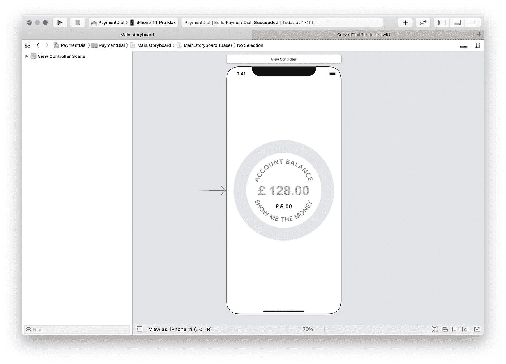
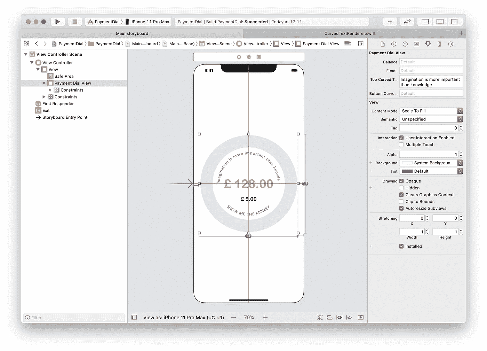

# 如何创建 Apple Card 支付拨号——第 2 部分

> 原文：<https://blog.devgenius.io/how-to-create-an-apple-card-payment-dial-part-2-ad056b8cf572?source=collection_archive---------16----------------------->

**表盘上的文字以及如何在曲线上绘制文字。**

在本系列的第 1 部分中，我们设计了表盘的基本界面。在这一部分，我们将在表盘内布置文字。

我们需要在这里布局的文本是顶部和底部的标签，“帐户余额”和“显示我的钱”。

苹果在这里有一个 CoreText 样本项目。它沿着弧线绘制文本，我认为这就足够了，不幸的是，这不是我所需要的适合。底部的线应该是上下颠倒的。所以我实现了自己的文本路径解决方案。

我选择使用[贝塞尔曲线](https://en.wikipedia.org/wiki/B%C3%A9zier_curve)，它会给我自由来设计我想要的文本。

# 贝塞尔曲线

为了沿着曲线布局文本，我们需要计算曲线的点和切线。我们使用[手柄](https://en.wikipedia.org/wiki/Tangent)找到我们需要旋转文本的角度。把切线想象成我们需要在上面绘制文本的线。

贝塞尔曲线有如下等式:
𝐁❨𝘵❩=❨𝟷𝘵❩𝚸₀+𝟹❨𝟷𝘵❩𝘵𝚸₁+𝟹❨𝟷𝘵❩𝘵𝚸₂+𝘵𝚸₃，且≤1

而它的正切方程是:
𝐁❨𝘵❩=𝟹❨𝟷𝘵❩❨𝚸₁𝚸₀+𝟼❨𝟷𝘵❩𝘵❨𝚸₂𝚸₁)+𝟹𝘵❨𝚸₃

以下函数生成曲线的点和切线。

上面的函数以 0.001 为步长从 0 到 1 循环通过曲线方程。为了画出曲线，我们画出将这些点连接在一起的线。这实际上是曲线的近似，而不是真实的曲线。

结果存储在一个简单的结构中，如下所示:

# 呈现文本

文本将呈现在图形上下文中。在 Swift 中，我总是忘记如何正确设置`CGContext`的最后一个参数，所以我创建了一个简单的 CGContext 包装器。

> 你也可以使用`UIGraphicsUIGraphicsImageRenderer`来达到同样的效果。

现在我们准备渲染字符串，我创建了一个函数`render(attributedString: curve: bitmap:)`
作为`NSAttributedString`传入文本，这样我们就可以控制字体、颜色、对齐和字距等参数。

我们在这里做的是在曲线上找到一个适合字符宽度的空间，一旦我们找到一个足够大的空间，我们就绘制该字符的字形，并重复这个过程，直到所有的字符都被绘制出来，或者我们用完了曲线上的空间。

让我们进一步分解它。我们用`attributedString`创建一个`CTLine`来获得该行的`CTRun`。我们只对第一次字形运行感兴趣。然后我们检查是否需要字距调整。

函数`indexOfStartPoint()`检查属性字符串的文本对齐。如果文本没有左对齐，我们需要找到曲线上我们想要开始呈现文本的点。因此，如果文本是右对齐的，我们测量曲线的长度(记住曲线只是一系列线)并测量文本的长度，从曲线的长度中减去文本的长度将告诉我们需要在曲线上的哪里开始。
同样，如果文本居中，找到曲线的中点，减去文本长度的一半，就会告诉我们需要从哪里开始。

回到`render()`现在我们知道了我们想从曲线上的哪一点开始，我们循环遍历字形，测量每个字形，然后试图找到曲线上适合字形的点的范围。一旦我们找到了这个范围，就得到这个范围中点的正切值，从这个正切值我们可以通过求正切值的反正切值来计算我们需要旋转字形的角度。

有了曲线上我们想要绘制字形的点和旋转它的角度，只需设置位图上下文的转换来匹配这些参数并绘制字形。
你会注意到我们也在循环中得到字体和颜色，我们可以在循环之外进行检查，但这样我们就失去了定制每个字形的文本的能力。

# 回到表盘

让我们重构上面的内容，这样我们就可以在我们的视图中使用它。

在 Xcode 的*项目导航器*新建一个组，姑且称之为*弯曲文字*。

> 如果看不到**项目导航器**窗格，打开*视图*菜单，然后转到*导航器*子菜单，选择*显示项目导航器*。

选择该组并创建一个名为 *CurvedTextRenderer* 的新 swift 文件。

向名为 *Bitmap.swift* 的组中添加一个新文件，并从上面添加`Bitmap`类。

给`CurvedTextRenderer`添加一个`bitmap`属性。

将上面的`Curve`结构添加到`CurvedTextRenderer`。

为了更容易编写贝塞尔曲线方程并提高可读性，我在一个名为 *CGPointAdditions.swift* 的单独文件中添加了一些关于`CGPoint`的操作符重载，如下所示:

在`CurvedTextRenderer`中增加`computeBezierCurve(::::)`、`render(:::)`和`indexOfStartPoint(:::)`功能。

如上所述，我们需要一个图形上下文来呈现我们的内容。为了在我们的视图中呈现图形上下文，我们需要添加一个 UIImageView。

打开 **PaymentDialView.xib** ，在*文本视图*中添加一个 UIImageView，确保它在标签的后面，通过使它成为*文本视图*中最上面的子视图来实现。将它固定到它的超级视图，我们称之为*位图视图*。

通过创建一个出口，然后将其连接到*位图视图*，将我们的*位图视图*连接到`PaymentDialView`类。

现在让我们在`CurvedTextRenderer`上创建一个类方法，我们向它传递两个属性字符串和图像视图的框架。它将返回我们可以在图像视图中设置的图形上下文的图像。

# 类方法

我们的类方法将有以下声明:

为了画出这两根弦，我们需要两条曲线，一条是上面的弦，一条是下面的弦。在曲线文本的顶部截图中，文本绘制在线的上方，我们需要在绘制顶部曲线时考虑到这一点。

我们首先需要创建一个`CurvedTextRenderer`的实例。

然后设置我们的图形上下文，我们使用传入的帧大小创建一个:

我在上面提到过，文本被绘制在曲线的上方，这意味着如果我们使用`frame`的当前大小来绘制曲线的点，顶部的字符串将被绘制在我们的图形上下文之外。因此，我们需要创建一个新的插入框架，一个比背景的尺寸小，但共享同一个中心的框架。我们还将在顶部添加一些额外的填充，使文本看起来更好。插入的值将是顶部字符串的字体大小乘以一个行距因子，我已经将行距设置为 1.7。从顶部属性字符串中检索字体大小。

> 根据本[帖](http://digerati-illuminatus.blogspot.com/2008/05/approximating-semicircle-with-cubic.html)用贝塞尔曲线逼近一个圆弧，控制点需要
> 
> `xValueInset = Diameter * 0.05
> yValueOffset = radius * 4.0 / 3.0`
> 
> `P0 = (0,0)
> P1 = (xValueInset, yValueOffset)
> P2 = (Diameter - xValueInset, yValueOffset)
> P3 = (Diameter, 0)`

作为上述结果，我们的顶部曲线的点将如下:

`scaledFrame`是`frame`乘以`UIScreen.main.scale`，将帧缩放到设备的原生分辨率。

对于底部的字符串，我们遵循与上面类似的方法，但是我们没有添加行距因子，因为文本是在曲线上方绘制的。

最后，我们返回上下文的 UIImage 以显示在视图中。

在`PaymentDialView`的`commonInit()`中，我们需要调用这个类方法来设置图像。我们还将在`updateConstraints()`中再次调用它，以便每当图像视图改变其框架时，图像视图更新其内容。我们将把所有这些放在一个单独的函数中，这样我们就不必重复自己，防止代码重复。

我们在`PaymentDialView`中的`updateRoundedTextView()`函数看起来像这样:

我们的视图现在应该是这样的:

我必须承认，我发现这部分是最难的，它花了最长的时间来发展！
我希望你喜欢这一部分，它足够清晰。和我一起参加第 3 部分，在表盘上设置交互。

# 奖励材料

在第 1 部分中，我们将`updateConstriants()`添加到了`prepareForInterfaceBuilder()`中，因此当我们打开 **Main.storyboard** 时，应该会出现以下内容:

然而，我们也希望能够更改*界面构建器*中的文本，这样我们就不必一直运行项目来查看我们的更改。我们通过添加这两个属性来实现:

我们还需要更新`updateRoundedTextView()`函数来使用这些值，而不是硬编码的值。

有了以上内容，我们应该能够在*界面构建器*中进行以下操作。

我们也可以改变字体，字体大小，字距和文字颜色。亲爱的读者，我将把它作为一个练习。

请加入我的第 3 部分，让表盘响应用户输入。