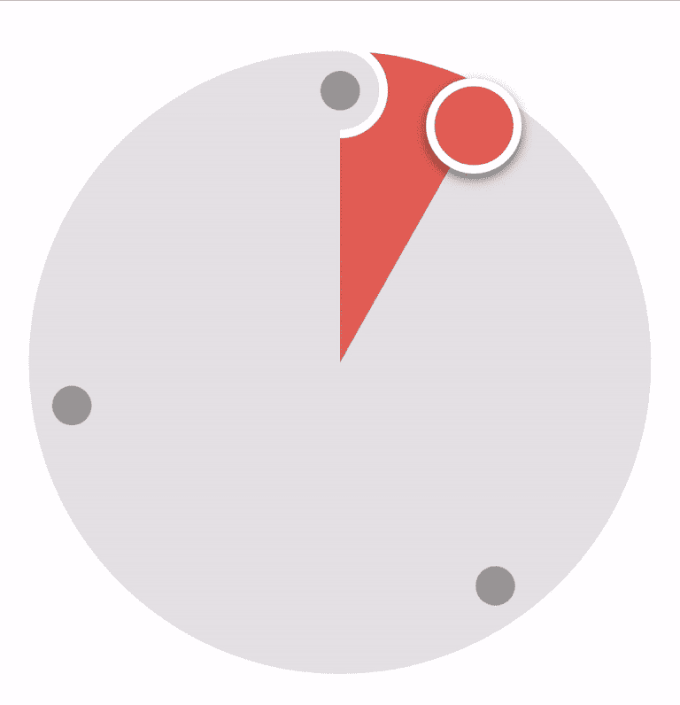

# 如何创建 Apple Card 支付拨号——第 4 部分

> 原文：<https://blog.devgenius.io/how-to-create-an-apple-card-payment-dial-part-4-c31342450c98?source=collection_archive---------24----------------------->

由[梅尔文·坦比](https://unsplash.com/@melvinthambi?utm_source=medium&utm_medium=referral)在 [Unsplash](https://unsplash.com?utm_source=medium&utm_medium=referral) 上拍摄的照片

**基于用户交互的界面更新。**

在最后一部分中，我们通过添加一个拇指并允许用户在表盘周围拖动拇指来开始与表盘进行交互。
在这一部分，我们将在用户与表盘交互时更新用户界面。

随着拇指的移动，我们需要更新表盘中间的数字，以及表盘的边框背景颜色。让我们从数字开始。

# 数字

这个刻度盘的全部意义实际上是更新我们想要为我们的虚拟账户提供资金的数量！
为了更新数字，在`thumbViewPanned()`内的`defer`闭包中，添加下面的新函数`updateFigures()`，我们将很快定义它。但在此之前，我们需要声明三个新变量来存储我们的初始数据。

在`commonInit()`中，我们将添加一个名为`configureBalance()`的新函数，这个函数将解析`balance`字符串并为`baseBalance`设置值。

我们也将改变`balance`的属性观察者来调用这个函数。

说完这些，让我们回到`updateFigures()`，这里是它的定义:

我们的`angle`是使用`atan2()`测量的，此函数返回-CGFloat.pi<`angle`<CGFloat.pi
范围内的角度。在我们的刻度盘中，上半部分代表-CG float . pi，下半部分是 CG float . pi。变量`value`正在转换，因此它从 0 开始。当进入第三象限时，即-CGFloat.pi 开始的地方，我们添加 2PI 以消除它对`value`的影响。
由于第一个标记是我们的起点，我们从计算的`value`中减去它的角度。现在，我们将`value`转换为介于 0 和`maximumFundingAmount`之间的值。最后，我们更新我们的标签。

运行应用程序，平移缩略图，我们应该会得到以下结果:

# 表盘的背景色

当我们拖动拇指时，我们希望拇指经过的背景有不同的颜色，就像这样:

我们通过添加一个`CAGradientLayer`到`dialBody`的图层，并用一个添加在上面的`CAShapeLayer`遮罩它来达到这个效果。

我们需要向我们的类中添加以下实例变量:

为了设置渐变层，我们定义了一个名为`setupGradient()`的函数，并在`commonInit()`中调用它。

`updateDialColors()`功能将根据拇指在表盘中的位置改变渐变颜色，其定义如下:

在`setupGradient()`结束时调用的`updateShapeLayer()`函数在渐变层的顶部创建蒙版，它创建了一个跟随我们拇指的路径。它的定义是:

我们还将`updateShapeLayer()`添加到我们的`updateThumb()`函数中。这样，每次我们移动缩略图时，我们的形状层都会更新。

`CALayer`对象不遵循约束更新。所以在我们的`updateConstraints()`函数中，我们需要更新我们的层对象框架，就像这样:

为了在通过标记后改变渐变颜色，我们检查角度是否位于两个标记之间，如果是，我们将`currentMarker`设置为最小的标记，并相应地更新颜色，当且仅当`currentMarker`已经改变。该检查在新功能`updateDialColorsIfNeeded()`中完成:

我们称`thumbViewPanned()`中的`updateDialColorsIfNeeded()`为`defer`闭包。

要查看渐变是如何被屏蔽的，隐藏*界面生成器*中的**文本视图**并运行应用程序。您应该看到以下内容:

打开 **Main.storyboard** 现在应该是这样的:

运行该项目，应该会产生以下结果:

Apple Card 表盘的拇指上有图标，当您到达一个标记时，图标会更新。我把这个留给你，我的读者朋友，作为一个练习。

在下一部分，我们将看到如何使我们的视图可访问。