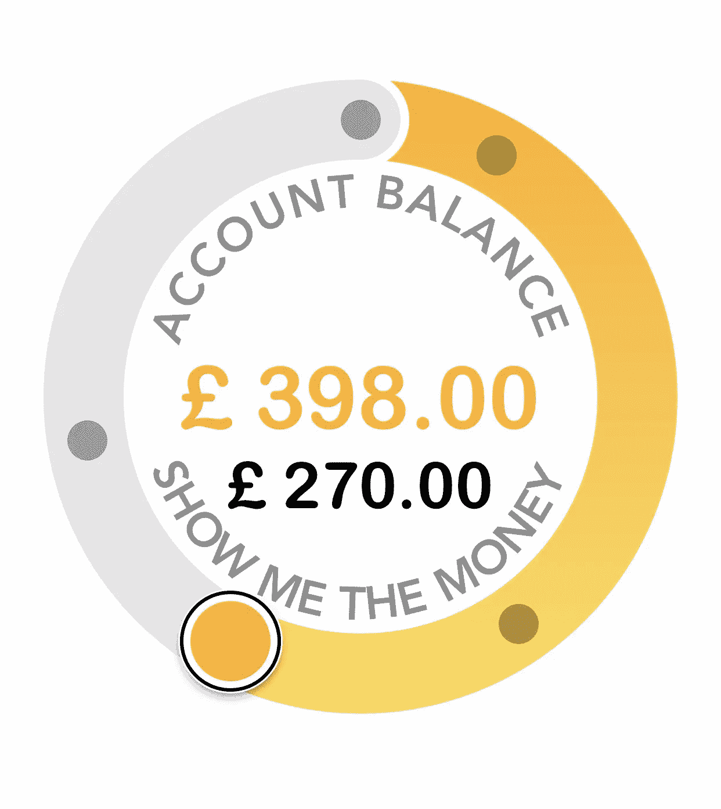
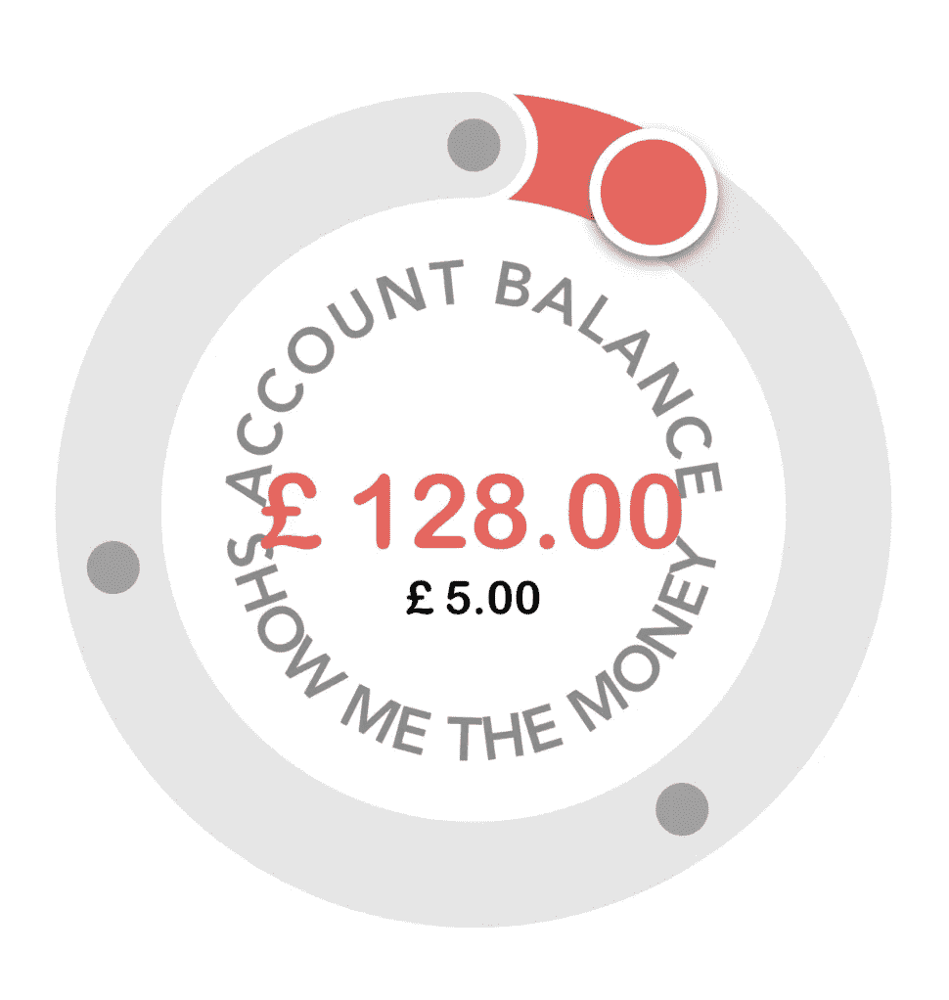
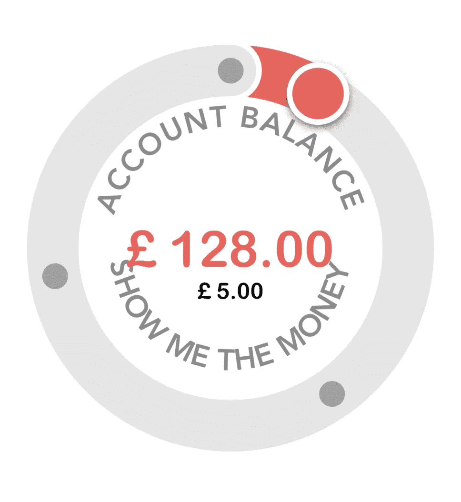
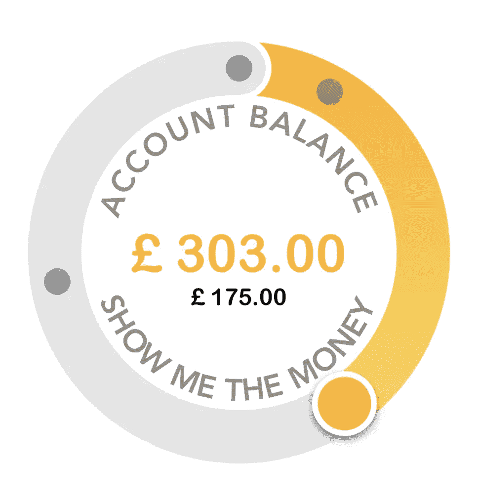
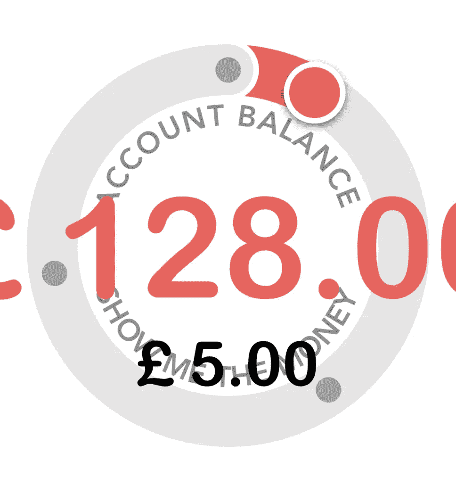
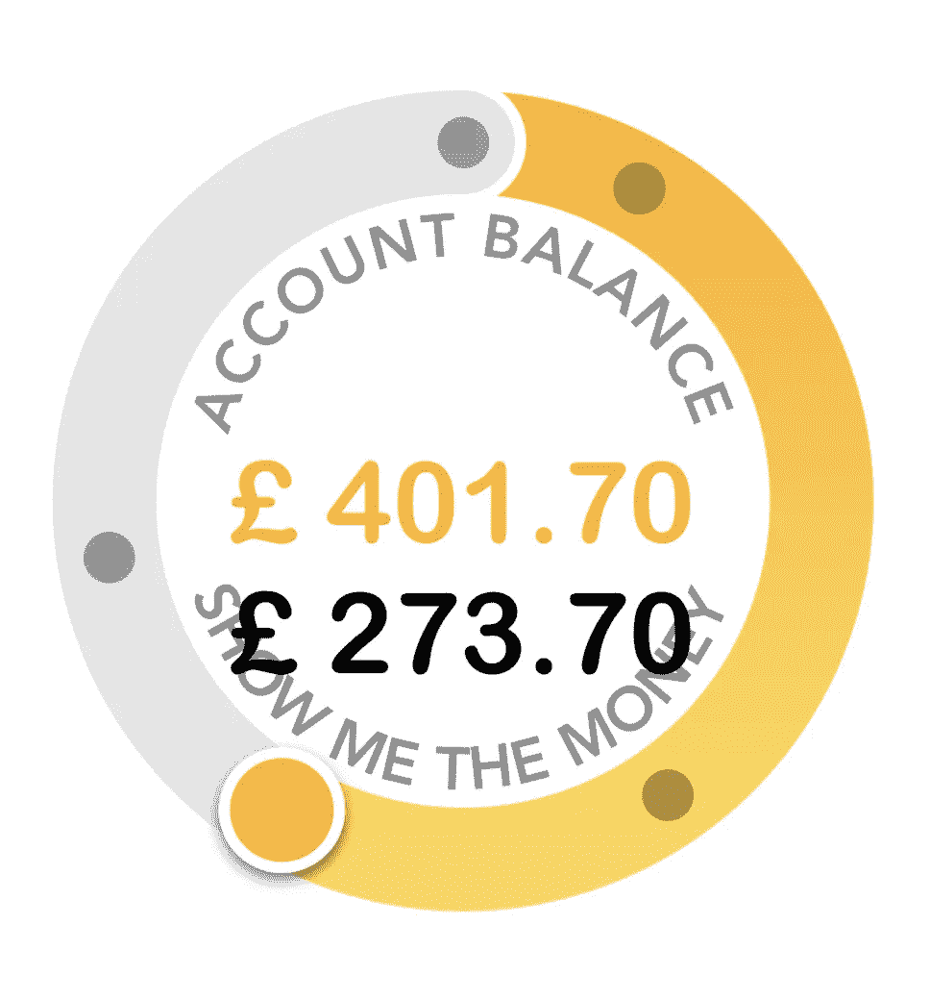
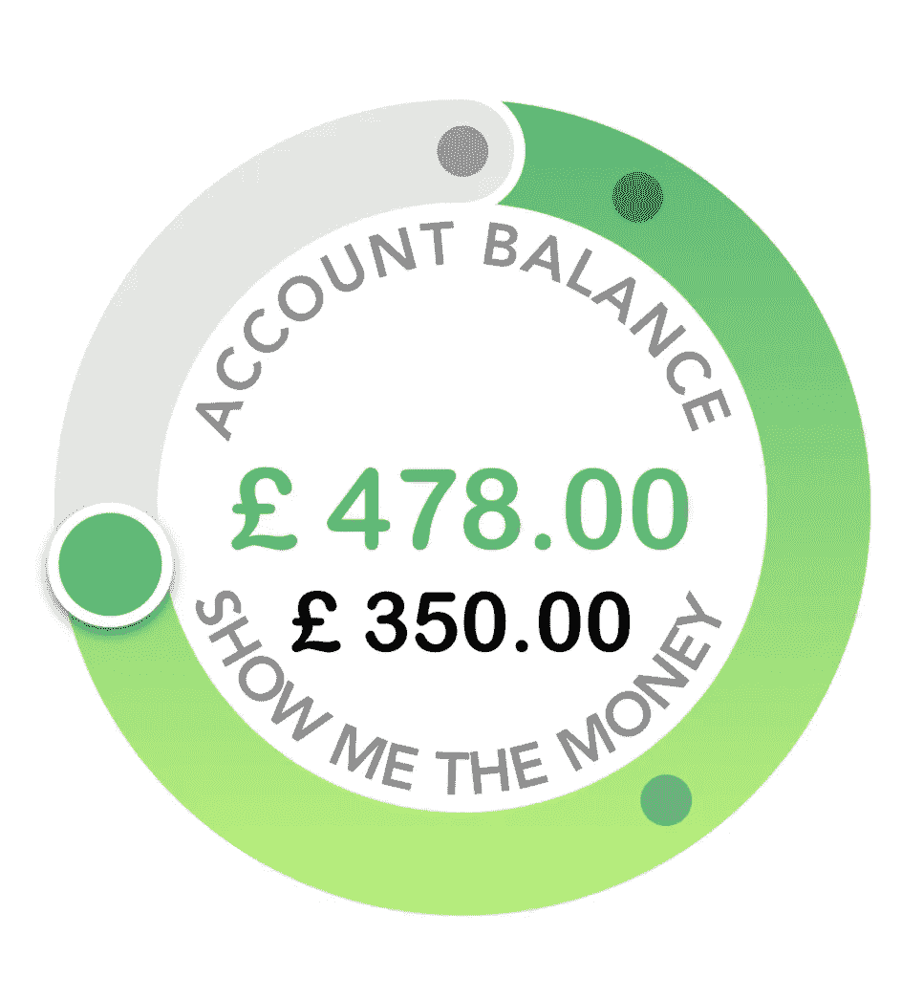
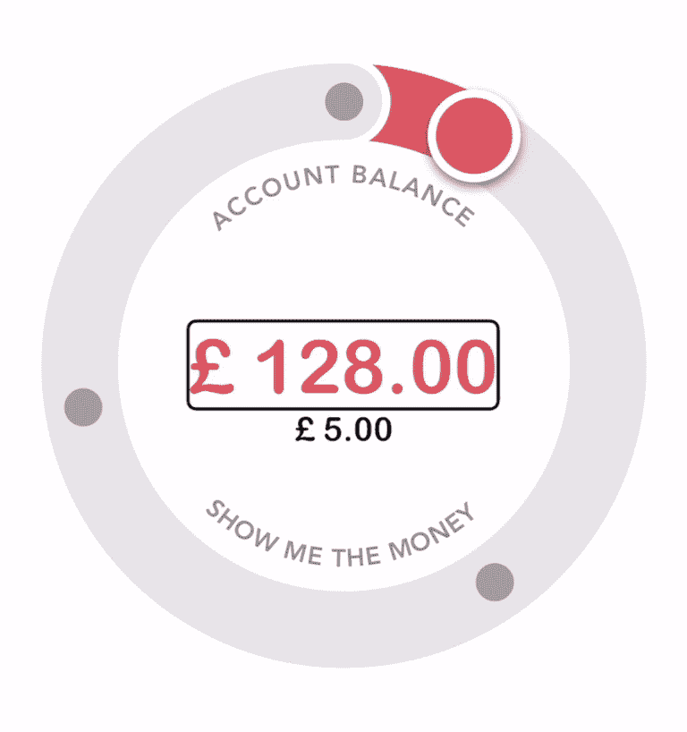
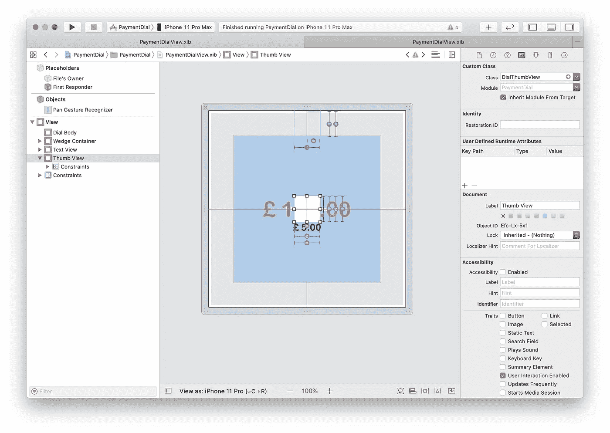

# 如何创建 Apple Card 支付拨号——第 5 部分

> 原文：<https://blog.devgenius.io/how-to-create-an-apple-card-payment-dial-part-5-7b0b508c8a0f?source=collection_archive---------31----------------------->

增加对动态文本和画外音的支持。



iOS 有一些非常棒的工具和技术来支持可访问性。然而不幸的是，大多数开发者似乎完全忽略了它们！

# 动态文本

让我们从简单的事情开始。iOS 允许用户增加系统的字体大小。我们希望我们的 dial 是一个好的操作系统公民，并与我们合作。

> 更改操作系统字体的大小。转到*设置*应用，然后转到
> *辅助功能*->-*显示&文本*->-*大文本*
> 底部有一个滑块，可以让你改变文本大小。向右滑动以查看文本变化。


让我们回到项目并运行它。你会发现一切都没变！不可接受！让我们修理它。

# 弯曲的琴弦

我们先从弯弦开始。因此，当我们使标签可访问时，我们可以考虑弯曲字符串覆盖的区域。

为了获得弯曲字符串的首选字体大小，我们将使用存储在`UIApplication`提供的`preferedContentSizeCategory`中的值。苹果在这里详细介绍了[如何调整*动态文本*的字体大小。在此基础上，我们将编写一个类效用函数，它提供了我们需要在弯曲文本上改变字体大小的数量。](https://developer.apple.com/design/human-interface-guidelines/ios/visual-design/typography/)

在`CurvedTextRenderer`类中添加:

将上面的函数添加到`PaymentDialView`中并改变属性字符串的字体大小会更容易。将它添加到`CurvedTextRenderer`将使我们的渲染器*能够感知动态文本*。

我们需要用不同大小的相同字体替换传入`CurvedTextRenderer`的属性字符串的字体。添加以下类函数:

在`renderRoundedText(:::)`中，创建可访问的属性字符串，并使用它们来代替传入的属性字符串。

随着上面的变化，我们的视图看起来会像这样:



在[第 2 部分](https://medium.com/dev-genius/how-to-create-an-apple-card-payment-dial-part-2-ad056b8cf572)中，我们讨论了弯曲文本，我们考虑了一个在渲染文本时被称为行高的值，它实际上是字体基线到表盘主体的距离。在标准文本大小的情况下，它看起来不错，但是在上面的图像中，这个距离太大了，非常突出。我们将使用*动态文本*调整行高参数。我们可以得到真正的技术，并检查字体的上升，体面和其他类似的参数。我们不会在这里讨论这个问题。相反，我们将根据从`accessibilityFontSizeDelta()`返回的正增量来插入行高。

从顶部标签开始，我们计算的行高是字体大小乘以 1.7。如果我们移除 1.7 并渲染动态文本*设置为最大，这就是它看起来的样子。*



我喜欢它的外观，承认我不是设计师，但我觉得它很好用。

当*动态文本*设置为最大值时，为了使乘数取反，让我们将顶部字符串的行高参数改为:

上面的代码，随着`delta`的增加`factor`减少。如果`delta`是否定的，我们什么都不做。

`accessibilityFontSizeDelta()`也被略微重构。最大值情况`.accessibilityExtraExtraExtraLarge`现在返回`Constants.maximumFontSizeDelta`，我们这样声明:

> 诚然，我也应该更早地使用这种结构。而不是在整个代码中随机声明数字。这个`Constants`结构将为它们提供上下文。

将我们的注意力转向底线。将底线高度乘以 0.3 得出以下结果:



我对结果很满意。我们将继续使底部曲线到表盘主体的距离意识到*动态文本*。
将`bottomLineHeight`改为:

当*动态文本*处于其最大值时，`bottomLineHeightFactor`将为 0.7。将`fontSize`与`(1 - bottomLineHeightFactor)`相乘将得到`bottomLineHeight = fontSize * 0.3`。
当*动态文本*为 0 或以下时，`bottomLineHeightFactor`将为 0.0。将`fontSize`与(1 - `bottomLineHeightFactor`)相乘将得到`bottomLineHeight = fontSize`。

# 两个 UILabels

如果我们在标签上使用**文本样式**而不是自定义字体。我们不需要做任何事。

幸运的是，多亏了`UIFontMetrics`，让标签尊重*动态文本的*用户设置真的很容易。

我们将很快使用它来使我们的标签尊重动态文本。但是在我们这样做之前，让我们在`commonInit()`中添加一个新函数。把它叫做`configureAccessibility()`，把它加在`updateRoundedTextView()`之前，它将允许我们的视图在配置视图中的其他元素之前进行必要的更新。要使标签可访问，请更改其字体以使用:

确保**辅助功能**设置中的**较大文本**尺寸设置为其最高值。现在我们的标签支持动态文本，他们将如何处理它？



明明工作了，却坏了我们的 UI！`UIFontMetrics`允许我们限制字体的最大尺寸。让我们将上面的`label?.font`更改为以下内容:

你会注意到我们没有给参数`maximumPointSize:`提供一个值，而是一个变量`maximumSize`。这是因为我们想找到绝对最大字体大小，这将适用于所有屏幕大小。为此，在*界面构建器*中找到您的视图可接受的最大字体大小。在 **PaymentDialView.xib 中摆弄标签的字体大小**我满意的最大字体大小是 50 磅。 **PaymentDialView.xib** 中视图的当前宽度为 414。我们现在可以根据屏幕大小缩放字体大小，方法是将 50 乘以当前屏幕宽度除以原始视图的宽度。

运行应用程序，你会看到我们的平衡标签，现在正确呈现，并尊重*动态文本*，而不必破坏用户界面。



不幸的是，资金标签的文本与底部弯曲的字符串重叠。我们需要为资金标签设置不同的最大值。对资金标签重复上述过程，37.0 点似乎是理想的最大值。
考虑到我们的最大字体大小，我们将循环改为:

最后，我们所有的文本都遵循*动态文本*的尺寸，表盘看起来如下。



# 画外音

说到屏幕阅读器，就支持和体验而言，iOS 是同类中最好的。iOS 的屏幕阅读器叫做 VoiceOver。你可以在[这里](https://developer.apple.com/documentation/uikit/accessibility_for_ios_and_tvos/supporting_voiceover_in_your_app)阅读更多关于如何在你的应用中支持 VoiceOver 的信息。启用 VoiceOver 最快最简单的方法是使用 Siri，说“打开 VoiceOver”，显然要关闭它，要求 Siri“关闭 VoiceOver”。

启用 VoiceOver，启动应用程序，我们会看到 VoiceOver 只识别余额和资金标签。其他的都是它看不见的！



此外，VoiceOver 可以正确读取余额和充值金额中的数字，但它所读取的内容没有上下文。

让我们给标签添加上下文。声明一个新函数`updateLabelAccessibilityValues()`。

将此功能添加到`configureBalance()`和`updateFigures()`的末尾。现在，当用户导航到*余额标签*时，VoiceOver 会告诉用户“Balance ”,然后是余额的数量，因此用户对该数字代表的内容有一个清晰的概念。

这同样适用于*资金标签*，当用户导航到它时，他们将知道报告的金额将是他们将添加到他们帐户的金额。
但是，用户无法更改资金数额或选择刻度盘的拇指！

为了让 dial 正确支持 VoiceOver，我们需要将其分解为一个单独的类。创建一个新文件，命名为*dialpthumbview . swift*。

你会注意到我们把大部分的`setupThumb()`从`PaymentDialView`移到了`DialThumbView`的`commonInit()`。在`commonInit()`的底部，我们也在上面设置了两个新的`UIView`属性。`isAccessibilityEnabled`和`accessibilityTraits`。
`isAccessibilityEnabled`告知操作系统视图支持 VoiceOver 等辅助技术。
`accessbilityTraits`描述了我们的行为观。在这种情况下，我们使用的是`.adjustable`，它告诉 VoiceOver 我们的视图允许用户调整它的值，类似于滑块。当视图获得焦点时，VoiceOver 会通知用户，他们可以上下滑动来更改值。
当用户向上或向下滑动时，VoiceOver 会相应地调用我们类上的`accessibilityIncrement()`或`accessibilityDecrement()`。

在*界面生成器*中，选择左侧**文档轮廓**窗格中的*缩略图视图*。打开右边 Inspector 面板中的**身份检查器**，将视图的*类*改为`DialThumbView`。



回到`PaymentDialView`，将`IBOutlet` `thumbView`的类改为`DialThumbView`。

`setupThumb()`简化为如下:

我们通过将资助标签的可访问性设置器移动到一个新函数中来重构`updateLabelAccessibilityValues()`，并且我们也在`setupThumb()`中使用它。

我们需要创建一个`DialThumbViewDelegate`协议，向`PaymentDialView`报告用户希望增加/减少的值。

```
protocol DialThumbViewDelegate: AnyObject {
    func dialShouldIncrementFundingValue()
    func dialShouldDecrementFundingValue()
}
```

给`DialThumbView`增加一个`delegate`变量。

并在我们重写的可访问性函数中调用委托。

在`PaymentDialView`的`setupThumb()`中设置委托。

并使`PaymentDialView`适应`DialThumbViewDelegate`协议。

在类中声明协议函数。

当用户上下滑动时，我们希望增加/减少 5.00，并移动我们的拇指。通过更新`angle`变量来移动拇指。要将它移动 5.00，我们将计算需要沿表盘主体移动多少度。
拇指的活动范围从第一个标记角度到圆圈上的 12 点钟位置。当拇指在 12 点时，资助金额为 500.00。将该范围除以最大量将得到 1.00 所需的角度移动量。我们将这个值乘以 5，得到我们需要用来更新`angle`的数量。在代码中，它看起来像这样:

通过使用`angle`增加/减少间隔来更新协议功能。

关于象限检查，在[第 4 部分](https://medium.com/dev-genius/how-to-create-an-apple-card-payment-dial-part-4-c31342450c98)中，我们提到`angle`是使用`atan2()`测量的，该函数返回-CGFloat.pi<`angle`<CGFloat.pi 范围内的角度。刻度盘的上半部分代表-CG float . pi，下半部分代表 CG float . pi。因此，当进入和退出第三象限时，`angle`需要转换为其正确值。

以允许 VoiceOver 将拇指的移动限制在表盘主体上。我们对`thumbViewPanned(:)`进行了重构，将象限检查移到了一个新功能`updateQuadrant(::)`中，并在使用 VoiceOver 时禁用了捕捉，否则拇指会卡在原地。

现在，我们使用 VoiceOver 的用户将能够设置他们想要的金额来为这个虚拟帐户提供资金。

# 可访问性项目顺序

当我们的表盘变得可见时，VoiceOver 会选择拇指视图作为第一个可访问的元素。我觉得现在的平衡会更合适。要控制 VoiceOver 遍历可访问元素的顺序，请在`configureAccessibility()`功能中添加`accessibilityElements`。

VoiceOver 将按照`accessibilityElements.`中定义的顺序遍历我们的拨号

我希望你喜欢这个系列。你可以在这里找到完成的 Xcode 项目。