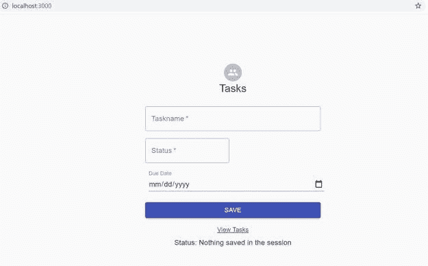
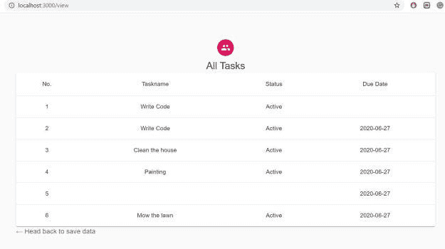

# 如何使用 Spring Boot 和 ReactJS 创建应用程序

> 原文：<https://blog.devgenius.io/how-to-create-an-application-with-spring-boot-and-reactjs-f0c2ee2d534a?source=collection_archive---------9----------------------->

照片由 [Filiberto Santillán](https://unsplash.com/@filisantillan?utm_source=medium&utm_medium=referral) 在 [Unsplash](https://unsplash.com?utm_source=medium&utm_medium=referral) 上拍摄

在这篇文章中，我将展示如何用 Spring Boot 和 ReactJS 创建一个应用程序。

我们将在前端使用 ReactJS，在后端使用 Spring Boot 处理业务逻辑。我们将使用 MySQL 作为数据库。我们构建的应用程序是一个待办事项列表应用程序。

我们将在本帖中介绍以下说明:

*   设置 Spring Boot 应用程序
*   设置 MySQL 数据库
*   Spring Boot 申请的详细信息
*   安装 ReactJS 并设置前端
*   在本地环境中测试应用程序

# 设置 Spring Boot 应用程序

我通常使用[https://start.spring.io/](https://start.spring.io/)来建立一个带有所需依赖关系的样板 Spring Boot 应用程序。作为这个项目的一部分，我们将使用`spring-data-jpa`、`spring-data-rest`、`jdbc`和`web`依赖项。我们的 Gradle 文件如下所示:

查看[要点](https://gist.github.com/yogsma/77ce8a5afd435680d91a0bbaf670fd49)上的代码。

一旦我们在 [https://start.spring.io、](https://start.spring.io,)创建了项目，我们就可以下载它并将其导入 IntelliJ 或 Eclipse。

# 设置 MySQL 数据库

对于待办事项列表应用程序，我们需要一个数据库和一个表。这个演示是一个准系统应用程序，所以我们不会有任何登录或注册屏幕。

由于我们将从我们的 Spring Boot 应用程序连接到数据库，我们需要如下设置我们的**应用程序:**

你可以使用 GUI 连接到你的 MySQL 数据库，我通常更喜欢命令行方式。

在命令行上登录 MySQL 数据库后，为我们的应用程序创建一个数据库。

`create database todolist`

我们将创建一个数据库表`task`。

`create table task (id int(6) unsigned not null auto_increment, taskname varchar(100) not null, duedate date default null, status int(1), primary key(id));`

我们既可以插入一些数据，也可以在应用程序的主页上显示插入数据的表单。

# Spring Boot 申请的详细信息

首先，我们将为`task`创建一个模型类。这个类将如下所示:

在这次开发中，我们将有一个处理 rest 服务的控制器和一个处理业务层逻辑的管理器。

管理器的实现如下所示:

而我们的`RestController`将如下图所示:

现在我们可以通过 POSTMAN 测试这些 REST APIs。我不会展示那个，但是如果你感兴趣，你可以下载 [postman](https://www.postman.com/) 。

# 安装 ReactJS 并设置前端

对于前端 UI，我们将使用 ReactJS。你需要使用的 ReactJS 有 npm、nodejs 和 create-react-app。

一旦安装了这三个组件，我们就可以为当前的 Spring Boot 应用程序使用 ReactJS 了。

在命令行上，转到我们有 Spring Boot 应用程序的根目录。使用以下命令创建一个 react 应用程序:

`npx create-react-app frontend`

如果你在命令行进入`frontend`目录，你将能够启动前端，它将向你显示 ReactJS 应用程序的默认屏幕。

为了确保应用程序顺利运行，我们需要两个库。我们将按如下方式安装它们:

`npm install react-router`
`npm install @material-ui/core`

`react-router`是 React 的一个标准库，它可以让你的 UI 与 URL 保持同步，提供动态路径匹配、位置转换和惰性代码处理功能。

`core`和`icons`是[前端组件](https://material-ui.com/)的库。

我们将在`package.json`中添加一个代理，这样我们在调用后端 API 时就不必写完整的 URL。

`proxy: [http://localhost:8080](http://localhost:8080)`

现在让我们看看组件文件。

# 2.AddTask.js

这将是我们应用程序的入口。在这个文件中，我们将有一个添加任务的表单。一旦用户输入了所有需要的信息，我们将向服务器端代码发送一个 POST 请求。该文件将如下所示:

# 3.Table.js

这个文件中，我们通过对 Spring Boot REST API 的 API 调用从数据库表中获取任务列表。它还将以表格形式显示所有条目。

随着这一改变，我们在前端和后端完成了大部分的代码修改。

# 在本地环境中测试应用程序

现在要运行应用程序，在命令行或编辑器中启动 Spring Boot 应用程序

要启动前端，请从前端文件夹中使用以下命令:

这将在 3000 端口启动本地主机，如下所示:

现在，如果我点击`View Tasks`，将会进入如下任务列表:

# 结论

在这篇文章中，我们展示了如何用 Spring Boot 和 ReactJS 创建应用程序。如果你有任何问题，可以在推特上关注我。这方面的代码可以在 [Github 库](https://github.com/yogsma/demo)上找到。如果你正在寻找如何用 AngularJS 创建一个类似的应用程序，你可以在这里访问[我的帖子](https://betterjavacode.com/spring-boot/how-to-angularjs-user-interface-to-crud-spring-boot-rest-api)。

# 参考

1.  ReactJS — [ReactJS Home](https://reactjs.org/)
2.  弹簧靴和反应堆— [Spring Boot 和反应堆](https://spring.io/guides/tutorials/react-and-spring-data-rest/)

*原载于 2020 年 7 月 8 日 https://betterjavacode.com***。**