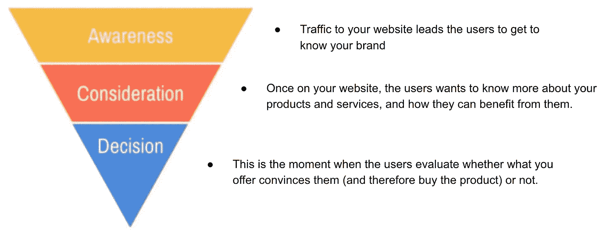
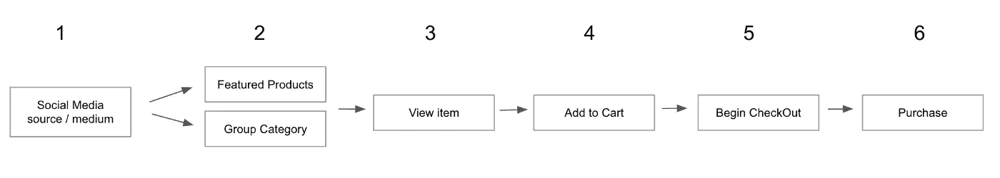
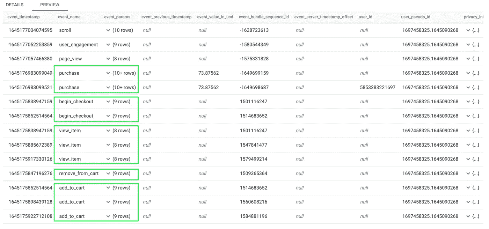
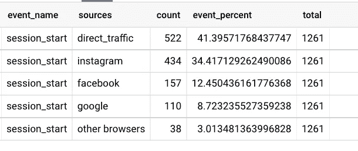
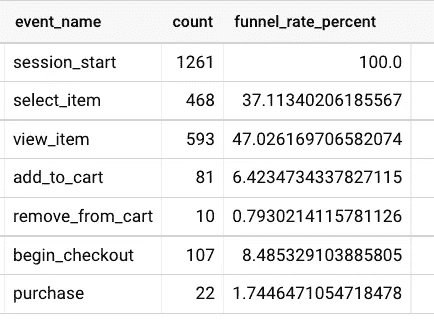

# 如何在 BigQuery 中创建电商销售漏斗？(+提高 add_to_cart 比率的提示)

> 原文：<https://blog.devgenius.io/how-to-create-an-e-commerce-sales-funnel-in-bigquery-tips-to-increase-the-add-to-cart-rate-c546845fdba8?source=collection_archive---------5----------------------->

目录

> [简介](#7da1)
> [漏斗定义](#1517)
> [事件验证](#433a)
> [运行 SQL 代码](#9b3b)
> [采取行动](#b5d0)
> [结论](#1ba5)

# #1 简介

销售漏斗对在线业务至关重要，因为它让我们了解客户在网上的行为。

*   哪些产品看的比较详细？
*   哪些产品被添加到购物车或 WhishList 中？
*   这些产品中有多少最终被购买？

通过回答这些问题，你会知道要实现网上商店的目标需要做出哪些**决定。否则，你的策略就失败了。**

在本文中，我们将**量化漏斗的阶段**并找出其弱点，以便做出正确的决策来改善**客户之旅。**

# #2 漏斗定义

销售漏斗定义了用户在网络中实现目标所必须采取的步骤。在电子商务中，这个目标就是**购买一个产品**。

通过谷歌搜索“*销售漏斗”*，你会发现许多不同的形状和阶段。这是因为有许多类型的漏斗。一般来说都有**三个阶段**:意识、考虑、决定。

# #3 事件验证

情况:用户从(1) **社交媒体流量**登陆网站。一次在网站上，在第`body` (2) **上半年展示特色产品**，在第二季度还会有第(2) **组分类**。

当选择一个特色产品或一个类别内的产品时，然后(3) **查看细节**以选择颜色、尺寸和数量。点击(4) **添加到购物车**选项，将启动(5) **结账**，并添加运输和账单信息，导致(6) **购买**

*   认知度:(1)社交媒体流量
*   考虑:(2)选择产品，(3)查看产品，(4)从购物车中添加/删除，(5)开始结帐
*   决策:(6)购买

一旦**销售漏斗**和**事件**被理解**、**，我们必须检查它们是否被发送到 **BigQuery。**否则，不会进行任何分析。

# #4 运行 SQL 代码

我对 *traffic_source* 参数进行了特定的*查询*，以查看不同的来源。首先，一个通用的*查询*允许我查看所有的文件，然后我用函数`CASE WHEN 'variable' THEN 'name'`将每个文件分组

结果是一个表，其中包含不同的**流量源**和**事件** **占总数的百分比**。我已经将 *total* 列( *value* : 1261)放在这里，所以看看 *session_start* 参数是否与下一个*查询*匹配。**的确如此:)**

结果表格显示了每个事件已记录的**计数**和**相对于漏斗的百分比**。

*   这个电商的**转化率**是多少？
    (22)买入/(1261)session _ start =**1.75%**

> 注:平均来说，西班牙(我来自的地方)的**平均转化率**在**1%-3%之间。**关于其他国家和行业阅读此[文章](https://www.growcode.com/blog/ecommerce-conversion-rate/)

# #5 采取行动

对销售漏斗有一个总体的了解可以让我们确定哪些阶段运行良好，哪些阶段容易改进。

*   这家电商的 *add_to_cart* 费率是多少？
    (81)add _ to _ cart/(1261)session _ start =**6.42%**

一点也不差，但是如果再低一点，**如何提高 *add_to_cart* 的速率？**只有一种方法:**通过在事件发生的地方做出改变**。

1.  改进产品照片
2.  原始产品描述
3.  社交证明—客户评论
4.  运输预期
5.  在线聊天支持
6.  产品紧急程度(可用库存)
7.  信任标志(诺顿、信任商店等)

> 注意:本文关注的是如何在 BigQuery 中创建一个销售漏斗。这就是为什么我提出了一些对 add_to_cart 的一般性改进。有关如何提高事件发生率的详细说明，请阅读这篇[文章](https://blog.littledata.io/2018/12/18/how-to-increase-add-to-cart-rate-on-your-ecommerce-store/)

# #6 结论

销售漏斗的定义和跟踪对于电子商务的生存至关重要。了解阶段及其值使我们能够**识别漏斗中的弱点。**

向 BigQuery 发送数据(事件完成的次数)的最常见实现是通过 GA4 电子商务和 Tag Manager。一旦我们**验证数据是正确的，**我们就可以开始写`sql functions`

记住:不是所有的电子商务都有相同的阶段。每一个都不一样。

运行`Funnel` *查询*后，我们将获得每个阶段的数据。只有这样我们才能**提出假设**和**在网站上做出改变**来改进我们考虑的那些。例如: *add_to_cart* 事件。