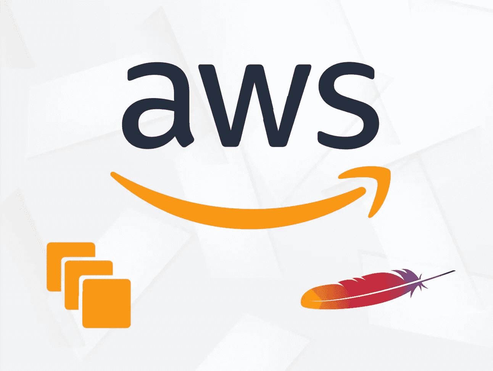
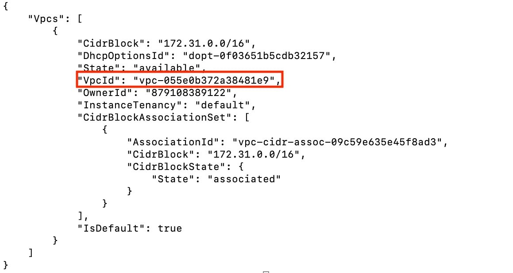
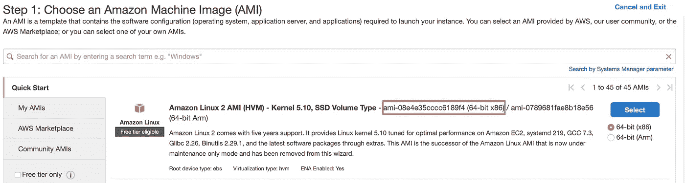
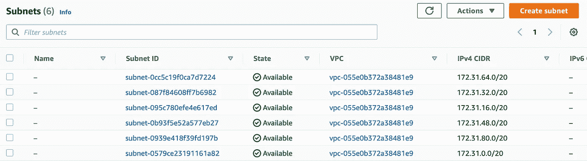
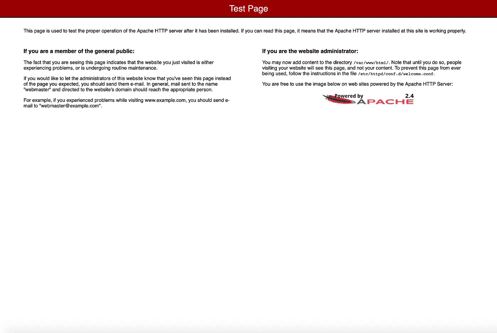

# 如何使用 AWS CLI 创建带有 Apache 服务器的 EC2 实例

> 原文：<https://blog.devgenius.io/how-to-create-an-ec2-instance-with-an-apache-server-using-the-aws-cli-63374bc40138?source=collection_archive---------9----------------------->



AWS 命令行界面(AWS CLI)允许用户使用终端程序与 AWS 服务进行交互。AWS CLI 有许多好处，包括使用脚本实现流程自动化，以及减少完成任务所需的时间。

本教程提供了如何使用 AWS CLI 在 Apache 服务器上创建 t.3nano EC2 实例的说明。一个脚本将用于更新软件包以及安装和启用 Apache 服务器。

**先决条件:**

*   安装了最新版本的 AWS CLI
*   IAM 用户帐户
*   命令行终端
*   精力

# **步骤 1:使用 AWS Configure 设置 AWS CLI**

运行 AWS Configure 命令将创建一个默认配置文件，当命令未指定要使用的配置文件时，CLI 将引用该配置文件。

在终端中输入以下命令:

```
aws configure
```

将显示以下输出:

```
AWS Access Key ID: AWS Secret Access Key:Default region name:Default output format:
```

为您的用户帐户输入 AWS 访问密钥 ID 和 AWS 秘密访问密钥。请记住，只有在创建用户帐户时才能检索 AWS 秘密访问密钥。

将默认区域名称设置为您选择的 AWS 区域。将默认输出格式设置为 JSON。

# **第二步:创建一个密钥对**

连接到 EC2 实例需要一个密钥对。

要创建密钥对，请输入以下命令:

```
aws ec2 create-key-pair --key-name <KeyPairName> --query 'KeyMaterial' --output text > <KeyPairName>.pem
```

# **步骤 3:创建安全组**

安全组用于控制 EC2 实例的入站和出站流量。

为了创建安全组，您将需要您的 VpcId。要找到它，请输入以下命令:

```
aws ec2 describe-vpcs
```



现在，您可以通过输入以下命令来创建安全组:

```
aws ec2 create-security-group --group-name <SecurityGroupName> --description "My security group" --vpc-id <vpcid>
```

这个命令的输出将是您的 GroupId。保存此 ID，因为您将需要在下一步中引用它。

# **步骤 4:向安全组添加规则**

将添加的第一个规则是允许入站 SSH 流量。

对于这个命令，您需要找到您的公共 IP 地址。您可以使用以下命令轻松找到它:

```
**curl** http://checkip.amazonaws.com
```

现在，您可以输入命令来允许入站 SSH 流量:

```
aws ec2 authorize-security-group-ingress --group-id <SecurityGroupID> --protocol tcp --port 22 --cidr <IPAddress>/32
```

下一个要添加的规则是允许 HTTP 流量。这将允许任何人访问我们的网页。

```
aws ec2 authorize-security-group-ingress --group-id <SecurityGroupID> --protocol tcp --port 80 --cidr 0.0.0.0/0
```

# **第五步:启动 EC2 实例**

首先，您需要选择一个 AMI 映像 ID。您可以通过访问 AWS 控制台 EC2，然后选择 launch an EC2 instance 来实现。对于本教程，将推出一个 Amazon Linux 2 AMI。



接下来，您需要选择一个子网 ID。为此，您可以导航到 VPC 服务仪表板，然后选择子网。复制您选择的可用性区域中的子网。



接下来，需要创建一个脚本来安装 Apache 服务器。

输入以下命令在 vim 中创建一个名为 userscript.sh 的脚本:

```
vim userscript.sh
```

在 vim 中输入以下脚本:

```
#!/bin/bash
yum update -y
yum install httpd -y
systemctl start httpd
systemctl enable httpd
```

输入:wq 保存文件并退出 vim。

最后，您可以输入以下命令来创建 EC2 实例:

```
aws ec2 run-instances --image-id <AMIImageID> --count 1 --instance-type t3.nano --key-name <KeyPairName> --security-group-ids <SecurityGroupID> --subnet-id <SubnetID> --user-data file://userscript.sh
```

# 第六步:测试一下！

您应该会看到一个新的实例在 AWS 控制台上运行。运行最后一个命令后，部署可能需要几分钟时间。

选择实例 ID，然后复制公共 IPv4 地址并将其粘贴到您的 web 浏览器中。如果成功，将会出现一个测试页面。

