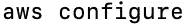
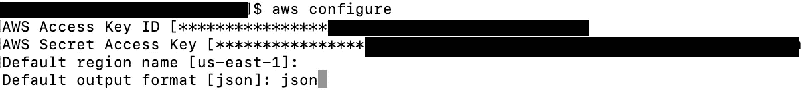
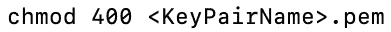
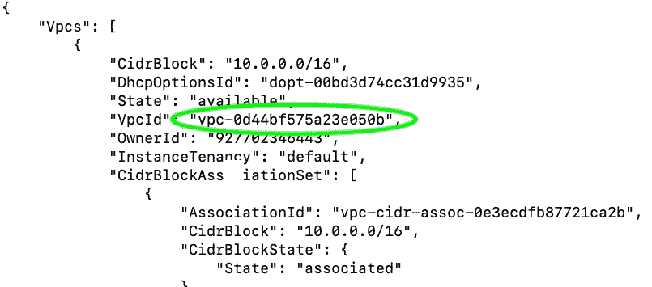
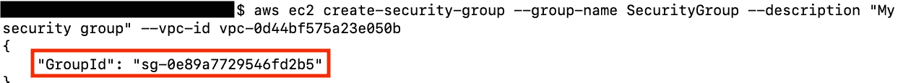
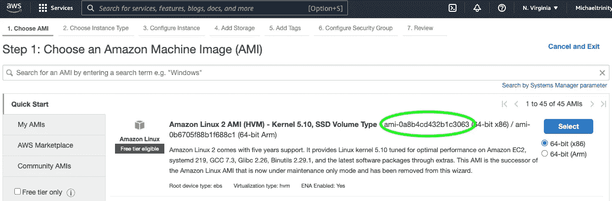
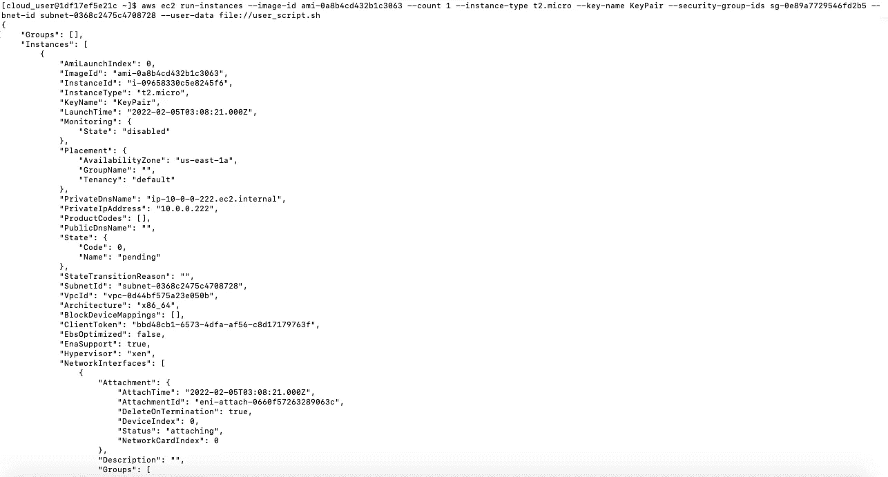
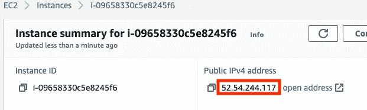
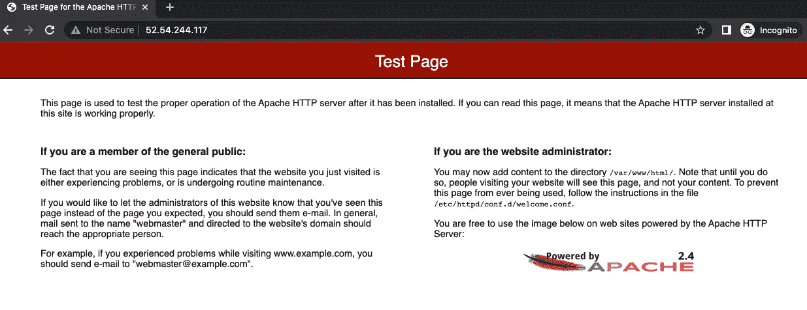

# 如何通过 AWS CLI 用 Apache 创建 EC2 实例

> 原文：<https://blog.devgenius.io/how-to-create-an-ec2-instance-with-apache-through-aws-cli-12bb7b57e549?source=collection_archive---------12----------------------->


什么是 AWS CLI？
**AWS 命令行界面**是一个开源工具，在这里你可以下载、配置和控制多个 AWS 服务。用户可以从这个中心位置使用命令和自动化脚本来实现这一点。

在本项目中，我们将…
1。创建一个 t.2 微 EC2 实例
2。使用脚本更新所有包，安装 Apache，并启动服务
3。验证该实例通过公共 IP 下载并安装了 apache 服务器

> ***先决条件:***
> 命令行终端
> AWS 账户与 IAM 用户
> AWS 命令行接口安装
> Vim

# 步骤 1:设置 AWS CLI

第一步是打开终端窗口，输入以下命令来设置 AWS CLI:



输入访问键并设置默认区域后，将默认输出格式设置为 JSON。

# 步骤 2:创建密钥对

您需要创建一个密钥对来连接到 EC2 实例。

```
aws ec2 create-key-pair --key-name **<KeyPairName>** --query 'KeyMaterial' --output text > **<KeyPairName>.pem**
```


设置您的私钥文件的权限。



# 步骤 3:创建安全组

首先找到您的 VpcId:



将您的 VpcId 放入以下命令中，并命名您的安全组:

```
aws ec2 create-security-group --group-name **<SecurityGroupName>** --description "My security group" --vpc-id **<vpcid>**
```



复制 SecurityGroupId。我们将在下一步中使用它。

# 步骤 4:向安全组添加规则

我们将添加允许 SSH 和 HTTP 流量的规则:

```
aws ec2 authorize-security-group-ingress --group-id **<SecurityGroupID>** --protocol tcp --port 22 --cidr 0.0.0.0/0aws ec2 authorize-security-group-ingress --group-id **<SecurityGroupID>** --protocol tcp --port 80 --cidr 0.0.0.0/0
```

# 步骤 5:启动 EC2 实例

我们必须在 AWS 控制台的 EC2 下选择一个 Amazon 机器映像。选择启动 EC2 实例。



复制 AmiImageId。我们将在下一步中使用它。

接下来，我们需要创建一个脚本来安装 Apache 服务器:

```
vim user_script.sh
```

将以下命令插入脚本:

```
#!/bin/bash
yum update -y
yum install httpd -y
systemctl start httpd
systemctl enable httpd
```

输入 **ESC** 和 **:wq** 保存并退出。

运行下面的命令来启动 EC2 实例

```
aws ec2 run-instances --image-id **<AMIImageID>** --count 1 --instance-type t3.nano --key-name **<KeyPairName>** --security-group-ids **<SecurityGroupID>** --subnet-id **<SubnetID>** --user-data file://userscript.sh
```



# 决赛:测试一下！

转到 AWS 控制台上的 EC2 仪表板。您将看到您部署的一个实例。单击实例并复制公共 IP 地址。



将其粘贴到您的网络浏览器中。如果你成功了，这就是你将看到的！

