# 如何使用 Figma 创建一个交互式滑块？

> 原文：<https://blog.devgenius.io/how-to-create-an-interactive-slider-using-figma-a4321d3c5a27?source=collection_archive---------13----------------------->

我想创建一个像下面视频中那样的交互式滑块，像所有其他问题一样，第一步是谷歌搜索，但是，令我惊讶的是，我找不到任何与该问题相关的文章或文档。所以，我决定为别人记录我的步骤。

Figma 是设计师特别是 UI/UX 设计师的流行工具，因此需要这样的文档来帮助初级设计师和初学者创建一个简单的原型，如上图所示。以下列出了所采取的步骤，以供参考；

1.  创建带有框架或形状的滑块。
2.  添加一个文本栏，并在文本栏中键入“1”。
3.  在 4 个地方重复“1”。
4.  相应地将“1”更改为 2 到 4。
5.  将数字分组。
6.  在“1”周围画一个矩形。
7.  通过按屏蔽图标选择并屏蔽分组的数字。
8.  用滑块将被屏蔽的数字分组并框住它们。
9.  复制帧，并将数量调整为 5。
10.  原型通过创建连接两个框架。
11.  编辑交互动作为“拖动”，类型为“智能动画和线性”，速度为“800 毫秒”。
12.  单击右侧边栏中的 play 按钮来测试原型。

让我们开始吧。

首先，你需要在[Figma.com](https://figma.com)打开桌面或浏览器上的 Figma 并登录你的账户。然后，为新画布打开一个新文件。

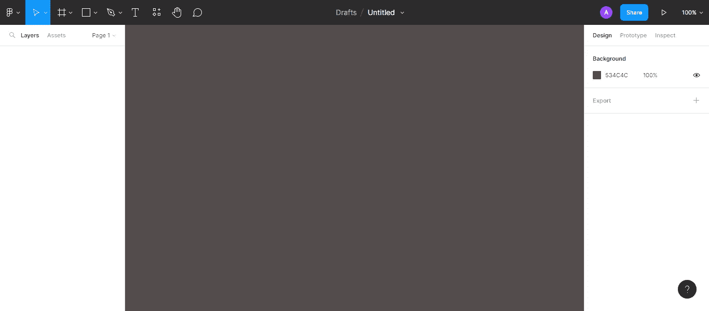

# **使用框架或形状创建滑块**

比起常规的形状工具，我更喜欢用框架来画形状。你可以做出选择。按 F 创建一个框架，大小为 10px 高和 350px 宽(宽度和高度的偏好是你的)。并通过在右边栏中将边界半径编辑为 10 来制作曲线边缘。

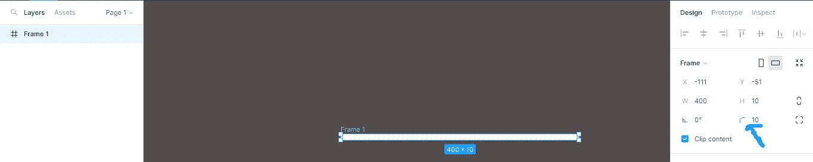

改变框架的颜色为灰色，并创建一个圆形覆盖矩形框架使用框架，并变成一个 24px 24px 的圆，边界半径为 20px。

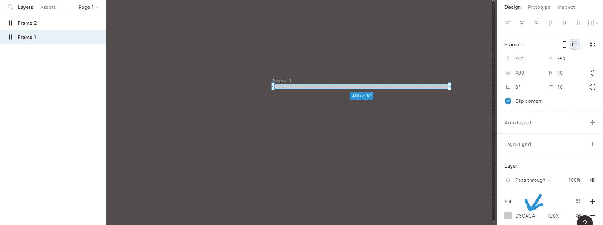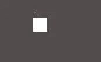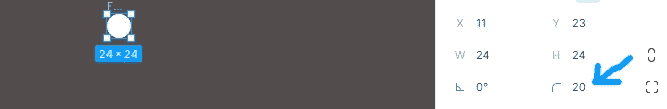

将圆放在矩形框的一端，用 Ctrl+G 将它们组合在一起，如下图所示

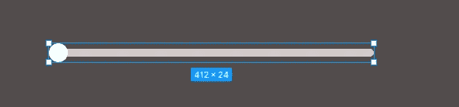

# **2。添加一个文本栏，并在文本栏中键入“1”。**

按 T 添加文本字段，并在字段中键入 1。

# **3。在 4 个地方重复“1”。**

使用 Ctrl D 将文本字段复制到其他四(4)个位置。

# **4。相应地将“1”更改为 2 到 5。**

相应地将复制文本字段的内容更改为 2、3、4 和 5。

# **5。将数字分组。**

使用移动工具选择文本字段(数字)并对其进行分组，使用 Ctrl+G 对其进行分组。

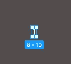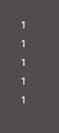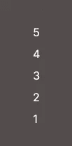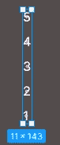

# **6。在“1”周围画一个矩形。**

按 R 在分组数字中的 1 上画一个矩形。

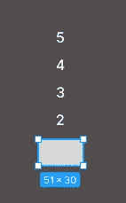

**7。通过按屏蔽图标选择并屏蔽分组的数字。**

选择矩形和分组编号。然后，单击屏蔽图标屏蔽数字。

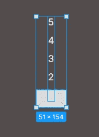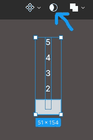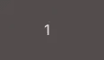

# **8。用滑块将被屏蔽的数字分组并框住它们。**

使用滑块选择并组合遮罩编号，然后将它们框在一起。

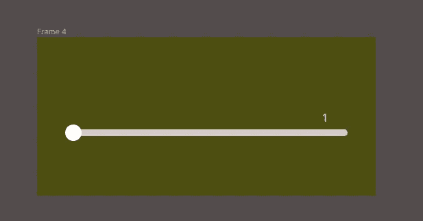

框架的颜色可以是你选择的任何颜色。

# **9。复制帧，并将数量调整为 5。**

选择新框架并按 Ctrl+D 复制该框架。然后，使用向下箭头键将屏蔽组中的数字调整为 5。并将圆的位置更改到杆的另一端。

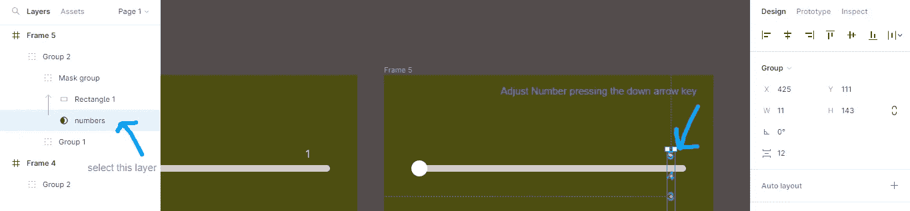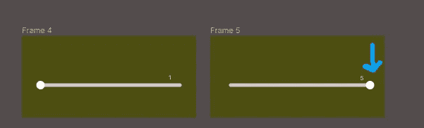

# **10。在两个框架之间创建一个连接。**

单击右侧边栏顶部的 prototype，从设计模式切换到原型模式。

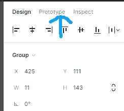

# **11。编辑交互动作为“拖动”，类型为“智能动画和线性”，速度为“800 毫秒”。**

选择第一个框架中的圆，并将一条线从连接端口拖到第二个框架。将弹出一个窗口来编辑交互。

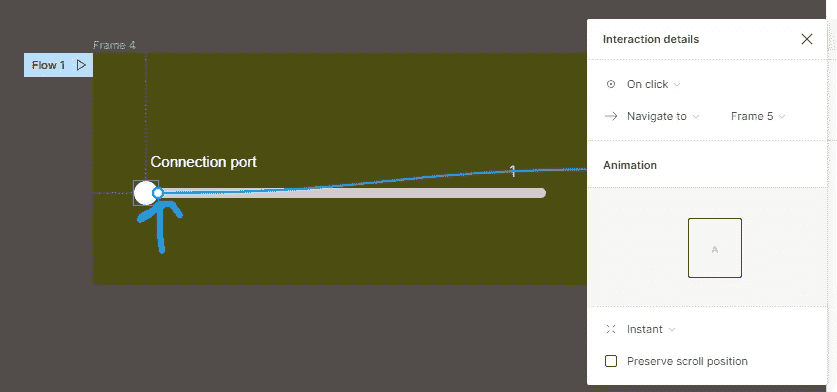

将动作从“点击”更改为“拖动”，交互行为从“即时”更改为“智能动画”，类型从“缓入”更改为“线性”，时间从 300 毫秒更改为 800 毫秒。

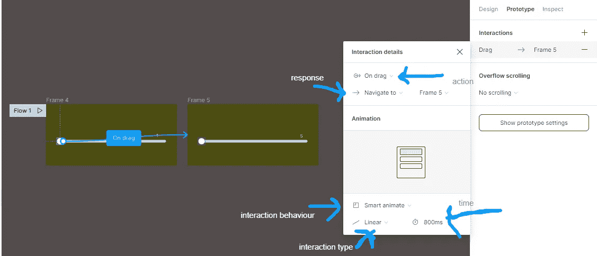

通过将第二帧中的圆连接到第一帧，再重复一次。

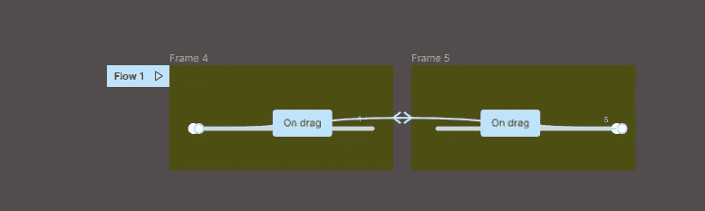

# 12。单击右侧边栏中的 play 按钮来测试原型。

单击工具栏右侧(即顶部栏)的播放按钮，查看并测试互动。

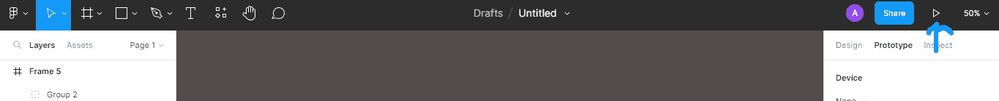

就是这样，伙计们试试看，如果觉得有帮助就评论一下。关注我，了解更多 Figma 技巧和一般技术更新。谢谢你。