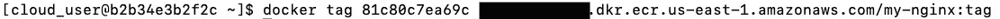
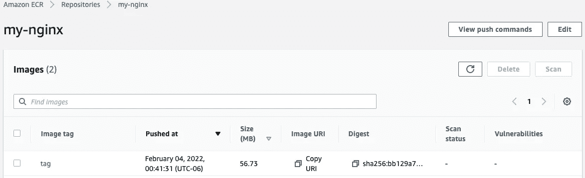

# 如何创建 NGINX Docker 映像并将其注册到 AWS ECR

> 原文：<https://blog.devgenius.io/how-to-create-an-nginx-docker-image-and-register-it-with-aws-ecr-7b973940c033?source=collection_archive---------4----------------------->


Docker 是什么？Docker 是一款开源的容器化软件，用于开发、部署和管理应用程序。Docker 使开发人员能够将配置文件、库和应用程序打包到一个隔离的环境中。

在本教程中，您将…

1.  使用 Nginx 创建您自己的映像，并添加一个文件来告诉您部署容器的时间
2.  在端口 8080 打开的情况下部署容器
3.  将容器数据保存到弹性容器注册表中

> ***先决条件:*** AWS 帐号(ECR 访问)
> [DockerHub](https://hub.docker.com/) 帐号
> 安装[Docker](https://docs.docker.com/engine/install/)安装 AWS CLI
> Vim

我将使用 CentOS 8。

# 步骤 1:用 Vim 创建 Dockerfile

在您登录到您的服务器并安装 Docker 之后，您需要将这两个文件保存在终端的当前目录中:

最后，您希望用这两个命令启动 docker:


# 步骤 2:构建 Docker 映像

通过输入以下命令构建 Docker 映像:


# 步骤 3:部署端口 8080 打开的容器

使用 Run 命令下拉 Nginx 映像，并在端口 8080 上本地打开容器:


# 步骤 4:将容器数据保存到弹性容器注册中心

1.  通过输入以下命令在终端中安装 AWS CLI:


2.通过输入以下命令配置 AWS CLI:


按照提示输入您的 AWS 访问密钥 ID、AWS 秘密访问密钥和您的默认区域名称。

3.输入以下命令以获取 AWS 帐户 ID 号。


一定要复制你的“账号 ID”。我们将在以下命令中使用它来执行 ECR。

4.向 AWS 验证 Docker:

```
aws ecr get-login-password --region us-east-1 | docker login --username AWS --password-stdin **<account_id>**.dkr.ecr.us-east-1.amazonaws.com
```

在您看到<account_id>的地方，输入您在上面记下的 ID。输入后，您应该会在底部收到一条“登录成功”的消息。</account_id>


5.创建新的 ECR 存储库:


6.列出图像，以便您可以识别要标记和推送的图像:


7.将图像标记到存储库中:

```
docker tag **<image_id>** **<account_id>**.dkr.ecr.us-east-1.amazonaws.com/my-nginx:tag
```



8.推送图像:

```
docker push **<aws_account_id>**.dkr.ecr.**<region>**.amazonaws.com/my-nginx
```


# 决赛:

1.  在网络浏览器中查看网页确认:


2.查看 AWS 控制台 ECR 确认:



你做到了！您已经创建了映像，部署了打开了端口 8080 的容器，并且从 AWS CLI 将容器数据保存到了弹性容器注册表中！