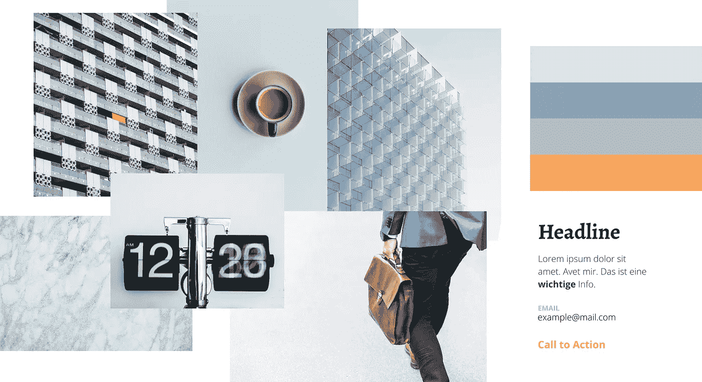
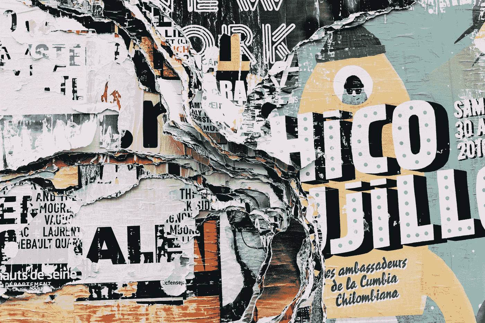
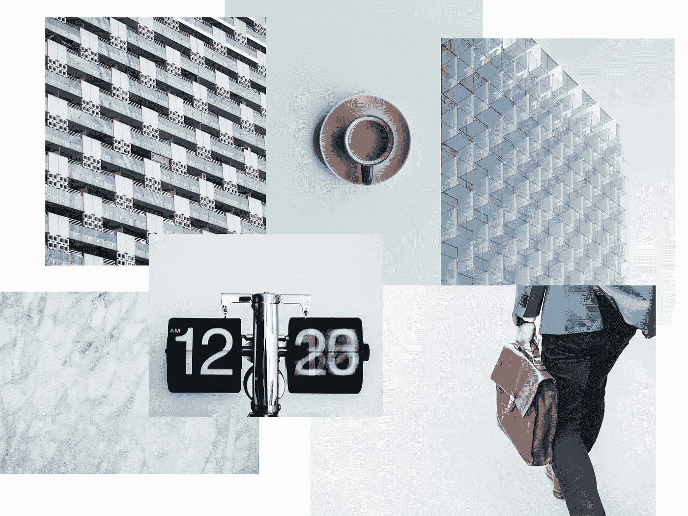
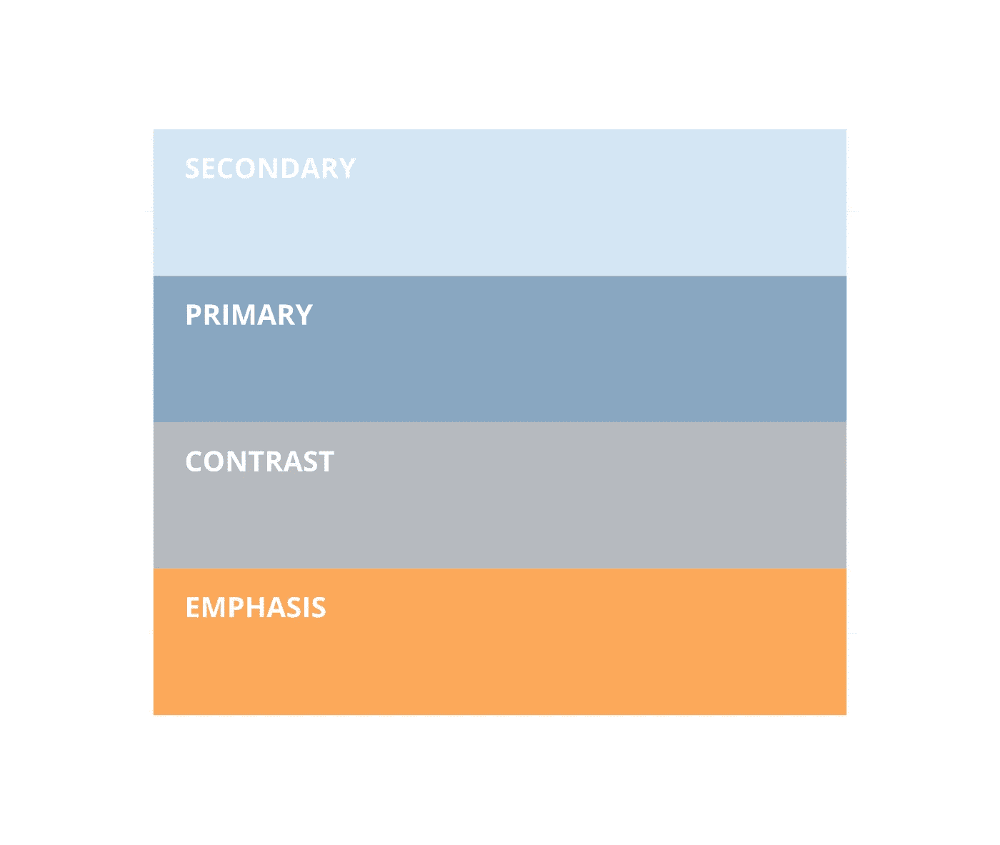
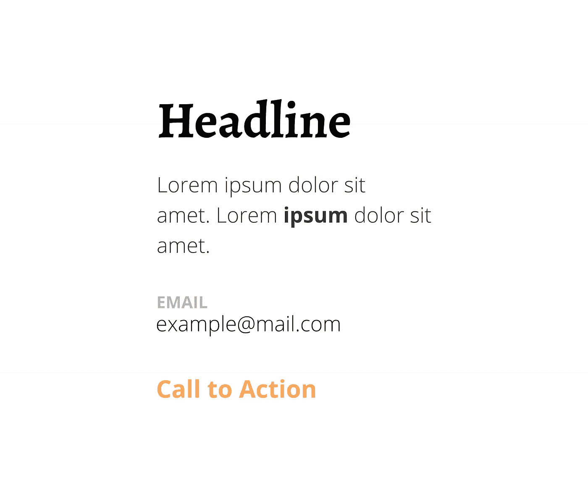

# 如何创建一个优秀的 moodboard 品牌网站

> 原文：<https://blog.devgenius.io/how-to-create-an-outstanding-moodboard-to-brand-a-website-9124dbc42696?source=collection_archive---------23----------------------->

我经常看到**可怕的网站**，它们有丑陋的、不相配的颜色和疯狂的、跑题的设计。如果你曾经遇到过这样的情况，这篇文章将通过**我个人的例子**来帮助你。如果你已经理解了 moodboards 的概念，那就把它作为进一步的课程吧。

在创建品牌、网站、作品集等创意过程中，Moodboards 非常重要。这是一个简单但非常有效的选择颜色、字体和一般样式的方法。现在你可能会问自己如何开始。所以让我们进入下一章。

# 什么是 moodboard？

照片由[爱丽丝·多诺万·劳斯](https://unsplash.com/@alicekat?utm_source=medium&utm_medium=referral)在 [Unsplash](https://unsplash.com?utm_source=medium&utm_medium=referral) 拍摄

Moodboards 是您与项目、主题或愿景相关联的多个图像的集合。当你思考一个话题时，你的脑海中会有特别的感受和图像。这个任务就是要把你脑海中的那些感觉和图像，带到一张纸上。

接下来我会给你一个例子，关于我如何为我的个人网站选择颜色、字体和风格。

# 如何开始？

首先，你需要对你的产品或项目有一个清晰的愿景。这非常重要，因为没有这些，你无法想象你的项目未来会是什么样子，没有未来的视角，你不知道你想要传达什么样的价值观。

在我的例子中，我想用我做人的方式来设计我的网站。

## 挑选关键词

一个品牌的主要价值之一是传递情感，在 moodboard 中也是如此。所以你需要想出描述你的项目或愿景的关键词。

在我的例子中，我想为自己创建一个网站。所以我需要思考是什么让我成为一个人，我的价值观是什么。

> 例子:我**过着极简的生活方式**，**在**动态**，**快速**变化的环境中努力工作**。我也是一个设计爱好者和建筑爱好者。

现在带着这些关键词进入下一部分。

## 挑选图像

在互联网上有很多免费的资源，你可以从中挑选一些图片。我最喜欢的是 unsplash.com、flickr.com 和 T21。在这里，您可以选择过滤关键字和颜色。但是理论已经讲得够多了，让我们来看看它是怎么做的。

这是一个展示我作为一个人的方式的网站。

因为我挑的那些关键词，所以选了**主要是极简的图片**。一杯**咖啡。**手拿**斜挎包**的男人，展现企业家的一面。一个**移动时钟**给人一种稳步前进的感觉。**大理石**具有一些经典的触感，一些**建筑**具有极简主义和独特的设计。为自己挑选喜欢的图片。

现在把这些图像组合成一个图形。

## 挑选颜色

你会注意到的第一件事是，颜色在之前的图像中基本相同。它是介于灰色-白色-蓝色-棕色-黑色之间的颜色。

挑选颜色时，你必须注意某些事情。

你应该定义 4 种主要的颜色。第一个是**原色**。这种颜色用于在你的网站上突出重要的东西。例如，你可以用它作为你的标志或主要按钮。

下一个是**二次色**。这是你网站上第二重要的东西。例如链接、二级按钮等。

你有一个**对比色**用于查看不太重要的信息，或者当你需要一些网站元素的对比时。

还有最重要的**强调色**，这种颜色是用来标记最重要的东西的。例如 CTA 或一些动作来引导用户或引起对一些元素的注意。

## 选择字体

字体是表达某种感情和情绪的一种方式。通常你可以用排版给用户创造比你想象的更多的感觉。选择时你必须非常小心，因为它们应该与之前选择的图像相匹配。你也可以选择免费的商业字体或开源字体。更便宜，更容易维护。

对于标题，我选择了一种更正式的字体来代表某种严肃性。

对于正文，我选择了一种现代而干净的字体，在古典和现代之间取得了很好的平衡。

**提示**为粗体，字体与正文相同。一个很好的技巧是**在加粗时跳过两种字体粗细**。在你的重要性等级中，你会有一个很好的和显著的不同。如你所见，文本“ipsum”就像在你脸上打了一拳，这就是粗体文本的目的。

**CTA 和提示用强调色加粗。**CTA(行动号召)应该只在您的网站上出现一次！如果你用得太频繁，人们会不知道点击哪里。

## 定义风格

当把这些东西结合起来，你就有了一个整体的画面，风格也就已经确定了。你唯一需要做的就是知道它**与你的设计**一致。

请在评论中告诉我，如果你也在创建这样的 moodboards，如果你是设计主题的新手，如果它对你有帮助，请留下你的意见。