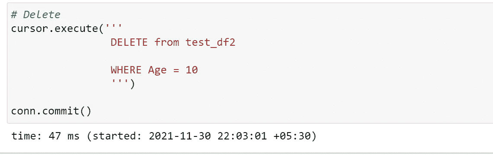

# 如何用 Python 创建和操作 SQL 数据库(Python SQL 库简介)

> 原文：<https://blog.devgenius.io/how-to-create-and-manipulate-sql-databases-with-python-introduction-to-python-sql-libraries-194774c20418?source=collection_archive---------1----------------------->

连接 SQL server 和 Python 的简单步骤


Emile Perron 在 [Unsplash](https://unsplash.com?utm_source=medium&utm_medium=referral) 上的照片

Python 和 SQL 是数据科学领域中使用的两种重要的脚本语言。

在本教程中，我将向您介绍一些概念，并讨论如何使用库连接 sql server 和 Python。

在本文中，我们将讨论如何将关系数据库中的数据直接提取到机器学习管道中，并使用 python 脚本在 SQL server 中导入和修改数据库。

我们将介绍以下几点:

*   为什么要学习如何一起使用 Python 和 SQL？
*   用 Python 连接到 SQL Server
*   从 Python 字典创建新的表和记录
*   用数据填充表格
*   读取数据
*   追加记录
*   更新记录
*   删除记录

# 为什么使用 Python 和 SQL？

对于数据分析师和数据科学家来说，Python 有很多优势。python 中有如此多的开源库，使得这个工具如此强大。

虽然数据集有不同种类的来源，但在许多情况下，数据将存储在关系数据库中。关系数据库是一种极其高效、强大和广泛使用的方式来[创建、读取、更新和删除各种数据。正如您所知，数据存储在数据库中，我们使用 SQL 脚本提取这些信息，了解如何结合使用 Python 和 SQL 将为您在处理数据和进行数据操作时带来更多优势。](https://en.wikipedia.org/wiki/Create,_read,_update_and_delete)

# 入门指南

在本教程中，我们将使用 JUPYTER 笔记本和 Microsoft SQL server。

我们将使用 PYODBC 库来连接 SQL server 和 Python。

```
pip install pyodbc
```

运行上述代码后，PYODBC 库将被安装在系统中。

# 导入库

在 Python 中，我们要做的第一件事就是导入我们的库。

```
%load_ext autotime   # used to track the speedimport pandas as pd
import numpy as np
import matplotlib.pyplot as plt
import seaborn as snsimport timeimport warnings
warnings.filterwarnings("ignore", category=FutureWarning)
pd.options.mode.chained_assignment = None  # default='warn'import pyodbc
```

# 正在连接到 Microsoft SQL Server:

现在我们需要执行下面的代码来连接 SQL server 和 Jupyter notebook。


SQL Server -Python 连接成功

```
conn = pyodbc.connect('Driver={SQL Server};'
                      'Server=Server name;'
                      'Database=Database name;'
                      'Trusted_Connection=yes;')
cursor = conn.cursor()
```

# 创建新数据库

现在我们已经建立了连接，下一步是在我们的服务器上创建一个新的数据库。


此代码将在 Microsoft SQL server 中创建 test_df2 表

在 Python 中创建数据框，我们将在表 test_df2 中将其导出到 SQL server。


现在，下面的脚本将在 SQL server 中导出数据框


数据框被导出到数据库


在服务器中导出

# 读取数据

现在我们有了一个可以使用的功能数据库。作为一名数据科学家，在您工作的项目中，您通常会接触现有的数据库。了解如何从这些数据库中提取数据，然后将数据输入到 python 数据管道中，这将非常有用。这是我们接下来要做的。

让我们用一个简单的查询来试试 see，看看它是如何工作的。


1.  **使用 Python 追加表中的记录:**

我们可以通过运行以下代码在现有的表中添加记录:


**2。使用 Python 更新表中的记录:**

如果您想要更新记录，那么您必须执行下面的代码来更新表中的记录


Ankit 的记录更新

让我们来看看结果:


记录已被更新

**3。使用 Python 删除 SQL Server 中的记录:**

假设您想从' **test_df2'** 表中删除年龄为 10 的记录。



让我们检查一下记录:


# 结论

在本教程中，我们已经涵盖了许多重要的概念

我们已经学习了如何创建新的表和记录，我们已经了解了如何从现有的数据库中提取数据并将其加载到 pandas 数据框中，我们还学习了如何导出数据库中的记录，然后进行检索，然后我们已经完成了一些数据操作，如追加、更新和删除记录。

我希望这篇文章能帮助你并节省大量的时间。如果你有任何建议，请告诉我。

快乐编码。

***Prabhat Pathak****(*[*Linkedin 简介*](https://www.linkedin.com/in/prabhat-pathak-029b6466/) *)数据科学顾问。*


照片由[格雷格·拉科齐](https://unsplash.com/@grakozy?utm_source=medium&utm_medium=referral)在 [Unsplash](https://unsplash.com?utm_source=medium&utm_medium=referral) 上拍摄

*更多内容请看*[*blog . dev genius . io*](http://blog.devgenius.io)*。*