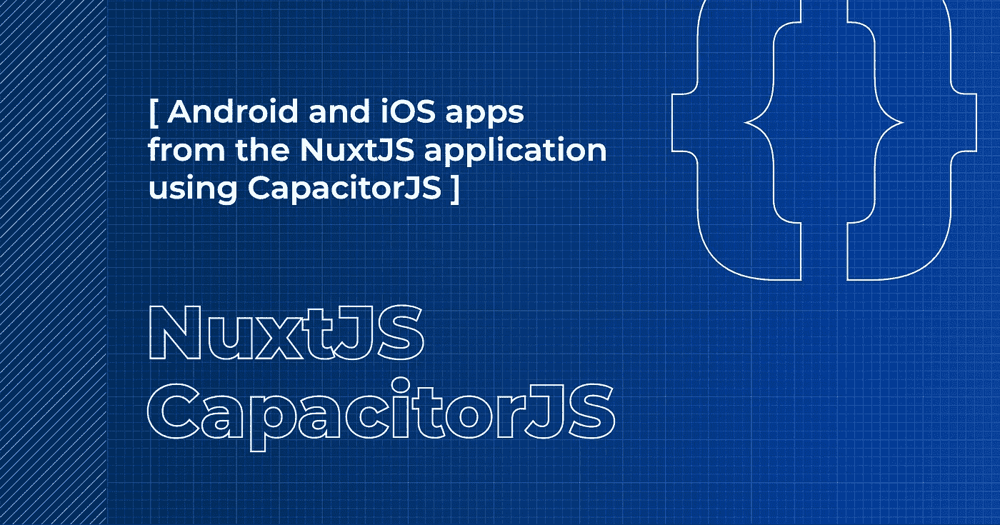
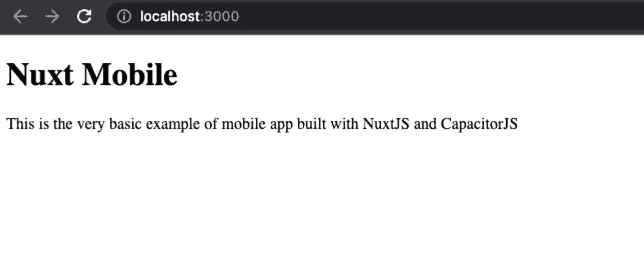
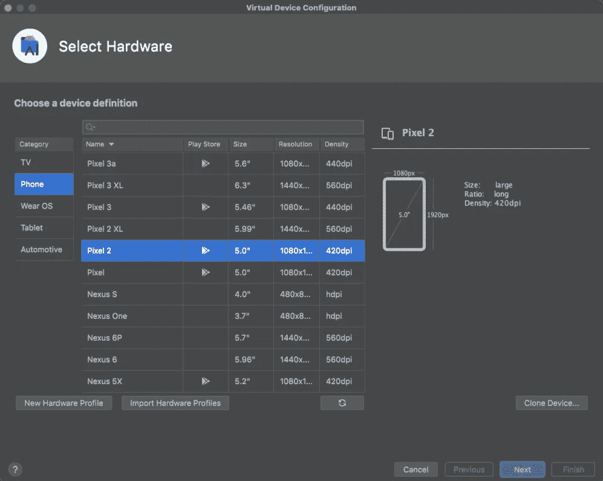
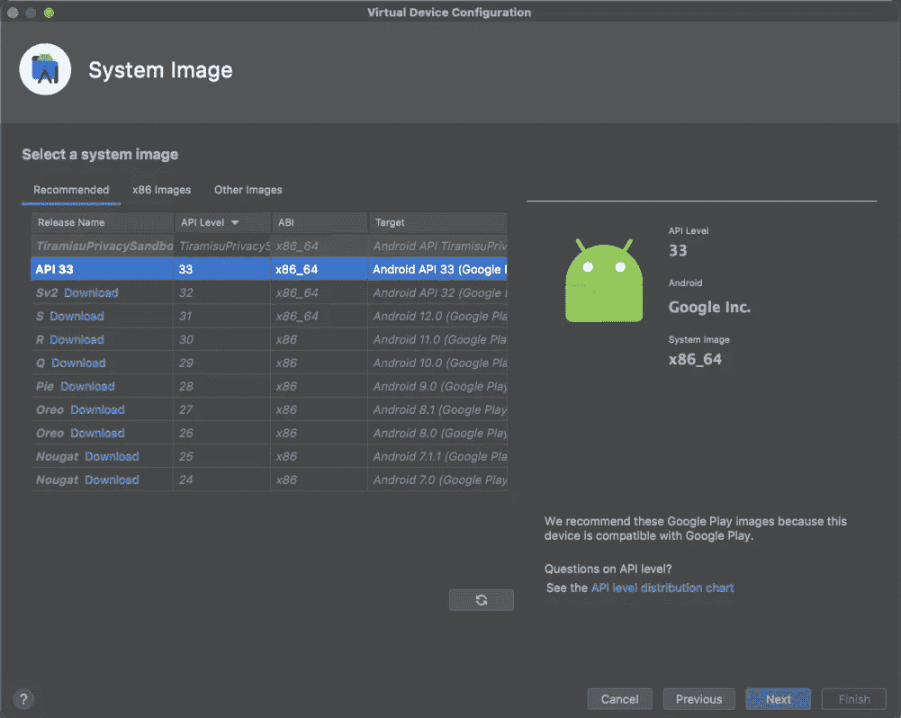
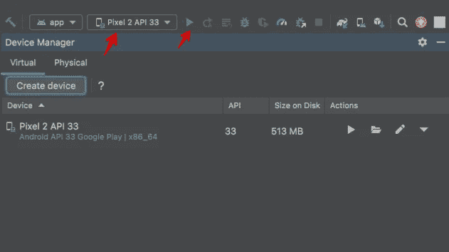
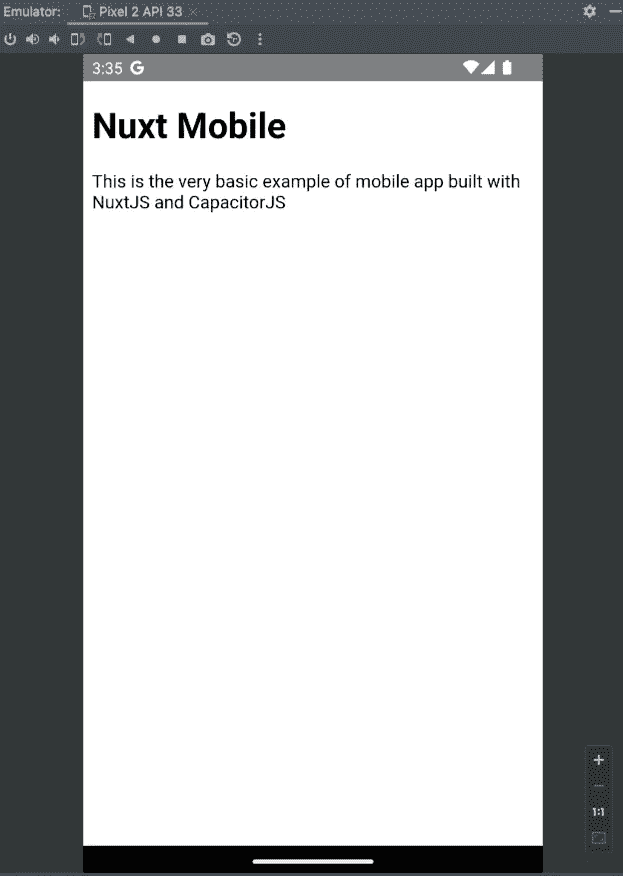
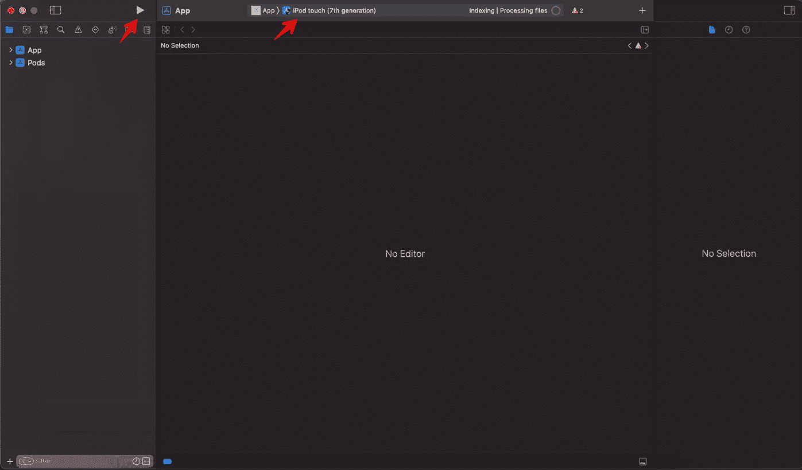
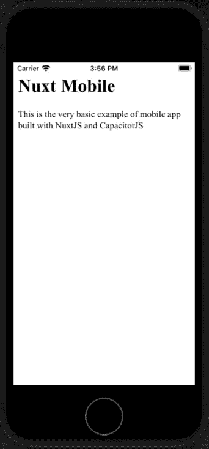

# 如何使用 CapacitorJS 从 NuxtJS 应用程序创建 Android 和 iOS 应用程序

> 原文：<https://blog.devgenius.io/how-to-create-android-and-ios-apps-from-the-nuxtjs-application-using-capacitorjs-8663e5037493?source=collection_archive---------14----------------------->



在本指南中，我将展示如何使用 [CapacitorJS](https://capacitorjs.com/) 将现有的 [NuxtJS](https://v3.nuxtjs.org/) web 应用程序包装成 Android 和 iOS 移动应用程序

> *Capacitor 是一款用于构建 Web 原生应用的开源原生运行时。使用 JavaScript、HTML 和 CSS 创建跨平台的 iOS、Android 和渐进式 Web 应用程序。*

CapacitorJS 在本地浏览器上运行您的静态站点，并显示给用户。此外，它在本地和 web 上下文之间有一些接口，用于访问本地特性。

但是如果用户可以从移动浏览器访问你的网站，你为什么需要这个呢？

1.  对用户更有用。如果用户经常使用你的 web 应用程序，他们只需点击你的应用程序图标，比去浏览器搜索你的应用程序书签或键入你的应用程序域名更容易。Android 和 iOS 都有“将网站添加到主屏幕”的功能。但是一个单独的本地应用提供了更好的 UX。
2.  分销渠道。用户可以在 AppStore 和 PlayMarket 中搜索你的应用。所以，最好出现在所有流行的平台上，以接触到更多的用户。
3.  原生特征。也许，你的 web 应用不需要它们。但是在你创建了一个手机版的应用程序后，你可以改变你的想法。至少可以通过 [FCM](https://firebase.google.com/docs/cloud-messaging) 添加通知。

我想我们已经问完“为什么”了部分。让我们去“如何？”部分。

# 创建虚拟 NuxtJS 应用程序

为了简化本指南，我将创建一个新的 Nuxt 应用程序。如果您已经有一个，请随意跳到安装 CapacitorJS 一节。

所以，让我们使用[官方指南](https://v3.nuxtjs.org/getting-started/quick-start/)创建一个 nuxt3 应用程序。我将使用 [NodeJS v16](https://nodejs.org/) 和[纱线 v1.22](https://yarnpkg.com/) 进行安装。

打开终端并运行:

```
$ yarn add global nuxi
$ yarn nuxi init nuxt-mobile
$ cd nuxt-mobile
$ yarn install
```

这里我们安装了 [nuxi](https://www.npmjs.com/package/nuxi) Nuxt 命令行接口，创建了一个新项目`nuxt-mobile`，并安装了来自`package.json`的依赖项。你可以用任何名字代替`nuxt-mobile`。

接下来我们来换`app.vue`。用以下文件替换现有文件:

现在，让我们看看我们得到了什么。运行开发服务器:

```
$ yarn dev -o
```

您将被导航到浏览器。在这里您将看到您的 web 应用程序。



它很空，但足以展示如何将 web 应用程序包装到移动应用程序中。

# 安装电容器 j

现在，让我们向应用程序添加 CapacitorJS。我将遵循官方指南的指示:

> 在应用程序的根目录下，安装 Capacitor 的主要 npm 组件:核心 JavaScript 运行时和命令行界面(CLI)。

```
$ yarn add @capacitor/core
$ yarn add --dev @capacitor/cli
```

> *然后，使用 CLI 问卷初始化电容器:*

```
$ yarn cap init
```

CLI 将询问您有关软件包的问题。你可以选择任意的`Name`和`Package`(我用的是`NuxtMobile`和`com.mycompany.nuxtmobile`的值)。然后你需要设置`Web asset directory`为`dist`。这是 [NuxtJS 静态站点](https://nuxtjs.org/docs/concepts/static-site-generation/)上的一个目的地。CLI 会将这些答案保存到`capacitor.config.json`中，并检查文件内容。

> *安装完电容核心运行时，就可以安装 Android 和 iOS 平台了。*

```
$ yarn add @capacitor/android @capacitor/ios
```

CapacitorJS 使用网站的静态版本。因此，我们需要生成它:

```
$ yarn generate
```

现在我们有了一个静态站点，这样我们就可以初始化 iOS 和 Android 应用程序:

```
$ yarn cap add android
$ yarn cap add ios
```

这些命令在`android`和`ios`文件夹中创建本地应用程序。他们将 web 内容从`dist`目录克隆到`ios/App/App/public`和`android/app/src/main/assets/public`目录。

每次你改变你的站点，你需要运行`yarn generate`来生成一个新的静态站点，运行`npx cap sync`来更新本地应用。

# 运行 Android 应用程序

让我们运行 Android 应用程序。首先下载安装 [AndroidStudio](https://developer.android.com/studio) 。

完成后，返回控制台并运行`yarn cap open android`。这将打开 AndroidStudio 中的`android`文件夹。在这里你可以改变你的 Android 文件和运行应用程序。

让我们添加一个模拟器来运行。进入“工具”->“设备管理器”，点击“创建设备”

首先，您需要选择“硬件设备”不同设备之间的主要区别是屏幕大小和 PlayMarket 的可用性。我会选择`Pixel 2`，因为它有 PlayMarket 和 5.0 英寸的屏幕。



然后，您需要选择 Android OS 映像。我会用`Android API 33`。



最后，单击“下一步”和“完成”。此后，您将在“设备”下拉列表中看到一个新设备。

现在，您可以选择您的设备并单击“运行”来构建和启动应用程序:



Android Studio 将启动模拟器，构建、安装并运行您的应用程序:



我们已经不再使用 Android 了；让我们转到 iOS 部分。

# 运行 iOS 应用程序

要为 iOS 构建应用程序，你需要一台 MacBook。如果你有 Linux 或者 Windows，可以跳过这一部分。

首先，您需要 XCode 来构建和运行 iOS 应用程序。你可以在 [AppStore](https://apps.apple.com/us/app/xcode/id497799835) 上买到。

安装完成后，返回控制台并运行`yarn cap open ios`。这个命令将把`ios`文件夹作为 XCode 项目打开。您可以在这里更改 iOS 应用程序文件和设置；构建并运行应用程序。

现在，我们需要选择一个仿真器设备来运行应用程序。我会用 iPod touch。

然后点击“运行”。XCode 将构建应用程序并在设备上运行。



我们已经完成了 iOS 部分。

# 结束了

恭喜你！在本指南中，我们将新的 NuxtJS web 应用程序转变为 iOS 和 Android 移动应用程序。这是一个非常基本的网络应用程序，所以我们不会上传到商店:)但如果你已经有了一个全功能的网络应用程序，你可以将其转换为移动应用程序，并上传到 PlayMarket 和 AppStore！

你可以在这里找到项目[的源代码。](https://github.com/eugen1j/nuxt-mobile)

如果您需要构建 web 或移动应用程序原型，请查看我们的[网站](https://daiquiri.team/services/prototyping?utm_medium=referral&utm_source=medium_blog&utm_campaign=nuxt_mobile_1)或直接在 [LinkedIn](https://www.linkedin.com/in/yevhen-bondar/) 上与我联系。