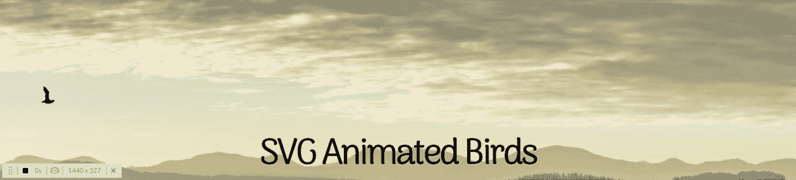

# 如何用 CSS 在 Web 应用程序上创建动画小鸟！

> 原文：<https://blog.devgenius.io/how-to-create-animated-birds-on-a-web-app-with-css-2415627acfa9?source=collection_archive---------0----------------------->

你有没有浏览过一个网站，心里想:“哇，这个网站需要多一点活力！”我经常这么说，这可能是我在开发自己的网络应用时最大的恐惧。我想要一个动态的、能吸引你注意力的网络应用。我的意思是，当你在熨斗学校与这么多伟大的开发人员一起工作时，你必须找到一种方法来挑战极限！因此，我的旅程开始寻找一种方法，在我的 web 应用程序的标题中创建一个动画，这不仅可以增加视觉美感，还可以展示我的个性。就在那时，我在 codepen.io 网站上偶然发现了史蒂文·罗伯特(Steven Roberts)创作的这个美丽的动画。([https://codepen.io/matchboxhero/pen/RLebOY](https://codepen.io/matchboxhero/pen/RLebOY))然而，当我试图将它应用到我的 Rails 或 JS web 应用程序时，我不得不做出一些改变，并在这个过程中学习如何根据我的需要优化它。这就是我如何让我的鸟飞起来的！

**第一步:HTML 设置**

首先要做的是在 html 文件的主体中创建一些 div，其中包含所有项目的类名。

**第二步:什么是雪碧？**

飞鸟图像精灵

你应该知道第一件事是你实际上在处理什么样的图像。图像精灵是放入单个图像中的图像集合。换句话说，我们的动画实际上是一条不断旋转的鸟的图像。为了让精灵旋转，请遵循下面的代码:

你要关注的最重要的事情是背景图像、动画计时功能和动画迭代计数。背景图片是你在上面看到的图片精灵的链接。Animation-timing-function 有一个动作，steps(10)，它本质上是告诉你的 web 应用程序按照时间顺序遍历 image sprite 中的 10 个图像(由宽度和高度定义)。我们可以通过将 animation-iteration-count 设置为 infinite 来控制循环继续的次数。

第二步:为你的鸟儿计时！

如果你想让你的动画看起来更加真实和动态，这一步是非常重要的！想象一下，如果你努力创作一部动画，而它看起来好像鸟儿一直在沿着同一条路走……是的，我不同意！本质上，你要寻找的是每只鸟的动画在不同的时间开始，并持续不同的时间，这样看起来就像鸟在互相尾随并以不同的速度飞行。你可以这样做:

一定要给鸟容器添加动画延迟和持续时间，因为它们负责在屏幕上实际移动鸟:

**第三步:飞！**

最精彩的部分！该飞了！现在，用 css 创建任何动画最重要的部分是理解关键帧的概念。当您在`@keyframes`规则中指定 CSS 样式时，动画将在特定时间从当前样式逐渐变为新样式。这些变化发生在由百分比定义的“路点”上。在我们的例子中，鸟将改变它们在屏幕上的位置，如它们给定的 x 和 y 轴所定义的。我们还调整了它们的比例，让它们看起来好像飞得离观众更近或更远。代码如下所示:

**结论**

咻这对于四只小鸟来说是一大堆代码！但最终他们是如此的值得，并且诚实地成为我在同事中的一张名片。我在一个关注生态友好的网络应用程序和另一个关注旅游的网络应用程序中使用了这个动画。我鼓励你找到其他方法来利用它，甚至可以添加不同的图像精灵！虽然我没有添加太多关于每个动作如何运作的信息，但我发现，[https://www.w3schools.com/css/css3_animations.asp](https://www.w3schools.com/css/css3_animations.asp)这个网站对于了解具体发生了什么非常有帮助！